# Design Document: Catalog Admin Management

## Overview

This feature extends the existing `forge catalog browse` server with full CRUD (Create, Read, Update, Delete) capabilities for knowledge artifacts, collections, and manifest entries. Currently the browse server is read-only — it serves a static HTML SPA with a JSON API for listing and viewing artifacts. The admin management feature adds:

1. **Artifact admin** — Three mutation endpoints (`POST /api/artifact`, `PUT /api/artifact/:name`, `DELETE /api/artifact/:name`) and corresponding frontend UI (create form, edit form, delete confirmation, notifications) to manage knowledge artifacts directly from the browser.
2. **Collection admin** — CRUD endpoints for collection YAML files (`GET/POST /api/collections`, `GET/PUT/DELETE /api/collections/:name`) and a collection management UI (list, detail, create/edit/delete forms) to manage curated artifact bundles.
3. **Manifest admin** — Read and mutation endpoints for the `.forge/manifest.yaml` file (`GET /api/manifest`, `GET /api/manifest/status`, `POST/PUT/DELETE /api/manifest/entries/:identifier`) and a manifest management UI (entry list with sync status, add/edit/remove controls).
4. **Collection browse integration** — Tab navigation between artifacts and collections, collection cards, member artifact links, collection badges on artifact detail views, and collection filtering.

The design follows the existing architectural patterns: the `handleRequest` function in `browse.ts` gains new route branches, a new `admin.ts` module encapsulates artifact mutation logic, a new `collection-admin.ts` module handles collection CRUD, a new `manifest-admin.ts` module handles manifest entry management, and the in-memory data is refreshed after each mutation. The frontend remains vanilla JS embedded in the HTML template string, with new components added inline.

## Architecture

```mermaid
graph TD
    subgraph Browser
        UI[Catalog UI - Vanilla JS SPA]
    end

    subgraph "Bun HTTP Server (browse.ts)"
        HR[handleRequest]
        HR -->|GET /| HTML[Static HTML Page]
        HR -->|GET /api/catalog| CAT_READ[Return catalogEntries JSON]
        HR -->|GET /api/artifact/:name/content| CONTENT[Read knowledge.md]
        HR -->|POST /api/artifact| CREATE_A[createArtifact]
        HR -->|PUT /api/artifact/:name| UPDATE_A[updateArtifact]
        HR -->|DELETE /api/artifact/:name| DELETE_A[deleteArtifact]
        HR -->|GET /api/collections| LIST_C[listCollections]
        HR -->|GET /api/collections/:name| GET_C[getCollection]
        HR -->|POST /api/collections| CREATE_C[createCollection]
        HR -->|PUT /api/collections/:name| UPDATE_C[updateCollection]
        HR -->|DELETE /api/collections/:name| DELETE_C[deleteCollection]
        HR -->|GET /api/manifest| GET_M[getManifest]
        HR -->|GET /api/manifest/status| GET_MS[getManifestStatus]
        HR -->|POST /api/manifest/entries| ADD_ME[addManifestEntry]
        HR -->|PUT /api/manifest/entries/:id| EDIT_ME[editManifestEntry]
        HR -->|DELETE /api/manifest/entries/:id| DEL_ME[removeManifestEntry]
    end

    subgraph "admin.ts (artifact mutations)"
        CREATE_A --> VAL_A[validateArtifactInput]
        UPDATE_A --> VAL_A
        VAL_A --> SER_A[serializeFrontmatter]
        SER_A --> FS_WRITE_A[Write knowledge.md + scaffold]
        DELETE_A --> FS_DEL_A[rm -rf artifact directory]
    end

    subgraph "collection-admin.ts (new module)"
        LIST_C --> PARSE_C[parseCollectionFile]
        GET_C --> PARSE_C
        CREATE_C --> VAL_C[validateCollectionInput]
        UPDATE_C --> VAL_C
        VAL_C --> SER_C[serializeCollection]
        SER_C --> FS_WRITE_C[Write collections/*.yaml]
        DELETE_C --> FS_DEL_C[rm collections/*.yaml]
    end

    subgraph "manifest-admin.ts (new module)"
        GET_M --> READ_M[readManifest]
        GET_MS --> READ_M
        GET_MS --> READ_SL[readSyncLock]
        GET_MS --> COMPUTE_S[computeSyncStatus]
        ADD_ME --> VAL_M[validateManifestEntry]
        EDIT_ME --> VAL_M
        VAL_M --> WRITE_M[writeManifest]
        DEL_ME --> WRITE_M
    end

    subgraph "Existing Modules"
        VAL_A --> ZOD_F[FrontmatterSchema - schemas.ts]
        VAL_C --> ZOD_C[CollectionSchema - schemas.ts]
        VAL_M --> ZOD_M[ManifestEntrySchema - guild/manifest.ts]
        READ_M --> MP[parseManifest - guild/manifest.ts]
        WRITE_M --> PM[printManifest - guild/manifest.ts]
    end

    UI -->|fetch| HR
```



The key architectural decisions:

1. **New `admin.ts` module** — Keeps artifact mutation logic separate from the read-only browse server. Exports pure functions for validation, serialization, and file operations, making them independently testable.

2. **New `collection-admin.ts` module** — Encapsulates collection CRUD logic. Uses `js-yaml` for parsing/serialization and the existing `CollectionSchema` from `schemas.ts` for validation. Operates on `collections/*.yaml` files directly.

3. **New `manifest-admin.ts` module** — Encapsulates manifest entry management. Reuses the existing `ManifestParser` (`parseManifest`/`printManifest`) and schema types (`ManifestEntrySchema`, `ArtifactManifestEntrySchema`, `CollectionManifestEntrySchema`) from `guild/manifest.ts`. Reads the sync-lock from `.forge/sync-lock.json` for status computation.

4. **Mutable server state** — The `startBrowseServer` function passes a mutable wrapper object (`{ catalogEntries, collections }`) so mutations can update in-memory data without restarting the server. Catalog entries are refreshed via `generateCatalog("knowledge")`, collections are refreshed by re-scanning `collections/`.

5. **Synchronous refresh** — After each successful mutation, the relevant data (catalog or collections) is re-scanned from disk. Both directories are local and small, so re-scanning is fast.

6. **Frontend stays vanilla JS** — Consistent with the existing approach. Tab navigation, collection cards, manifest views, and forms are built with DOM manipulation, no framework needed.

7. **Reuse guild types, don't redefine** — Manifest management reuses `ManifestSchema`, `ManifestEntrySchema`, `ArtifactManifestEntrySchema`, `CollectionManifestEntrySchema`, `parseManifest`, and `printManifest` from `guild/manifest.ts`. Collection management reuses `CollectionSchema` from `schemas.ts`.

## Components and Interfaces

### `admin.ts` — Artifact Admin Module

```typescript
/** Input shape for create/update requests */
export interface ArtifactInput {
  name: string;
  displayName?: string;
  description: string;
  keywords: string[];
  author: string;
  version: string;
  harnesses: string[];
  type: string;
  inclusion?: string;
  categories: string[];
  ecosystem: string[];
  depends: string[];
  enhances: string[];
  body: string;
}

/** Validates ArtifactInput against FrontmatterSchema + name pattern */
export function validateArtifactInput(
  input: ArtifactInput
): { success: true; data: Frontmatter } | { success: false; errors: Array<{ field: string; message: string }> };

/** Converts Frontmatter + body into a knowledge.md string (YAML frontmatter + markdown) */
export function serializeFrontmatter(frontmatter: Frontmatter, body: string): string;

/** Creates a new artifact directory with knowledge.md, hooks.yaml, mcp-servers.yaml, workflows/ */
export async function createArtifact(
  knowledgeDir: string,
  input: ArtifactInput
): Promise<CatalogEntry>;

/** Updates an existing artifact's knowledge.md (preserves other files) */
export async function updateArtifact(
  knowledgeDir: string,
  name: string,
  input: ArtifactInput
): Promise<CatalogEntry>;

/** Deletes an artifact directory recursively */
export async function deleteArtifact(
  knowledgeDir: string,
  name: string
): Promise<void>;
```

### `collection-admin.ts` — New Module

Handles CRUD operations for collection YAML files in `collections/`. Uses the existing `CollectionSchema` from `schemas.ts` for validation and `js-yaml` for serialization.

```typescript
import type { Collection } from "./schemas";

/** Input shape for collection create/update requests */
export interface CollectionInput {
  name: string;
  displayName: string;
  description: string;
  version: string;
  trust: string;
  tags: string[];
}

/** Validates CollectionInput against CollectionSchema + name pattern */
export function validateCollectionInput(
  input: CollectionInput
): { success: true; data: Collection } | { success: false; errors: Array<{ field: string; message: string }> };

/** Serializes a Collection object to YAML string using js-yaml */
export function serializeCollection(collection: Record<string, unknown>): string;

/** Parses a YAML string into a validated Collection, preserving unknown keys */
export function parseCollectionFile(yamlContent: string): { collection: Collection; raw: Record<string, unknown> };

/** Lists all collections from the collections/ directory */
export async function listCollections(
  collectionsDir: string
): Promise<Array<{ collection: Collection; raw: Record<string, unknown> }>>;

/** Gets a single collection by name, including member artifact names */
export async function getCollection(
  collectionsDir: string,
  name: string,
  catalogEntries: CatalogEntry[]
): Promise<{ collection: Collection; raw: Record<string, unknown>; members: string[] }>;

/** Creates a new collection YAML file */
export async function createCollection(
  collectionsDir: string,
  input: CollectionInput
): Promise<Collection>;

/** Updates an existing collection YAML file, preserving unknown keys */
export async function updateCollection(
  collectionsDir: string,
  name: string,
  input: CollectionInput
): Promise<Collection>;

/** Deletes a collection YAML file */
export async function deleteCollection(
  collectionsDir: string,
  name: string
): Promise<void>;
```

The `getCollection` function resolves member artifacts by scanning `catalogEntries` for artifacts whose `collections` array includes the collection name. This leverages the existing frontmatter `collections` field (per ADR-0016).

### `manifest-admin.ts` — New Module

Handles manifest entry management. Reuses `parseManifest`/`printManifest` and all schema types from `guild/manifest.ts`.

```typescript
import type { Manifest, ManifestEntry } from "./guild/manifest";

/** Input shape for adding a manifest entry */
export interface ManifestEntryInput {
  name?: string;           // for artifact refs
  collection?: string;     // for collection refs
  version: string;
  mode: "required" | "optional";
  harnesses?: string[];
  backend?: string;
}

/** Sync status for a single manifest entry */
export interface EntryStatus {
  identifier: string;      // name or collection
  type: "artifact" | "collection";
  version: string;
  mode: string;
  syncedVersion: string | null;
  status: "synced" | "outdated" | "missing";
}

/** Full sync status response */
export interface SyncStatusResponse {
  entries: EntryStatus[];
  syncedAt: string | null;
}

/** Reads and parses the manifest file, returns empty manifest if file doesn't exist */
export async function readManifest(
  manifestPath: string
): Promise<{ manifest: Manifest; raw: Record<string, unknown> }>;

/** Reads and parses the sync-lock file, returns null if file doesn't exist */
export async function readSyncLock(
  syncLockPath: string
): Promise<SyncLock | null>;

/** Computes sync status by comparing manifest entries against sync-lock */
export function computeSyncStatus(
  manifest: Manifest,
  syncLock: SyncLock | null
): SyncStatusResponse;

/** Validates a ManifestEntryInput against the appropriate schema */
export function validateManifestEntry(
  input: ManifestEntryInput
): { success: true; data: ManifestEntry } | { success: false; errors: Array<{ field: string; message: string }> };

/** Adds a new entry to the manifest, writes to disk */
export async function addManifestEntry(
  manifestPath: string,
  input: ManifestEntryInput
): Promise<Manifest>;

/** Updates an existing entry in the manifest, writes to disk */
export async function editManifestEntry(
  manifestPath: string,
  identifier: string,
  input: Partial<ManifestEntryInput>
): Promise<Manifest>;

/** Removes an entry from the manifest, writes to disk */
export async function removeManifestEntry(
  manifestPath: string,
  identifier: string
): Promise<Manifest>;
```

The `computeSyncStatus` function is a pure function that compares manifest entries against sync-lock entries:
- **synced**: Entry exists in sync-lock with a version matching the manifest pin
- **outdated**: Entry exists in sync-lock but with a different version than the manifest pin
- **missing**: Entry does not exist in sync-lock at all

The manifest read/write functions preserve the top-level `backend` field and any unknown keys by using `ManifestSchema.passthrough()` and merging the raw parsed object during writes.

### `browse.ts` — Modified

- `handleRequest` gains new route branches for all collection and manifest endpoints
- `startBrowseServer` changes to pass a mutable wrapper `{ catalogEntries: CatalogEntry[], collectionsDir: string, forgeDir: string }` so the `handleRequest` closure can access all data sources
- A `refreshCatalog` helper re-scans the knowledge directory
- A `refreshCollections` helper re-scans the collections directory

### `generateHtmlPage()` — Modified

The HTML template implements the UI Design System (see section above). All styles use the shared design tokens. All views use the shared component patterns (cards, forms, badges, toasts, modals, tabs). The JS uses the DRY render function architecture.

Structural additions:
- **Header**: "New Artifact" / "New Collection" button (context-aware based on active tab)
- **Tab navigation**: Artifacts | Collections | Manifest — using `.tab-nav` pattern
- **Artifact view**: Existing card grid + create/edit `.form-panel` + delete `.modal`
- **Collection view**: Collection card grid (`.card--collection`) + create/edit form + delete modal + trust/tag filter groups
- **Manifest view**: Table-style entry list with status dots + "Add Entry" form + inline edit + remove with confirmation
- **Shared**: Toast notification container, kebab-case client-side validation, auto-name generation from displayName
- **Cross-view links**: Collection badges on artifact detail views, member artifact links on collection detail views

## UI Design System

The admin UI extends the existing browse interface's visual language — warm neutrals, Space Grotesk headings, Inter body text, monospace accents — into a cohesive design system that all views (artifacts, collections, manifest) share. The goal is a unified aesthetic where new views feel native, not bolted on.

### Design Tokens (CSS Custom Properties)

All views share a single set of design tokens defined in `:root`. This is the single source of truth for colors, spacing, typography, and radii — no magic numbers scattered across components.

```css
:root {
  /* Typography */
  --font-display: "Space Grotesk", -apple-system, BlinkMacSystemFont, "Segoe UI", sans-serif;
  --font-body: "Inter", -apple-system, BlinkMacSystemFont, "Segoe UI", sans-serif;
  --font-mono: "Berkeley Mono", "IBM Plex Mono", "JetBrains Mono", "Fira Code", Menlo, Monaco, Consolas, monospace;

  /* Colors — Neutral palette (warm grays) */
  --color-bg: #f7f7f5;
  --color-surface: #fff;
  --color-surface-alt: #fafaf8;
  --color-border: #e4e4e0;
  --color-border-subtle: #e8e8e4;
  --color-border-hover: #c8c8c4;
  --color-text-primary: #1a1a1a;
  --color-text-secondary: #555;
  --color-text-muted: #999;
  --color-text-faint: #aaa;

  /* Colors — Semantic */
  --color-success: #0a3622;
  --color-success-bg: #d1e7dd;
  --color-warning: #856404;
  --color-warning-bg: #fff3cd;
  --color-error: #842029;
  --color-error-bg: #f8d7da;
  --color-info: #084298;
  --color-info-bg: #cfe2ff;

  /* Colors — Status indicators (manifest sync) */
  --color-status-synced: #16a34a;
  --color-status-outdated: #ca8a04;
  --color-status-missing: #dc2626;

  /* Spacing scale (4px base) */
  --space-1: 4px;
  --space-2: 8px;
  --space-3: 12px;
  --space-4: 16px;
  --space-5: 20px;
  --space-6: 24px;
  --space-8: 32px;
  --space-10: 40px;

  /* Radii */
  --radius-sm: 4px;
  --radius-md: 6px;
  --radius-lg: 8px;
  --radius-pill: 20px;

  /* Shadows */
  --shadow-card-hover: 0 4px 16px rgba(0,0,0,0.07);
  --shadow-modal: 0 8px 32px rgba(0,0,0,0.12);
  --shadow-toast: 0 4px 12px rgba(0,0,0,0.1);
}
```

### Shared Component Patterns

The UI is built from a small set of reusable component patterns. Each pattern is implemented as a CSS class + a JS render function, used identically across artifact, collection, and manifest views.

#### Cards (`.card`)

Used for artifact cards AND collection cards. Same border, radius, hover behavior, and layout structure. The card interior varies by content type but the shell is identical.

```
┌─────────────────────────────────────┐
│ .card-header  [displayName] [badge] │
│ .card-name    (monospace slug)      │
│ .card-description (2-line clamp)    │
│ .card-tags    (pill chips)          │
│ ─────────────────────────────────── │
│ .card-footer  [icons]    [badges]   │
└─────────────────────────────────────┘
```

Collection cards reuse the same `.card` class with `.card--collection` modifier for the trust badge color and tag pills instead of keyword pills.

#### Forms (`.form-panel`)

A single form component pattern used for artifact create/edit, collection create/edit, and manifest entry add. The form panel slides in from the right or replaces the main content area.

```
┌─────────────────────────────────────┐
│ .form-panel-header  [title] [close] │
├─────────────────────────────────────┤
│ .form-group                         │
│   .form-label                       │
│   .form-input / .form-textarea /    │
│   .form-checkbox-group /            │
│   .form-radio-group /               │
│   .form-select                      │
│   .form-error (validation msg)      │
│                                     │
│ .form-group ...                     │
├─────────────────────────────────────┤
│ .form-actions  [cancel] [submit]    │
└─────────────────────────────────────┘
```

Shared form field styles:
- Text inputs: `--radius-md` border, `--color-surface-alt` background, focus ring with `box-shadow: 0 0 0 2px rgba(0,0,0,0.05)`
- Checkboxes: `accent-color: #555`, wrapped in `.form-checkbox-group` with pill-style labels (same as filter checkboxes)
- Radio buttons: Same pill-style as checkboxes but with radio semantics
- Textareas: Monospace font for body/code content, standard font for descriptions
- Select dropdowns: Same border/radius as text inputs
- Error states: Red border (`--color-error`), error message below in `--color-error` at 0.75rem

#### Badges (`.badge`)

A single badge component with modifier classes for context:

| Modifier | Use | Colors |
|----------|-----|--------|
| `.badge-maturity-*` | Artifact maturity | experimental/beta/stable/deprecated |
| `.badge-trust-*` | Collection trust level | official/community/partner |
| `.badge-type-artifact` | Manifest entry type | Neutral gray |
| `.badge-type-collection` | Manifest entry type | Purple tint |
| `.badge-status-*` | Manifest sync status | synced(green)/outdated(yellow)/missing(red) |

#### Toast Notifications (`.toast`)

A single toast system shared across all views. Toasts appear in a fixed container at top-right, auto-dismiss after 4 seconds.

```css
.toast-container { position: fixed; top: 16px; right: 16px; z-index: 1000; display: flex; flex-direction: column; gap: 8px; }
.toast { padding: 12px 16px; border-radius: var(--radius-md); font-size: 0.825rem; box-shadow: var(--shadow-toast); }
.toast--success { background: var(--color-success-bg); color: var(--color-success); border: 1px solid #a3cfbb; }
.toast--error { background: var(--color-error-bg); color: var(--color-error); border: 1px solid #f1aeb5; }
```

#### Confirmation Modal (`.modal`)

A single modal component used for delete confirmations across all resource types. Same overlay, same card-style dialog, same button layout.

#### Tab Navigation (`.tab-nav`)

A horizontal tab bar below the header for switching between Artifacts, Collections, and Manifest views. Active tab has a bottom border accent. Tabs use the same font/size as filter group labels but larger.

```css
.tab-nav { display: flex; gap: 0; border-bottom: 1px solid var(--color-border); background: var(--color-surface); padding: 0 24px; }
.tab-nav-item { padding: 12px 16px; font-size: 0.825rem; font-weight: 500; color: var(--color-text-muted); border-bottom: 2px solid transparent; cursor: pointer; transition: color 0.15s, border-color 0.15s; }
.tab-nav-item:hover { color: var(--color-text-primary); }
.tab-nav-item--active { color: var(--color-text-primary); border-bottom-color: var(--color-text-primary); }
```

### View Structure (DRY Layout)

All three views share the same page skeleton:

```
┌─ header ─────────────────────────────────────────┐
│ [Logo] | [count] .............. [+ New] button   │
├─ tab-nav ────────────────────────────────────────┤
│ [Artifacts]  [Collections]  [Manifest]           │
├─ filters (view-specific) ────────────────────────┤
│ [search] [filter groups...]                      │
├─ content area ───────────────────────────────────┤
│ card-grid / detail-view / list-view / form-panel │
└──────────────────────────────────────────────────┘
```

Each view plugs into the same content area. The `showView(viewName)` function handles:
1. Updating active tab
2. Showing/hiding the appropriate filter bar
3. Rendering the correct content (grid, list, or detail)

This avoids duplicating layout logic — one function manages all view transitions.

### Manifest View — Specific UI Patterns

The manifest view uses a **table-style list** rather than cards (since entries are compact data rows, not browseable content):

```
┌──────────────────────────────────────────────────────────────────┐
│ ● artifact  aws-security      ^1.0.0  required  [kiro][cc]  s3  │
│ ◆ collection neon-caravan     ~0.3.0  required  [all]       gh  │
│ ● artifact  code-review       1.2.0   optional  [all]       —   │
└──────────────────────────────────────────────────────────────────┘
```

Each row has:
- Type icon (● for artifact, ◆ for collection)
- Identifier (monospace)
- Version pin (monospace)
- Mode badge (required = solid, optional = outline)
- Harness icons (same icons as artifact cards)
- Backend label (or — for default)
- Status dot (green/yellow/red circle)
- Inline edit button (pencil icon)
- Remove button (× icon)

The inline edit expands the row into an editable form (same `.form-group` components) without navigating away.

### Collection Badges on Artifact Detail

When viewing an artifact that belongs to collections, badges appear in the metadata section:

```
Collections: [kiro-official] [neon-caravan]
```

Each badge is clickable and navigates to the collection detail view. Uses `.badge-trust-*` styling to indicate the collection's trust level visually.

### Responsive Behavior

- Card grid: `repeat(auto-fill, minmax(360px, 1fr))` — same for both artifact and collection cards
- Forms: Max-width 640px, centered on wide screens
- Manifest table: Horizontal scroll on narrow viewports
- Tab nav: Scrollable on very narrow screens (unlikely for a dev tool)

### JavaScript Architecture (DRY Rendering)

The frontend JS is organized around a few reusable render functions:

```javascript
// Shared across views
function renderCard(data, type) { /* type: 'artifact' | 'collection' */ }
function renderForm(fields, mode, onSubmit) { /* mode: 'create' | 'edit' */ }
function renderBadge(text, variant) { /* variant: 'maturity-stable', 'trust-official', etc. */ }
function showToast(message, type) { /* type: 'success' | 'error' */ }
function showModal(title, message, onConfirm) { /* confirmation dialog */ }
function showView(viewName) { /* 'artifacts' | 'collections' | 'manifest' */ }

// View-specific (thin wrappers over shared functions)
function renderArtifactGrid(entries) { /* uses renderCard(entry, 'artifact') */ }
function renderCollectionGrid(collections) { /* uses renderCard(col, 'collection') */ }
function renderManifestTable(entries, statuses) { /* table rows with status dots */ }
```

This keeps the inline JS DRY — the card rendering logic is written once and parameterized by content type, not duplicated for artifacts vs. collections.

## Data Models

### ArtifactInput (Request Body)

The JSON body sent by the frontend for artifact create and update operations:

```typescript
{
  name: string;           // kebab-case, e.g. "my-new-skill"
  displayName?: string;   // human-readable, e.g. "My New Skill"
  description: string;
  keywords: string[];     // parsed from comma-separated input
  author: string;
  version: string;        // semver, e.g. "0.1.0"
  harnesses: string[];    // subset of SUPPORTED_HARNESSES
  type: string;           // "skill" | "power" | "rule"
  inclusion?: string;     // "always" | "fileMatch" | "manual"
  categories: string[];   // subset of CATEGORIES
  ecosystem: string[];    // kebab-case strings
  depends: string[];      // kebab-case strings
  enhances: string[];     // kebab-case strings
  body: string;           // markdown content
}
```

### CollectionInput (Request Body)

The JSON body sent by the frontend for collection create and update operations:

```typescript
{
  name: string;           // kebab-case, e.g. "my-collection"
  displayName: string;    // human-readable, e.g. "My Collection"
  description: string;
  version: string;        // semver, e.g. "0.1.0"
  trust: string;          // "official" | "community" (or other TrustLane values)
  tags: string[];         // parsed from comma-separated input
}
```

### ManifestEntryInput (Request Body)

The JSON body sent by the frontend for adding/editing manifest entries:

```typescript
{
  name?: string;          // for artifact refs (mutually exclusive with collection)
  collection?: string;    // for collection refs (mutually exclusive with name)
  version: string;        // semver pin, e.g. "^1.0.0"
  mode: string;           // "required" | "optional"
  harnesses?: string[];   // subset of SUPPORTED_HARNESSES
  backend?: string;       // optional backend override
}
```

### SyncStatusResponse

The response shape for `GET /api/manifest/status`:

```typescript
{
  entries: Array<{
    identifier: string;       // name or collection value
    type: "artifact" | "collection";
    version: string;          // version pin from manifest
    mode: string;
    syncedVersion: string | null;  // resolved version from sync-lock, or null
    status: "synced" | "outdated" | "missing";
  }>;
  syncedAt: string | null;   // ISO timestamp from sync-lock, or null
}
```

### Serialized knowledge.md Format

```
---
name: my-new-skill
displayName: My New Skill
description: A description
keywords:
  - keyword1
  - keyword2
author: author-name
version: 0.1.0
harnesses:
  - kiro
  - claude-code
type: skill
inclusion: always
categories:
  - testing
ecosystem: []
depends: []
enhances: []
---

Markdown body content here...
```

The serialization uses `js-yaml` (already a dependency) to dump the frontmatter object, wrapped in `---` delimiters, followed by the body content. This is the inverse of what `gray-matter` does during parsing.

### Collection YAML Format

```yaml
name: my-collection
displayName: "My Collection"
description: "A curated bundle of artifacts"
version: "0.1.0"
trust: community
tags: [workflow, craft]
```

Collection files are simple YAML documents validated against `CollectionSchema` from `schemas.ts`. The schema uses `.passthrough()` semantics (via raw object preservation in `collection-admin.ts`) to preserve unknown keys for forward-compatibility.

### API Response Shapes

**Success (Create/Update Artifact):**
```json
{ "entry": { /* CatalogEntry */ } }
```

**Success (Delete Artifact):**
HTTP 204 No Content (empty body)

**Success (List Collections):**
```json
[{ "name": "...", "displayName": "...", "description": "...", "version": "...", "trust": "...", "tags": [...] }]
```

**Success (Get Collection):**
```json
{ "collection": { /* Collection fields */ }, "members": ["artifact-name-1", "artifact-name-2"] }
```

**Success (Create/Update Collection):**
```json
{ "collection": { /* Collection fields */ } }
```

**Success (Delete Collection):**
HTTP 204 No Content (empty body)

**Success (Get Manifest):**
```json
{ "backend": "github", "artifacts": [{ /* ManifestEntry */ }] }
```

**Success (Get Manifest Status):**
```json
{ "entries": [{ "identifier": "...", "type": "artifact", "version": "...", "mode": "required", "syncedVersion": "1.2.3", "status": "synced" }], "syncedAt": "2025-01-15T10:30:00Z" }
```

**Success (Add/Edit Manifest Entry):**
```json
{ "manifest": { /* full Manifest object */ } }
```

**Success (Remove Manifest Entry):**
HTTP 204 No Content (empty body)

**Validation Error (400):**
```json
{ "error": "Validation failed", "details": [{ "field": "name", "message": "..." }] }
```

**Conflict Error (409):**
```json
{ "error": "Artifact 'name' already exists" }
```

**Not Found Error (404):**
```json
{ "error": "Artifact 'name' not found" }
```

**Server Error (500):**
```json
{ "error": "Failed to refresh catalog after operation" }
```


## Correctness Properties

*A property is a characteristic or behavior that should hold true across all valid executions of a system — essentially, a formal statement about what the system should do. Properties serve as the bridge between human-readable specifications and machine-verifiable correctness guarantees.*

### Property 1: Frontmatter serialization round-trip

*For any* valid Frontmatter object and any body string, serializing them into a `knowledge.md` string (YAML frontmatter + markdown body) and then parsing that string back with `gray-matter` and `FrontmatterSchema` shall produce an equivalent Frontmatter object and identical body content.

**Validates: Requirements 2.3**

### Property 2: Validation consistency with FrontmatterSchema

*For any* ArtifactInput object, `validateArtifactInput` shall accept the input if and only if the frontmatter fields pass `FrontmatterSchema.safeParse` and the name matches the kebab-case pattern. The validation errors returned shall correspond to the Zod validation issues.

**Validates: Requirements 1.4, 2.2**

### Property 3: Kebab-case name validation

*For any* string, the admin API shall accept it as an Artifact_Name if and only if it matches the kebab-case pattern (lowercase alphanumeric segments separated by hyphens).

**Validates: Requirements 1.6, 5.1**

### Property 4: Create produces correct file structure

*For any* valid ArtifactInput, calling `createArtifact` shall produce a directory under `knowledge/` containing exactly: `knowledge.md` (parseable with valid frontmatter), `hooks.yaml`, `mcp-servers.yaml`, and a `workflows/` subdirectory.

**Validates: Requirements 1.3**

### Property 5: Update preserves non-knowledge.md files

*For any* existing artifact with arbitrary `hooks.yaml` and `mcp-servers.yaml` content, calling `updateArtifact` with new frontmatter and body shall leave the `hooks.yaml` and `mcp-servers.yaml` files byte-identical to their pre-update state.

**Validates: Requirements 2.4**

### Property 6: Delete removes artifact directory

*For any* existing artifact, calling `deleteArtifact` shall result in the artifact's directory no longer existing under `knowledge/`.

**Validates: Requirements 3.2**

### Property 7: Catalog consistency after mutations

*For any* sequence of create, update, and delete operations, after each operation completes, the in-memory catalog entries shall be equivalent to a fresh call to `generateCatalog("knowledge")`.

**Validates: Requirements 4.4, 6.1**

### Property 8: toKebabCase produces valid kebab-case

*For any* non-empty display name string containing at least one alphanumeric character, the `toKebabCase` conversion function shall produce a string matching the kebab-case pattern (lowercase alphanumeric segments separated by hyphens).

**Validates: Requirements 5.3**

### Property 9: Comma-separated string parsing round-trip

*For any* array of non-empty strings that do not contain commas, joining them with commas and then splitting/trimming back into an array shall produce the original array.

**Validates: Requirements 7.3**

### Property 10: Collection YAML round-trip

*For any* valid Collection object (conforming to CollectionSchema), serializing it to YAML via `serializeCollection` and then parsing the result back via `parseCollectionFile` shall produce a Collection object that is deeply equal to the original.

**Validates: Requirements 11.1, 11.2, 11.3**

### Property 11: Collection unknown key preservation

*For any* valid Collection object augmented with arbitrary additional top-level keys, serializing to YAML and parsing back shall preserve all unknown keys in the resulting raw object.

**Validates: Requirements 11.4**

### Property 12: Collection validation consistency with CollectionSchema

*For any* CollectionInput object, `validateCollectionInput` shall accept the input if and only if the fields pass `CollectionSchema.safeParse` and the name matches the kebab-case pattern. Invalid inputs shall be rejected with appropriate error details.

**Validates: Requirements 10.4**

### Property 13: Sync status computation correctness

*For any* Manifest with N entries and any SyncLock object, `computeSyncStatus` shall return exactly N EntryStatus objects where: an entry present in the sync-lock with a matching version has status "synced", an entry present in the sync-lock with a different version has status "outdated", and an entry absent from the sync-lock has status "missing".

**Validates: Requirements 12.4**

### Property 14: Manifest entry validation delegation

*For any* ManifestEntryInput object, `validateManifestEntry` shall accept the input if and only if it conforms to either `ArtifactManifestEntrySchema` (when `name` is set) or `CollectionManifestEntrySchema` (when `collection` is set), and shall reject inputs that have both or neither of `name` and `collection`.

**Validates: Requirements 13.4**

### Property 15: Manifest top-level field preservation during entry mutations

*For any* Manifest object with a top-level `backend` field and arbitrary unknown top-level keys, after adding, editing, or removing an entry via the manifest-admin functions, the resulting manifest shall preserve the original `backend` value and all unknown top-level keys.

**Validates: Requirements 13.10**

### Property 16: Collection filtering correctness

*For any* set of Collection objects and any combination of trust level filter and tag filter, the filtered results shall include exactly those collections that match all active filter criteria — every returned collection satisfies the filters, and no matching collection is excluded.

**Validates: Requirements 14.6**

## Error Handling

### Server-Side Error Handling

| Condition | HTTP Status | Response |
|---|---|---|
| Invalid/missing Content-Type header | 400 | `{ "error": "Content-Type must be application/json" }` |
| Malformed JSON body | 400 | `{ "error": "Invalid JSON body" }` |
| Frontmatter validation failure | 400 | `{ "error": "Validation failed", "details": [{ "field": "...", "message": "..." }] }` |
| Invalid artifact name pattern | 400 | `{ "error": "Validation failed", "details": [{ "field": "name", "message": "..." }] }` |
| Artifact already exists (create) | 409 | `{ "error": "Artifact 'name' already exists" }` |
| Artifact not found (update/delete) | 404 | `{ "error": "Artifact 'name' not found" }` |
| Collection validation failure | 400 | `{ "error": "Validation failed", "details": [{ "field": "...", "message": "..." }] }` |
| Collection already exists (create) | 409 | `{ "error": "Collection 'name' already exists" }` |
| Collection not found (get/update/delete) | 404 | `{ "error": "Collection 'name' not found" }` |
| Manifest entry validation failure | 400 | `{ "error": "Validation failed", "details": [{ "field": "...", "message": "..." }] }` |
| Manifest entry already exists (add) | 409 | `{ "error": "Manifest entry 'identifier' already exists" }` |
| Manifest entry not found (edit/remove) | 404 | `{ "error": "Manifest entry 'identifier' not found" }` |
| Manifest file parse error | 500 | `{ "error": "Failed to parse manifest: ..." }` |
| File system error during write | 500 | `{ "error": "Failed to create/update artifact" }` |
| Catalog refresh failure | 500 | `{ "error": "Operation succeeded but catalog refresh failed" }` |

All error responses use `Content-Type: application/json`. The `handleRequest` function wraps mutation calls in try/catch to ensure errors are always returned as structured JSON, never as raw stack traces.

### Client-Side Error Handling

- **Validation errors (400)**: Parse the `details` array and display each error message next to the corresponding form field. Highlight invalid fields with a red border. Applies to artifact forms, collection forms, and manifest entry forms.
- **Conflict errors (409)**: Display an inline message below the name field indicating the name is taken. Applies to artifact creation, collection creation, and manifest entry addition.
- **Not-found errors (404)**: Display a toast notification and navigate back to the appropriate list view (artifact grid, collection list, or manifest view).
- **Server errors (500)**: Display a generic toast notification: "Something went wrong. Please try again."
- **Network errors**: Display a toast notification: "Unable to reach the server."

### Input Validation Strategy

Validation happens at two layers:

1. **Client-side (immediate feedback)**: Name fields validate against the kebab-case regex on every keystroke. Required fields are checked before submission. The manifest entry form validates mutual exclusivity of name/collection fields. This prevents unnecessary round-trips.
2. **Server-side (authoritative)**: `validateArtifactInput` runs `FrontmatterSchema`, `validateCollectionInput` runs `CollectionSchema`, and `validateManifestEntry` runs `ArtifactManifestEntrySchema` or `CollectionManifestEntrySchema`. The server is the source of truth — client-side validation is a UX convenience, not a security boundary.

## Testing Strategy

### Property-Based Tests (fast-check)

The project already uses `fast-check` for property-based testing. Each correctness property maps to a single property-based test with a minimum of 100 iterations.

Tag format: `Feature: catalog-admin-management, Property N: <title>`

**Test file**: `src/__tests__/admin.property.test.ts` (Properties 1–9)

- Property 1: Frontmatter serialization round-trip — reuse the existing `frontmatterArb` generator from `schema-roundtrip.property.test.ts`, serialize with `serializeFrontmatter`, parse back with `gray-matter` + `FrontmatterSchema`
- Property 2: Validation consistency — generate random objects (both valid and invalid), verify `validateArtifactInput` agrees with `FrontmatterSchema.safeParse`
- Property 3: Kebab-case validation — generate random strings, verify acceptance matches regex
- Property 4: Create file structure — generate valid inputs, create in a temp directory, verify file structure
- Property 5: Update preserves files — create artifact with known hooks/mcp content, update, verify those files unchanged
- Property 6: Delete removes directory — create then delete, verify directory gone
- Property 7: Catalog consistency — sequence of operations, verify in-memory matches fresh scan
- Property 8: toKebabCase output — generate display names, verify output matches pattern
- Property 9: Comma-separated round-trip — generate string arrays, join/split, verify equivalence

**Test file**: `src/__tests__/collection-admin.property.test.ts` (Properties 10–12, 16)

- Property 10: Collection YAML round-trip — generate random valid Collection objects (name, displayName, description, version, trust, tags), serialize with `serializeCollection`, parse back with `parseCollectionFile`, verify deep equality
- Property 11: Collection unknown key preservation — extend Property 10 generator with random extra top-level keys, verify unknown keys survive round-trip in the raw object
- Property 12: Collection validation consistency — generate random CollectionInput objects (both valid and invalid), verify `validateCollectionInput` agrees with `CollectionSchema.safeParse`
- Property 16: Collection filtering — generate random collections with various trust levels and tags, apply filter combinations, verify results match filter criteria exactly

**Test file**: `src/__tests__/manifest-admin.property.test.ts` (Properties 13–15)

- Property 13: Sync status computation — generate random manifest entries and sync-lock entries with varying overlap, verify `computeSyncStatus` returns correct status for each entry (synced/outdated/missing)
- Property 14: Manifest entry validation — generate random ManifestEntryInput objects (valid artifact refs, valid collection refs, invalid both/neither), verify `validateManifestEntry` delegates correctly to the appropriate schema
- Property 15: Manifest top-level preservation — generate manifests with backend and extra keys, perform entry mutations (add/edit/remove), verify top-level fields are preserved

### Unit Tests (example-based)

**Test file**: `src/__tests__/admin.test.ts`

- `serializeFrontmatter` with known inputs produces expected YAML output
- `validateArtifactInput` rejects specific invalid cases (empty name, invalid harness, etc.)
- `createArtifact` conflict error when directory exists
- `updateArtifact` not-found error when directory missing
- `deleteArtifact` not-found error when directory missing
- `handleRequest` routes POST/PUT/DELETE correctly (status codes, response shapes)
- Content-Type validation on mutation endpoints

**Test file**: `src/__tests__/collection-admin.test.ts`

- `parseCollectionFile` with known YAML produces expected Collection object
- `serializeCollection` with known Collection produces expected YAML string
- `validateCollectionInput` rejects missing required fields (name, displayName, description, version, trust)
- `createCollection` conflict error when file already exists
- `updateCollection` not-found error when file missing
- `deleteCollection` not-found error when file missing
- `getCollection` returns correct member artifacts based on frontmatter `collections` field
- `handleRequest` routes GET/POST/PUT/DELETE for `/api/collections` correctly

**Test file**: `src/__tests__/manifest-admin.test.ts`

- `readManifest` returns empty manifest when file doesn't exist
- `readManifest` parses valid manifest YAML correctly
- `readSyncLock` returns null when file doesn't exist
- `computeSyncStatus` with empty sync-lock marks all entries as "missing"
- `computeSyncStatus` with matching versions marks entries as "synced"
- `computeSyncStatus` with mismatched versions marks entries as "outdated"
- `addManifestEntry` conflict error when entry with same identifier exists
- `editManifestEntry` not-found error when identifier doesn't match
- `removeManifestEntry` not-found error when identifier doesn't match
- `handleRequest` routes GET/POST/PUT/DELETE for `/api/manifest` and `/api/manifest/entries` correctly

### Integration Tests

**Test file**: `src/__tests__/browse.test.ts` (extend existing)

- Full HTTP round-trip: POST create artifact → GET catalog → verify entry present
- Full HTTP round-trip: PUT update artifact → GET catalog → verify entry updated
- Full HTTP round-trip: DELETE artifact → GET catalog → verify entry removed
- Full HTTP round-trip: POST create collection → GET collections → verify collection present
- Full HTTP round-trip: PUT update collection → GET collection → verify updated
- Full HTTP round-trip: DELETE collection → GET collections → verify removed
- Full HTTP round-trip: POST add manifest entry → GET manifest → verify entry present
- Full HTTP round-trip: PUT edit manifest entry → GET manifest → verify entry updated
- Full HTTP round-trip: DELETE manifest entry → GET manifest → verify entry removed
- GET /api/manifest/status returns correct sync status indicators
- Error responses have correct JSON shape for all error codes across all resource types
