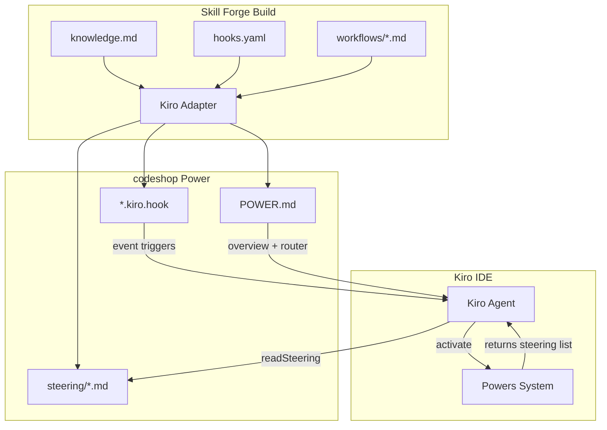
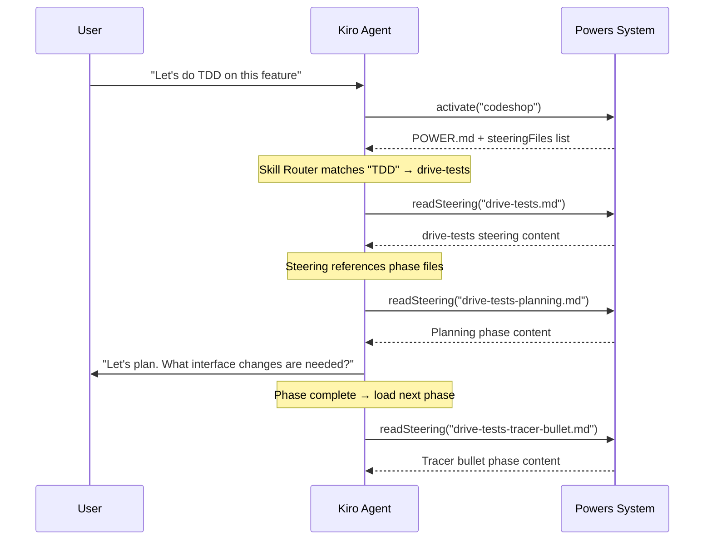
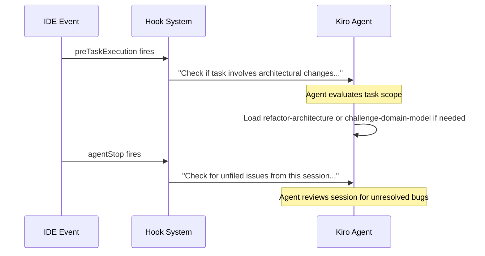

# Design Document: codeshop-power

## Overview

The codeshop power consolidates 19 developer workflow skills into a single Kiro Knowledge Base Power (Pattern C — no `mcp.json`). The power transforms loosely-structured skill instructions — from the original Claude Code skills collection and from existing Skill Forge catalog artifacts — into actionable, phase-driven Kiro workflows. Thirteen skills are classified as Workflow_Skills with explicit ordered phases and `workflows/` phase files. Six are Knowledge_Skills with flat steering files only.

The power's output structure:

```
powers/codeshop/
├── knowledge.md          # Frontmatter + POWER.md body (canonical source)
├── hooks.yaml            # Canonical hooks (5 hooks)
└── workflows/            # Phase files for Workflow_Skills
    ├── drive-tests-planning.md
    ├── drive-tests-tracer-bullet.md
    ├── drive-tests-incremental-loop.md
    ├── drive-tests-refactor.md
    ├── draft-prd-explore.md
    ├── draft-prd-sketch-modules.md
    ├── draft-prd-write-prd.md
    ├── compose-issues-gather-context.md
    ├── compose-issues-explore.md
    ├── compose-issues-draft-slices.md
    ├── compose-issues-quiz-user.md
    ├── compose-issues-create-issues.md
    ├── plan-refactor-capture.md
    ├── plan-refactor-explore.md
    ├── plan-refactor-interview.md
    ├── plan-refactor-scope.md
    ├── plan-refactor-test-coverage.md
    ├── plan-refactor-commit-plan.md
    ├── plan-refactor-create-issue.md
    ├── triage-bug-capture.md
    ├── triage-bug-diagnose.md
    ├── triage-bug-fix-approach.md
    ├── triage-bug-tdd-plan.md
    ├── triage-bug-create-issue.md
    ├── design-interface-requirements.md
    ├── design-interface-generate.md
    ├── design-interface-present.md
    ├── design-interface-compare.md
    ├── design-interface-synthesize.md
    ├── run-qa-session-listen.md
    ├── run-qa-session-explore.md
    ├── run-qa-session-scope.md
    ├── run-qa-session-file-issue.md
    ├── run-qa-session-continue.md
    ├── refactor-architecture-explore.md
    ├── refactor-architecture-present.md
    ├── refactor-architecture-grilling-loop.md
    ├── challenge-domain-model-setup.md
    ├── challenge-domain-model-session.md
    ├── challenge-domain-model-update.md
    ├── author-knowledge-gather.md
    ├── author-knowledge-draft.md
    ├── author-knowledge-review.md
    ├── write-living-docs-audit.md
    ├── write-living-docs-classify.md
    ├── write-living-docs-harvest.md
    ├── write-living-docs-compose.md
    ├── write-living-docs-reconcile.md
    ├── review-changes-orient.md
    ├── review-changes-read.md
    ├── review-changes-comment.md
    ├── review-changes-decide.md
    ├── journal-debug-articulate.md
    ├── journal-debug-isolate.md
    └── journal-debug-fix-and-verify.md
```

When compiled by the Kiro adapter (`format: power`), this produces:
- `POWER.md` — rendered from `knowledge.md` frontmatter + body via `kiro/power.md.njk`
- `steering/*.md` — one per skill (15 files) + all workflow phase files copied from `workflows/`
- `*.kiro.hook` — one JSON file per canonical hook (5 files)
- No `mcp.json` (Knowledge Base Power)

### Design Rationale

**Why a single power instead of 15 separate skills?** The skills share vocabulary (deep modules, vertical slices, domain language, durable issues), reference each other's content, and chain into natural workflows. A single power with a Skill Router lets the agent discover and navigate all workflows from one activation, while steering files keep each workflow self-contained for context efficiency.

**Why phase files for Workflow_Skills?** The Kiro adapter copies `workflows/` entries to `steering/` during compilation. Phase files let the agent load only the current phase of a multi-step workflow, preserving context window budget. This mirrors the ADR power's pattern where `workflows/workflow.md` contains mode-specific instructions loaded on demand.

**Why inline supplementary files?** Claude Code skills used separate `.md` files for reference content (e.g., `tdd/tests.md`, `domain-model/CONTEXT-FORMAT.md`). In the Kiro power model, steering files are the atomic unit of on-demand loading. Inlining supplementary content into the parent steering file ensures the agent gets everything it needs in one `readSteering` call.

## Architecture

### System Context



### Build Pipeline

The codeshop power is authored as a canonical knowledge artifact in `skill-forge/knowledge/codeshop/` and compiled via the standard Skill Forge pipeline:

1. **Parse**: `knowledge.md` frontmatter validated against `FrontmatterSchema` (Zod). Body extracted as markdown.
2. **Hooks**: `hooks.yaml` parsed against `HooksFileSchema` — array of `CanonicalHook` objects.
3. **Workflows**: Each `.md` file in `workflows/` parsed as `WorkflowFile` (name, filename, content).
4. **Adapt**: `kiroAdapter` receives the `KnowledgeArtifact`, renders `POWER.md` from template, copies workflows to `steering/`, generates steering file for the artifact itself, and produces `.kiro.hook` files from canonical hooks.
5. **Write**: Output files written to `dist/kiro/codeshop/`.

### Runtime Flow



### Hook Event Flow



## Components and Interfaces

### 1. knowledge.md (Canonical Source)

The single source file for the codeshop power. Contains:

**Frontmatter** (validated by `FrontmatterSchema`):
```yaml
---
name: codeshop
displayName: Kiro Codeshop
description: >-
  Developer workflow skills for planning, design, development, testing,
  and knowledge management. Nineteen skills packaged as phase-driven
  workflows and behavioral modes.
keywords:
  - codeshop
  - planning
  - interface-design
  - test-driven-development
  - refactoring
  - architecture
  - domain-modeling
  - issue-triage
  - prd
  - vertical-slices
  - codebase-architecture
  - bug-triage
  - qa-session
  - skill-authoring
  - article-editing
  - living-documentation
  - code-review
  - commit-messages
  - debugging-methodology
author: Matt Pocock
version: 0.1.0
harnesses:
  - kiro
type: power
inclusion: manual
categories:
  - architecture
  - testing
  - documentation
ecosystem: []
depends: []
enhances: []
maturity: experimental
trust: community
audience: intermediate
model-assumptions: []
collections: []
inherit-hooks: false
harness-config:
  kiro:
    format: power
---
```

**Body** (markdown): Contains the POWER.md content with these sections:
1. Onboarding
2. Skill Router
3. Shared Concepts
4. Workflow Composition
5. Troubleshooting

### 2. Steering Files (19 total)

Each steering file is a self-contained markdown document loaded on demand via `readSteering`.

**Workflow_Skill steering files** (13): Serve as workflow overview + reference to phase files. Do not contain full phase instructions inline.

| Steering File | Source Skill | Inlined Supplementary Files |
|---|---|---|
| `drive-tests.md` | tdd | tests.md, mocking.md, deep-modules.md, interface-design.md, refactoring.md |
| `draft-prd.md` | to-prd | (none) |
| `compose-issues.md` | to-issues | (none) |
| `plan-refactor.md` | request-refactor-plan | (none) |
| `triage-bug.md` | triage-issue | (none) |
| `design-interface.md` | design-an-interface | (none) |
| `run-qa-session.md` | run-qa-session | (none) |
| `refactor-architecture.md` | improve-codebase-architecture | LANGUAGE.md, DEEPENING.md, INTERFACE-DESIGN.md |
| `challenge-domain-model.md` | domain-model | CONTEXT-FORMAT.md, ADR-FORMAT.md |
| `author-knowledge.md` | write-a-skill | (none — refocused on canonical knowledge artifact authoring, composable with Skill Forge build pipeline) |
| `write-living-docs.md` | (new — original to codeshop) | (none — includes Living Documentation anti-patterns and checklist inline) |
| `review-changes.md` | review-ritual (catalog) | (none — inlines reading order, comment taxonomy, approval criteria from review-ritual) |
| `journal-debug.md` | debug-journal (catalog) | (none — reuses existing phase files from debug-journal/workflows/) |

**Knowledge_Skill steering files** (6): Flat files with complete instructions.

| Steering File | Source Skill |
|---|---|
| `stress-test-plan.md` | grill-me |
| `edit-article.md` | edit-article |
| `define-glossary.md` | ubiquitous-language |
| `map-context.md` | zoom-out |
| `laconic-output.md` | caveman |
| `craft-commits.md` | commit-craft (catalog) |

### 3. Phase Files (workflows/)

Each Workflow_Skill's ordered phases are extracted into individual files under `workflows/`. Naming convention: `{skill-name}-{phase-name}.md`.

Phase file structure:
```markdown
# {Phase Name}

## Entry Criteria
- What must be true before starting this phase

## Steps
1. Step-by-step instructions for this phase

## Exit Criteria
- What must be true before moving to the next phase

## Next Phase
→ Load `{skill-name}-{next-phase}.md`
```

**Phase breakdown per Workflow_Skill:**

| Skill | Phases |
|---|---|
| drive-tests | planning, tracer-bullet, incremental-loop, refactor |
| draft-prd | explore, sketch-modules, write-prd |
| compose-issues | gather-context, explore, draft-slices, quiz-user, create-issues |
| plan-refactor | capture, explore, interview, scope, test-coverage, commit-plan, create-issue |
| triage-bug | capture, diagnose, fix-approach, tdd-plan, create-issue |
| design-interface | requirements, generate, present, compare, synthesize |
| run-qa-session | listen, explore, scope, file-issue, continue |
| refactor-architecture | explore, present, grilling-loop |
| challenge-domain-model | setup, session, update |
| author-knowledge | gather, draft, review |
| write-living-docs | audit, classify, harvest, compose, reconcile |
| review-changes | orient, read, comment, decide |
| journal-debug | articulate, isolate, fix-and-verify |

### 4. hooks.yaml (5 Canonical Hooks)

All hooks follow the directive pattern from the ADR power: imperative action prompts ending with a concrete action the agent must take.

```yaml
# Hook 1: Map Context (userTriggered)
- name: Map Context
  description: User-invoked zoom-out to map relevant modules and callers.
  event: user_triggered
  action:
    type: ask_agent
    prompt: >-
      Read the map-context steering file from the codeshop power.
      Explore the codebase area the user is asking about. Go up a layer
      of abstraction and present a map of all relevant modules and callers.
      Do NOT summarize — show the actual dependency graph.

# Hook 2: Define Glossary (userTriggered)
- name: Define Glossary
  description: User-invoked glossary extraction from conversation context.
  event: user_triggered
  action:
    type: ask_agent
    prompt: >-
      Read the define-glossary steering file from the codeshop power.
      Scan the current conversation for domain-relevant terms. Identify
      ambiguities, synonyms, and vague terms. Propose a canonical glossary
      and write it to UBIQUITOUS_LANGUAGE.md. Present a summary inline.

# Hook 3: Challenge Domain Model (userTriggered)
- name: Challenge Domain Model
  description: User-invoked domain model grilling session.
  event: user_triggered
  action:
    type: ask_agent
    prompt: >-
      Read the challenge-domain-model steering file from the codeshop power.
      Begin a grilling session: interview the user about every aspect of
      their plan against the existing domain model. Start with the first
      question. Update CONTEXT.md and offer ADRs inline as decisions crystallize.

# Hook 4: Architectural Change Detection (preTaskExecution)
- name: Architectural Change Detection
  description: >-
    Before starting a task, check if it involves architectural changes
    and suggest loading the appropriate workflow.
  event: pre_task
  action:
    type: ask_agent
    prompt: >-
      Before starting this task, assess whether it involves architectural
      changes (new module structures, integration patterns, interface redesigns,
      or significant refactoring):

      1. Read the task description and any linked spec design.md.
      2. If the task involves architectural changes:
         a. Read the refactor-architecture steering file from codeshop.
         b. Check if CONTEXT.md and docs/adr/ exist — if so, review them
            for relevant context before proceeding.
         c. Proceed with the task using the architectural review framework.
      3. If the task does not involve architectural changes, proceed normally.

      Do NOT just acknowledge this check. Either load the architectural
      context or confirm the task is non-architectural and proceed.

# Hook 5: Unfiled Issue Reminder (agentStop)
- name: Unfiled Issue Reminder
  description: >-
    When the session ends, check if bugs were discussed but not filed.
  event: agent_stop
  action:
    type: ask_agent
    prompt: >-
      Before this session ends, review the conversation for any bugs,
      issues, or problems that were discussed but NOT filed as GitHub issues:

      1. Scan the conversation for bug reports, error descriptions, or
         "we should fix" mentions.
      2. If unfiled issues exist:
         a. For each unfiled issue, create a GitHub issue using the
            triage-bug or run-qa-session issue template patterns.
         b. Use durable language (behaviors, not file paths).
         c. Include reproduction steps if discussed.
      3. If all discussed issues were already filed, report:
         "All issues from this session have been filed."

      Do NOT just list unfiled issues. Either file them or confirm all are filed.
```

### 5. Cross-Reference Resolution Strategy

| Original Reference | Resolution |
|---|---|
| `tdd/tests.md` | Inlined as appendix in `drive-tests.md` |
| `tdd/mocking.md` | Inlined as appendix in `drive-tests.md` |
| `tdd/deep-modules.md` | Inlined as appendix in `drive-tests.md` |
| `tdd/interface-design.md` | Inlined as appendix in `drive-tests.md` |
| `tdd/refactoring.md` | Inlined as appendix in `drive-tests.md` |
| `improve-codebase-architecture/LANGUAGE.md` | Inlined as appendix in `refactor-architecture.md` |
| `improve-codebase-architecture/DEEPENING.md` | Inlined as appendix in `refactor-architecture.md` |
| `improve-codebase-architecture/INTERFACE-DESIGN.md` | Inlined as appendix in `refactor-architecture.md` |
| `../domain-model/CONTEXT-FORMAT.md` | Replaced with "See the challenge-domain-model steering file for context format details" |
| `../domain-model/ADR-FORMAT.md` | Replaced with "See the challenge-domain-model steering file for ADR format details" |
| `domain-model/CONTEXT-FORMAT.md` | Inlined as appendix in `challenge-domain-model.md` |
| `domain-model/ADR-FORMAT.md` | Inlined as appendix in `challenge-domain-model.md` |
| `review-ritual` (catalog artifact) | Content adapted into `review-changes.md` steering file with reading order, comment taxonomy, approval criteria inlined |
| `commit-craft` (catalog artifact) | Content adapted into `craft-commits.md` steering file (flat Knowledge_Skill) |
| `debug-journal` (catalog artifact) | Content adapted into `journal-debug.md` steering file; existing phase files (`01-articulate.md`, `02-isolate.md`, `03-fix-and-verify.md`) reused as `journal-debug-articulate.md`, `journal-debug-isolate.md`, `journal-debug-fix-and-verify.md` |

### 6. Claude Code Adaptation Map

| Claude Code Concept | Kiro Equivalent | Affected Skills |
|---|---|---|
| `Agent tool (subagent_type=Explore)` | `invokeSubAgent` with `context-gatherer` agent, or direct file exploration tools (`readCode`, `grepSearch`, `listDirectory`) | refactor-architecture, triage-bug, run-qa-session, compose-issues |
| `Task tool` (parallel sub-agents) | `invokeSubAgent` with `general-task-execution` agent (sequential, not parallel) | design-interface |
| `gh issue create` / `gh` CLI | Preserved as-is with adaptation note: "Requires `gh` CLI installed and authenticated" | compose-issues, plan-refactor, triage-bug, run-qa-session, draft-prd |
| `disable-model-invocation: true` | Adaptation note: "User-invoked only — do not proactively suggest" + `userTriggered` hooks | map-context, define-glossary, challenge-domain-model |

### 7. POWER.md Body Structure

```markdown
# Codeshop

## Onboarding
[What codeshop provides, how to invoke workflows, prerequisites]

## Skill Router
### Planning and Design
[stress-test-plan, draft-prd, compose-issues, design-interface, plan-refactor]
### Development
[drive-tests, triage-bug, journal-debug, run-qa-session, review-changes, refactor-architecture, challenge-domain-model]
### Writing and Knowledge
[edit-article, define-glossary, write-living-docs, craft-commits, map-context, laconic-output, author-knowledge]

## Shared Concepts
[deep modules, vertical slices, domain language discipline, durable issues,
 agent brief format, out-of-scope knowledge base, living documentation principles]

## Workflow Composition
[planning chain, bug-fix chain, architecture chain, domain chain,
 documentation chain, delivery chain, debugging chain]

## Companion Powers
[adr — full ADR lifecycle, type-guardian — TypeScript discipline,
 karpathy-mode — surgical changes and simplicity]

## Troubleshooting
[gh CLI, test runner, CONTEXT.md, wrong workflow]
```


## Data Models

### KnowledgeArtifact (existing schema — no changes)

The codeshop power is represented as a standard `KnowledgeArtifact`:

```typescript
interface CodeshopArtifact {
  name: "codeshop";
  frontmatter: {
    name: "codeshop";
    displayName: "Codeshop";
    description: string;          // ≤3 sentences
    keywords: string[];           // domain-specific compound terms
    author: "Matt Pocock";
    version: "0.1.0";
    harnesses: ["kiro"];
    type: "power";
    inclusion: "manual";
    categories: ["architecture", "testing", "documentation"];
    "harness-config": {
      kiro: { format: "power" }
    };
  };
  body: string;                   // POWER.md markdown content
  hooks: CanonicalHook[];         // 5 hooks from hooks.yaml
  mcpServers: [];                 // empty — Knowledge Base Power
  workflows: WorkflowFile[];      // ~55 phase files from workflows/
  sourcePath: string;
}
```

### Steering File Content Model

Each steering file follows this implicit structure:

```typescript
interface SteeringFileContent {
  // Workflow_Skill steering files
  overview: string;               // What this workflow does
  prerequisites: string[];        // What must be in place
  phases: PhaseReference[];       // References to phase files
  adaptationNotes: string[];      // Claude Code → Kiro adaptations
  appendices?: AppendixSection[]; // Inlined supplementary content

  // Knowledge_Skill steering files
  instructions: string;           // Complete instructions
  adaptationNotes: string[];
}

interface PhaseReference {
  name: string;                   // e.g., "Planning"
  filename: string;               // e.g., "drive-tests-planning.md"
  description: string;            // One-line summary
}

interface AppendixSection {
  title: string;                  // e.g., "Appendix: Good and Bad Tests"
  sourceFile: string;             // e.g., "tdd/tests.md"
  content: string;                // Inlined markdown
}
```

### Canonical Hook Model (existing schema)

```typescript
interface CanonicalHook {
  name: string;
  description?: string;
  event: "user_triggered" | "pre_task" | "agent_stop";
  condition?: {
    file_patterns?: string[];
    tool_types?: string[];
  };
  action: {
    type: "ask_agent";
    prompt: string;               // Directive pattern — imperative, not advisory
  };
}
```

### Skill Router Entry Model

Each entry in the POWER.md Skill Router:

```typescript
interface SkillRouterEntry {
  verbNounName: string;           // e.g., "drive-tests"
  originalName: string;           // e.g., "tdd" (parenthetical)
  description: string;            // One sentence, adapted for Kiro
  steeringFile: string;           // e.g., "drive-tests.md"
  type: "Workflow" | "Knowledge"; // Visual distinction
  triggerPhrases: string[];       // e.g., ["TDD", "red-green-refactor", "test-first"]
  category: "Planning and Design" | "Development" | "Writing and Knowledge";
}
```

### Conditional Steering Configuration

For fileMatch-based auto-activation (Req 19), the power's harness-config will include conditional steering entries:

```yaml
harness-config:
  kiro:
    format: power
    conditional-steering:
      - fileMatch: "CONTEXT.md,CONTEXT-MAP.md"
        reminder: "Working with domain context files — the challenge-domain-model workflow can help sharpen terminology and update CONTEXT.md inline."
      - fileMatch: "docs/adr/**"
        reminder: "Working with ADR files — the refactor-architecture workflow uses ADRs to inform deepening candidates."
      - fileMatch: "UBIQUITOUS_LANGUAGE.md"
        reminder: "Working with the glossary — the define-glossary workflow can extract and formalize domain terms."
```

> **Note:** The conditional steering mechanism depends on how the Kiro adapter handles `harness-config` extensions. If the adapter does not natively support `conditional-steering`, these will be implemented as `fileEdited` hooks with `file_patterns` conditions instead. The fallback hook approach:

```yaml
# Fallback: fileEdited hooks for conditional steering
- name: Domain Context File Guidance
  event: file_edited
  condition:
    file_patterns: ["CONTEXT.md", "CONTEXT-MAP.md"]
  action:
    type: ask_agent
    prompt: >-
      You are editing domain context files. The challenge-domain-model
      workflow can help sharpen terminology. If the user is actively
      working on domain modeling, offer to start a grilling session.

- name: ADR File Guidance
  event: file_edited
  condition:
    file_patterns: ["docs/adr/**"]
  action:
    type: ask_agent
    prompt: >-
      You are editing ADR files. The refactor-architecture workflow
      uses ADRs to inform deepening candidates. If the user is reviewing
      architecture, offer to load the refactor-architecture steering file.

- name: Glossary File Guidance
  event: file_edited
  condition:
    file_patterns: ["UBIQUITOUS_LANGUAGE.md"]
  action:
    type: ask_agent
    prompt: >-
      You are editing the ubiquitous language glossary. The define-glossary
      workflow can extract and formalize domain terms from the current
      conversation. If the user is working on terminology, offer to run
      the glossary extraction workflow.
```


### Companion Powers Model

The POWER.md Companion Powers section references external powers the agent should consider activating alongside codeshop. These are NOT bundled — they are activated separately via the Powers system.

```typescript
interface CompanionPowerEntry {
  powerName: string;              // e.g., "adr"
  description: string;            // One sentence: what it adds to codeshop
  whenToSuggest: string;          // When the agent should recommend activating it
  relatedWorkflows: string[];     // Which codeshop workflows benefit from this companion
}
```

**Companion powers:**

| Power | Description | When to Suggest | Related Workflows |
|---|---|---|---|
| `adr` | Full ADR lifecycle management — create, update, review, health check, cross-reference | When `refactor-architecture` or `challenge-domain-model` surfaces decisions worth recording | refactor-architecture, challenge-domain-model, write-living-docs |
| `type-guardian` | TypeScript type discipline — strict mode, discriminated unions, utility types | When working in a TypeScript codebase and `drive-tests` or `review-changes` encounters type issues | drive-tests, review-changes, refactor-architecture |
| `karpathy-mode` | Behavioral guidelines for surgical changes, simplicity-first, and goal-driven execution | When the user wants to enforce coding discipline across development workflows | drive-tests, review-changes, plan-refactor |


## Correctness Properties

*A property is a characteristic or behavior that should hold true across all valid executions of a system — essentially, a formal statement about what the system should do. Properties serve as the bridge between human-readable specifications and machine-verifiable correctness guarantees.*

### PBT Applicability Assessment

This feature produces a **fixed set of markdown and YAML files** — documentation content, not functions with variable input/output behavior. The "input space" is a known, finite corpus of ~60 files authored by hand. There are no parsers, serializers, data transformations, or algorithms being written.

However, several acceptance criteria express **universal invariants** over the file corpus that benefit from property-style validation. While the corpus is fixed (making 100+ random iterations unnecessary), the properties below are expressed as universal quantifications that can be verified by iterating over all files in the set. These are implemented as **parameterized example tests** (one assertion per file) rather than randomized property-based tests.

### Property 1: Cross-Reference Integrity

*For any* steering file in the codeshop power, the file SHALL NOT contain relative path references to other skill directories (patterns like `../skill-name/`, `./skill-name/`, or `](skill-name/`). All cross-references between steering files SHALL use verb-noun names in prose form.

**Validates: Requirements 4.5, 5.2, 5.3, 7.4**

### Property 2: Phase File Structure Consistency

*For any* phase file in the codeshop power's `workflows/` directory, the file SHALL contain an "Entry Criteria" section, a "Steps" section, and an "Exit Criteria" section.

**Validates: Requirements 13.3**

### Property 3: Hook Directive Pattern Compliance

*For any* hook in the codeshop power's `hooks.yaml`, the action prompt SHALL NOT contain advisory anti-patterns ("keep in mind", "consider suggesting", "flag for the user", "you might want to") and SHALL end with a concrete action directive that tells the agent what to do.

**Validates: Requirements 15.4**

### Property 4: Keyword Specificity

*For any* keyword in the codeshop power's frontmatter `keywords` array, the keyword SHALL NOT be in the banned broad-term list: "writing", "skills", "code-review", "tdd", "domain-model", "code", "development", "testing".

**Validates: Requirements 17.1, 17.2**

## Error Handling

### Build-Time Errors

| Error | Cause | Handling |
|---|---|---|
| Invalid frontmatter | Missing required fields or invalid types | `FrontmatterSchema` Zod validation fails with descriptive error. Fix in `knowledge.md`. |
| Missing workflow file | Phase file referenced in steering but not in `workflows/` | Build produces incomplete `steering/` output. Validate by checking all phase file references resolve. |
| Invalid hook YAML | Malformed `hooks.yaml` | `HooksFileSchema` Zod validation fails. Fix in `hooks.yaml`. |
| Broken cross-reference | Steering file contains `../` relative path | Caught by Property 1 validation. Fix by replacing with verb-noun name reference. |

### Runtime Errors (Agent-Side)

| Error | Cause | Handling |
|---|---|---|
| Steering file not found | `readSteering` called with wrong filename | Agent falls back to POWER.md Skill Router to find correct filename. |
| `gh` CLI not available | User hasn't installed/authenticated `gh` | Steering files include adaptation notes. Troubleshooting section provides resolution steps. |
| No test runner | `drive-tests` invoked without configured test runner | Troubleshooting section guides user to configure one. |
| No CONTEXT.md | `challenge-domain-model` or `refactor-architecture` invoked without existing context files | Workflows create files lazily — this is expected behavior, not an error. |
| Wrong workflow selected | Agent matches user request to incorrect skill | Troubleshooting section advises more specific trigger phrases. Skill Router trigger phrases help disambiguation. |

## Testing Strategy

### Approach

Since this feature produces documentation and configuration files (not executable code), testing focuses on **structural validation** and **content integrity** rather than behavioral testing.

**No property-based testing (PBT) with randomized inputs.** The output is a fixed corpus of files, not a function with variable inputs. The properties identified above are validated as parameterized example tests iterating over the known file set.

### Test Categories

#### 1. Smoke Tests (Build Validation)

Verify the power builds successfully and produces expected output structure:

- `knowledge.md` has valid frontmatter (passes `FrontmatterSchema`)
- Build produces `POWER.md`, 19 steering files, ~55 phase files, 5 hook files (+ 3 conditional steering hooks = 8 total)
- No `mcp.json` in output
- `name` field equals `codeshop`
- `displayName` equals `Codeshop`

#### 2. Content Integrity Tests (Example-Based)

Verify steering file content meets requirements:

- **Inlining**: `drive-tests.md` contains content from all 5 supplementary files
- **Inlining**: `refactor-architecture.md` contains content from all 3 supplementary files
- **Inlining**: `challenge-domain-model.md` contains content from CONTEXT-FORMAT.md and ADR-FORMAT.md
- **Cross-references**: No steering file contains `../` relative paths (Property 1)
- **Adaptation notes**: Affected steering files contain Kiro-equivalent instructions
- **User-invoked notes**: `map-context.md`, `define-glossary.md`, `challenge-domain-model.md` contain user-invoked annotations
- **author-knowledge extension**: `author-knowledge.md` covers canonical knowledge artifact authoring composable with Skill Forge
- **Catalog sourcing**: `review-changes.md` contains reading order, comment taxonomy, and approval criteria from review-ritual
- **Catalog sourcing**: `craft-commits.md` contains conventional commit format, rule of thumb, and anti-patterns from commit-craft
- **Catalog sourcing**: `journal-debug.md` references three phase files and contains three-sentence rule from debug-journal
- **Companion Powers**: POWER.md contains Companion Powers section listing adr, type-guardian, and karpathy-mode

#### 3. Structure Validation Tests (Parameterized)

Verify structural properties across all files:

- **Phase file structure** (Property 2): Every file in `workflows/` has Entry Criteria, Steps, Exit Criteria sections
- **Naming convention**: All steering files use verb-noun kebab-case names per the mapping
- **Skill Router completeness**: Every steering file is referenced in the Skill Router
- **Phase file coverage**: Every Workflow_Skill has at least 2 phase files; no Knowledge_Skill has phase files

#### 4. Hook Validation Tests

- 3 `userTriggered` hooks exist (map-context, define-glossary, challenge-domain-model)
- 1 `pre_task` hook exists (architectural change detection)
- 1 `agent_stop` hook exists (unfiled issue reminder)
- All hook prompts follow directive pattern (Property 3)
- 3 `file_edited` hooks exist for conditional steering (CONTEXT.md, docs/adr/**, UBIQUITOUS_LANGUAGE.md)

#### 5. Keyword Validation Tests

- Keywords array contains all required terms from Req 17.3
- Keywords array does not contain banned broad terms (Property 4)
- Keywords use compound terms (e.g., "test-driven-development" not "tdd")

#### 6. Integration Tests (Manual)

Per Req 20, manual validation after local installation:

- Power appears in Installed Powers list
- `activate` returns correct steering file list
- At least one workflow per category triggers from natural language
- `readSteering` loads files with expected content
- Hooks fire at expected events with directive prompts

### Test Runner

Tests run via `bun test` from the `skill-forge/` directory. Structural and content tests are standard unit tests (not property-based) since the corpus is fixed.

