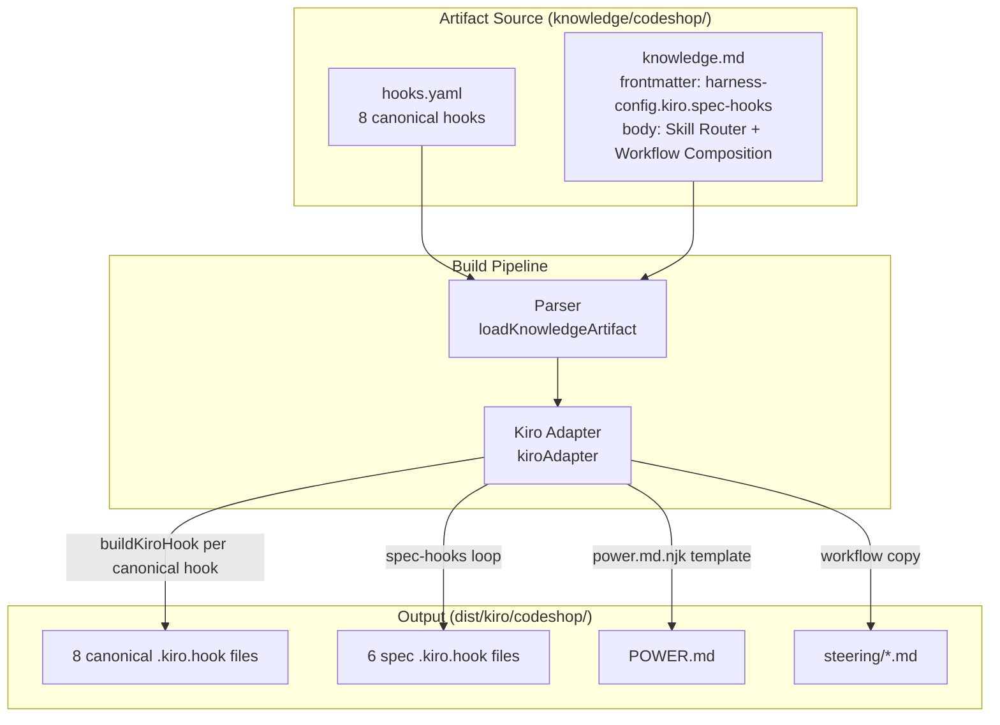
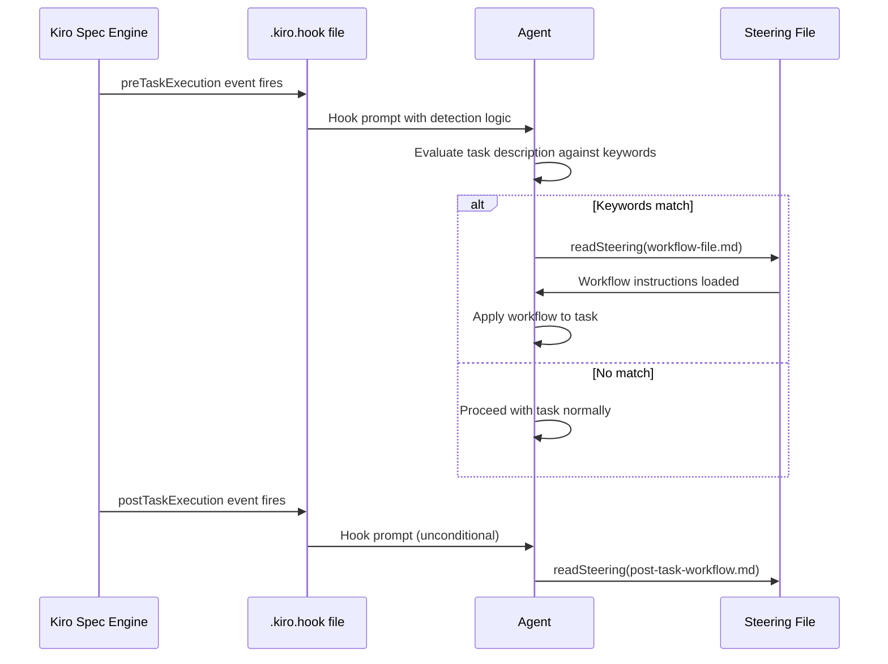

# Design Document: Codeshop Spec Integration

## Overview

This feature integrates the Codeshop power's developer workflows with Kiro's Spec Mode by adding 6 spec-aware hooks that fire automatically during spec task execution. The hooks are defined in `harness-config.kiro.spec-hooks` (not in `hooks.yaml`) and compiled by the existing Kiro adapter into `.kiro.hook` files alongside the 8 canonical hooks.

The integration touches four artifact surfaces:

1. **harness-config.kiro.spec-hooks** — 6 new hook entries in the codeshop `knowledge.md` frontmatter, each using Kiro-native `when`/`then` structure with `preTaskExecution` or `postTaskExecution` events.
2. **knowledge.md Skill Router** — A new "Spec Mode Integration" subsection documenting which hooks fire, when, and what workflow they load.
3. **knowledge.md Workflow Composition** — Two new chains: "Spec-Driven Development Chain" and "Spec Bugfix Chain".
4. **hooks.yaml** — Unchanged. All 8 canonical hooks remain as-is.

No changes to `src/schemas.ts`, `src/adapters/kiro.ts`, or Nunjucks templates are required — the adapter already handles `spec-hooks` compilation (see `kiroAdapter` lines handling `kiroConfig["spec-hooks"]`).

### Design Rationale

Spec-hooks bypass the canonical event schema (`CanonicalEventSchema` → `KIRO_EVENT_MAP` translation) because `preTaskExecution` and `postTaskExecution` are Kiro-native events that map 1:1 from canonical `pre_task`/`post_task`. Defining them directly in `harness-config.kiro.spec-hooks` avoids unnecessary round-tripping through the canonical layer and keeps the canonical `hooks.yaml` clean for harness-agnostic hooks.

## Architecture



### Hook Execution Flow



### Separation of Concerns

| Concern | Location | Reason |
|---|---|---|
| Harness-agnostic hooks | `hooks.yaml` | Compiled through `CanonicalEventSchema` → `KIRO_EVENT_MAP` for any harness |
| Kiro-specific spec hooks | `harness-config.kiro.spec-hooks` | Bypass canonical translation, emitted directly as Kiro-native JSON |
| Workflow documentation | `knowledge.md` body (Skill Router, Workflow Composition) | Agent reads POWER.md at activation time for routing context |
| Hook compilation | `src/adapters/kiro.ts` | Existing code handles both paths — no changes needed |

## Components and Interfaces

### Component 1: Spec-Hooks Array in harness-config

The 6 spec-hooks are defined in the `knowledge.md` frontmatter under `harness-config.kiro.spec-hooks`. Each entry follows the Kiro-native hook structure that the adapter already compiles.

**Interface (per spec-hook entry):**

```typescript
interface SpecHookEntry {
  name: string;           // Human-readable name, e.g. "TDD Task Detection"
  version: string;        // Semver, always "1.0.0" for initial release
  description: string;    // One-line description of what the hook does
  when: {
    type: "preTaskExecution" | "postTaskExecution";
  };
  then: {
    type: "askAgent";
    prompt: string;       // Directive prompt with conditional detection logic
  };
}
```

This matches the shape the Kiro adapter already expects in its `spec-hooks` loop (see `kiro.ts` lines handling `specHooks`).

**Hook Inventory:**

| # | Hook Name | Event | Steering File | Detection |
|---|---|---|---|---|
| 1 | TDD Task Detection | preTaskExecution | `drive-tests.md` | Task description contains test keywords |
| 2 | Post-Task Code Review | postTaskExecution | `review-changes.md` | Unconditional (fires after every task) |
| 3 | Post-Task Commit Guidance | postTaskExecution | `craft-commits.md` | Unconditional (fires after every task) |
| 4 | Domain Concept Validation | preTaskExecution | `challenge-domain-model.md` | Task description contains domain keywords |
| 5 | Plan Stress Test | preTaskExecution | `stress-test-plan.md` | Task is first task (task 1 / task 1.1) |
| 6 | Bugfix Triage Context | preTaskExecution | `triage-bug.md` | Task context contains bugfix keywords |

### Component 2: Hook Prompt Directive Pattern

Every spec-hook prompt follows the same structure established by the existing canonical hooks:

1. **Context statement** — What the hook is checking
2. **Detection criteria** — Keywords or patterns to match in the task description
3. **Match branch** — Load the specific steering file and apply the workflow
4. **No-match branch** — Proceed with the task normally
5. **Closing directive** — Concrete action the agent must take (either/or)

Example structure:
```
Before starting this task, assess whether it involves [criteria]:

1. Check the task description for [keyword list].
2. If the task matches:
   a. Read the [steering-file] steering file from the codeshop power.
   b. Apply [methodology] to the task.
3. If the task does not match, proceed with the task normally.

Either load [workflow] and confirm it is applied, or confirm the task
does not match and proceed with implementation.
```

### Component 3: Skill Router Spec-Mode Section

A new subsection added to the Skill Router in `knowledge.md` body, after the existing skill category tables. Documents:

- Each spec-hook with its event, workflow, and detection criteria
- Automatic activation (no manual invocation needed)
- Precedence rules for overlapping hooks

### Component 4: Workflow Composition Spec-Mode Chains

Two new chain entries added to the Workflow Composition section in `knowledge.md` body:

1. **Spec-Driven Development Chain**: `stress-test-plan` → `drive-tests` → `review-changes` → `craft-commits`
2. **Spec Bugfix Chain**: `triage-bug` → `journal-debug` → `drive-tests`

Both annotated as automatically activated by spec-hooks (unlike the existing manually-invoked chains).

## Data Models

### Spec-Hook YAML Structure (in knowledge.md frontmatter)

The spec-hooks are defined as a YAML array under `harness-config.kiro.spec-hooks`. The Kiro adapter reads this array and compiles each entry into a `.kiro.hook` JSON file using the `kiro/hook.json.njk` template (which simply calls `{{ hook | dump(2) }}`).

```yaml
harness-config:
  kiro:
    format: power
    spec-hooks:
      - name: "TDD Task Detection"
        version: "1.0.0"
        description: "Detects test-related spec tasks and loads TDD workflow"
        when:
          type: preTaskExecution
        then:
          type: askAgent
          prompt: |
            Before starting this task, assess whether it involves writing
            or modifying tests...
```

### Compiled Output Structure

Each spec-hook compiles to a `.kiro.hook` file containing JSON:

```json
{
  "name": "TDD Task Detection",
  "version": "1.0.0",
  "description": "Detects test-related spec tasks and loads TDD workflow",
  "when": {
    "type": "preTaskExecution"
  },
  "then": {
    "type": "askAgent",
    "prompt": "Before starting this task, assess whether..."
  }
}
```

### Output File Naming

Hook names are converted to kebab-case filenames by the adapter: `hook.name.toLowerCase().replace(/\s+/g, "-")`.

| Hook Name | Output File |
|---|---|
| TDD Task Detection | `tdd-task-detection.kiro.hook` |
| Post-Task Code Review | `post-task-code-review.kiro.hook` |
| Post-Task Commit Guidance | `post-task-commit-guidance.kiro.hook` |
| Domain Concept Validation | `domain-concept-validation.kiro.hook` |
| Plan Stress Test | `plan-stress-test.kiro.hook` |
| Bugfix Triage Context | `bugfix-triage-context.kiro.hook` |

### Keyword Detection Sets

These keyword sets are embedded in the hook prompts (not in code). The agent performs string matching at runtime.

| Hook | Keywords |
|---|---|
| TDD Task Detection | test, spec, TDD, red-green, assertion, coverage, unit test, integration test, property test |
| Domain Concept Validation | new type, new interface, new entity, new aggregate, bounded context, domain event, value object, new module, new model |
| Plan Stress Test | task 1, task 1.1 (first task detection) |
| Bugfix Triage Context | bugfix, bug, fix, regression, defect, broken |

### Hook Precedence

When multiple `preTaskExecution` hooks could fire for the same task (e.g., the first task is also test-related), the hooks fire in the order they appear in the `spec-hooks` array. The recommended ordering:

1. Plan Stress Test (first-task only, fires once per spec)
2. Bugfix Triage Context (spec-type detection)
3. Domain Concept Validation (domain keyword detection)
4. TDD Task Detection (test keyword detection)

Post-task hooks fire after all pre-task hooks complete:

5. Post-Task Code Review
6. Post-Task Commit Guidance

## Correctness Properties

*A property is a characteristic or behavior that should hold true across all valid executions of a system — essentially, a formal statement about what the system should do. Properties serve as the bridge between human-readable specifications and machine-verifiable correctness guarantees.*

### Property 1: Spec-hook compilation cardinality

*For any* array of N valid spec-hook entries in `harness-config.kiro.spec-hooks`, the Kiro adapter SHALL emit exactly N `.kiro.hook` files from the spec-hooks compilation path, in addition to any hook files generated from canonical hooks.

**Validates: Requirements 8.3, 12.1**

### Property 2: Spec-hook output schema validity

*For any* valid spec-hook entry with `name`, `version`, `description`, `when` (containing `type`), and `then` (containing `type` and `prompt`), the compiled `.kiro.hook` file SHALL contain valid JSON preserving all input fields — `name`, `version`, `description`, `when.type`, `then.type`, and `then.prompt` must all appear in the output unchanged.

**Validates: Requirements 8.2, 12.2**

### Property 3: Hook name to filename kebab-case transformation

*For any* spec-hook entry with a given `name`, the emitted `.kiro.hook` filename SHALL equal the hook name lowercased with spaces replaced by hyphens, suffixed with `.kiro.hook`. This is a deterministic pure transformation: `name.toLowerCase().replace(/\s+/g, "-") + ".kiro.hook"`.

**Validates: Requirements 8.4, 12.3**

### Property 4: Canonical hooks preserved alongside spec-hooks

*For any* artifact with both canonical hooks (in `hooks.yaml`) and spec-hooks (in `harness-config.kiro.spec-hooks`), the Kiro adapter output SHALL contain all canonical hook files unchanged — the set of canonical `.kiro.hook` files must be identical whether or not spec-hooks are present.

**Validates: Requirements 7.1, 7.2, 7.3, 7.4, 7.5, 12.4**

## Error Handling

### Invalid Spec-Hook Entries

The Kiro adapter iterates `spec-hooks` with minimal validation — it calls `renderTemplate` on each entry and derives the filename from `specHook.name`. Potential failure modes:

| Error | Current Behavior | Recommendation |
|---|---|---|
| `spec-hooks` is not an array | Skipped (guarded by `Array.isArray` check) | No change needed |
| Entry missing `name` | Falls back to `"spec-hook"` filename | Acceptable — adapter already handles this |
| Entry missing `when` or `then` | Template renders incomplete JSON | The hook.json.njk template does `{{ hook \| dump(2) }}` which will output whatever fields exist. Kiro will reject malformed hooks at load time. |
| Duplicate hook names | Multiple files with same name — last write wins | Document in knowledge.md that hook names must be unique |

### Hook Prompt Failures

Hook prompts are evaluated by the Kiro agent at runtime. If a prompt references a steering file that doesn't exist, the agent will fail to load it. All 6 spec-hook prompts reference steering files that already exist in the codeshop workflows directory:

- `drive-tests.md` ✓
- `review-changes.md` ✓
- `craft-commits.md` ✓
- `challenge-domain-model.md` ✓
- `stress-test-plan.md` ✓
- `triage-bug.md` ✓

### Precedence Conflicts

When multiple `preTaskExecution` hooks fire for the same task, Kiro executes them in the order they appear in the `.kiro/hooks/` directory (alphabetical by filename). The spec-hooks array ordering in `harness-config` controls the authored order, but the final execution order depends on Kiro's hook loading. The hook prompts include conditional detection logic so that non-matching hooks exit early with "proceed normally", making the execution order less critical — each hook independently decides whether to activate.

## Testing Strategy

### Property-Based Tests (fast-check)

Property-based tests validate the 4 correctness properties using the `fast-check` library. Each test generates random inputs and verifies the property holds across 100+ iterations.

- **Library**: fast-check (already a devDependency)
- **Test file**: `src/__tests__/codeshop-spec-hooks.property.test.ts`
- **Minimum iterations**: 100 per property
- **Tag format**: `Feature: codeshop-spec-integration, Property N: <property text>`

Tests exercise the `kiroAdapter` pure function directly with generated spec-hook entries, verifying compilation cardinality, schema validity, filename transformation, and canonical hook preservation.

### Example-Based Unit Tests

Example tests verify the specific content of the 6 authored spec-hooks and the knowledge.md body changes.

- **Test file**: `src/__tests__/codeshop-spec-hooks.test.ts`
- **Coverage**:
  - Each of the 6 spec-hooks has correct event type, steering file reference, and directive prompt structure (Requirements 1-6)
  - Each pre-task hook prompt contains both match and no-match branches (Requirement 11)
  - Each hook prompt ends with a concrete either/or directive (Requirement 11)
  - The knowledge.md body contains the Spec Mode Integration subsection (Requirement 9)
  - The knowledge.md body contains the two spec-driven chains (Requirement 10)
  - The 8 canonical hooks in hooks.yaml are unchanged (Requirement 7)
  - The spec-hooks array has exactly 6 entries (Requirement 8)

### Integration Tests

Integration tests verify the full build pipeline compiles the codeshop artifact correctly.

- Run `bun run dev build --harness kiro` and verify the `dist/kiro/codeshop/` directory contains all 14 hook files (8 canonical + 6 spec)
- Verify each `.kiro.hook` file is valid JSON
- Verify POWER.md contains the Skill Router and Workflow Composition updates

