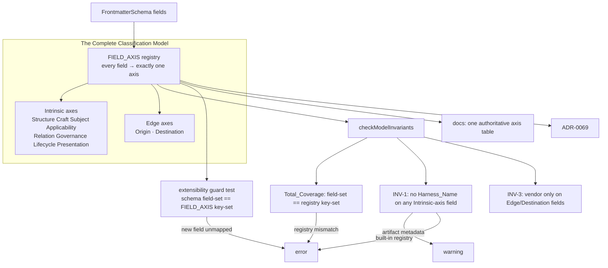

# Design Document: Complete Axis Inventory

## Overview

The prior spec (`vendor-neutral-formats-categories`) proved a model on two axes and left a guard that *promises* completeness — the Property-12 extensibility test fails if a new intrinsic field goes unregistered. But the model it guarded covered five axes and a handful of fields; the rest of `FrontmatterSchema` sat outside it. This spec makes the promise true: it **closes the model** by naming the full set of axes and mapping **every** frontmatter field to exactly one of them, in a single `FIELD_AXIS` registry that `checkModelInvariants` consults.

The design is deliberately additive and almost entirely declarative. There is **no schema change and no behavior change**: `type`, `ecosystem`, `depends`, `enhances`, `maturity`, and the rest keep their exact Zod definitions and runtime semantics. What changes is that each is now *named* onto an axis, the guard is taught the total map, and the model is documented as one table. The heavy lifting was already done in the code and in prior ADRs — this spec mostly *ratifies* placements the codebase already implies (most importantly ADR-0051, which already established that `type` is pure structure decoupled from output format).

The elegance target is three properties, each mechanically checked:

- **Complete** — every field is on an axis (`Total_Coverage`).
- **Orthogonal** — every field is on *exactly one* axis, and each axis answers exactly one question.
- **Closed under growth** — a new field cannot be added without an axis assignment, because the guard fails otherwise.

## The Complete Classification Model

Ten axes, in two bands. **Intrinsic** axes describe what an artifact *is*, *does*, or is *about*; **Edge** axes describe where it *came from* and where it *goes*. The single load-bearing rule — inherited from the prior spec's INV-1/INV-3 — is that **vendor identity appears only on the two Edge axes.**

| Band | Axis | Question it answers | Fields | Vendor? |
|---|---|---|---|---|
| Intrinsic | **Structure** | What kind/shape of artifact is this? | `type` | No |
| Intrinsic | **Craft** | What engineering skill does it encode? | `categories` | No |
| Intrinsic | **Subject** | What is it about? | `domains` | No |
| Intrinsic | **Applicability** | What technical context does it apply to? | `ecosystem` | No |
| Intrinsic | **Relation** | How does it relate to other artifacts? | `depends`, `enhances` | No |
| Intrinsic | **Governance** | How should it be trusted/handled? | `trust`, `risk-level`, `license`, `audience`, `model-assumptions`, `visibility` | No |
| Intrinsic | **Lifecycle** | Where is it in its life? | `maturity`, `version`, `successor`, `replaces`, `migrations` | No |
| Intrinsic | **Presentation** | How is it identified and displayed? | `name`, `displayName`, `description`, `keywords`, `author`, `id`, `priority`, `collections` | No |
| Edge | **Origin** | Where did it come from? | `provenance`, `attribution` | Recorded, never classifies |
| Edge | **Destination** | Which harness discovers it, and in what form? | `harnesses`, `inclusion`, `file_patterns`, `harness-config`, `inherit-hooks`, `outcomes` | **Yes — the only home for vendor** |

This is the whole model. Every one of the ~30 frontmatter fields lands in exactly one row. The two prior-spec invariants carry over verbatim and now range over the *complete* field set:

- **INV-1 (no vendor on an Intrinsic axis).** No value of any Intrinsic-axis field equals a `Harness_Name` — with the single exception the prior spec already carved out for a genuinely vendor-owned *structure* (a source Format_Contract's `harness`, which is not a frontmatter field).
- **INV-2 (orthogonality).** `FIELD_AXIS` maps each field to exactly one axis; no field is validated against another axis's vocabulary.
- **INV-3 (vendor at the edge only).** Only Origin (recorded) and Destination (export) name a vendor. Destination is where a `Harness_Name` or output-format value legitimately appears.

### Why these axis boundaries (the three placements that could be argued)

Elegance is only real if the debatable placements are defended, not glossed:

1. **`type` is Structure, not Destination — ratifying ADR-0051.** It is tempting to call `type` a delivery concern because adapters produce different files per type. But ADR-0051 already established the opposite and the code already implements it: `resolveFormat()` never reads `frontmatter.type`; output format comes from `harness-config.<harness>.format`. The vendor-flavored value `power` was *deprecated precisely because* it belonged to Destination, not Structure. So `type` is the clean structural taxonomy (`skill | rule | workflow | agent | prompt | template | reference-pack`), and this spec finishes the job by naming it Structure and forbidding any future vendor/output-format value there (Requirement 3).

2. **`ecosystem` is its own axis (Applicability), not folded into Craft or Subject.** "Applies to React" is a third question, orthogonal to "teaches refactoring" (Craft) and "is about academic medicine" (Subject). Collapsing it into either loses a real filter dimension and re-creates the overload this whole effort exists to remove. It is Intrinsic and INV-1 applies: a *harness* is never a valid `ecosystem` value, because a harness is a Destination, not a technical context an artifact targets.

3. **`depends`/`enhances` are a Relation axis, not properties.** Every other field describes the artifact itself; these describe *edges between artifacts*. Modeling them as their own axis is what makes "show me what composes with X" a first-class query and keeps the referential-integrity check (ADR-0007's unresolved-reference warning) conceptually located.

The `outcomes` placement is the one genuine judgment call, handled explicitly in Component C4 and Requirement 7.5.

## Scope

| In scope | Out of scope |
|---|---|
| Define the 10-axis model as the complete, closed set | Adding/removing/renaming any frontmatter field |
| `FIELD_AXIS` registry mapping every field → axis (Total_Coverage) | Changing any field's Zod definition, default, or runtime behavior |
| Extend `checkModelInvariants` + guard to total coverage | New persisted frontmatter (axes are enforcement/doc constructs) |
| Ratify `type` = Structure; classify `ecosystem`, `depends`/`enhances` | Re-litigating ADR-0051 (this ratifies it) |
| ADR-0069 + one authoritative axis table in docs | Catalog/browse facet UI for the new axes (follow-on if desired) |
| Place governance/lifecycle/presentation/`outcomes` | Introducing an 11th axis (would need its own ADR per Req 1.4) |

## Architecture



The registry is the hub: it is the single source the invariant check, the guard test, and the documentation table all derive from, so they cannot drift from each other.

## Components and Interfaces

### C1. `FIELD_AXIS` registry (new, in `src/validate.ts` or `src/model-axes.ts`)

The single source of truth: a total map from every `FrontmatterSchema` field to its `Axis`.

```ts
export type Axis =
  | "structure" | "craft" | "subject" | "applicability" | "relation"
  | "governance" | "lifecycle" | "presentation"   // intrinsic
  | "origin" | "destination";                      // edge

export const INTRINSIC_AXES: ReadonlySet<Axis> = new Set([
  "structure", "craft", "subject", "applicability", "relation",
  "governance", "lifecycle", "presentation",
]);

// Every FrontmatterSchema field appears here exactly once.
export const FIELD_AXIS: Readonly<Record<string, Axis>> = {
  // Structure
  type: "structure",
  // Craft / Subject / Applicability / Relation
  categories: "craft",
  domains: "subject",
  ecosystem: "applicability",
  depends: "relation", enhances: "relation",
  // Governance
  trust: "governance", "risk-level": "governance", license: "governance",
  audience: "governance", "model-assumptions": "governance", visibility: "governance",
  // Lifecycle
  maturity: "lifecycle", version: "lifecycle", successor: "lifecycle",
  replaces: "lifecycle", migrations: "lifecycle",
  // Presentation
  name: "presentation", displayName: "presentation", description: "presentation",
  keywords: "presentation", author: "presentation", id: "presentation",
  priority: "presentation", collections: "presentation",
  // Origin (edge)
  provenance: "origin", attribution: "origin",
  // Destination (edge)
  harnesses: "destination", inclusion: "destination", file_patterns: "destination",
  "harness-config": "destination", "inherit-hooks": "destination", outcomes: "destination",
};

export const EDGE_OR_VENDOR_BEARING = new Set<string>(
  Object.entries(FIELD_AXIS)
    .filter(([, ax]) => ax === "destination" || ax === "origin")
    .map(([f]) => f),
);
```

The `EDGE_OR_VENDOR_BEARING` set is derived from the registry (not hand-maintained), superseding the prior spec's hard-coded `VENDOR_BEARING_FIELDS = {harnesses, provenance, attribution}` — it now correctly includes `inclusion`, `file_patterns`, `harness-config`, `inherit-hooks`, `outcomes` as well.

### C2. Deriving the schema's field set (new helper)

To check Total_Coverage the check needs the authoritative list of `FrontmatterSchema` fields. Derive it from the schema shape rather than a second hand-list:

```ts
// FrontmatterSchema is a ZodObject (with .passthrough()); its declared keys are its shape keys.
export function frontmatterFieldNames(): string[] {
  return Object.keys(FrontmatterSchema._def.shape());
}
```

This is the crux of "closed under growth": the guard compares `frontmatterFieldNames()` to `Object.keys(FIELD_AXIS)`, so adding a field to the schema without a `FIELD_AXIS` entry breaks the build.

### C3. `checkModelInvariants` extension (in `src/validate.ts`)

Generalize the prior spec's check to consult `FIELD_AXIS`:

```ts
function checkModelInvariants(contracts, artifacts) {
  const errors = []; const warnings = [];

  // Total_Coverage (ERROR): schema field-set === registry key-set
  const fields = new Set(frontmatterFieldNames());
  const mapped = new Set(Object.keys(FIELD_AXIS));
  for (const f of fields) if (!mapped.has(f)) errors.push(unclassifiedField(f));   // Req 2.3
  for (const m of mapped) if (!fields.has(m)) errors.push(staleAxisEntry(m));      // Req 2.4

  // INV-1 (WARNING for artifacts): no Intrinsic-axis field value is a Harness_Name
  for (const art of artifacts)
    for (const [field, ax] of Object.entries(FIELD_AXIS))
      if (INTRINSIC_AXES.has(ax))
        for (const v of valuesOf(art.frontmatter, field))
          if (HARNESS_NAMES.has(v)) warnings.push(vendorOnIntrinsic(art, field, ax, v)); // Req 8.4

  // INV-1a (ERROR): built-in source Format_Contract harness rule — unchanged from prior spec
  // INV-3: vendor values permitted only on EDGE_OR_VENDOR_BEARING fields — enforced by the
  //        two rules above (intrinsic fields rejected; edge fields exempt by construction)

  return { errors, warnings };
}
```

Severity split is preserved (Requirement 8.5): a registry/coverage mismatch or a built-in-registry violation is an **error**; an authored-artifact INV-1 hit is a **warning**.

### C4. `outcomes` placement (Requirement 7.5)

`outcomes` is an array of `OutcomeSchema` capability declarations (specification/operation/invariant). It is not a classification of the artifact; it is a contract about what the artifact *does when exported*. It is therefore placed on **Destination** as an export-capability contract, and — being neither a `Harness_Name` nor a classification — it trivially satisfies INV-1/INV-3. The ADR records this rationale so the placement is not mistaken for an arbitrary catch-all.

### C5. Extensibility guard test generalization (Requirement 8.3)

The prior spec's Property-12 test compared the *intrinsic* field set to the check's known set. Generalize it: assert `frontmatterFieldNames()` equals `Object.keys(FIELD_AXIS)`. Adding *any* field — intrinsic or edge — without a `FIELD_AXIS` entry now fails this test. This is the mechanical form of "closed under growth."

### C6. Documentation + ADR (Requirement 10)

- One authoritative axis table (the table in this design) in the contributor docs, generated-or-checked against `FIELD_AXIS` so docs cannot drift.
- **ADR-0069 — The complete axis inventory**: records the 10-axis model, the total-mapping rule, the `type`=Structure ratification (extends ADR-0051), the `ecosystem`/`depends`/`enhances`/`outcomes` placements, and links the prior spec's ADR-0067/0068. Notes that it supersedes the taxonomy framing of ADR-0014 and completes ADR-0007.

## Data Models

### The `Axis` type and bands

| Band | Axes | Vendor allowed on any field? |
|---|---|---|
| Intrinsic | structure, craft, subject, applicability, relation, governance, lifecycle, presentation | No (INV-1) |
| Edge | origin, destination | origin: recorded only; destination: yes (INV-3) |

### Field → Axis (the total map, authoritative)

The `FIELD_AXIS` map in C1 is the data model. Its key set is exactly the `FrontmatterSchema` field set (Total_Coverage). No field appears twice (orthogonality). This table and C1 are the same data in two renderings and are checked equal by C6.

### Worked artifact, sorted by axis (Requirement 10.5)

`jhsomcv` (real catalog artifact), every field placed:

| Axis | Fields on this artifact |
|---|---|
| Structure | `type: skill` |
| Craft | `categories: [documentation]` |
| Subject | `domains: [academic, healthcare, publishing]` |
| Applicability | `ecosystem: []` |
| Relation | `depends: []`, `enhances: []` |
| Governance | `trust: community`, `audience: advanced` |
| Lifecycle | `maturity: beta`, `version: 0.1.0` |
| Presentation | `name`, `displayName: jhsomCV`, `description`, `keywords`, `author`, `collections: [jh-dsai]` |
| Origin | `attribution: {upstream: davidstonko/jhsomcv, …}` |
| Destination | `harnesses: [claude-code, codex, cursor]`, `inclusion: manual`, `harness-config.codex.format: skill` |

Every field on a real artifact lands on exactly one axis, and only the Destination row names harnesses — the model's whole claim, demonstrated on one artifact.

## Correctness Properties

*A property is a machine-verifiable statement of what the system should do across all valid executions.*

### Property 1: Total coverage — every field is on exactly one axis

*For* the set of `FrontmatterSchema` field names and the key set of `FIELD_AXIS`, the two sets shall be equal; and no field shall map to more than one axis. `checkModelInvariants` shall error on any field present in one set but not the other.
**Validates: Requirements 1.1, 2.1, 2.2, 2.3, 2.4**

### Property 2: Closed under growth

*For any* field added to `FrontmatterSchema` without a corresponding `FIELD_AXIS` entry (and vice versa), the extensibility guard test shall fail.
**Validates: Requirements 1.4, 8.2, 8.3**

### Property 3: No vendor on any intrinsic axis

*For all* artifacts and *for every* field whose `FIELD_AXIS` axis is in `INTRINSIC_AXES`, no value of that field shall equal a `Harness_Name`; a synthetic artifact injecting such a value shall be flagged (warning for authored metadata). *For* `type` specifically, a `Harness_Name` value shall be flagged as an INV-1 violation.
**Validates: Requirements 3.5, 4.4, 5.4, 6.4, 8.4**

### Property 4: Vendor confined to edge fields

*For all* artifacts, any `Harness_Name` or output-format value shall appear only on a field whose axis is `destination` (or the recorded `origin` fields); the `EDGE_OR_VENDOR_BEARING` set derived from `FIELD_AXIS` shall exactly equal the origin+destination field set.
**Validates: Requirements 7.1, 7.2, 7.4**

### Property 5: `type` carries no output-format meaning

*For any* artifact, the resolved export output format shall be a function of `harness-config.<harness>.format` (and its documented fallbacks) and shall not change if only `frontmatter.type` changes among valid `AssetType` values.
**Validates: Requirements 3.2, 3.3, 7.3**

### Property 6: Placement preserves behavior (backward compatibility)

*For all* existing valid artifacts, parsing, validating, building (all harnesses), and cataloging after the refactor shall be byte-identical to before, except for genuinely new INV-1/Total_Coverage diagnostics where a real violation exists.
**Validates: Requirements 9.1, 9.2, 9.3, 9.4**

### Property 7: Axis map is single-sourced

*For* the axis table rendered in documentation and the `FIELD_AXIS` registry, the field→axis assignments shall be equal; a docs/registry mismatch shall fail a check.
**Validates: Requirements 10.1, 10.2**

## Error Handling

| Condition | Severity | Behavior |
|---|---|---|
| `FrontmatterSchema` field missing from `FIELD_AXIS` | Error | Total_Coverage failure; names the unclassified field (Req 2.3, 8.2) |
| `FIELD_AXIS` entry not a `FrontmatterSchema` field | Error | Total_Coverage failure; names the stale entry (Req 2.4) |
| New field added without axis assignment | Error | Extensibility guard test fails in CI (Req 8.3) |
| Intrinsic-axis field value equals a `Harness_Name` (authored artifact) | Warning | INV-1 diagnostic naming artifact/field/axis/value; artifact stays valid (Req 8.4, 8.5) |
| Built-in source Format_Contract asserts a false vendor `harness` | Error | Registry self-check (unchanged from prior spec) (Req 8.5) |
| `type` set to a `Harness_Name` or output-format value | Warning (INV-1) + guidance | Flagged as a Destination concept misfiled onto Structure (Req 3.5) |
| Docs axis table disagrees with `FIELD_AXIS` | Error | Single-source check fails (Req 10.1) |

### Deliberate non-errors

- An unrecognized-but-well-formed `domains` value remains a *warning* (prior spec's governance) — unaffected here.
- An unresolved `depends`/`enhances` reference remains a *warning* (ADR-0007) — now documented as the Relation axis's referential-integrity check (Req 5.5), not changed.

## Testing Strategy

Runtime Bun (`bun test`); property tests via `fast-check` (min 100 runs), tagged `Feature: complete-axis-inventory, Property {N}: {title}`.

### Property-based tests

| Property | Test file | Focus |
|---|---|---|
| P1 Total coverage | `src/__tests__/axis-inventory.property.test.ts` | schema field-set === FIELD_AXIS key-set; no double-mapping |
| P2 Closed under growth | `axis-inventory.property.test.ts` (guard) | simulate an unmapped field → guard fails |
| P3 No vendor on intrinsic axis | `src/__tests__/model-invariants.property.test.ts` (extend) | inject Harness_Name on each intrinsic field → flagged |
| P4 Vendor confined to edge | `model-invariants.property.test.ts` | EDGE_OR_VENDOR_BEARING === origin+destination field set |
| P5 `type` no output-format meaning | `src/__tests__/type-structure.test.ts` | vary `type`, assert resolved format unchanged |
| P6 Backward compat | `src/__tests__/backcompat-axes.test.ts` + full build/catalog diff in CI | byte-identical outputs |
| P7 Axis map single-sourced | `src/__tests__/axis-docs-sync.test.ts` | docs table === FIELD_AXIS |

### Example-based tests

| Test | File | Requirement |
|---|---|---|
| All 10 axes present; intrinsic/edge banding correct | `axis-inventory.test.ts` | 1.1, 1.2 |
| `type` → structure; no `type` value is a format | `type-structure.test.ts` | 3.1, 3.3 |
| `ecosystem` → applicability; harness value warns | `axis-inventory.test.ts` | 4.1, 4.4 |
| `depends`/`enhances` → relation; unresolved ref still warns | `validate.test.ts` | 5.1, 5.5 |
| governance/lifecycle/presentation field placements | `axis-inventory.test.ts` | 6.1, 6.2, 6.3 |
| `outcomes` → destination (capability) | `axis-inventory.test.ts` | 7.5 |
| worked artifact sorts cleanly by axis | `axis-inventory.test.ts` | 10.5 |

### Whole-catalog regression

Full `kanon build` (all harnesses) and `kanon catalog generate` before/after must diff empty (Req 9.3, 9.4); `checkModelInvariants` reports clean Total_Coverage over the real corpus.
