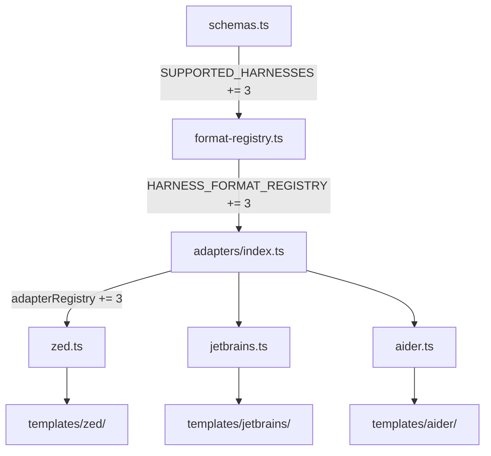

# Design Document: New Harness Adapters (Zed, JetBrains, Aider)

## Overview

This feature adds three new harness targets to Skill Forge: Zed, JetBrains AI (Junie), and Aider. Each follows the established adapter pattern — a pure-function adapter, Nunjucks templates, format registry entry, and schema integration. The design is intentionally conservative: no new architectural patterns are introduced. Every new component slots into existing extension points.

## Architecture

The change touches the same five layers as any harness addition, with no new modules or patterns:



No changes to the build pipeline, catalog generator, browse SPA logic, or validation engine are needed — they all discover harnesses dynamically from the schema and registry.

## Components and Interfaces

### 1. Schema Changes (`src/schemas.ts`)

Add three entries to `SUPPORTED_HARNESSES`:

```typescript
export const SUPPORTED_HARNESSES = [
  "kiro",
  "claude-code",
  "copilot",
  "cursor",
  "windsurf",
  "cline",
  "qdeveloper",
  "zed",        // NEW
  "jetbrains",  // NEW
  "aider",      // NEW
] as const;
```

The `FrontmatterSchema` default for `harnesses` uses `[...SUPPORTED_HARNESSES]`, so new artifacts will automatically target all ten harnesses. The existing `superRefine` for per-harness format validation already iterates `harness-config` keys dynamically against `HARNESS_FORMAT_REGISTRY`, so no schema validation changes are needed.

### 2. Format Registry (`src/format-registry.ts`)

Add three entries to `HARNESS_FORMAT_REGISTRY`:

```typescript
zed:       { formats: ["prompt"],    default: "prompt" },
jetbrains: { formats: ["guideline"], default: "guideline" },
aider:     { formats: ["convention"], default: "convention" },
```

All three are single-format harnesses. The `resolveFormat()` function requires no changes — it already handles single-format harnesses correctly.

### 3. Zed Adapter (`src/adapters/zed.ts`)

**Output structure:**
```
.zed/
├── prompts/<artifact-name>.md
└── settings.json              (only when MCP servers defined)
```

**Adapter logic:**
- Call `resolveFormat("zed", zedConfig)` for consistency
- Render `zed/prompt.md.njk` → `.zed/prompts/<name>.md`
- If MCP servers present: build `context_servers` object with shape `{ [name]: { command: { path, args, env } } }`, render `zed/settings.json.njk` → `.zed/settings.json`
- If hooks present: emit warning "Zed does not support hooks"

**Key difference from other adapters:** Zed's MCP config uses `context_servers` (not `mcpServers`) and nests the command under a `command` object with `path` instead of `command`. The template handles this shape difference.

```typescript
export const zedAdapter: HarnessAdapter = (artifact, templateEnv) => {
  const files: OutputFile[] = [];
  const warnings: AdapterWarning[] = [];
  const harnessConfig = (artifact.frontmatter as Record<string, unknown>)["harness-config"] as Record<string, unknown> | undefined;
  const zedConfig = (harnessConfig?.zed ?? {}) as Record<string, unknown>;
  resolveFormat("zed", zedConfig);

  // Prompt file
  const content = renderTemplate(templateEnv, "zed/prompt.md.njk", { artifact });
  files.push({ relativePath: `.zed/prompts/${artifact.name}.md`, content });

  // MCP → context_servers in settings.json
  if (artifact.mcpServers.length > 0) {
    const contextServers: Record<string, unknown> = {};
    for (const server of artifact.mcpServers) {
      contextServers[server.name] = {
        command: { path: server.command, args: server.args, env: server.env },
      };
    }
    const settingsContent = renderTemplate(templateEnv, "zed/settings.json.njk", { contextServers });
    files.push({ relativePath: ".zed/settings.json", content: settingsContent });
  }

  // Hooks — not supported
  if (artifact.hooks.length > 0) {
    warnings.push({
      artifactName: artifact.name, harnessName: "zed",
      message: "Zed does not support hooks; skipping all hook definitions",
    });
  }

  return { files, warnings };
};
```

### 4. JetBrains Adapter (`src/adapters/jetbrains.ts`)

**Output structure:**
```
.junie/
├── guidelines/<artifact-name>.md
└── mcp.json                   (only when MCP servers defined)
```

**Adapter logic:**
- Call `resolveFormat("jetbrains", jetbrainsConfig)` for consistency
- Render `jetbrains/guideline.md.njk` → `.junie/guidelines/<name>.md`
- If MCP servers present: build standard `{ mcpServers: { ... } }` object, render `jetbrains/mcp.json.njk` → `.junie/mcp.json`
- If hooks present: emit warning "JetBrains AI does not support hooks"

This adapter follows the exact same pattern as the Cursor adapter — single format, standard MCP shape, no hook support.

```typescript
export const jetbrainsAdapter: HarnessAdapter = (artifact, templateEnv) => {
  const files: OutputFile[] = [];
  const warnings: AdapterWarning[] = [];
  const harnessConfig = (artifact.frontmatter as Record<string, unknown>)["harness-config"] as Record<string, unknown> | undefined;
  const jetbrainsConfig = (harnessConfig?.jetbrains ?? {}) as Record<string, unknown>;
  resolveFormat("jetbrains", jetbrainsConfig);

  // Guideline file
  const content = renderTemplate(templateEnv, "jetbrains/guideline.md.njk", { artifact });
  files.push({ relativePath: `.junie/guidelines/${artifact.name}.md`, content });

  // MCP servers
  if (artifact.mcpServers.length > 0) {
    const mcpConfig: Record<string, unknown> = { mcpServers: {} };
    for (const server of artifact.mcpServers) {
      (mcpConfig.mcpServers as Record<string, unknown>)[server.name] = {
        command: server.command, args: server.args, env: server.env,
      };
    }
    const mcpContent = renderTemplate(templateEnv, "jetbrains/mcp.json.njk", { mcpConfig });
    files.push({ relativePath: ".junie/mcp.json", content: mcpContent });
  }

  // Hooks — not supported
  if (artifact.hooks.length > 0) {
    warnings.push({
      artifactName: artifact.name, harnessName: "jetbrains",
      message: "JetBrains AI does not support hooks; skipping all hook definitions",
    });
  }

  return { files, warnings };
};
```

### 5. Aider Adapter (`src/adapters/aider.ts`)

**Output structure:**
```
.aider/
└── prompts/<artifact-name>.md
```

**Adapter logic:**
- Call `resolveFormat("aider", aiderConfig)` for consistency
- Render `aider/convention.md.njk` → `.aider/prompts/<name>.md`
- If MCP servers present: emit warning "Aider does not natively support MCP servers"
- If hooks present: emit warning "Aider does not support hooks"

Aider is the simplest adapter — single output file, no MCP, no hooks.

```typescript
export const aiderAdapter: HarnessAdapter = (artifact, templateEnv) => {
  const files: OutputFile[] = [];
  const warnings: AdapterWarning[] = [];
  const harnessConfig = (artifact.frontmatter as Record<string, unknown>)["harness-config"] as Record<string, unknown> | undefined;
  const aiderConfig = (harnessConfig?.aider ?? {}) as Record<string, unknown>;
  resolveFormat("aider", aiderConfig);

  // Convention file
  const content = renderTemplate(templateEnv, "aider/convention.md.njk", { artifact });
  files.push({ relativePath: `.aider/prompts/${artifact.name}.md`, content });

  // MCP — not supported
  if (artifact.mcpServers.length > 0) {
    warnings.push({
      artifactName: artifact.name, harnessName: "aider",
      message: "Aider does not natively support MCP servers; skipping MCP definitions",
    });
  }

  // Hooks — not supported
  if (artifact.hooks.length > 0) {
    warnings.push({
      artifactName: artifact.name, harnessName: "aider",
      message: "Aider does not support hooks; skipping all hook definitions",
    });
  }

  return { files, warnings };
};
```

### 6. Templates

#### `templates/harness-adapters/zed/prompt.md.njk`
```njk

```

Plain markdown, no frontmatter. Zed prompts are just markdown files.

#### `templates/harness-adapters/zed/settings.json.njk`
```njk
{
  "context_servers": {{ contextServers | dump(2) }}
}
```

#### `templates/harness-adapters/jetbrains/guideline.md.njk`
```njk

```

Plain markdown, no frontmatter. Junie guidelines are markdown files.

#### `templates/harness-adapters/jetbrains/mcp.json.njk`
```njk
{{ mcpConfig | dump(2) }}
```

Standard MCP JSON, same pattern as cursor/windsurf/cline.

#### `templates/harness-adapters/aider/convention.md.njk`
```njk

```

Plain markdown. Aider conventions are read as plain text files.

### 7. Adapter Registry (`src/adapters/index.ts`)

Add three imports and three registry entries:

```typescript
import { zedAdapter } from "./zed";
import { jetbrainsAdapter } from "./jetbrains";
import { aiderAdapter } from "./aider";

export const adapterRegistry: Record<HarnessName, HarnessAdapter> = {
  // ... existing 7 ...
  zed: zedAdapter,
  jetbrains: jetbrainsAdapter,
  aider: aiderAdapter,
};
```

### 8. Wizard Updates (`src/wizard.ts`)

Add descriptive labels for the three new harnesses in the harness multi-select:

```
zed — Prompt files for Zed editor's AI assistant
jetbrains — Guidelines for JetBrains Junie AI
aider — Convention files for Aider CLI pair programmer
```

Since all three are single-format harnesses, the wizard will not prompt for format selection for any of them (consistent with cursor, windsurf, cline, claude-code).

## Data Models

### Output File Mappings

| Harness    | Format      | Output Path                              | MCP Output                | Hooks   |
|------------|-------------|------------------------------------------|---------------------------|---------|
| zed        | prompt      | `.zed/prompts/<name>.md`                 | `.zed/settings.json`      | Warning |
| jetbrains  | guideline   | `.junie/guidelines/<name>.md`            | `.junie/mcp.json`         | Warning |
| aider      | convention  | `.aider/prompts/<name>.md`               | Warning (not supported)   | Warning |

### Zed Context Server Shape

Zed uses a different MCP configuration shape than other harnesses:

```json
{
  "context_servers": {
    "server-name": {
      "command": {
        "path": "uvx",
        "args": ["package@latest"],
        "env": { "KEY": "value" }
      }
    }
  }
}
```

This differs from the standard `{ mcpServers: { name: { command, args, env } } }` shape used by Cursor, Windsurf, Cline, JetBrains, etc. The Zed adapter handles this transformation in the adapter logic before passing to the template.

## Backward Compatibility

- Existing artifacts with explicit `harnesses` arrays listing only the original 7 harnesses are unaffected — no new output is produced.
- Existing artifacts that omit `harnesses` (defaulting to all) will now also build for the 3 new harnesses. This is additive and non-breaking — new output directories appear in `dist/` but existing output is unchanged.
- No existing adapter, template, or schema behavior is modified.

## What Does NOT Change

- Build pipeline orchestration (`src/build.ts`) — discovers harnesses from the registry
- Catalog generator (`src/catalog.ts`) — iterates `harnesses` array dynamically
- Browse SPA (`src/browse.ts`) — renders whatever harnesses appear in catalog entries
- Validation engine (`src/validate.ts`) — schema validation handles new harnesses via existing `superRefine`
- `resolveFormat()` — already handles single-format harnesses correctly
- Install/publish backends — harness-agnostic
