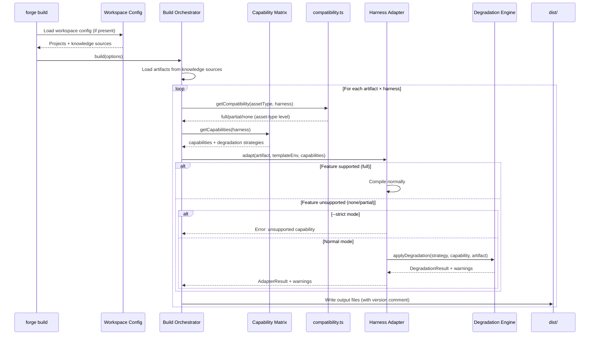
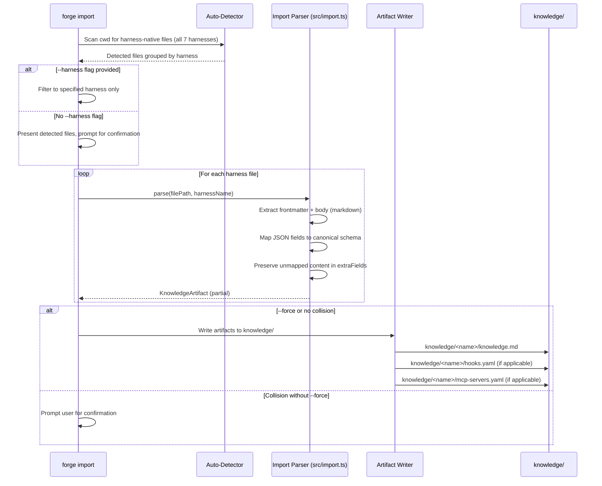
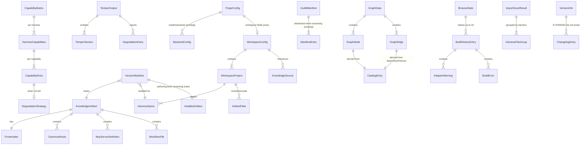

# Design Document: Skill Forge 10-Star Features

## Implementation Status

> **8 related specs have been fully implemented** that overlap with features described here. This design has been updated to reflect existing infrastructure and focus on what remains to be built.

| Feature | Status | Existing Infrastructure |
|---------|--------|------------------------|
| 1. Capability Matrix | 🟡 Partially Started | `src/format-registry.ts` (HARNESS_FORMAT_REGISTRY, resolveFormat), `src/compatibility.ts` (ASSET_HARNESS_COMPATIBILITY, getCompatibility), `--strict` flag on build |
| 2. Import (Multi-Harness) | 🟡 Partially Started | `src/import.ts` (forge import with --all, --format, --dry-run, --collections, --knowledge-dir for Kiro powers/skills) |
| 3. Versioning + Migration | 🟡 Partially Started | `src/guild/` (manifest-driven distribution, version-resolver, global-cache, sync-lock), `FrontmatterSchema.version` defaults to "0.1.0" |
| 4. Workspace Support | 🟡 Partially Started | `forge.config.yaml` (backends config), Guild manifest (`.forge/manifest.yaml`) |
| 5. Temper / Preview | 🔴 Not Started | `src/browse.ts` (Browse_SPA patterns, local HTTP server, handleRequest) |
| 6. Admin UX Integration | 🔴 Not Started | `src/browse.ts` (handleRequest, BrowseState), `src/browse-ui.ts` (generateHtmlPage, design system), `src/admin.ts` (CRUD), `src/temper.ts` (planned), `src/import.ts`, `src/versioning.ts`, `src/workspace.ts` |
| 7. Dependency Graph Visualization | 🔴 Not Started | `src/browse-ui.ts` (inline HTML/CSS/JS SPA), `CatalogEntrySchema` (depends, enhances fields), `src/catalog.ts` (generateCatalog) |
| 8. Build Dashboard | 🔴 Not Started | `src/build.ts` (build function, BuildResult, BuildOptions), `src/browse.ts` (handleRequest, BrowseState), `src/browse-ui.ts` (design system) |

## Overview

This design extends Skill Forge with eight major capabilities that transform it from a one-way compiler into a full-lifecycle knowledge management platform. The features are:

1. **Harness Capability Matrix + Graceful Degradation** — A machine-readable matrix declaring what each harness supports, with configurable strategies (`inline`, `comment`, `omit`) for handling unsupported features during compilation. Extends the existing `HARNESS_FORMAT_REGISTRY` and `ASSET_HARNESS_COMPATIBILITY`.
2. **Bidirectional Sync / `forge import`** — Extends the existing `forge import` command (which handles Kiro powers/skills) to support all 7 harness-native formats, adding `--harness` scanning and `--force` overwrite.
3. **Artifact Versioning + Migration** — Authoring-level versioning (distinct from the Guild_System's distribution-level versioning): version embedding in compiled output, `forge upgrade` command, and optional migration scripts.
4. **Multi-Repo / Monorepo Workspace Support** — Extends the existing `forge.config.yaml` (which currently defines backends) with workspace project definitions for monorepo artifact management.
5. **Interactive Temper / Preview** — A `forge temper` command that renders a human-readable preview of the "AI experience" for a given artifact-harness combination, leveraging the Browse_SPA infrastructure for web mode.
6. **Admin UX Integration** — Surfaces capability data, temper previews, import actions, version/upgrade info, and workspace management directly in the Browse_SPA admin UI via new API endpoints and inline UI components.
7. **Dependency Graph Visualization** — An interactive inline SVG graph rendering artifact dependency relationships (`depends`/`enhances`) within the admin UI, with click-to-navigate, hover highlighting, and type filtering.
8. **Build Dashboard** — A build trigger, status display, and history panel within the admin UI, allowing users to configure and run builds without switching to the terminal.

### Key Design Decisions

- **Capability matrix co-located with format-registry** — The matrix lives in `src/capability-matrix.ts` alongside `src/format-registry.ts`, since both declare per-harness metadata. The existing `src/compatibility.ts` handles asset-type compatibility (a different concern); the new capability matrix handles feature-level capabilities (hooks, MCP, path_scoping, etc.).
- **Degradation in the adapter layer** — Each adapter receives the capability matrix and applies degradation strategies itself, rather than a centralized pre-processing step. This keeps adapter-specific knowledge encapsulated.
- **Import extends `src/import.ts`** — Rather than creating a new `src/importers/` directory, the existing `src/import.ts` module is extended with additional format detectors and parsers for non-Kiro harnesses. This keeps the import logic centralized.
- **Workspace config extends `forge.config.yaml`** — The existing config file gains new top-level fields (`knowledgeSources`, `projects`, `defaults`) alongside the existing `install.backends` structure. No new config file is created.
- **Temper reuses Browse_SPA patterns** — The web preview mode reuses `startBrowseServer`-style patterns from `src/browse.ts` (Bun.serve, handleRequest routing, HTML generation) rather than introducing a new server framework.
- **Versioning is authoring-level, distinct from Guild** — The Guild_System handles distribution-level versioning (which compiled version to install from a remote backend). This feature handles authoring-level versioning (tracking what version of the source artifact is installed locally, with migration scripts for breaking changes).
- **Version manifests as sidecar JSON** — `.forge-manifest.json` files are written alongside installed artifacts (already partially implemented in `src/install.ts`).
- **Admin UX extends `handleRequest()` in `src/browse.ts`** — All new API endpoints (capabilities, temper, import/scan, versions, upgrade, workspace, graph, build) are added as route handlers in the existing `handleRequest()` function. No new server or router framework is introduced.
- **All new UI is inline in `generateHtmlPage()`** — New UI components (capability badges, temper panel, import modal, version display, workspace tab, dependency graph, build dashboard) are rendered as inline HTML/CSS/JS within the existing `generateHtmlPage()` function in `src/browse-ui.ts`. No external frameworks or CDN dependencies.
- **Dependency graph uses inline SVG with force-directed layout** — The graph is rendered as SVG elements within the SPA, with a simple force-directed layout algorithm implemented in inline JavaScript. No external graph libraries (D3, vis.js, etc.) are used, keeping the zero-dependency constraint.
- **Build state is in-memory, bounded to 10 entries** — Build results are stored in the `BrowseState` object for the server session lifetime. A bounded ring buffer of 10 entries prevents unbounded memory growth. State is lost on server restart (acceptable for a dev tool).
- **Build configuration persisted in localStorage** — The user's last build settings (harness filter, artifact filter, strict mode) are stored in the browser's localStorage, not on the server. This keeps the server stateless for build config while providing UX continuity.

## Architecture

```mermaid
graph TD
    subgraph "CLI Layer (src/cli.ts)"
        CLI["forge CLI<br/>Commander.js"]
        BUILD_CMD["build --strict"]
        IMPORT_CMD["import --harness --force --dry-run"]
        UPGRADE_CMD["upgrade --force --dry-run --project"]
        TEMPER_CMD["temper --harness --compare --web --json"]
        INSTALL_CMD["install --project"]
    end

    subgraph "New Feature Modules"
        CAP["src/capability-matrix.ts<br/>Capability Matrix + Degradation"]
        DEG["src/adapters/degradation.ts<br/>Degradation Engine"]
        VER["src/versioning.ts<br/>Manifest + Migration"]
        WS["src/workspace.ts<br/>Workspace Config"]
        PG["src/temper.ts<br/>Temper Renderer"]
    end

    subgraph "Admin UI Layer (src/browse.ts + src/browse-ui.ts)"
        BROWSE_SERVER["Browse Server<br/>handleRequest()"]
        BROWSE_UI["generateHtmlPage()<br/>Inline SPA"]

        subgraph "New API Endpoints"
            API_CAP["GET /api/capabilities<br/>GET /api/capabilities/:harness"]
            API_PG["POST /api/temper"]
            API_IMPORT["POST /api/import/scan<br/>POST /api/import"]
            API_VER["GET /api/versions/:name<br/>POST /api/upgrade/:name"]
            API_WS["GET /api/workspace<br/>PUT /api/workspace/projects/:name"]
            API_GRAPH["GET /api/graph"]
            API_BUILD["POST /api/build<br/>GET /api/build/status"]
        end

        subgraph "New UI Components (inline in generateHtmlPage)"
            UI_CAP["Capability Badges<br/>Matrix Grid"]
            UI_PG["Inline Temper Panel<br/>Harness Selector"]
            UI_IMPORT["Import Modal<br/>File Scanner"]
            UI_VER["Version Display<br/>Upgrade Button"]
            UI_WS["Workspace Tab<br/>Project Detail"]
            UI_GRAPH["Dependency Graph<br/>Inline SVG + Force Layout"]
            UI_BUILD["Build Dashboard<br/>Config + History"]
        end
    end

    subgraph "Existing Modules (already implemented)"
        BUILD["src/build.ts"]
        INSTALL["src/install.ts"]
        ADAPTERS["src/adapters/"]
        PARSER["src/parser.ts"]
        SCHEMAS["src/schemas.ts"]
        VALIDATE["src/validate.ts"]
        CATALOG["src/catalog.ts"]
        TMPL["src/template-engine.ts"]
        FMTREG["src/format-registry.ts<br/>HARNESS_FORMAT_REGISTRY"]
        COMPAT["src/compatibility.ts<br/>ASSET_HARNESS_COMPATIBILITY"]
        IMPORT["src/import.ts<br/>(Kiro power/skill import)"]
        BROWSE["src/browse.ts<br/>(Browse_SPA, HTTP server)"]
        GUILD["src/guild/<br/>(manifest, sync, cache)"]
        CONFIG["src/config.ts<br/>(loadForgeConfig)"]
        ADMIN["src/admin.ts<br/>(CRUD operations)"]
    end

    subgraph "Data"
        KA["knowledge/*/"]
        DIST["dist/<harness>/<artifact>/"]
        MANIFEST[".forge-manifest.json"]
        WSCONFIG["forge.config.yaml"]
        TEMPLATES["templates/"]
    end

    CLI --> BUILD_CMD & IMPORT_CMD & UPGRADE_CMD & TEMPER_CMD & INSTALL_CMD

    BUILD_CMD --> BUILD
    BUILD --> CAP
    BUILD --> ADAPTERS
    BUILD --> WS
    ADAPTERS --> DEG
    DEG --> CAP

    IMPORT_CMD --> IMPORT
    IMPORT --> PARSER

    UPGRADE_CMD --> VER
    VER --> BUILD
    VER --> INSTALL

    TEMPER_CMD --> PG
    PG --> BUILD
    PG --> CAP
    PG --> TMPL
    PG --> BROWSE

    INSTALL_CMD --> INSTALL
    INSTALL --> WS
    INSTALL --> VER

    VALIDATE --> CAP
    VALIDATE --> WS

    CAP --> FMTREG
    CAP --> COMPAT

    BUILD --> KA
    BUILD --> DIST
    INSTALL --> MANIFEST
    WS --> WSCONFIG
    WS --> CONFIG
    PG --> TEMPLATES
    ADAPTERS --> TEMPLATES

    %% Admin UI connections
    BROWSE_SERVER --> API_CAP & API_PG & API_IMPORT & API_VER & API_WS & API_GRAPH & API_BUILD
    API_CAP --> CAP
    API_PG --> PG
    API_IMPORT --> IMPORT
    API_VER --> VER
    API_WS --> WS
    API_GRAPH --> CATALOG
    API_BUILD --> BUILD
    BROWSE_UI --> UI_CAP & UI_PG & UI_IMPORT & UI_VER & UI_WS & UI_GRAPH & UI_BUILD
```




### Data Flow: Build with Degradation



### Data Flow: Import Round-Trip (Extended)



## Components and Interfaces

### 1. Capability Matrix (`src/capability-matrix.ts`)

> **Relationship to existing modules**: This module extends the per-harness metadata story. `src/format-registry.ts` declares output formats per harness. `src/compatibility.ts` declares asset-type compatibility per harness. This new module declares feature-level capabilities per harness (hooks, MCP, path_scoping, etc.) with degradation strategies.

The central data structure declaring what each harness supports and how to handle unsupported features.

```typescript
// src/capability-matrix.ts

import { z } from "zod";
import type { HarnessName } from "./schemas";
import { SUPPORTED_HARNESSES } from "./schemas";

export const HARNESS_CAPABILITIES = [
  "hooks", "mcp", "path_scoping", "workflows",
  "toggleable_rules", "agents", "file_match_inclusion",
  "system_prompt_merging",
] as const;

export type HarnessCapabilityName = (typeof HARNESS_CAPABILITIES)[number];

export const SupportLevelSchema = z.enum(["full", "partial", "none"]);
export type SupportLevel = z.infer<typeof SupportLevelSchema>;

export const DegradationStrategySchema = z.enum(["inline", "comment", "omit"]);
export type DegradationStrategy = z.infer<typeof DegradationStrategySchema>;

export const CapabilityEntrySchema = z.object({
  support: SupportLevelSchema,
  degradation: DegradationStrategySchema.optional(),
}).refine(
  (entry) => entry.support === "full" || entry.degradation !== undefined,
  { message: "Degradation strategy required when support is not 'full'" },
);
export type CapabilityEntry = z.infer<typeof CapabilityEntrySchema>;

export type CapabilityMatrix = Record<HarnessName, Record<HarnessCapabilityName, CapabilityEntry>>;

/** The capability matrix constant — source of truth */
export const CAPABILITY_MATRIX: CapabilityMatrix = {
  kiro: {
    hooks: { support: "full" },
    mcp: { support: "full" },
    path_scoping: { support: "full" },
    workflows: { support: "full" },
    toggleable_rules: { support: "full" },
    agents: { support: "partial", degradation: "inline" },
    file_match_inclusion: { support: "full" },
    system_prompt_merging: { support: "full" },
  },
  "claude-code": {
    hooks: { support: "partial", degradation: "inline" },
    mcp: { support: "full" },
    path_scoping: { support: "none", degradation: "comment" },
    workflows: { support: "none", degradation: "inline" },
    toggleable_rules: { support: "none", degradation: "omit" },
    agents: { support: "none", degradation: "omit" },
    file_match_inclusion: { support: "none", degradation: "omit" },
    system_prompt_merging: { support: "full" },
  },
  copilot: {
    hooks: { support: "none", degradation: "inline" },
    mcp: { support: "none", degradation: "comment" },
    path_scoping: { support: "full" },
    workflows: { support: "none", degradation: "inline" },
    toggleable_rules: { support: "none", degradation: "omit" },
    agents: { support: "full" },
    file_match_inclusion: { support: "full" },
    system_prompt_merging: { support: "none", degradation: "inline" },
  },
  cursor: {
    hooks: { support: "none", degradation: "inline" },
    mcp: { support: "full" },
    path_scoping: { support: "full" },
    workflows: { support: "none", degradation: "inline" },
    toggleable_rules: { support: "full" },
    agents: { support: "none", degradation: "omit" },
    file_match_inclusion: { support: "full" },
    system_prompt_merging: { support: "none", degradation: "inline" },
  },
  windsurf: {
    hooks: { support: "none", degradation: "inline" },
    mcp: { support: "full" },
    path_scoping: { support: "full" },
    workflows: { support: "full" },
    toggleable_rules: { support: "none", degradation: "omit" },
    agents: { support: "none", degradation: "omit" },
    file_match_inclusion: { support: "full" },
    system_prompt_merging: { support: "none", degradation: "inline" },
  },
  cline: {
    hooks: { support: "partial", degradation: "inline" },
    mcp: { support: "full" },
    path_scoping: { support: "none", degradation: "comment" },
    workflows: { support: "none", degradation: "inline" },
    toggleable_rules: { support: "none", degradation: "omit" },
    agents: { support: "none", degradation: "omit" },
    file_match_inclusion: { support: "none", degradation: "omit" },
    system_prompt_merging: { support: "none", degradation: "inline" },
  },
  qdeveloper: {
    hooks: { support: "none", degradation: "inline" },
    mcp: { support: "full" },
    path_scoping: { support: "full" },
    workflows: { support: "none", degradation: "inline" },
    toggleable_rules: { support: "none", degradation: "omit" },
    agents: { support: "full" },
    file_match_inclusion: { support: "full" },
    system_prompt_merging: { support: "none", degradation: "inline" },
  },
};

/** Query capabilities for a harness */
export function getCapabilities(harness: HarnessName): Record<HarnessCapabilityName, CapabilityEntry> {
  return CAPABILITY_MATRIX[harness];
}

/** Check if a specific capability is supported */
export function isSupported(harness: HarnessName, capability: HarnessCapabilityName): boolean {
  return CAPABILITY_MATRIX[harness][capability].support === "full";
}

/** Get degradation strategy for a capability, or undefined if fully supported */
export function getDegradation(
  harness: HarnessName,
  capability: HarnessCapabilityName,
): DegradationStrategy | undefined {
  const entry = CAPABILITY_MATRIX[harness][capability];
  return entry.support === "full" ? undefined : entry.degradation;
}

/** Validate matrix is in sync with adapter registry and format registry */
export function validateMatrixSync(
  matrixHarnesses: string[],
  registryHarnesses: string[],
  formatRegistryHarnesses: string[],
): { missing: string[]; extra: string[] } {
  const matrixSet = new Set(matrixHarnesses);
  const allRequired = new Set([...registryHarnesses, ...formatRegistryHarnesses]);
  return {
    missing: [...allRequired].filter((h) => !matrixSet.has(h)),
    extra: matrixHarnesses.filter((h) => !allRequired.has(h)),
  };
}
```

### 2. Degradation Engine (`src/adapters/degradation.ts`)

Each adapter is enhanced to accept the capability matrix and apply degradation. A shared utility handles the common patterns.

```typescript
// src/adapters/degradation.ts

import type { KnowledgeArtifact, CanonicalHook } from "../schemas";
import type { AdapterWarning } from "./types";
import type { DegradationStrategy, HarnessCapabilityName } from "../capability-matrix";

export interface DegradationResult {
  inlineText: string;
  commentText: string;
  warnings: AdapterWarning[];
}

/** Render hooks as prose for inline degradation */
export function degradeHooksInline(
  hooks: CanonicalHook[],
  artifactName: string,
  harnessName: string,
): DegradationResult {
  const warnings: AdapterWarning[] = [];
  if (hooks.length === 0) return { inlineText: "", commentText: "", warnings };

  const lines = [
    "",
    "---",
    "<!-- forge:degraded hooks (inline) -->",
    "## Automated Behaviors",
    "",
    "The following behaviors should be applied manually since this harness does not support hooks natively:",
    "",
  ];

  for (const hook of hooks) {
    const trigger = hook.event.replace(/_/g, " ");
    const action = hook.action.type === "ask_agent"
      ? hook.action.prompt
      : `Run: \`${hook.action.command}\``;
    lines.push(`- **When** ${trigger}: ${action}`);
  }

  warnings.push({
    artifactName,
    harnessName,
    message: `hooks: degraded via inline strategy (${hooks.length} hook(s) rendered as prose)`,
  });

  return { inlineText: lines.join("\n"), commentText: "", warnings };
}

/** Apply a degradation strategy for a given capability */
export function applyDegradation(
  strategy: DegradationStrategy,
  capability: HarnessCapabilityName,
  artifact: KnowledgeArtifact,
  harnessName: string,
): DegradationResult {
  const warnings: AdapterWarning[] = [];

  switch (strategy) {
    case "inline":
      if (capability === "hooks") {
        return degradeHooksInline(artifact.hooks, artifact.name, harnessName);
      }
      warnings.push({
        artifactName: artifact.name,
        harnessName,
        message: `${capability}: degraded via inline strategy`,
      });
      return { inlineText: `\n<!-- forge:degraded ${capability} (inline) -->\n`, commentText: "", warnings };

    case "comment":
      const comment = `<!-- forge:unsupported ${capability} — this harness does not support ${capability} -->`;
      warnings.push({
        artifactName: artifact.name,
        harnessName,
        message: `${capability}: degraded via comment strategy`,
      });
      return { inlineText: "", commentText: comment, warnings };

    case "omit":
      warnings.push({
        artifactName: artifact.name,
        harnessName,
        message: `${capability}: omitted (not supported by ${harnessName})`,
      });
      return { inlineText: "", commentText: "", warnings };
  }
}
```

### 3. Adapter Interface Extension

The `HarnessAdapter` type in `src/adapters/types.ts` is extended to receive capabilities context:

```typescript
// src/adapters/types.ts — extended (backward compatible)

import type { CapabilityEntry, HarnessCapabilityName } from "../capability-matrix";

export interface AdapterContext {
  capabilities: Record<HarnessCapabilityName, CapabilityEntry>;
  strict: boolean;
}

// Updated adapter signature (context is optional for backward compat)
export type HarnessAdapter = (
  artifact: KnowledgeArtifact,
  templateEnv: nunjucks.Environment,
  context?: AdapterContext,
) => AdapterResult;
```

### 4. Import Parser Extension (`src/import.ts`)

> **Existing infrastructure**: `src/import.ts` already handles Kiro powers (`POWER.md`) and Kiro skills (`SKILL.md`) with auto-detection, `--all`, `--dry-run`, `--format`, `--collections`, and `--knowledge-dir`. The module exports `importCommand`, `ImportFormat`, `ImportOptions`, and `ImportResult`.

The existing module is extended with:
- New format detectors for 6 additional harnesses
- A `--harness` flag for directory scanning mode
- A `--force` flag for overwrite without confirmation
- Auto-detection of harness-native files in the current directory

```typescript
// src/import.ts — extensions to existing module

// Extended ImportFormat type
export type ImportFormat =
  | "kiro-power" | "kiro-skill"           // existing
  | "claude-code" | "copilot" | "cursor"  // new
  | "windsurf" | "cline" | "qdeveloper"   // new
  | "auto";

// Extended ImportOptions
export interface ImportOptions {
  all?: boolean;
  format?: ImportFormat;
  dryRun?: boolean;
  knowledgeDir?: string;
  collections?: string[];
  harness?: HarnessName;  // NEW: scan cwd for this harness's native files
  force?: boolean;        // NEW: overwrite without confirmation
}

// Harness-native file path mappings (for --harness scanning)
const HARNESS_NATIVE_PATHS: Record<HarnessName, string[]> = {
  kiro: [".kiro/steering/*.md", ".kiro/skills/*/SKILL.md"],
  "claude-code": ["CLAUDE.md", ".claude/settings.json"],
  copilot: [".github/copilot-instructions.md", ".github/instructions/*.instructions.md"],
  cursor: [".cursor/rules/*.md", ".cursorrules"],
  windsurf: [".windsurfrules", ".windsurf/rules/*.md"],
  cline: [".clinerules/*.md"],
  qdeveloper: [".q/rules/*.md", ".amazonq/rules/*.md"],
};

// New parser functions (added alongside existing importKiroPower, importKiroSkill)
async function importClaudeCode(filePath: string, opts: ImportOptions): Promise<ImportResult>;
async function importCopilot(filePath: string, opts: ImportOptions): Promise<ImportResult>;
async function importCursor(filePath: string, opts: ImportOptions): Promise<ImportResult>;
async function importWindsurf(filePath: string, opts: ImportOptions): Promise<ImportResult>;
async function importCline(filePath: string, opts: ImportOptions): Promise<ImportResult>;
async function importQDeveloper(filePath: string, opts: ImportOptions): Promise<ImportResult>;

// Extended auto-detection (adds to existing detectFormat)
function detectFormat(sourceDir: string, entries: string[]): ImportFormat {
  if (entries.includes("POWER.md")) return "kiro-power";
  if (entries.includes("SKILL.md")) return "kiro-skill";
  if (entries.includes("CLAUDE.md")) return "claude-code";
  if (entries.includes(".cursorrules")) return "cursor";
  if (entries.includes(".windsurfrules")) return "windsurf";
  // ... additional detection logic
  return "auto";
}
```

### 5. Versioning Module (`src/versioning.ts`)

> **Relationship to Guild_System**: The Guild_System (`src/guild/`) handles distribution-level versioning — which compiled version to fetch from a remote backend and cache globally. This module handles authoring-level versioning — tracking what version of the source artifact is installed locally, embedding versions in compiled output, and running migration scripts for breaking changes.

```typescript
// src/versioning.ts

import { z } from "zod";

export const VersionManifestSchema = z.object({
  artifactName: z.string().min(1),
  version: z.string().regex(/^\d+\.\d+\.\d+$/),
  harnessName: z.string().min(1),
  sourcePath: z.string().min(1),
  installedAt: z.string().datetime(),
  files: z.array(z.string()),
});
export type VersionManifest = z.infer<typeof VersionManifestSchema>;

export function serializeManifest(manifest: VersionManifest): string {
  return JSON.stringify(manifest, null, 2);
}

export function parseManifest(json: string): VersionManifest {
  return VersionManifestSchema.parse(JSON.parse(json));
}

export interface MigrationScript {
  fromVersion: string;
  toVersion: string;
  migrate: (files: Map<string, string>, manifest: VersionManifest) => Map<string, string>;
}

/** Discover and order migration scripts for a version range */
export function resolveMigrationChain(
  availableMigrations: MigrationScript[],
  fromVersion: string,
  toVersion: string,
): MigrationScript[];

/** Compare semver strings */
export function compareVersions(a: string, b: string): number;

/** Scan directory for .forge-manifest.json files */
export async function discoverManifests(rootDir: string): Promise<VersionManifest[]>;

/** Execute upgrade for a single artifact */
export async function upgradeArtifact(
  manifest: VersionManifest,
  latestVersion: string,
  migrations: MigrationScript[],
  options: { force?: boolean; dryRun?: boolean },
): Promise<{ updated: boolean; newManifest?: VersionManifest }>;

/** Embed version in compiled output content */
export function embedVersion(content: string, version: string, format: "markdown" | "json"): string;
```


### 6. Workspace Module (`src/workspace.ts`)

> **Relationship to existing config**: The existing `forge.config.yaml` defines `install.backends` (used by `src/config.ts` → `loadForgeConfig()` → `resolveBackendConfigs()`). The workspace module extends this same file with new top-level fields for workspace project definitions. The existing `loadForgeConfig()` in `src/config.ts` will be extended to also parse workspace fields.

```typescript
// src/workspace.ts

import { z } from "zod";
import { HarnessNameSchema } from "./schemas";

export const WorkspaceProjectSchema = z.object({
  name: z.string().min(1),
  root: z.string().min(1),
  harnesses: z.array(HarnessNameSchema).min(1),
  artifacts: z.object({
    include: z.array(z.string()).optional(),
    exclude: z.array(z.string()).optional(),
  }).optional(),
  overrides: z.record(z.string(), z.record(z.string(), z.unknown())).optional(),
});
export type WorkspaceProject = z.infer<typeof WorkspaceProjectSchema>;

export const WorkspaceConfigSchema = z.object({
  knowledgeSources: z.array(z.string()).min(1),
  sharedMcpServers: z.string().optional(),
  defaults: z.object({
    harnesses: z.array(HarnessNameSchema).optional(),
    buildOptions: z.record(z.string(), z.unknown()).optional(),
  }).optional(),
  projects: z.array(WorkspaceProjectSchema).min(1),
});
export type WorkspaceConfig = z.infer<typeof WorkspaceConfigSchema>;

/** Load workspace config from forge.config.yaml (extends existing loadForgeConfig) */
export async function loadWorkspaceConfig(
  rootDir: string,
): Promise<{ config: WorkspaceConfig; source: string } | null>;

/** Validate workspace config against filesystem and knowledge sources */
export async function validateWorkspaceConfig(
  config: WorkspaceConfig,
  rootDir: string,
  knownArtifacts: Set<string>,
): Promise<ValidationError[]>;

/** Merge knowledge sources, detecting conflicts */
export async function mergeKnowledgeSources(
  sources: string[],
  rootDir: string,
): Promise<{ artifacts: Map<string, string>; conflicts: Array<{ name: string; sources: string[] }> }>;

/** Serialize workspace config to YAML */
export function serializeWorkspaceConfig(config: WorkspaceConfig): string;

/** Parse workspace config from YAML string */
export function parseWorkspaceConfigYaml(yamlStr: string): WorkspaceConfig;
```

**Extended `forge.config.yaml` format:**

```yaml
# Existing fields (unchanged)
install:
  backends:
    github:
      type: github
      repo: thinkingsage/context-bazaar
      releasePrefix: v

# NEW workspace fields (additive)
knowledgeSources:
  - knowledge
  - packages

defaults:
  harnesses: [kiro, claude-code, cursor]

projects:
  - name: api-server
    root: packages/api
    harnesses: [kiro, claude-code]
    artifacts:
      include: [security-rules, api-patterns]
  - name: web-client
    root: packages/web
    harnesses: [cursor, copilot]
    artifacts:
      exclude: [api-patterns]
    overrides:
      cursor:
        inclusion: always
```

### 7. Temper Module (`src/temper.ts`)

> **Leverages**: `src/browse.ts` patterns (Bun.serve, handleRequest, HTML generation), `templates/eval-contexts/` for harness context simulation, `src/build.ts` for artifact compilation, `src/capability-matrix.ts` for degradation reporting.

```typescript
// src/temper.ts

import type { HarnessName, KnowledgeArtifact } from "./schemas";
import type { CapabilityEntry, HarnessCapabilityName } from "./capability-matrix";

export interface TemperSection {
  title: string;
  content: string;
  type: "system-prompt" | "steering" | "hooks" | "mcp-servers" | "degradation-report";
}

export interface TemperOutput {
  artifactName: string;
  harnessName: string;
  sections: TemperSection[];
  degradations: Array<{
    capability: string;
    strategy: string;
    detail: string;
  }>;
  fileCount: number;
  hooksTranslated: number;
  hooksDegraded: number;
  mcpServers: string[];
}

/** Render a single artifact-harness preview */
export function renderTemper(
  artifact: KnowledgeArtifact,
  harness: HarnessName,
  options: { noColor?: boolean; json?: boolean },
): TemperOutput;

/** Format TemperOutput as terminal text */
export function formatTerminalOutput(
  output: TemperOutput,
  options: { noColor?: boolean },
): string;

/** Format TemperOutput as JSON */
export function formatJsonOutput(output: TemperOutput): string;

/** Render side-by-side comparison */
export function renderComparison(
  artifact: KnowledgeArtifact,
  harnesses: HarnessName[],
): string;

/** Generate HTML for web preview (reuses browse-ui patterns) */
export function generateTemperHtml(
  outputs: TemperOutput[],
  availableHarnesses: HarnessName[],
): string;

/** Start web preview server (reuses Bun.serve pattern from browse.ts) */
export async function startTemperServer(
  artifactName: string,
  port: number,
): Promise<void>;
```

### 8. CLI Registration (`src/cli.ts` modifications)

New commands and flags added to the existing Commander.js program. Note: `forge import` already exists — only new flags are added.

```typescript
// Extend existing import command with new flags
program
  .command("import [path]")  // path becomes optional for --harness scanning mode
  .description("Import harness-native files into canonical Knowledge Artifacts")
  .option("--all", "Import all artifact subdirectories within <path>")
  .option("--format <format>", "Source format (default: auto-detect)")
  .option("--harness <name>", "Scan cwd for a specific harness's native files")  // NEW
  .option("--force", "Overwrite existing artifacts without confirmation")          // NEW
  .option("--dry-run", "Show what would be imported without writing files")
  .option("--collections <names>", "Comma-separated collection names")
  .option("--knowledge-dir <dir>", "Target knowledge directory (default: knowledge)")
  .action(importCommand);

// NEW commands
program
  .command("upgrade")
  .description("Upgrade installed artifacts to the latest version")
  .option("--force", "Skip confirmation prompts")
  .option("--dry-run", "Show upgrade plan without modifying files")
  .option("--project <name>", "Upgrade only for a specific workspace project")
  .action(upgradeCommand);

program
  .command("temper <artifact>")
  .description("Preview how an artifact appears to the AI assistant")
  .option("--harness <name>", "Preview for a specific harness")
  .option("--compare", "Compare across all target harnesses")
  .option("--web", "Open web-based preview")
  .option("--json", "Output as structured JSON")
  .option("--no-color", "Disable color output for deterministic diffs")
  .action(temperCommand);

// Extend existing install command
// --project <name> flag added for workspace-aware installation
```

### 9. Admin API Endpoints (`src/browse.ts` — handleRequest extensions)

> **Relationship to existing infrastructure**: The existing `handleRequest()` in `src/browse.ts` routes HTTP requests to handlers for artifacts, collections, and manifest CRUD. These new endpoints follow the same pattern — route matching via regex, JSON request/response, error handling via `handleMutationError()`.

New routes added to `handleRequest()`:

```typescript
// src/browse.ts — new route handlers added to handleRequest()

// --- Capability Matrix routes ---

// GET /api/capabilities → return full capability matrix
if (pathname === "/api/capabilities" && (!req.method || req.method === "GET")) {
  const { CAPABILITY_MATRIX } = await import("./capability-matrix");
  return jsonResponse(CAPABILITY_MATRIX);
}

// GET /api/capabilities/:harness → return capabilities for a single harness
const capHarnessMatch = pathname.match(/^\/api\/capabilities\/([^/]+)$/);
if (capHarnessMatch && (!req.method || req.method === "GET")) {
  const { CAPABILITY_MATRIX } = await import("./capability-matrix");
  const harness = decodeURIComponent(capHarnessMatch[1]);
  const entry = CAPABILITY_MATRIX[harness as HarnessName];
  if (!entry) return jsonError(`Unknown harness '${harness}'`, 404);
  return jsonResponse(entry);
}

// --- Temper route ---

// POST /api/temper → render temper for artifact-harness pair
if (pathname === "/api/temper" && req.method === "POST") {
  const body = await parseJsonBody(req);
  if (body instanceof Response) return body;
  const { artifactName, harness } = body as { artifactName: string; harness: string };
  // Delegates to renderTemper() from src/temper.ts
  // Returns TemperOutput JSON
}

// --- Import routes ---

// POST /api/import/scan → scan workspace for harness-native files
if (pathname === "/api/import/scan" && req.method === "POST") {
  // Scans cwd using HARNESS_NATIVE_PATHS, returns detected files grouped by harness
}

// POST /api/import → import specified files into knowledge artifacts
if (pathname === "/api/import" && req.method === "POST") {
  const body = await parseJsonBody(req);
  if (body instanceof Response) return body;
  const { files, harness, force, dryRun } = body as {
    files: string[]; harness?: string; force?: boolean; dryRun?: boolean;
  };
  // Delegates to importCommand logic, returns created artifact names
  // Returns 409 on conflict if force is not set
}

// --- Version/Upgrade routes ---

// GET /api/versions/:name → version info for an artifact
const versionsMatch = pathname.match(/^\/api\/versions\/([^/]+)$/);
if (versionsMatch && (!req.method || req.method === "GET")) {
  const name = decodeURIComponent(versionsMatch[1]);
  // Returns: { sourceVersion, installedVersion?, upgradeAvailable, changelog? }
}

// POST /api/upgrade/:name → trigger upgrade for an artifact
const upgradeMatch = pathname.match(/^\/api\/upgrade\/([^/]+)$/);
if (upgradeMatch && req.method === "POST") {
  const name = decodeURIComponent(upgradeMatch[1]);
  // Triggers rebuild + reinstall + manifest update
  // Returns updated version info
}

// --- Workspace routes ---

// GET /api/workspace → return parsed workspace config
if (pathname === "/api/workspace" && (!req.method || req.method === "GET")) {
  // Reads forge.config.yaml, returns WorkspaceConfig JSON
  // Returns 404 if no workspace config exists
}

// PUT /api/workspace/projects/:name → update a workspace project
const wsProjectMatch = req.method === "PUT"
  ? pathname.match(/^\/api\/workspace\/projects\/([^/]+)$/)
  : null;
if (wsProjectMatch) {
  const name = decodeURIComponent(wsProjectMatch[1]);
  const body = await parseJsonBody(req);
  if (body instanceof Response) return body;
  // Updates project in forge.config.yaml, returns updated config
}

// --- Dependency Graph route ---

// GET /api/graph → return dependency graph data
if (pathname === "/api/graph" && (!req.method || req.method === "GET")) {
  const entries = Array.isArray(stateOrEntries)
    ? stateOrEntries
    : stateOrEntries.catalogEntries;
  // Compute nodes and edges from catalog entries
  const nodes = entries.map(e => ({
    name: e.name,
    displayName: e.displayName,
    type: e.type,
  }));
  const edges: Array<{ source: string; target: string; type: "depends" | "enhances" }> = [];
  for (const entry of entries) {
    for (const dep of entry.depends) {
      edges.push({ source: entry.name, target: dep, type: "depends" });
    }
    for (const enh of entry.enhances) {
      edges.push({ source: entry.name, target: enh, type: "enhances" });
    }
  }
  return jsonResponse({ nodes, edges });
}

// --- Build routes ---

// POST /api/build → trigger a build
if (pathname === "/api/build" && req.method === "POST") {
  const body = await parseJsonBody(req);
  if (body instanceof Response) return body;
  const { harness, artifacts, strict } = (body || {}) as {
    harness?: string; artifacts?: string[]; strict?: boolean;
  };
  // Delegates to build() from src/build.ts
  // Stores result in BrowseState.buildHistory
  // Returns BuildResult-like JSON
}

// GET /api/build/status → return most recent build result
if (pathname === "/api/build/status" && (!req.method || req.method === "GET")) {
  // Returns the most recent entry from BrowseState.buildHistory, or null
}
```

### 10. Extended BrowseState

The `BrowseState` interface is extended to hold build history:

```typescript
// src/browse.ts — extended BrowseState

export interface BuildHistoryEntry {
  timestamp: string;          // ISO 8601
  status: "success" | "failure";
  artifactsCompiled: number;
  filesWritten: number;
  warnings: AdapterWarning[];
  errors: BuildError[];
  options: { harness?: string; artifacts?: string[]; strict?: boolean };
}

export interface BrowseState {
  catalogEntries: CatalogEntry[];
  collectionsDir: string;
  forgeDir: string;
  knowledgeDir: string;
  buildHistory: BuildHistoryEntry[];  // NEW: bounded to 10 entries (ring buffer)
}
```

### 11. Capability Display Component (inline in `generateHtmlPage`)

Rendered within the artifact detail view when the user expands the "Harness Capabilities" section:

```typescript
// Conceptual structure rendered as inline HTML/CSS/JS in src/browse-ui.ts

// Capability badge rendering logic (in the SPA's JavaScript):
function renderCapabilityBadges(artifact, capabilityMatrix) {
  const harnesses = artifact.harnesses;
  const capabilities = [
    "hooks", "mcp", "path_scoping", "workflows",
    "toggleable_rules", "agents", "file_match_inclusion", "system_prompt_merging"
  ];

  // If >= 3 harnesses, render as matrix grid (harnesses as columns, capabilities as rows)
  // If < 3 harnesses, render as stacked cards per harness

  // Badge colors:
  //   full    → .badge-green  (background: #dcfce7, text: #166534)
  //   partial → .badge-yellow (background: #fef9c3, text: #854d0e)
  //   none    → .badge-red    (background: #fee2e2, text: #991b1b)

  // Tooltip on partial/none badges shows degradation strategy
}
```

### 12. Inline Temper Panel (reuses `TemperOutput` from `src/temper.ts`)

The temper panel is rendered within the artifact detail view. It calls `POST /api/temper` and renders the response:

```typescript
// Conceptual structure in src/browse-ui.ts SPA JavaScript:

async function showTemper(artifactName, harness) {
  const res = await fetch("/api/temper", {
    method: "POST",
    headers: { "Content-Type": "application/json" },
    body: JSON.stringify({ artifactName, harness }),
  });
  const output = await res.json(); // TemperOutput

  // Render sections:
  // - Steering content with syntax highlighting (pre > code)
  // - Hooks list (translated vs degraded)
  // - MCP servers list
  // - Degradation report (color-coded: green=inline, yellow=comment, red=omit)
}
```

### 13. Import Scanner UI (reuses import logic from `src/import.ts`)

The import modal is triggered from the "Import" button in the Artifacts tab toolbar:

```typescript
// Conceptual flow in src/browse-ui.ts SPA JavaScript:

async function showImportModal() {
  // 1. Call POST /api/import/scan to detect harness-native files
  const scanResult = await fetch("/api/import/scan", { method: "POST" });
  const { groups } = await scanResult.json();
  // groups: Record<HarnessName, string[]> — files grouped by harness

  // 2. Render modal with checkboxes per file, grouped by harness
  // 3. Include "Dry Run" toggle and "Force" checkbox
  // 4. On confirm: call POST /api/import with selected files
  // 5. On conflict (409): show confirmation dialog, retry with force: true
  // 6. On success: refresh catalog, show toast notification
}
```

### 14. Dependency Graph Renderer (inline SVG in `generateHtmlPage`)

The dependency graph is rendered as inline SVG with a force-directed layout algorithm:

```typescript
// Conceptual structure in src/browse-ui.ts SPA JavaScript:

function renderDependencyGraph(nodes, edges, container) {
  // Force-directed layout algorithm (simplified):
  // - Initialize node positions randomly within container bounds
  // - Iterate: apply repulsion between all node pairs, attraction along edges
  // - Converge after N iterations or when delta < threshold

  // SVG rendering:
  // - <circle> for each node, colored by artifact type
  // - <text> label with displayName
  // - <line> for depends edges (solid, stroke: #6366f1)
  // - <line> for enhances edges (dashed, stroke: #10b981)
  // - <marker> arrowheads for direction

  // Interactions:
  // - click node → navigate to artifact detail (window.location.hash = ...)
  // - hover node → highlight connected edges, dim others (CSS class toggle)
  // - mouse drag → pan (translate SVG viewBox)
  // - scroll → zoom (scale SVG viewBox)
  // - type filter dropdown → show/hide nodes by artifact type
}

// Graph data structure (from GET /api/graph):
interface GraphData {
  nodes: Array<{ name: string; displayName: string; type: string }>;
  edges: Array<{ source: string; target: string; type: "depends" | "enhances" }>;
}
```

### 15. Build Dashboard (reuses `src/build.ts`)

The build dashboard provides configuration, trigger, and history display:

```typescript
// Conceptual structure in src/browse-ui.ts SPA JavaScript:

// Build configuration panel:
// - Harness checkboxes (all SUPPORTED_HARNESSES, default: all checked)
// - Artifact multi-select (searchable, from catalog entries)
// - Strict mode toggle
// - "Build" button

// Build execution:
async function triggerBuild(config) {
  const res = await fetch("/api/build", {
    method: "POST",
    headers: { "Content-Type": "application/json" },
    body: JSON.stringify(config),
  });
  const result = await res.json();
  // Display result: summary banner, expandable warnings/errors
  // Update nav bar status indicator
}

// Build history (from GET /api/build/status or in-memory after builds):
// - List of up to 10 recent builds
// - Each entry: timestamp, status badge, artifact count, warning/error counts
// - Click to expand: full warnings and errors

// localStorage persistence:
// - Save last config to localStorage on each build
// - Load from localStorage on page load to pre-fill config
```

## Data Models

### New Zod Schemas

```typescript
// --- Capability Matrix schemas (in src/capability-matrix.ts) ---

export const SupportLevelSchema = z.enum(["full", "partial", "none"]);
export const DegradationStrategySchema = z.enum(["inline", "comment", "omit"]);

export const CapabilityEntrySchema = z.object({
  support: SupportLevelSchema,
  degradation: DegradationStrategySchema.optional(),
});

// --- Version Manifest (in src/versioning.ts) ---

export const VersionManifestSchema = z.object({
  artifactName: z.string().min(1),
  version: z.string().regex(/^\d+\.\d+\.\d+$/),
  harnessName: z.string().min(1),
  sourcePath: z.string().min(1),
  installedAt: z.string().datetime(),
  files: z.array(z.string()),
});

// --- Workspace Config (in src/workspace.ts) ---

export const WorkspaceProjectSchema = z.object({
  name: z.string().min(1),
  root: z.string().min(1),
  harnesses: z.array(HarnessNameSchema).min(1),
  artifacts: z.object({
    include: z.array(z.string()).optional(),
    exclude: z.array(z.string()).optional(),
  }).optional(),
  overrides: z.record(z.string(), z.record(z.string(), z.unknown())).optional(),
});

export const WorkspaceConfigSchema = z.object({
  knowledgeSources: z.array(z.string()).min(1),
  sharedMcpServers: z.string().optional(),
  defaults: z.object({
    harnesses: z.array(HarnessNameSchema).optional(),
    buildOptions: z.record(z.string(), z.unknown()).optional(),
  }).optional(),
  projects: z.array(WorkspaceProjectSchema).min(1),
});

// --- Temper Output (in src/temper.ts) ---

export const TemperSectionSchema = z.object({
  title: z.string(),
  content: z.string(),
  type: z.enum(["system-prompt", "steering", "hooks", "mcp-servers", "degradation-report"]),
});

export const TemperOutputSchema = z.object({
  artifactName: z.string(),
  harnessName: z.string(),
  sections: z.array(TemperSectionSchema),
  degradations: z.array(z.object({
    capability: z.string(),
    strategy: z.string(),
    detail: z.string(),
  })),
  fileCount: z.number(),
  hooksTranslated: z.number(),
  hooksDegraded: z.number(),
  mcpServers: z.array(z.string()),
});

// --- Extensions to existing schemas (in src/schemas.ts) ---

// FrontmatterSchema: add optional `migrations` boolean field
// CatalogEntrySchema: add `changelog` (boolean) and `migrations` (boolean) fields
```

### New Schemas for Features 6, 7, 8

```typescript
// --- Graph Data (computed from catalog, returned by GET /api/graph) ---

export const GraphNodeSchema = z.object({
  name: z.string(),
  displayName: z.string(),
  type: z.string(),
});

export const GraphEdgeSchema = z.object({
  source: z.string(),
  target: z.string(),
  type: z.enum(["depends", "enhances"]),
});

export const GraphDataSchema = z.object({
  nodes: z.array(GraphNodeSchema),
  edges: z.array(GraphEdgeSchema),
});
export type GraphData = z.infer<typeof GraphDataSchema>;

// --- Build History Entry (in-memory, returned by GET /api/build/status) ---

export const BuildHistoryEntrySchema = z.object({
  timestamp: z.string().datetime(),
  status: z.enum(["success", "failure"]),
  artifactsCompiled: z.number(),
  filesWritten: z.number(),
  warnings: z.array(z.object({
    artifactName: z.string(),
    harnessName: z.string(),
    message: z.string(),
  })),
  errors: z.array(z.object({
    artifactName: z.string(),
    harnessName: z.string(),
    message: z.string(),
  })),
  options: z.object({
    harness: z.string().optional(),
    artifacts: z.array(z.string()).optional(),
    strict: z.boolean().optional(),
  }),
});
export type BuildHistoryEntry = z.infer<typeof BuildHistoryEntrySchema>;

// --- Import Scan Result (returned by POST /api/import/scan) ---

export const ImportScanResultSchema = z.object({
  groups: z.record(z.string(), z.array(z.string())),
  // keys are harness names, values are arrays of detected file paths
});
export type ImportScanResult = z.infer<typeof ImportScanResultSchema>;

// --- Version Info (returned by GET /api/versions/:name) ---

export const VersionInfoSchema = z.object({
  artifactName: z.string(),
  sourceVersion: z.string(),
  installedVersion: z.string().optional(),
  upgradeAvailable: z.boolean(),
  changelog: z.array(z.object({
    version: z.string(),
    entries: z.array(z.string()),
  })).optional(),
});
export type VersionInfo = z.infer<typeof VersionInfoSchema>;
```

### Schema Relationships



### File System Layout (after all features)

```
project-root/
├── forge.config.yaml              # Extended: backends + workspace config
├── knowledge/
│   └── my-skill/
│       ├── knowledge.md           # Canonical artifact (version in frontmatter)
│       ├── hooks.yaml
│       ├── mcp-servers.yaml
│       ├── workflows/
│       ├── migrations/            # NEW: version migration scripts
│       │   └── 1.0.0-to-2.0.0.ts
│       ├── CHANGELOG.md           # NEW: per-artifact changelog
│       └── evals/
├── src/
│   ├── capability-matrix.ts       # NEW: co-located with format-registry.ts
│   ├── format-registry.ts         # EXISTING: HARNESS_FORMAT_REGISTRY
│   ├── compatibility.ts           # EXISTING: ASSET_HARNESS_COMPATIBILITY
│   ├── import.ts                  # EXTENDED: multi-harness import
│   ├── versioning.ts              # NEW: version manifest + migration
│   ├── workspace.ts               # NEW: workspace config
│   ├── temper.ts              # NEW: temper renderer
│   ├── browse.ts                  # EXTENDED: new API routes for Features 6-8
│   ├── browse-ui.ts              # EXTENDED: new UI components for Features 6-8
│   ├── admin.ts                   # EXISTING: artifact CRUD
│   ├── adapters/
│   │   ├── degradation.ts         # NEW: shared degradation utilities
│   │   └── ...                    # EXISTING: per-harness adapters (extended)
│   ├── guild/                     # EXISTING: distribution-level versioning
│   └── __tests__/
│       ├── admin-capabilities.property.test.ts  # NEW: Properties 29, 30
│       ├── admin-temper.property.test.ts    # NEW: Property 31
│       ├── admin-import.property.test.ts        # NEW: Property 32
│       ├── admin-graph.property.test.ts         # NEW: Properties 33, 34
│       ├── admin-build.property.test.ts         # NEW: Properties 35, 36
│       ├── browse-capabilities.test.ts          # NEW: unit tests
│       ├── browse-temper.test.ts            # NEW: unit tests
│       ├── browse-import.test.ts                # NEW: unit tests
│       ├── browse-versions.test.ts              # NEW: unit tests
│       ├── browse-workspace.test.ts             # NEW: unit tests
│       ├── browse-graph.test.ts                 # NEW: unit tests
│       ├── browse-build.test.ts                 # NEW: unit tests
│       └── ...                                  # EXISTING test files
├── dist/
│   └── <harness>/
│       └── <artifact>/
│           └── ...                # Compiled output (now with version comments)
├── .forge/
│   ├── manifest.yaml              # EXISTING: guild manifest
│   └── sync-lock.json             # EXISTING: guild sync lock
├── packages/                      # Monorepo projects
│   ├── api/
│   │   ├── .kiro/steering/        # Installed via workspace-aware install
│   │   └── .forge-manifest.json   # Version manifest per project
│   └── web/
│       ├── .cursor/rules/
│       └── .forge-manifest.json
└── catalog.json                   # Extended with changelog/migrations fields
```


## Correctness Properties

*A property is a characteristic or behavior that should hold true across all valid executions of a system — essentially, a formal statement about what the system should do. Properties serve as the bridge between human-readable specifications and machine-verifiable correctness guarantees.*

### Property 1: Capability matrix completeness

*For any* harness name in `SUPPORTED_HARNESSES`, the `CAPABILITY_MATRIX` shall contain an entry for that harness, and that entry shall contain a `CapabilityEntry` for each of the 8 defined `HARNESS_CAPABILITIES`, with each entry's `support` field being one of `"full"`, `"partial"`, or `"none"`.

**Validates: Requirements 1.1, 1.2, 1.4**

### Property 2: Matrix-registry synchronization

*For any* set of harness names, the set of keys in `CAPABILITY_MATRIX` shall be exactly equal to the set of keys in `adapterRegistry` and the set of keys in `HARNESS_FORMAT_REGISTRY` — no missing entries, no extra entries.

**Validates: Requirements 1.6**

### Property 3: Degradation strategy presence

*For any* harness and capability in the `CAPABILITY_MATRIX` where `support` is `"none"` or `"partial"`, the entry shall have a defined `degradation` strategy (one of `"inline"`, `"comment"`, `"omit"`).

**Validates: Requirements 2.1**

### Property 4: Degradation produces correct output and warnings

*For any* Knowledge Artifact using a capability that a target harness does not fully support, the adapter shall produce an `AdapterResult` containing at least one warning identifying the artifact name, harness name, unsupported capability, and degradation strategy applied.

**Validates: Requirements 2.3, 2.5**

### Property 5: Inline degradation appends delimited section

*For any* Knowledge Artifact with hooks compiled for a harness where hooks have `"inline"` degradation, the compiled steering file body shall contain a delimited section (marked with `<!-- forge:degraded hooks (inline) -->`) rendering each hook's trigger and action as prose.

**Validates: Requirements 2.4**

### Property 6: Strict mode fails on degradation

*For any* Knowledge Artifact requiring degradation for a target harness, building with `strict: true` shall produce an error (non-empty `errors` array in `BuildResult`) rather than applying any degradation strategy.

**Validates: Requirements 2.6**

### Property 7: Build idempotency

*For any* set of Knowledge Artifacts and build options, running the `build()` function twice without modifying source files shall produce byte-identical output files in the dist directory.

**Validates: Requirements 3.1, 3.2**

### Property 8: Import parser — markdown frontmatter and body extraction

*For any* valid markdown string containing YAML frontmatter and a body, the import parser shall separate the frontmatter fields into the artifact's `frontmatter` object and the remaining content into the `body` string, preserving both without data loss.

**Validates: Requirements 5.3, 6.1**

### Property 9: Import parser — JSON field mapping

*For any* valid JSON hook definition conforming to a harness-native schema, the import parser shall produce a `CanonicalHook` with correctly mapped `event` and `action` fields.

**Validates: Requirements 6.2, 6.3**

### Property 10: Import parser — unmapped content preservation

*For any* harness-native file containing fields not present in the canonical schema, the import parser shall preserve those fields in the artifact's `extraFields` record and emit a warning identifying the unmapped content.

**Validates: Requirements 6.4**

### Property 11: Markdown import-build round-trip

*For any* valid harness-native markdown file, importing it via the import parser then building for the same harness shall produce output whose markdown body content is semantically equivalent to the original file's body content.

**Validates: Requirements 7.1**

### Property 12: Hook import-build round-trip

*For any* valid Kiro `.kiro.hook` JSON file, importing it via the import parser then building for Kiro shall produce a `.kiro.hook` JSON file with equivalent `when` and `then` fields.

**Validates: Requirements 7.2**

### Property 13: MCP config import-build round-trip

*For any* valid MCP server JSON configuration, importing it then building for the same harness shall produce an MCP JSON file with equivalent server entries (name, command, args, env).

**Validates: Requirements 7.3**

### Property 14: Version embedding in compiled output

*For any* Knowledge Artifact with a `version` field in its frontmatter, the compiled output for every target harness shall contain the version string embedded as a comment (`<!-- forge:version X.Y.Z -->` in markdown) or metadata field (`"_forgeVersion": "X.Y.Z"` in JSON).

**Validates: Requirements 9.2**

### Property 15: Version manifest serialization round-trip

*For any* valid `VersionManifest` object, serializing it to JSON via `serializeManifest()` then parsing it back via `parseManifest()` shall produce an object deeply equal to the original.

**Validates: Requirements 10.1**

### Property 16: Migration script sequential execution

*For any* sequence of migration scripts covering a version range from `A` to `B`, the `resolveMigrationChain()` function shall return them ordered by ascending source version, and `upgradeArtifact()` shall execute them in that order.

**Validates: Requirements 12.3**

### Property 17: Upgrade idempotency

*For any* installed artifact whose version matches the latest source version, running `upgradeArtifact()` shall produce no file changes and return `{ updated: false }`.

**Validates: Requirements 14.1, 14.2**

### Property 18: Workspace config validation catches invalid fields

*For any* `WorkspaceConfig` containing a `WorkspaceProject` with a non-existent `root` path, or an artifact name not present in any knowledge source, or an unrecognized harness name, `validateWorkspaceConfig()` shall return at least one `ValidationError` identifying the invalid field.

**Validates: Requirements 15.4, 18.2, 18.3, 18.4**

### Property 19: Knowledge source merging — unique names

*For any* set of knowledge source directories where all artifact names are unique across sources, `mergeKnowledgeSources()` shall return a map containing every artifact from every source with no conflicts.

**Validates: Requirements 16.2**

### Property 20: Knowledge source conflict detection

*For any* two knowledge source directories that both contain an artifact with the same name, `mergeKnowledgeSources()` shall return a non-empty `conflicts` array identifying the artifact name and both source paths.

**Validates: Requirements 16.3**

### Property 21: Override merging precedence

*For any* artifact `harness-config` and workspace project `overrides` with overlapping keys, the merged configuration shall contain the project override values for overlapping keys and all non-overlapping keys from both sources.

**Validates: Requirements 16.4**

### Property 22: Workspace config YAML round-trip

*For any* valid `WorkspaceConfig` object, serializing it to YAML via `serializeWorkspaceConfig()` then parsing it back via `parseWorkspaceConfigYaml()` shall produce an object deeply equal to the original.

**Validates: Requirements 19.1**

### Property 23: Temper section completeness

*For any* Knowledge Artifact with hooks and MCP servers, the `TemperOutput` produced by `renderTemper()` shall contain sections of type `"system-prompt"`, `"steering"`, `"hooks"`, and `"mcp-servers"`.

**Validates: Requirements 20.2**

### Property 24: Temper degradation report

*For any* artifact-harness combination where at least one capability requires degradation, the `TemperOutput` shall contain a section of type `"degradation-report"` listing each degraded capability and the strategy applied.

**Validates: Requirements 21.1**

### Property 25: Temper comparison summary completeness

*For any* artifact compiled for multiple harnesses via `renderComparison()`, the output shall include for each harness: the file count, the number of hooks translated vs. degraded, the MCP servers configured, and any degradation strategies applied.

**Validates: Requirements 22.2**

### Property 26: Temper output determinism

*For any* valid artifact-harness combination, calling `renderTemper()` twice with the same inputs and `{ noColor: true }` shall produce identical `TemperOutput` objects.

**Validates: Requirements 24.1**

### Property 27: Temper JSON output validity

*For any* valid artifact-harness combination, `formatJsonOutput(renderTemper(...))` shall produce a string that is valid JSON and parses to an object conforming to `TemperOutputSchema`.

**Validates: Requirements 24.3**

### Property 28: New Zod schema round-trips

*For any* valid instance of `VersionManifestSchema`, `WorkspaceConfigSchema`, `WorkspaceProjectSchema`, `CapabilityEntrySchema`, or `TemperOutputSchema`, parsing the instance then serializing to JSON then parsing again shall produce an object deeply equal to the original.

**Validates: Requirements 26.4**

### Property 29: Capability badge correctness

*For any* artifact with a non-empty `harnesses` list, and for each harness-capability pair in the `CAPABILITY_MATRIX`, the capability display shall render a badge with the correct support level color (green for full, yellow for partial, red for none) and include the degradation strategy text when support is not "full".

**Validates: Requirements 28.2, 28.3**

### Property 30: Capabilities endpoint per-harness correctness

*For any* harness name in `SUPPORTED_HARNESSES`, calling `GET /api/capabilities/:harness` shall return a JSON object containing exactly the 8 defined capability entries matching the corresponding row in `CAPABILITY_MATRIX`. For any string not in `SUPPORTED_HARNESSES`, the endpoint shall return 404.

**Validates: Requirements 28.4, 28.5**

### Property 31: Temper API returns valid TemperOutput

*For any* valid artifact name present in the catalog and any harness from that artifact's `harnesses` list, calling `POST /api/temper` with `{ artifactName, harness }` shall return a response conforming to `TemperOutputSchema` with non-empty `sections` array.

**Validates: Requirements 29.3, 29.4**

### Property 32: Import conflict detection via API

*For any* artifact name that already exists in the catalog, calling `POST /api/import` with a file that would produce that artifact name and `force: false` shall return a 409 response listing the conflicting artifact name.

**Validates: Requirements 30.6**

### Property 33: Graph data completeness

*For any* set of catalog entries, calling `GET /api/graph` shall return a `GraphData` object where: (a) the `nodes` array contains one entry per catalog entry with correct `name`, `displayName`, and `type` fields, and (b) the `edges` array contains one entry for each `depends` and `enhances` relationship declared across all catalog entries.

**Validates: Requirements 33.2, 33.4, 33.5**

### Property 34: Artifact dependency section shows missing dependency warnings

*For any* artifact whose `depends` or `enhances` list contains a name not present in the catalog's artifact names, the artifact detail view's dependency section shall include a warning indicator for that missing dependency.

**Validates: Requirements 35.1, 35.4**

### Property 35: Build history bounded buffer

*For any* sequence of N build operations where N > 10, the `BrowseState.buildHistory` array shall contain exactly 10 entries, and those entries shall be the 10 most recent builds in chronological order.

**Validates: Requirements 37.3**

### Property 36: Build API result schema completeness

*For any* build triggered via `POST /api/build`, the response shall contain all required fields: `status` (success/failure), `artifactsCompiled` (number), `filesWritten` (number), `warnings` (array with artifactName, harnessName, message per entry), and `errors` (array with artifactName, harnessName, message per entry).

**Validates: Requirements 36.4**


## Error Handling

### Error Categories

| Category | Source | Handling |
|----------|--------|----------|
| **Parse errors** | Import parser encounters malformed harness-native files | Return `ParseError` with field path and message; skip file, continue with others |
| **Degradation errors** | `--strict` mode encounters unsupported capability | Return `BuildError` with artifact name, harness, and capability; fail the build |
| **Validation errors** | Capability matrix out of sync, workspace config invalid | Return `ValidationError[]` with field paths; non-zero exit code |
| **Migration errors** | Migration script throws during upgrade | Abort upgrade for that artifact; leave installed files unchanged; log error to stderr |
| **Conflict errors** | Duplicate artifact names across knowledge sources | Return error identifying both sources and the conflicting name; fail the build |
| **Not-found errors** | Temper references non-existent artifact or harness | Return error listing available options from catalog |
| **Version errors** | Manifest has invalid semver, missing migration script | Warn and fall back to clean reinstall |
| **API errors** | Admin API endpoint receives invalid input | Return structured JSON error with 400/404/409/500 status via `jsonError()` |
| **Build API errors** | POST /api/build encounters build failures | Return build result with `status: "failure"` and populated `errors` array |
| **Import scan errors** | POST /api/import/scan cannot read workspace files | Return partial results with warnings for unreadable paths |
| **Graph errors** | GET /api/graph with empty or corrupt catalog | Return empty `{ nodes: [], edges: [] }` — graceful empty state |
| **Workspace API errors** | PUT /api/workspace/projects/:name with invalid config | Return 400 with validation errors from `validateWorkspaceConfig()` |

### Error Message Format

All new commands follow the existing convention (consistent with `src/build.ts`, `src/validate.ts`, `src/install.ts`):
- Diagnostic output (warnings, progress) → `stderr`
- Machine-readable output (JSON, preview text) → `stdout`
- Non-zero exit code on any error
- Every error message includes an actionable suggestion:

```
Error: Artifact "my-skill" not built for harness "cursor".
  → Run `forge build --harness cursor` first, or use `forge temper --harness kiro` instead.

Error: Workspace project "api" not found in forge.config.yaml.
  → Available projects: api-server, web-client, shared-lib

Error: No harness-native files detected in current directory.
  → Checked: .kiro/, .cursor/, .claude/, .github/, .windsurf/, .clinerules/, .q/, .amazonq/
  → Run `forge new <name>` to create a new artifact from scratch.

Error: Migration script missing for version gap 1.0.0 → 3.0.0.
  → Expected: knowledge/my-skill/migrations/1.0.0-to-2.0.0.ts
  → Falling back to clean reinstall. Custom modifications may be lost.

Error: Import would overwrite existing artifact "my-skill".
  → Use force: true to overwrite, or rename the imported file.

Error: Build failed in strict mode — unsupported capability "hooks" for harness "copilot".
  → Remove --strict flag to allow degradation, or remove "copilot" from artifact harnesses.

Error: Unknown harness "vim" in GET /api/capabilities/vim.
  → Valid harnesses: kiro, claude-code, copilot, cursor, windsurf, cline, qdeveloper

Error: Workspace project "api" references non-existent artifact "missing-skill".
  → Available artifacts: security-rules, api-patterns, code-style
```

### Graceful Degradation of Errors

- Import: If one file fails to parse, continue importing others; report failures in summary
- Build: If one artifact fails for one harness, continue with other artifacts/harnesses; report in summary (existing behavior in `src/build.ts`)
- Upgrade: If one artifact's migration fails, skip it and continue with others; report in summary
- Validate: Collect all errors across all artifacts and workspace config; report all at once (existing behavior in `src/validate.ts`)

## Testing Strategy

### Dual Testing Approach

This feature set uses both unit tests and property-based tests for comprehensive coverage:

- **Unit tests** (example-based): Verify specific scenarios, edge cases, integration points, and error conditions
- **Property-based tests** (via `fast-check`): Verify universal properties that must hold across all valid inputs

The project already has `fast-check` as a dev dependency. All property tests will use `fast-check` with a minimum of 100 iterations per property.

### Existing Test Patterns

Tests follow the existing patterns in `src/__tests__/`:
- Property-based tests use `.property.test.ts` suffix
- All tests run via `bun test`
- Tests are colocated in `src/__tests__/`

### Property-Based Test Plan

Each correctness property maps to a property-based test. Tests are tagged with the format:
`Feature: skill-forge-10-star-features, Property N: <title>`

| Property | Test File | Generator Strategy |
|----------|-----------|-------------------|
| 1: Matrix completeness | `__tests__/capability-matrix.property.test.ts` | Iterate over `SUPPORTED_HARNESSES` constant |
| 2: Matrix-registry sync | `__tests__/capability-matrix.property.test.ts` | Compare key sets of matrix, adapterRegistry, and HARNESS_FORMAT_REGISTRY |
| 3: Degradation strategy presence | `__tests__/capability-matrix.property.test.ts` | Filter matrix entries where support ≠ "full" |
| 4: Degradation output + warnings | `__tests__/degradation.property.test.ts` | Generate random `KnowledgeArtifact` with hooks/MCP, random harness with degradation |
| 5: Inline degradation section | `__tests__/degradation.property.test.ts` | Generate random hooks, apply inline degradation, check output contains markers |
| 6: Strict mode failure | `__tests__/degradation.property.test.ts` | Generate random artifact requiring degradation, build with strict=true |
| 7: Build idempotency | `__tests__/build-idempotency.property.test.ts` | Generate random artifacts, build twice, compare output byte-for-byte |
| 8: Markdown extraction | `__tests__/import-parser.property.test.ts` | Generate random YAML frontmatter + markdown body strings |
| 9: JSON field mapping | `__tests__/import-parser.property.test.ts` | Generate random valid hook JSON objects |
| 10: Unmapped content | `__tests__/import-parser.property.test.ts` | Generate random objects with known + unknown fields |
| 11: Markdown round-trip | `__tests__/import-roundtrip.property.test.ts` | Generate random markdown with frontmatter, import then build |
| 12: Hook round-trip | `__tests__/import-roundtrip.property.test.ts` | Generate random `CanonicalHook`, export to Kiro JSON, import back |
| 13: MCP round-trip | `__tests__/import-roundtrip.property.test.ts` | Generate random `McpServerDefinition`, export then import |
| 14: Version embedding | `__tests__/versioning.property.test.ts` | Generate random semver strings, build artifacts, check output |
| 15: Manifest round-trip | `__tests__/versioning.property.test.ts` | Generate random `VersionManifest` objects, serialize/deserialize |
| 16: Migration ordering | `__tests__/versioning.property.test.ts` | Generate random version sequences, verify chain ordering |
| 17: Upgrade idempotency | `__tests__/versioning.property.test.ts` | Generate manifest at latest version, verify no-op |
| 18: Workspace validation | `__tests__/workspace.property.test.ts` | Generate configs with invalid fields, verify errors |
| 19: Knowledge source merging | `__tests__/workspace.property.test.ts` | Generate unique artifact name sets, verify union |
| 20: Conflict detection | `__tests__/workspace.property.test.ts` | Generate overlapping artifact names, verify conflict |
| 21: Override precedence | `__tests__/workspace.property.test.ts` | Generate two config objects with overlapping keys, verify merge |
| 22: Workspace YAML round-trip | `__tests__/workspace.property.test.ts` | Generate random `WorkspaceConfig`, serialize/parse |
| 23: Temper sections | `__tests__/temper.property.test.ts` | Generate artifacts with hooks + MCP, verify section types |
| 24: Temper degradation report | `__tests__/temper.property.test.ts` | Generate artifact-harness pairs requiring degradation |
| 25: Comparison summary | `__tests__/temper.property.test.ts` | Generate artifact, render for multiple harnesses |
| 26: Temper determinism | `__tests__/temper.property.test.ts` | Generate artifact-harness pair, render twice, compare |
| 27: Temper JSON validity | `__tests__/temper.property.test.ts` | Generate artifact-harness pair, render as JSON, parse |
| 28: Schema round-trips | `__tests__/schemas.property.test.ts` | Generate random instances of each new schema |

### Property-Based Test Plan (Features 6, 7, 8)

| Property | Test File | Generator Strategy |
|----------|-----------|-------------------|
| 29: Capability badge correctness | `__tests__/admin-capabilities.property.test.ts` | Generate random artifacts with varying harness lists, verify badge output per matrix entry |
| 30: Capabilities endpoint per-harness | `__tests__/admin-capabilities.property.test.ts` | Iterate over SUPPORTED_HARNESSES for valid, generate random strings for invalid |
| 31: Temper API valid output | `__tests__/admin-temper.property.test.ts` | Generate random artifact-harness pairs from catalog, verify response schema |
| 32: Import conflict detection | `__tests__/admin-import.property.test.ts` | Generate artifact names matching existing catalog entries, verify 409 response |
| 33: Graph data completeness | `__tests__/admin-graph.property.test.ts` | Generate random catalog entries with depends/enhances, verify node/edge counts |
| 34: Missing dependency warnings | `__tests__/admin-graph.property.test.ts` | Generate artifacts with non-existent dependency names, verify warning presence |
| 35: Build history bounded buffer | `__tests__/admin-build.property.test.ts` | Generate sequences of 1–20 builds, verify history length ≤ 10 and ordering |
| 36: Build API result schema | `__tests__/admin-build.property.test.ts` | Trigger builds with random parameters, verify response contains all required fields |

### Unit Test Plan

| Area | Test File | Key Scenarios |
|------|-----------|---------------|
| CLI registration | `__tests__/cli.test.ts` | New commands (upgrade, temper) appear in help; extended flags on import |
| Import auto-detection | `__tests__/import.test.ts` | Detects files from multiple harnesses, handles empty directory |
| Import --force/--dry-run | `__tests__/import.test.ts` | Force overwrites, dry-run writes nothing |
| Claude Code settings import | `__tests__/import.test.ts` | Maps command entries to agent_stop hooks |
| Cursor/Windsurf/Cline import | `__tests__/import.test.ts` | Parses markdown rules into canonical artifacts |
| Upgrade with changelog | `__tests__/versioning.test.ts` | Displays changelog entries between versions |
| Upgrade --force/--dry-run | `__tests__/versioning.test.ts` | Force skips prompts, dry-run modifies nothing |
| Missing migration fallback | `__tests__/versioning.test.ts` | Falls back to clean reinstall with warning |
| Migration script error | `__tests__/versioning.test.ts` | Aborts upgrade, leaves files unchanged |
| Workspace .ts vs .yaml precedence | `__tests__/workspace.test.ts` | Prefers .ts when both exist, emits warning |
| Workspace-aware install | `__tests__/workspace.test.ts` | Installs into correct project directories |
| Temper non-existent artifact | `__tests__/temper.test.ts` | Error lists available artifacts |
| Temper web preview | `__tests__/temper.test.ts` | HTML contains no external CDN references |
| Error message quality | `__tests__/errors.test.ts` | All error messages include actionable suggestions |
| Capability matrix validation | `__tests__/validate.test.ts` | validate command catches matrix out of sync |

### Unit Test Plan (Features 6, 7, 8)

| Area | Test File | Key Scenarios |
|------|-----------|---------------|
| Capabilities API | `__tests__/browse-capabilities.test.ts` | GET /api/capabilities returns full matrix; GET /api/capabilities/:harness returns single entry; unknown harness returns 404 |
| Temper API | `__tests__/browse-temper.test.ts` | POST /api/temper returns valid TemperOutput; missing artifact returns 404; invalid harness returns 400 |
| Import scan API | `__tests__/browse-import.test.ts` | POST /api/import/scan detects files; POST /api/import creates artifacts; conflict returns 409; force overwrites; dry-run writes nothing |
| Version API | `__tests__/browse-versions.test.ts` | GET /api/versions/:name returns version info; upgrade available when versions differ; POST /api/upgrade/:name triggers rebuild |
| Workspace API | `__tests__/browse-workspace.test.ts` | GET /api/workspace returns config; PUT /api/workspace/projects/:name updates config; missing config returns 404; invalid update returns 400 |
| Graph API | `__tests__/browse-graph.test.ts` | GET /api/graph returns nodes and edges; empty catalog returns empty graph; edges match depends/enhances fields |
| Build API | `__tests__/browse-build.test.ts` | POST /api/build triggers build and returns result; GET /api/build/status returns last result; history bounded to 10; strict mode returns failure on degradation |
| Build history ring buffer | `__tests__/browse-build.test.ts` | After 15 builds, only 10 most recent retained; ordering is chronological |
| Capability badges UI | `__tests__/browse-ui.test.ts` | Matrix grid rendered for ≥3 harnesses; stacked cards for <3; correct CSS classes per support level |
| Dependency graph empty state | `__tests__/browse-ui.test.ts` | No-edges message displayed when no dependencies exist |
| Workspace tab visibility | `__tests__/browse-ui.test.ts` | Tab shown when workspace config has projects; hidden otherwise |
| Build config localStorage | `__tests__/browse-ui.test.ts` | Config saved to localStorage on build; loaded on page init |

### Test Configuration

```typescript
// Example property test structure (in src/__tests__/versioning.property.test.ts)
import { describe, test, expect } from "bun:test";
import * as fc from "fast-check";
import { SUPPORTED_HARNESSES } from "../schemas";
import { serializeManifest, parseManifest } from "../versioning";

describe("Feature: skill-forge-10-star-features", () => {
  test("Property 15: Version manifest serialization round-trip", () => {
    fc.assert(
      fc.property(
        fc.record({
          artifactName: fc.string({ minLength: 1 }),
          version: fc.tuple(fc.nat(99), fc.nat(99), fc.nat(99))
            .map(([a, b, c]) => `${a}.${b}.${c}`),
          harnessName: fc.constantFrom(...SUPPORTED_HARNESSES),
          sourcePath: fc.string({ minLength: 1 }),
          installedAt: fc.date().map((d) => d.toISOString()),
          files: fc.array(fc.string({ minLength: 1 })),
        }),
        (manifest) => {
          const serialized = serializeManifest(manifest);
          const deserialized = parseManifest(serialized);
          expect(deserialized).toEqual(manifest);
        },
      ),
      { numRuns: 100 },
    );
  });
});
```

```typescript
// Example property test structure (in src/__tests__/admin-graph.property.test.ts)
import { describe, test, expect } from "bun:test";
import * as fc from "fast-check";
import { handleRequest } from "../browse";
import type { BrowseState, CatalogEntry } from "../browse";

describe("Feature: skill-forge-10-star-features", () => {
  test("Property 33: Graph data completeness", () => {
    const artifactNameArb = fc.string({ minLength: 1, maxLength: 20 })
      .filter(s => /^[a-z][a-z0-9-]*$/.test(s));

    fc.assert(
      fc.property(
        fc.array(
          fc.record({
            name: artifactNameArb,
            displayName: fc.string({ minLength: 1 }),
            type: fc.constantFrom("skill", "power", "rule", "workflow"),
            depends: fc.array(artifactNameArb, { maxLength: 3 }),
            enhances: fc.array(artifactNameArb, { maxLength: 2 }),
          }),
          { minLength: 1, maxLength: 10 },
        ),
        async (entries) => {
          const catalogEntries = entries.map(e => ({
            ...e,
            description: "", keywords: [], author: "", version: "1.0.0",
            harnesses: ["kiro"], path: `knowledge/${e.name}`,
            evals: false, categories: [], ecosystem: [],
            formatByHarness: {}, maturity: "experimental",
            "model-assumptions": [], collections: [],
          })) as unknown as CatalogEntry[];

          const req = new Request("http://localhost/api/graph");
          const res = await handleRequest(req, catalogEntries, "");
          const data = await res.json();

          // Verify node count matches catalog entries
          expect(data.nodes.length).toBe(catalogEntries.length);

          // Verify edge count matches total depends + enhances
          const expectedEdges = catalogEntries.reduce(
            (sum, e) => sum + e.depends.length + e.enhances.length, 0
          );
          expect(data.edges.length).toBe(expectedEdges);
        },
      ),
      { numRuns: 100 },
    );
  });

  test("Property 35: Build history bounded buffer", () => {
    fc.assert(
      fc.property(
        fc.nat({ max: 20 }).filter(n => n > 0),
        (buildCount) => {
          const history: Array<{ timestamp: string }> = [];
          for (let i = 0; i < buildCount; i++) {
            history.push({ timestamp: new Date(Date.now() + i * 1000).toISOString() });
            if (history.length > 10) history.shift();
          }
          expect(history.length).toBeLessThanOrEqual(10);
          if (buildCount > 10) {
            expect(history.length).toBe(10);
          }
        },
      ),
      { numRuns: 100 },
    );
  });
});
```
