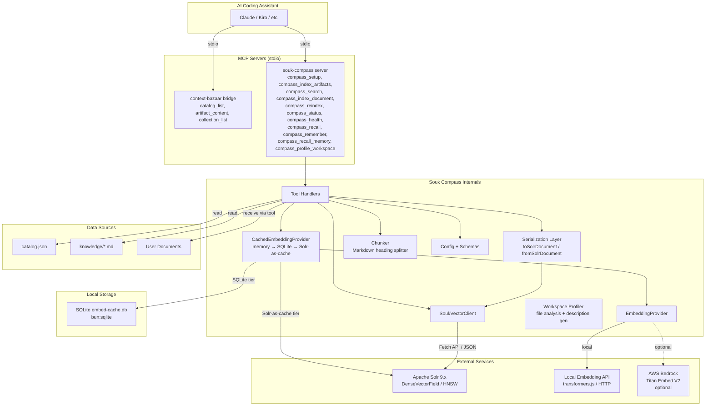
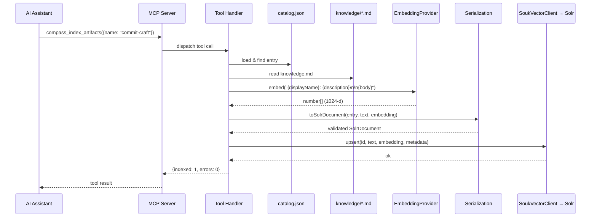
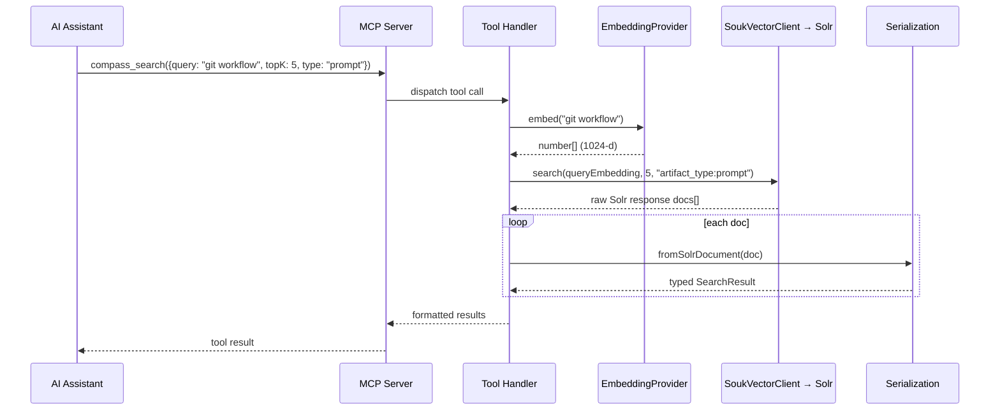
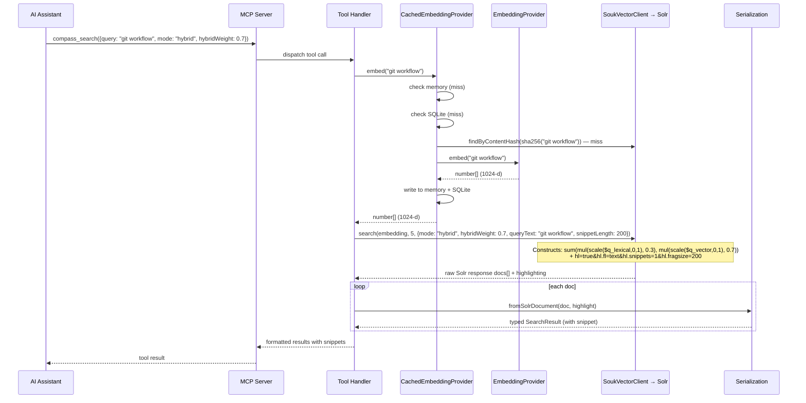
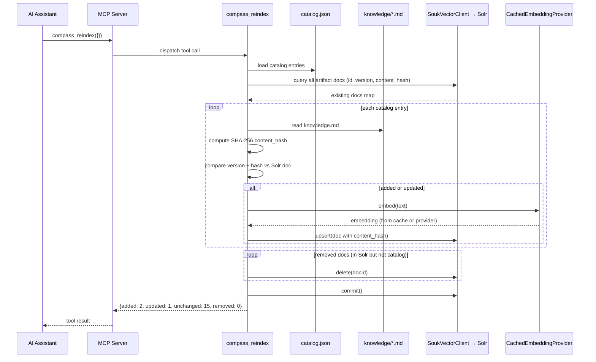
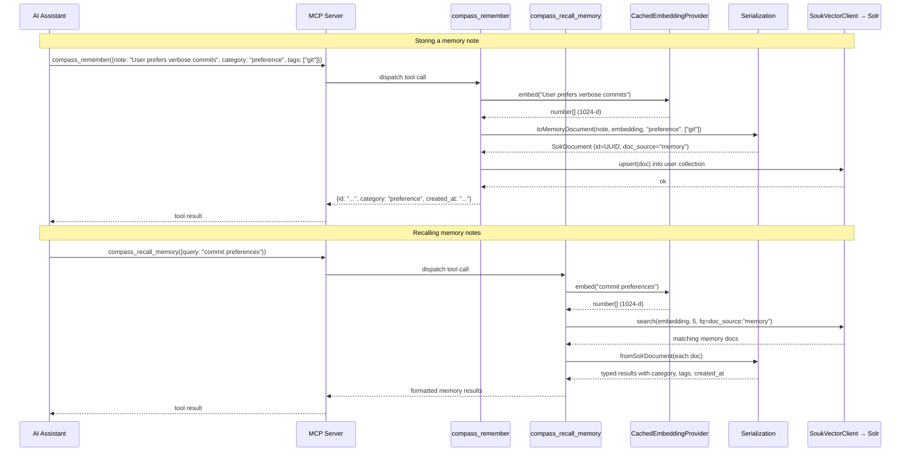
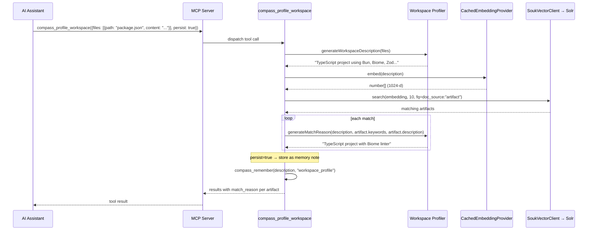
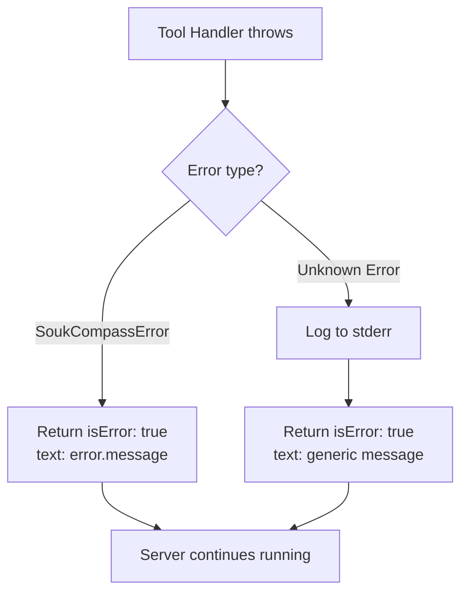

# Design Document — Souk Compass

## Overview

Souk Compass is a standalone MCP server that adds Solr-backed semantic search to the context-bazaar ecosystem. It lives in `skill-forge/mcp-servers/souk-compass/` and connects to an Apache Solr 9.x instance to provide vector indexing and kNN search over the bazaar's knowledge artifacts and user-supplied document collections.

The server exposes eleven tools via stdio transport: `compass_setup`, `compass_index_artifacts`, `compass_search`, `compass_index_document`, `compass_reindex`, `compass_status`, `compass_health`, `compass_recall`, `compass_remember`, `compass_recall_memory`, and `compass_profile_workspace`. Embeddings are generated through a pluggable provider interface — local-first by default, with an optional Bedrock Titan cloud provider for users with AWS credentials. A three-tier embedding cache (in-memory LRU → SQLite → Solr-as-cache) avoids redundant embedding API calls across sessions and team members.

Souk Compass is fully independent of the existing `context-bazaar` MCP bridge at runtime. Both servers are registered in `.mcp.json` and can start/stop independently. Configuration follows the project's env-var pattern with sensible defaults. Search results include enough metadata (`artifact_name`, `artifact_path`) for the AI assistant to seamlessly chain into the catalog bridge's `artifact_content` tool for full content retrieval.

Beyond core vector search, Souk Compass supports hybrid search (BM25 + kNN) for improved relevance, chunk-level indexing of long artifacts for finer-grained retrieval, search result snippets for quick relevance previews, automatic re-indexing on catalog changes via content hash change detection, configurable similarity score thresholds to filter low-relevance noise, proactive contextual skill recall, cross-session plugin-level memory persistence, and workspace-aware skill matching.

As a Claude Code plugin, Souk Compass is bundled alongside the existing catalog bridge in `.mcp.json` and distributed via the plugin's CJS bundle. An auto-reindex hook keeps the Solr index synchronized with the catalog after `forge build` runs. The `compass_recall` tool enables proactive artifact suggestions, `compass_remember` / `compass_recall_memory` provide cross-session memory, and `compass_profile_workspace` matches workspace characteristics against the artifact catalog for project-aware recommendations.

### Key Design Decisions

1. **Standalone MCP server** — Souk Compass runs as its own process rather than extending the existing bridge. This keeps the catalog bridge simple and allows Souk Compass to fail without affecting core bazaar functionality.
2. **Pluggable embedding providers** — An `EmbeddingProvider` interface decouples embedding generation from the rest of the system. The local provider works out of the box; cloud providers are opt-in.
3. **Shared Solr schema** — Both the artifact collection and user document collection use the same field definitions, differentiated by the `doc_source` field. This simplifies schema management and enables cross-collection queries.
4. **Fetch API for HTTP** — Bun's native Fetch API is used for all Solr communication, avoiding external HTTP dependencies.
5. **Zod v4 validation everywhere** — All data shapes (config, Solr documents, search results, tool inputs) are validated with Zod schemas, consistent with the project's existing convention.
6. **Docker-based local dev** — A bundled `docker-compose.yml` starts a pre-configured Solr 9.x instance for development, and the `compass_setup` tool automates the entire provisioning flow.
7. **Hybrid search via Solr-native primitives** — Hybrid mode uses Solr's `seedQuery` on the knn parser for seeded vector search, `{!rerank}` for re-ranking, and `scale()`/`mul()`/`sum()` function queries for weighted scoring — no custom scoring logic outside Solr.
8. **Three-tier embedding cache** — A `CachedEmbeddingProvider` wraps any concrete provider with in-memory LRU → SQLite (`bun:sqlite`) → Solr-as-cache tiers, transparent to the `EmbeddingProvider` interface. This avoids redundant API calls across sessions and enables team-level cache sharing via Solr.
9. **Content-hash-based change detection** — SHA-256 hashes of embedding text are stored in Solr documents, enabling `compass_reindex` to skip unchanged artifacts without re-embedding.
10. **Server-side similarity filtering** — Uses Solr's native `{!vectorSimilarity}` query parser with `minReturn` for threshold-based search, avoiding client-side post-filtering.
11. **Cross-tool chaining by convention** — `compass_search` results include `artifact_name` and `artifact_path` so the AI assistant can pass them directly to the catalog bridge's `artifact_content` tool. An optional `includeContent` parameter inlines full content for simple use cases.
12. **Plugin-level memory via Solr** — Memory notes (`compass_remember`) are stored in the user document collection with `doc_source: "memory"`, reusing the same Solr infrastructure and embedding cache. No separate storage backend needed.
13. **Workspace profiling as embedding comparison** — `compass_profile_workspace` generates a text description from workspace files, embeds it, and performs kNN search against the artifact collection. This reuses the existing search pipeline rather than introducing a separate matching engine.
14. **Auto-reindex hook** — A `postToolUse` hook fires after `forge build` and invokes `compass_reindex` via `askAgent`, keeping the index fresh without manual intervention.

## Architecture

### High-Level System Diagram



### Request Flow — Indexing an Artifact



### Request Flow — Semantic Search



### Request Flow — Hybrid Search



### Request Flow — Auto-Reindex



### Request Flow — Memory Persistence and Recall



### Request Flow — Workspace Profiling



## Components and Interfaces

### Directory Layout

```
skill-forge/mcp-servers/souk-compass/
├── src/
│   ├── index.ts                  # MCP server entry point
│   ├── schemas.ts                # All Zod schemas + inferred types
│   ├── config.ts                 # Configuration loading & validation
│   ├── errors.ts                 # SoukCompassError class
│   ├── solr-client.ts            # SoukVectorClient class
│   ├── embedding-provider.ts     # EmbeddingProvider interface
│   ├── embed-cache.ts            # CachedEmbeddingProvider (memory → SQLite → Solr-as-cache)
│   ├── chunker.ts                # Markdown heading-based chunk splitter
│   ├── workspace-profiler.ts     # Workspace file analysis + description generation
│   ├── providers/
│   │   ├── local-provider.ts     # Local embedding (transformers.js / HTTP API)
│   │   └── bedrock-provider.ts   # Optional Bedrock Titan provider
│   ├── serialization.ts          # toSolrDocument / fromSolrDocument / toUserSolrDocument / toMemoryDocument
│   ├── tools/
│   │   ├── compass-setup.ts      # compass_setup tool handler
│   │   ├── compass-index.ts      # compass_index_artifacts tool handler
│   │   ├── compass-search.ts     # compass_search tool handler
│   │   ├── compass-index-doc.ts  # compass_index_document tool handler
│   │   ├── compass-reindex.ts    # compass_reindex tool handler (change detection + re-index)
│   │   ├── compass-status.ts     # compass_status tool handler
│   │   ├── compass-health.ts     # compass_health tool handler
│   │   ├── compass-recall.ts     # compass_recall tool handler (contextual skill recall)
│   │   ├── compass-remember.ts   # compass_remember tool handler (memory persistence)
│   │   ├── compass-recall-memory.ts  # compass_recall_memory tool handler (memory retrieval)
│   │   └── compass-profile-workspace.ts  # compass_profile_workspace tool handler
│   └── catalog-reader.ts         # Reads catalog.json + knowledge.md files
├── hooks/
│   └── auto-reindex.json         # postToolUse hook: compass_reindex after forge build
├── solr/
│   ├── schema.xml                # Solr collection schema definition
│   └── README.md                 # Solr setup instructions
├── docker-compose.yml            # Local Solr 9.x dev instance
├── package.json
└── tsconfig.json
```

### Component Interfaces (Low-Level Design)

#### 1. `SoukCompassError` — `src/errors.ts`

```typescript
export class SoukCompassError extends Error {
  readonly code: string;
  readonly httpStatus?: number;
  readonly solrMessage?: string;

  constructor(message: string, code: string, options?: {
    httpStatus?: number;
    solrMessage?: string;
    cause?: unknown;
  });
}
```

Error codes follow a namespaced convention:
- `SOLR_CONNECTION` — Solr unreachable
- `SOLR_HTTP` — Solr returned non-2xx
- `SOLR_RESPONSE` — Malformed Solr response
- `EMBED_FAILURE` — Embedding provider error
- `EMBED_INIT` — Provider initialization failure
- `SERIALIZATION` — Document serialization/deserialization failure
- `CONFIG_INVALID` — Invalid configuration
- `SETUP_DOCKER` — Docker not available
- `SETUP_PORT` — Port conflict
- `CACHE_SQLITE` — SQLite cache read/write failure
- `CACHE_INIT` — Cache initialization failure (e.g., corrupted SQLite DB)
- `CHUNKER` — Chunk splitting failure
- `REINDEX` — Reindex change detection or execution failure

#### 2. `EmbeddingProvider` Interface — `src/embedding-provider.ts`

```typescript
export interface EmbeddingProvider {
  /** Human-readable provider name, e.g. "transformers-local", "bedrock-titan" */
  readonly name: string;

  /** Dimensionality of produced vectors */
  readonly dimensions: number;

  /** Generate embedding for a single text */
  embed(text: string): Promise<number[]>;

  /** Generate embeddings for multiple texts (batch) */
  batchEmbed(texts: string[]): Promise<number[][]>;
}
```

##### `LocalEmbeddingProvider` — `src/providers/local-provider.ts`

```typescript
export class LocalEmbeddingProvider implements EmbeddingProvider {
  readonly name = "transformers-local";
  readonly dimensions: number;

  constructor(config: { dimensions: number; apiUrl?: string });

  embed(text: string): Promise<number[]>;
  batchEmbed(texts: string[]): Promise<number[][]>;
}
```

- Uses `@xenova/transformers` (transformers.js) for in-process embedding, or delegates to a configurable local HTTP API endpoint (`SOUK_COMPASS_LOCAL_EMBED_URL`).
- Truncates input text exceeding the model's token limit by taking the first portion that fits.

##### `BedrockTitanProvider` — `src/providers/bedrock-provider.ts`

```typescript
export class BedrockTitanProvider implements EmbeddingProvider {
  readonly name = "bedrock-titan";
  readonly dimensions: number;

  constructor(config: { dimensions: number; region?: string });

  embed(text: string): Promise<number[]>;
  batchEmbed(texts: string[]): Promise<number[][]>;
}
```

- Uses `amazon.titan-embed-text-v2:0` via the Bedrock Runtime `InvokeModel` API.
- Requires AWS credentials in the environment (standard SDK credential chain).
- Truncates input exceeding 8192 tokens.

##### Provider Factory — `src/embedding-provider.ts`

```typescript
export async function createEmbeddingProvider(
  config: SoukCompassConfig
): Promise<EmbeddingProvider> {
  // 1. Read SOUK_COMPASS_EMBED_PROVIDER
  // 2. Attempt to create the requested provider
  // 3. On init failure for cloud providers, log warning to stderr, fall back to local
  // 4. Return the active provider
}
```

#### 3. `SoukVectorClient` — `src/solr-client.ts`

```typescript
export class SoukVectorClient {
  constructor(baseUrl: string, collection: string);

  /** Upsert a document with optional auto-commit */
  async upsert(
    docId: string,
    text: string,
    embedding: number[],
    metadata: Record<string, string>,
    options?: { commit?: boolean }
  ): Promise<void>;

  /** Search with mode support: vector (kNN), keyword (BM25), or hybrid */
  async search(
    queryEmbedding: number[] | null,
    topK: number,
    options?: {
      filterQuery?: string;
      mode?: "vector" | "keyword" | "hybrid";
      hybridWeight?: number;
      queryText?: string;
      snippetLength?: number;
    }
  ): Promise<SolrSearchResponse>;

  /**
   * Threshold-based search using Solr's {!vectorSimilarity} query parser.
   * Returns all documents above minScore, up to topK.
   * Uses minReturn for server-side score filtering and minTraverse
   * for controlling HNSW graph traversal depth.
   */
  async searchByThreshold(
    queryEmbedding: number[],
    topK: number,
    minScore: number,
    options?: {
      filterQuery?: string;
      minTraverse?: number;
    }
  ): Promise<SolrSearchResponse>;

  /** Query Solr for documents matching a content_hash value (used by Solr-as-cache tier) */
  async findByContentHash(contentHash: string): Promise<SolrDocument | null>;

  /** Delete a document by ID */
  async delete(docId: string): Promise<void>;

  /** Explicit commit */
  async commit(): Promise<void>;

  /** Health check — is Solr reachable and does the collection exist? */
  async health(): Promise<boolean>;
}
```

All HTTP calls use the native Fetch API. Errors are wrapped in `SoukCompassError` with the HTTP status and Solr error body when available.

**Solr API endpoints used:**
- `POST /solr/{collection}/update/json/docs` — upsert
- `POST /solr/{collection}/update?commit=true` — commit
- `GET /solr/{collection}/select` — kNN query with `q={!knn f=vector topK=N}[...]` and optional `fq`
- `GET /solr/{collection}/select` — hybrid query using `seedQuery` on knn parser, or `{!rerank}` with `reRankWeight`, or `sum(mul(scale(...)))` function queries
- `GET /solr/{collection}/select` — threshold search with `q={!vectorSimilarity f=vector minReturn=N}[...]`
- `GET /solr/{collection}/select` — keyword search with standard `q` against `text` field
- `GET /solr/{collection}/select` — highlighting with `hl=true&hl.fl=text&hl.snippets=1&hl.fragsize=N`
- `POST /solr/{collection}/update?commit=true` — delete by ID
- `GET /solr/admin/cores?action=STATUS` — health check
- `GET /solr/{collection}/select?q=*:*&rows=0` — document count
- `GET /solr/{collection}/select?q=content_hash:"..."` — content hash lookup (Solr-as-cache)

**Solr-Native Query Parameters (internal defaults):**

These are implementation details of the `SoukVectorClient`, not user-facing parameters:

| Parameter | Parser | Purpose | Default |
|-----------|--------|---------|---------|
| `earlyTermination` | knn | Exit early when candidate queue saturates | `true` |
| `saturationThreshold` | knn (earlyTermination sub-param) | Saturation threshold for early exit | `0.995` |
| `patience` | knn (earlyTermination sub-param) | Steps before early exit | `max(7, topK * 0.3)` |
| `efSearchScaleFactor` | knn | Multiplier for HNSW candidate count | `1.0` (env: `SOUK_COMPASS_EF_SEARCH_SCALE`) |
| `filteredSearchThreshold` | knn | ACORN-filtered search threshold | `60` |
| `minReturn` | vectorSimilarity | Server-side score threshold | Per-query `minScore` |
| `minTraverse` | vectorSimilarity | Graph traversal depth control | Solr default |

#### 4. Serialization Layer — `src/serialization.ts`

```typescript
import type { CatalogEntry } from "../../../src/schemas.js";

/** Convert a catalog entry + text + embedding into a Solr JSON document */
export function toSolrDocument(
  entry: CatalogEntry,
  text: string,
  embedding: number[]
): SolrDocument;

/** Parse a raw Solr response document into a typed SearchResult */
export function fromSolrDocument(
  doc: Record<string, unknown>
): SearchResult;

/** Convert a user document into Solr JSON format */
export function toUserSolrDocument(
  id: string,
  text: string,
  embedding: number[],
  metadata?: Record<string, string>
): SolrDocument;

/** Convert a memory note into Solr JSON format */
export function toMemoryDocument(
  note: string,
  embedding: number[],
  category: string,
  tags?: string[],
  sessionId?: string
): SolrDocument;
```

- `toSolrDocument` validates output against `SolrDocumentSchema` before returning.
- `fromSolrDocument` validates output against `SearchResultSchema`; throws `SoukCompassError` on missing fields.
- `toUserSolrDocument` sets `doc_source: "user"` and prefixes user metadata keys with `metadata_`.
- `toMemoryDocument` sets `doc_source: "memory"`, generates a UUID for `id`, and stores `metadata_category`, `metadata_tags` (comma-joined), `metadata_created_at` (ISO 8601), and `metadata_session_id`.

#### 5. Tool Handlers — `src/tools/*.ts`

Each tool handler is a pure async function with the signature:

```typescript
type ToolHandler<TInput> = (
  input: TInput,
  ctx: ToolContext
) => Promise<ToolResult>;

interface ToolContext {
  solrClient: SoukVectorClient;
  userSolrClient: SoukVectorClient;
  embeddingProvider: EmbeddingProvider;  // CachedEmbeddingProvider in practice
  config: SoukCompassConfig;
  pluginRoot: string;
}

interface ToolResult {
  content: Array<{ type: "text"; text: string }>;
  isError?: boolean;
}
```

##### `compass_setup` — `src/tools/compass-setup.ts`

```typescript
// Input: { action?: "check" | "start" | "create_collections" | "stop" }
// Default action: "check"
//
// "check"  → Docker available? Solr reachable? Collections exist? Document counts?
// "start"  → docker compose up -d (using bundled docker-compose.yml)
// "create_collections" → Solr Collections API to create artifact + user doc collections
// "stop"   → docker compose down
//
// All actions return structured JSON for the AI assistant to interpret.
```

##### `compass_index_artifacts` — `src/tools/compass-index.ts`

```typescript
// Input: { name?: string; all?: boolean; chunked?: boolean }
//
// If name: index single artifact by name from catalog.json
// If all: index every artifact in catalog.json
//
// For each artifact:
//   1. Read catalog entry
//   2. Read knowledge.md content
//   3. Build embedding text: "{displayName}: {description}\n\n{body}"
//   4. Compute SHA-256 content_hash of embedding text
//   5. If chunked=true:
//      a. chunkMarkdown(body) → Chunk[]
//      b. batchEmbed chunk texts via provider
//      c. buildChunkDocuments(name, chunks, embeddings, metadata)
//      d. Upsert each chunk document (with content_hash on parent doc)
//   6. If chunked=false (default):
//      a. Generate embedding via provider
//      b. toSolrDocument(entry, text, embedding) — includes content_hash
//      c. client.upsert(...)
//
// Batch mode: commit=false per upsert, explicit commit() at end
// Returns: { indexed: N, chunks: N, errors: N, details: [...] }
```

##### `compass_search` — `src/tools/compass-search.ts`

```typescript
// Input: { query: string; topK?: number; type?: string; collection?: string;
//          maturity?: string; scope?: "artifacts" | "documents" | "all";
//          mode?: "vector" | "keyword" | "hybrid"; hybridWeight?: number;
//          snippetLength?: number; minScore?: number; includeContent?: boolean }
//
// 1. Determine effective mode (default: "hybrid")
// 2. If mode is "keyword": skip embedding, use BM25 text search
//    If mode is "vector": embed query, use kNN search
//    If mode is "hybrid": embed query, use combined BM25 + kNN
// 3. If minScore is set (or SOUK_COMPASS_DEFAULT_MIN_SCORE):
//    Use searchByThreshold() with vectorSimilarity parser (server-side filtering)
//    Tool param takes precedence over env var
// 4. Build filter query from optional params (type, collection, maturity)
// 5. Search appropriate collection(s) based on scope
// 6. Generate snippets:
//    - keyword/hybrid: use Solr highlighting (hl=true, hl.fl=text, hl.snippets=1, hl.fragsize=snippetLength)
//    - vector: extract first snippetLength chars of text field
// 7. fromSolrDocument each result (with snippet)
// 8. Enrich each result with cross-tool chaining metadata:
//    - artifact_name: kebab-case name usable as input to artifact_content
//    - artifact_path: relative path to knowledge.md (e.g., "knowledge/{name}/knowledge.md")
// 9. If includeContent=true:
//    - For ≤3 results: read and inline full knowledge.md body per result
//    - For >3 results: inline first 500 chars per result + note to use artifact_content
// 10. Format and return results with scores
```

##### `compass_index_document` — `src/tools/compass-index-doc.ts`

```typescript
// Input: { id: string; text: string; metadata?: Record<string, string>;
//          collection?: string }
//
// 1. Generate embedding for text
// 2. toUserSolrDocument(id, text, embedding, metadata)
// 3. Upsert into user document collection (or specified collection)
```

##### `compass_status` — `src/tools/compass-status.ts`

```typescript
// Input: {} (no params)
// Returns: document counts per configured collection + embedding cache stats per tier
//   + memory note count (doc_source="memory")
//   { collections: [...], cache: { memory: { hits, misses, size }, sqlite: {...}, solr: {...} },
//     memoryNotes: number }
```

##### `compass_health` — `src/tools/compass-health.ts`

```typescript
// Input: {} (no params)
// Returns: { solrReachable: boolean, collections: { name: string, exists: boolean }[] }
```

##### `compass_recall` — `src/tools/compass-recall.ts`

```typescript
// Input: { context: string; topK?: number; minScore?: number; exclude?: string[] }
//
// Proactive contextual skill recall — the assistant calls this when starting
// new tasks, switching contexts, or when the user asks for workflow help.
//
// 1. Embed the context string using the active EmbeddingProvider
// 2. Perform kNN search against the artifact collection (topK default: 3)
// 3. Apply minScore threshold (default: 0.6 — higher than compass_search)
// 4. Filter out artifacts listed in the exclude array (already recommended this session)
// 5. For each match, generate a rationale by concatenating the artifact's
//    description with keyword matches against the context string
// 6. Return results: artifact_name, display_name, type, relevance_score,
//    description, rationale
// 7. If no artifacts score above minScore, return empty result set
```

##### `compass_remember` — `src/tools/compass-remember.ts`

```typescript
// Input: { note: string; category: "preference" | "convention" | "recommendation" |
//          "observation" | "workflow"; tags?: string[] }
//
// Persists a memory note for cross-session recall.
//
// 1. Embed the note text using the active EmbeddingProvider
// 2. Generate a UUID for the document id
// 3. Build memory document via toMemoryDocument():
//    - id: generated UUID
//    - text: note content
//    - vector: embedding
//    - doc_source: "memory"
//    - metadata_category: category
//    - metadata_tags: comma-joined tags
//    - metadata_created_at: ISO 8601 timestamp
//    - metadata_session_id: current session id (if available from env)
// 4. Upsert into the user document collection
// 5. Return: { id, category, tags, created_at }
```

##### `compass_recall_memory` — `src/tools/compass-recall-memory.ts`

```typescript
// Input: { query: string; category?: string; tags?: string[]; topK?: number }
//
// Semantic search over previously stored memory notes.
//
// 1. Embed the query string
// 2. Build filter query: doc_source:"memory"
//    + optional category filter: metadata_category:"{category}"
//    + optional tags filter: metadata_tags:"{tag}" for each tag (AND)
// 3. Perform kNN search against the user document collection (topK default: 5)
// 4. fromSolrDocument each result, extracting memory-specific fields
// 5. Return results: note text, category, tags, created_at, relevance_score
```

##### `compass_profile_workspace` — `src/tools/compass-profile-workspace.ts`

```typescript
// Input: { files: Array<{ path: string; content: string }>; topK?: number;
//          minScore?: number; persist?: boolean }
//
// Analyzes workspace files and matches relevant artifacts.
//
// 1. Generate workspace description string by extracting:
//    - Project name (from package.json name field)
//    - Languages/frameworks (from package.json dependencies, file extensions)
//    - Build tools (from scripts, config files like tsconfig.json, biome.json)
//    - Detected patterns (monorepo structure, test framework, CI/CD config)
//    - Explicit technology mentions from README.md
// 2. Description generation is deterministic — same input files → same description
// 3. Embed the workspace description
// 4. Perform kNN search against the artifact collection (topK default: 10)
// 5. Apply minScore threshold (default: 0.4 — lower than compass_recall)
// 6. For each match, generate match_reason indicating which workspace
//    characteristics triggered the match (e.g., "TypeScript project with Biome linter")
// 7. If persist=true, store the workspace profile as a memory note
//    (category: "workspace_profile") via compass_remember
// 8. If files is empty, return a message suggesting which files to include
// 9. Return results: artifact_name, display_name, type, relevance_score,
//    description, match_reason
```

#### 6. MCP Server Entry Point — `src/index.ts`

```typescript
// 1. Load and validate config via Zod
// 2. Create embedding provider (with fallback)
// 3. Wrap provider in CachedEmbeddingProvider (tiers from SOUK_COMPASS_CACHE_TIERS)
// 4. Create SoukVectorClient instances (artifact + user doc collections)
// 5. Register all 11 tools with @modelcontextprotocol/sdk Server
//    (compass_setup, compass_index_artifacts, compass_search,
//     compass_index_document, compass_reindex, compass_status,
//     compass_health, compass_recall, compass_remember,
//     compass_recall_memory, compass_profile_workspace)
// 6. Wrap each tool handler in error boundary:
//    - SoukCompassError → { isError: true, text: error.message }
//    - Unknown error → log to stderr, return generic message
// 7. Connect via StdioServerTransport
//
// Solr availability is NOT checked at startup — errors surface on tool invocation.
```

#### 7. Configuration — `src/config.ts`

```typescript
export function loadConfig(): SoukCompassConfig {
  // Read env vars with defaults, validate via SoukCompassConfigSchema
  // SOUK_COMPASS_SOLR_URL            → default "http://localhost:8983"
  // SOUK_COMPASS_SOLR_COLLECTION     → default "context-bazaar"
  // SOUK_COMPASS_USER_COLLECTION     → default "context-bazaar-user-docs"
  // SOUK_COMPASS_EMBED_PROVIDER      → default "local"
  // SOUK_COMPASS_EMBED_DIMENSIONS    → default 1024
  // SOUK_COMPASS_CACHE_TIERS         → default "memory,sqlite,solr"
  // SOUK_COMPASS_CACHE_DB            → default "~/.souk-compass/embed-cache.db"
  // SOUK_COMPASS_EMBED_CACHE_SIZE    → default 1000
  // SOUK_COMPASS_DEFAULT_MIN_SCORE   → default undefined (no threshold)
  // SOUK_COMPASS_EF_SEARCH_SCALE     → default 1.0
}
```

#### 8. Catalog Reader — `src/catalog-reader.ts`

```typescript
export async function loadCatalog(pluginRoot: string): Promise<CatalogEntry[]>;
export async function readArtifactContent(
  pluginRoot: string,
  entry: CatalogEntry
): Promise<{ frontmatter: Record<string, unknown>; body: string }>;
```

Reuses the existing `CatalogEntrySchema` from `skill-forge/src/schemas.ts` for validation.

#### 9. Chunker — `src/chunker.ts`

```typescript
export interface Chunk {
  /** Chunk text content */
  text: string;
  /** Zero-based chunk index */
  index: number;
  /** Heading that starts this chunk (if any) */
  heading?: string;
}

/**
 * Split a Markdown body into chunks at ## and ### heading boundaries.
 * Merges short chunks (< minLength chars) with the next chunk.
 * Splits oversized chunks at paragraph boundaries if they exceed maxLength.
 */
export function chunkMarkdown(
  body: string,
  options?: {
    minLength?: number;   // default: 50
    maxLength?: number;   // default: provider token limit in chars
  }
): Chunk[];

/**
 * Build chunk Solr documents from an artifact's chunks.
 * Each chunk document gets:
 *   - id: "{artifactName}__chunk_{N}"
 *   - chunk_index: N
 *   - parent_artifact: artifactName
 *   - All parent artifact metadata fields
 */
export function buildChunkDocuments(
  artifactName: string,
  chunks: Chunk[],
  embeddings: number[][],
  metadata: Record<string, string>
): SolrDocument[];
```

**Chunking algorithm:**
1. Split body at lines matching `/^#{2,3}\s/` (## or ### headings).
2. Each heading starts a new chunk; text before the first heading is chunk 0.
3. Merge pass: if a chunk's text length < `minLength` (default 50), append it to the next chunk.
4. Split pass: if a chunk's text length > `maxLength`, split at paragraph boundaries (`\n\n`).
5. Assign sequential zero-based indices.

#### 10. CachedEmbeddingProvider — `src/embed-cache.ts`

```typescript
export interface CacheStats {
  hits: number;
  misses: number;
  size: number;
}

export interface CacheTierStats {
  memory: CacheStats;
  sqlite: CacheStats;
  solr: CacheStats;
}

/**
 * Three-tier embedding cache that wraps any EmbeddingProvider.
 * Lookup order: in-memory LRU → SQLite on-disk → Solr-as-cache → provider.
 * Implements EmbeddingProvider so it's a transparent drop-in wrapper.
 */
export class CachedEmbeddingProvider implements EmbeddingProvider {
  readonly name: string;
  readonly dimensions: number;

  constructor(
    inner: EmbeddingProvider,
    options: {
      /** Active tiers, e.g. ["memory", "sqlite", "solr"] */
      tiers: Array<"memory" | "sqlite" | "solr">;
      /** Max entries for in-memory LRU tier */
      memoryCacheSize: number;
      /** Path to SQLite database file */
      sqliteDbPath: string;
      /** SoukVectorClient for Solr-as-cache lookups (optional) */
      solrClient?: SoukVectorClient;
    }
  );

  /** Embed with cache lookup. Checks tiers in order, falls through on miss. */
  async embed(text: string): Promise<number[]>;

  /** Batch embed with per-text cache lookup. */
  async batchEmbed(texts: string[]): Promise<number[][]>;

  /** Get per-tier cache statistics for compass_status reporting. */
  getStats(): CacheTierStats;
}
```

**In-memory LRU tier:**
- `Map<string, number[]>` keyed by SHA-256 content hash.
- On access, entry is moved to the end (most-recently-used).
- On insert when at capacity, the first entry (least-recently-used) is deleted.
- Max size controlled by `SOUK_COMPASS_EMBED_CACHE_SIZE` (default: 1000).

**SQLite tier:**
- Uses `bun:sqlite` for zero-dependency SQLite access.
- Database path: `SOUK_COMPASS_CACHE_DB` (default: `~/.souk-compass/embed-cache.db`).
- Table schema:
  ```sql
  CREATE TABLE IF NOT EXISTS embeddings (
    content_hash TEXT PRIMARY KEY,
    embedding    BLOB NOT NULL,
    provider_name TEXT NOT NULL,
    dimensions   INTEGER NOT NULL,
    created_at   TEXT NOT NULL DEFAULT (datetime('now'))
  );
  ```
- Embeddings stored as `Float64Array` → `Buffer` (BLOB).
- Auto-creates DB file and table on first use.
- On corruption/read failure: logs warning to stderr, skips tier, continues.

**Solr-as-cache tier:**
- Queries Solr for documents with matching `content_hash` field.
- If found, extracts the `vector` field and returns it.
- Enabled by default when Solr is reachable; silently skipped when unavailable.
- Does NOT write back to Solr — Solr documents are populated during indexing.

**Content hash computation:**
```typescript
import { createHash } from "node:crypto";

export function contentHash(text: string): string {
  return createHash("sha256").update(text, "utf-8").digest("hex");
}
```

#### 11. `compass_reindex` — `src/tools/compass-reindex.ts`

```typescript
// Input: { force?: boolean }
//
// 1. Load catalog.json
// 2. Query Solr for all existing artifact documents (doc_source="artifact")
//    — fetch id, version, content_hash fields
// 3. For each catalog entry:
//    a. Build embedding text: "{displayName}: {description}\n\n{body}"
//    b. Compute SHA-256 content_hash of embedding text
//    c. Compare against Solr document:
//       - Not in Solr → "added"
//       - In Solr but version or content_hash differs → "updated"
//       - In Solr and both match → "unchanged"
// 4. Solr documents not in catalog → "removed" (delete from Solr)
// 5. If force=true, treat all catalog entries as "updated"
// 6. Re-index added + updated artifacts (embed + upsert)
// 7. Delete removed artifacts
// 8. Return summary: { added: N, updated: N, unchanged: N, removed: N }
```

#### 12. Workspace Profiler — `src/workspace-profiler.ts`

```typescript
export interface WorkspaceFile {
  path: string;
  content: string;
}

/**
 * Analyze workspace files and generate a deterministic text description
 * suitable for embedding and kNN search against the artifact collection.
 *
 * Extracts: project name, languages/frameworks, build tools, detected patterns,
 * and explicit technology mentions.
 */
export function generateWorkspaceDescription(files: WorkspaceFile[]): string;

/**
 * Generate a match_reason string explaining why an artifact matched
 * the workspace profile, based on keyword overlap between the workspace
 * description and the artifact's keywords/description.
 */
export function generateMatchReason(
  workspaceDescription: string,
  artifactKeywords: string[],
  artifactDescription: string
): string;
```

**Description generation algorithm:**
1. Parse `package.json` (if present): extract `name`, `dependencies`, `devDependencies`, `scripts`.
2. Parse config files (`tsconfig.json`, `biome.json`, `.eslintrc`, `Dockerfile`, etc.): extract tool names.
3. Scan file extensions across all provided paths: infer languages.
4. Extract technology mentions from `README.md` (if present).
5. Concatenate extracted signals into a structured description string.
6. The function is pure — same input files always produce the same output string.

#### 13. Auto-Reindex Hook — `hooks/auto-reindex.json`

```json
{
  "id": "souk-compass-auto-reindex",
  "name": "Auto-Reindex on Build",
  "description": "Triggers compass_reindex after forge build completes to keep the Solr index synchronized with the catalog",
  "eventType": "postToolUse",
  "hookAction": "askAgent",
  "outputPrompt": "The catalog has been rebuilt. Run compass_reindex to update the semantic search index.",
  "toolTypes": "shell"
}
```

The hook fires after shell tool usage (which includes `forge build`). The `compass_reindex` tool uses content-hash change detection to re-index only changed artifacts. If Solr is not running, `compass_reindex` returns a non-fatal error and the hook does not block subsequent operations.

## Data Models

### Zod Schemas — `src/schemas.ts`

All schemas are co-located in a single file, exporting both the Zod schema and the inferred TypeScript type.

```typescript
import { z } from "zod";

// --- Configuration ---

export const SoukCompassConfigSchema = z.object({
  solrUrl: z.string().url().default("http://localhost:8983"),
  artifactCollection: z.string().min(1).default("context-bazaar"),
  userCollection: z.string().min(1).default("context-bazaar-user-docs"),
  embedProvider: z.enum(["local", "bedrock-titan"]).default("local"),
  embedDimensions: z.coerce.number().int().positive().default(1024),
  cacheTiers: z.array(z.enum(["memory", "sqlite", "solr"])).default(["memory", "sqlite", "solr"]),
  cacheDbPath: z.string().default("~/.souk-compass/embed-cache.db"),
  embedCacheSize: z.coerce.number().int().positive().default(1000),
  defaultMinScore: z.coerce.number().min(0).max(1).optional(),
  efSearchScaleFactor: z.coerce.number().positive().default(1.0),
});
export type SoukCompassConfig = z.infer<typeof SoukCompassConfigSchema>;

// --- Solr Document (upsert payload) ---

export const SolrDocumentSchema = z.object({
  id: z.string().min(1),
  text: z.string(),
  vector: z.array(z.number()),
  artifact_name: z.string().optional(),
  artifact_type: z.string().optional(),
  display_name: z.string().optional(),
  maturity: z.string().optional(),
  collection_names: z.union([z.string(), z.array(z.string())]).optional(),
  keywords: z.union([z.string(), z.array(z.string())]).optional(),
  author: z.string().optional(),
  version: z.string().optional(),
  doc_source: z.enum(["artifact", "user", "memory"]),
  content_hash: z.string().optional(),
  chunk_index: z.number().int().nonnegative().optional(),
  parent_artifact: z.string().optional(),
}).passthrough(); // allow metadata_* dynamic fields
export type SolrDocument = z.infer<typeof SolrDocumentSchema>;

// --- Search Result (parsed from Solr response) ---

export const SearchResultSchema = z.object({
  id: z.string(),
  score: z.number(),
  artifactName: z.string().optional(),
  displayName: z.string().optional(),
  type: z.string().optional(),
  description: z.string().optional(),
  maturity: z.string().optional(),
  collections: z.array(z.string()).optional(),
  text: z.string().optional(),
  docSource: z.enum(["artifact", "user", "memory"]),
  metadata: z.record(z.string(), z.string()).optional(),
  snippet: z.string().optional(),
  chunkIndex: z.number().int().nonnegative().optional(),
  parentArtifact: z.string().optional(),
  artifactPath: z.string().optional(),
  content: z.string().optional(),
  rationale: z.string().optional(),
  matchReason: z.string().optional(),
  category: z.string().optional(),
  tags: z.array(z.string()).optional(),
  createdAt: z.string().optional(),
});
export type SearchResult = z.infer<typeof SearchResultSchema>;

// --- Tool Input Schemas ---

export const CompassSetupInputSchema = z.object({
  action: z.enum(["check", "start", "create_collections", "stop"]).default("check"),
});

export const CompassIndexArtifactsInputSchema = z.object({
  name: z.string().optional(),
  all: z.boolean().optional(),
  chunked: z.boolean().default(false),
}).refine(
  (d) => d.name !== undefined || d.all === true,
  { message: "Provide either 'name' or 'all: true'" }
);

export const CompassSearchInputSchema = z.object({
  query: z.string().min(1),
  topK: z.number().int().positive().default(5),
  type: z.string().optional(),
  collection: z.string().optional(),
  maturity: z.string().optional(),
  scope: z.enum(["artifacts", "documents", "all"]).default("artifacts"),
  mode: z.enum(["vector", "keyword", "hybrid"]).default("hybrid"),
  hybridWeight: z.number().min(0).max(1).default(0.5),
  snippetLength: z.number().int().positive().default(200),
  minScore: z.number().min(0).max(1).optional(),
  includeContent: z.boolean().default(false),
});

export const CompassIndexDocumentInputSchema = z.object({
  id: z.string().min(1),
  text: z.string().min(1),
  metadata: z.record(z.string(), z.string()).optional(),
  collection: z.string().optional(),
});

export const CompassReindexInputSchema = z.object({
  force: z.boolean().default(false),
});

export const CompassStatusInputSchema = z.object({});

export const CompassHealthInputSchema = z.object({});

export const CompassRecallInputSchema = z.object({
  context: z.string().min(1),
  topK: z.number().int().positive().default(3),
  minScore: z.number().min(0).max(1).default(0.6),
  exclude: z.array(z.string()).default([]),
});

export const CompassRememberInputSchema = z.object({
  note: z.string().min(1),
  category: z.enum(["preference", "convention", "recommendation", "observation", "workflow"]),
  tags: z.array(z.string()).optional(),
});

export const CompassRecallMemoryInputSchema = z.object({
  query: z.string().min(1),
  category: z.string().optional(),
  tags: z.array(z.string()).optional(),
  topK: z.number().int().positive().default(5),
});

export const CompassProfileWorkspaceInputSchema = z.object({
  files: z.array(z.object({
    path: z.string(),
    content: z.string(),
  })),
  topK: z.number().int().positive().default(10),
  minScore: z.number().min(0).max(1).default(0.4),
  persist: z.boolean().default(false),
});

export const ToolInputSchemas = {
  compass_setup: CompassSetupInputSchema,
  compass_index_artifacts: CompassIndexArtifactsInputSchema,
  compass_search: CompassSearchInputSchema,
  compass_index_document: CompassIndexDocumentInputSchema,
  compass_reindex: CompassReindexInputSchema,
  compass_status: CompassStatusInputSchema,
  compass_health: CompassHealthInputSchema,
  compass_recall: CompassRecallInputSchema,
  compass_remember: CompassRememberInputSchema,
  compass_recall_memory: CompassRecallMemoryInputSchema,
  compass_profile_workspace: CompassProfileWorkspaceInputSchema,
} as const;
```

### Solr Collection Schema — `solr/schema.xml`

```xml
<?xml version="1.0" encoding="UTF-8"?>
<schema name="souk-compass" version="1.6">
  <!-- Unique key -->
  <uniqueKey>id</uniqueKey>

  <!-- Core fields -->
  <field name="id"               type="string"        stored="true"  indexed="true"  required="true" />
  <field name="text"             type="text_general"   stored="true"  indexed="true" />
  <field name="vector"           type="knn_vector_1024" stored="true"  indexed="true" />

  <!-- Artifact metadata -->
  <field name="artifact_name"    type="string"        stored="true"  indexed="true" />
  <field name="artifact_type"    type="string"        stored="true"  indexed="true" />
  <field name="display_name"     type="string"        stored="true"  indexed="false" />
  <field name="maturity"         type="string"        stored="true"  indexed="true" />
  <field name="author"           type="string"        stored="true"  indexed="true" />
  <field name="version"          type="string"        stored="true"  indexed="true" />
  <field name="doc_source"       type="string"        stored="true"  indexed="true" />

  <!-- Multi-valued fields -->
  <field name="collection_names" type="string"        stored="true"  indexed="true"  multiValued="true" />
  <field name="keywords"         type="string"        stored="true"  indexed="true"  multiValued="true" />

  <!-- Change detection + chunking fields -->
  <field name="content_hash"     type="string"        stored="true"  indexed="true" />
  <field name="chunk_index"      type="pint"          stored="true"  indexed="true" />
  <field name="parent_artifact"  type="string"        stored="true"  indexed="true" />

  <!-- Dynamic fields for user metadata -->
  <dynamicField name="metadata_*" type="string"       stored="true"  indexed="true" />

  <!-- Field types -->
  <fieldType name="string" class="solr.StrField" sortMissingLast="true" />
  <fieldType name="pint" class="solr.IntPointField" docValues="true" />
  <fieldType name="text_general" class="solr.TextField" positionIncrementGap="100">
    <analyzer type="index">
      <tokenizer class="solr.StandardTokenizerFactory"/>
      <filter class="solr.LowerCaseFilterFactory"/>
    </analyzer>
    <analyzer type="query">
      <tokenizer class="solr.StandardTokenizerFactory"/>
      <filter class="solr.LowerCaseFilterFactory"/>
    </analyzer>
  </fieldType>
  <fieldType name="knn_vector_1024"
             class="solr.DenseVectorField"
             vectorDimension="1024"
             similarityFunction="cosine"
             hnswMaxConnections="16"
             hnswBeamWidth="100" />
</schema>
```

### `.mcp.json` Update

```json
{
  "context-bazaar": {
    "command": "node",
    "args": ["${CLAUDE_PLUGIN_ROOT}/skill-forge/bridge/mcp-server.cjs"]
  },
  "souk-compass": {
    "command": "node",
    "args": ["${CLAUDE_PLUGIN_ROOT}/skill-forge/mcp-servers/souk-compass/dist/mcp-server.cjs"],
    "env": {
      "SOUK_COMPASS_SOLR_URL": "http://localhost:8983",
      "SOUK_COMPASS_SOLR_COLLECTION": "context-bazaar",
      "SOUK_COMPASS_USER_COLLECTION": "context-bazaar-user-docs",
      "SOUK_COMPASS_EMBED_PROVIDER": "local",
      "SOUK_COMPASS_CACHE_TIERS": "memory,sqlite,solr",
      "SOUK_COMPASS_CACHE_DB": "~/.souk-compass/embed-cache.db",
      "SOUK_COMPASS_EMBED_CACHE_SIZE": "1000",
      "SOUK_COMPASS_EF_SEARCH_SCALE": "1.0"
    }
  }
}
```

### Claude Code Plugin Updates

#### `.claude-plugin/plugin.json` Changes

- Add `"semantic-search"`, `"vector-search"`, `"solr"`, `"embeddings"` to the `keywords` array.
- Update `description` to mention semantic search capabilities alongside catalog browsing.

#### `.claude-plugin/marketplace.json` Changes

- Add `"semantic-search"`, `"vector-search"`, `"solr"` to the `tags` array.
- Update `description` to mention Souk Compass semantic search.

#### Build Process

The Souk Compass CJS bundle is built to `skill-forge/mcp-servers/souk-compass/dist/mcp-server.cjs` as part of the project's build process, using the same Bun bundler approach as the existing `bridge/mcp-server.cjs`. A `build:souk-compass` script in `package.json` handles this:

```bash
bun build src/index.ts --target=node --outfile=dist/mcp-server.cjs --format=cjs
```


## Correctness Properties

*A property is a characteristic or behavior that should hold true across all valid executions of a system — essentially, a formal statement about what the system should do. Properties serve as the bridge between human-readable specifications and machine-verifiable correctness guarantees.*

### Property 1: Serialization Round-Trip Preserves Artifact Identity

*For any* valid `CatalogEntry` with a valid embedding vector, converting it to a Solr document via `toSolrDocument` and then parsing back via `fromSolrDocument` shall produce a `SearchResult` containing the same artifact name, artifact type, description (derived from text), maturity, and collection memberships as the original entry.

**Validates: Requirements 11.3**

### Property 2: toSolrDocument Output Passes Schema Validation

*For any* valid `CatalogEntry` with a valid text string and embedding vector, the output of `toSolrDocument(entry, text, embedding)` shall pass validation against `SolrDocumentSchema` — meaning all required fields (`id`, `text`, `vector`, `doc_source`, `artifact_name`, `artifact_type`, `display_name`, `maturity`, `collection_names`, `keywords`, `author`, `version`) are present and correctly typed.

**Validates: Requirements 3.4, 11.4**

### Property 3: fromSolrDocument Rejects Incomplete Documents

*For any* Solr response document that is missing one or more required fields (`id`, `text`, `doc_source`), calling `fromSolrDocument` shall throw a `SoukCompassError` with code `SERIALIZATION` rather than returning a partial result.

**Validates: Requirements 11.5**

### Property 4: fromSolrDocument Extracts All Required Search Result Fields

*For any* valid Solr response document containing all required fields and artifact metadata, `fromSolrDocument` shall produce a `SearchResult` that includes: artifact name, display name, type, relevance score, description, maturity, collection memberships, and artifact path (the relative path to the artifact's `knowledge.md` file).

**Validates: Requirements 4.7, 19.1**

### Property 5: Embedding Text Format for Artifacts

*For any* artifact with a display name, description, and Markdown body, the embedding text shall be constructed as `"{displayName}: {description}\n\n{body}"` — the display name and description are joined by `: `, followed by two newlines, followed by the body content.

**Validates: Requirements 3.5**

### Property 6: User Document Serialization Invariants

*For any* user document with an id, text, embedding, and optional metadata key-value pairs, `toUserSolrDocument` shall produce a `SolrDocument` where: (a) `doc_source` is always `"user"`, (b) every user-provided metadata key `k` appears in the output as `metadata_{k}`, and (c) the `id`, `text`, and `vector` fields match the inputs exactly.

**Validates: Requirements 5.5**

### Property 7: Embedding Provider Truncation Safety

*For any* input text string (including strings exceeding the provider's maximum token limit), calling `embed(text)` on any `EmbeddingProvider` implementation shall return a `number[]` of exactly `provider.dimensions` length without throwing an error.

**Validates: Requirements 2.7**

### Property 8: Solr Error Wrapping Preserves Context

*For any* Solr HTTP error response with a status code and error body, the `SoukVectorClient` shall throw a `SoukCompassError` whose message includes both the HTTP status code and the Solr error message text.

**Validates: Requirements 1.7, 10.2**

### Property 9: Embedding Error Wrapping Preserves Context

*For any* embedding provider failure with a provider name and underlying error message, the resulting `SoukCompassError` shall include both the provider name and the underlying error message in its message string.

**Validates: Requirements 10.3**

### Property 10: MCP Error Boundary Converts SoukCompassError to Tool Error

*For any* `SoukCompassError` thrown during tool execution, the MCP server error boundary shall return a tool result with `isError: true` and a `text` field containing the error's message — the server process shall not crash.

**Validates: Requirements 10.4**

### Property 11: Configuration Env Var Precedence

*For any* configuration field, when the corresponding environment variable is set to a valid value, `loadConfig()` shall return that value; when the environment variable is unset, `loadConfig()` shall return the documented default value.

**Validates: Requirements 7.6**

### Property 12: Configuration Validation Rejects Invalid Values

*For any* invalid configuration value (malformed URL for `solrUrl`, non-positive number for `embedDimensions`, unrecognized string for `embedProvider`), the `SoukCompassConfigSchema` shall reject the input with a Zod validation error containing a descriptive message.

**Validates: Requirements 7.7**

### Property 13: Hybrid Search Mode Query Construction

*For any* search mode (`"vector"`, `"keyword"`, `"hybrid"`) and any `hybridWeight` value in [0.0, 1.0], the `SoukVectorClient.search()` method shall construct the correct Solr query: `"vector"` mode produces a `{!knn}` query without BM25 components, `"keyword"` mode produces a standard `q` text query without kNN components, and `"hybrid"` mode produces a combined query using Solr's `seedQuery` on the knn parser (or `{!rerank}`/`sum(mul(scale(...)))` function queries) that incorporates both BM25 and kNN scoring weighted by `hybridWeight`. At `hybridWeight=0.0` the hybrid query degenerates to pure keyword scoring, and at `hybridWeight=1.0` it degenerates to pure vector scoring.

**Validates: Requirements 13.1, 13.2, 13.3, 13.7**

### Property 14: Filter Queries Apply Consistently Across All Search Modes

*For any* combination of search mode (`"vector"`, `"keyword"`, `"hybrid"`) and filter parameters (`type`, `collection`, `maturity`), the constructed Solr query shall include the corresponding `fq` parameters regardless of which mode is active — filters are mode-independent.

**Validates: Requirements 13.6**

### Property 15: Reindex Change Detection and Summary Consistency

*For any* set of catalog entries and any set of existing Solr documents (with version and content_hash fields), the `compass_reindex` diff algorithm shall classify each artifact as exactly one of: added (in catalog but not Solr), updated (in both but version or content_hash differs), unchanged (in both and both match), or removed (in Solr but not catalog). The summary counts shall satisfy: `added + updated + unchanged = |catalog|` and `removed = |solr_artifacts| - (updated + unchanged)`.

**Validates: Requirements 14.1, 14.2, 14.4**

### Property 16: Content Hash is SHA-256 of Embedding Text

*For any* artifact with a display name, description, and body, the `content_hash` field stored in the Solr document shall equal the hex-encoded SHA-256 digest of the embedding text (`"{displayName}: {description}\n\n{body}"`). Computing the hash independently from the same input text shall always produce the same value.

**Validates: Requirements 14.3**

### Property 17: Chunk Splitting Produces Correctly Structured Chunks

*For any* Markdown body containing `##` or `###` headings, `chunkMarkdown(body)` shall produce chunks where: (a) each chunk's `id` follows the pattern `"{artifactName}__chunk_{N}"` with sequential zero-based indices, (b) each chunk document includes a `chunk_index` integer matching its position and a `parent_artifact` string matching the source artifact name, (c) all parent artifact metadata fields are present on every chunk document, and (d) concatenating all chunk texts (in index order) reconstructs the original body content (modulo heading-boundary whitespace normalization).

**Validates: Requirements 15.2, 15.3, 15.4**

### Property 18: Short Chunks Are Merged

*For any* Markdown body that produces a chunk shorter than `minLength` (default: 50 characters), `chunkMarkdown` shall merge that chunk with the subsequent chunk — no chunk in the output (except possibly the last) shall have text shorter than `minLength`.

**Validates: Requirements 15.5**

### Property 19: Snippet Length Invariant

*For any* search result with a `text` field and any `snippetLength` value, the returned `snippet` field shall not exceed `snippetLength` characters. In vector mode specifically, the snippet shall be exactly the first `min(snippetLength, text.length)` characters of the document's text field.

**Validates: Requirements 16.1, 16.3, 16.4**

### Property 20: Cache Tier Fallthrough Order

*For any* cache configuration with tiers `[T1, T2, ..., Tn]` and any input text, `CachedEmbeddingProvider.embed(text)` shall check tiers in the configured order and return the embedding from the first tier that contains a cache hit. If tier `Ti` has a hit, tiers `Ti+1` through `Tn` and the underlying `EmbeddingProvider` shall not be consulted. On a complete miss across all tiers, the underlying provider is called and the result is written to the in-memory and SQLite tiers.

**Validates: Requirements 17.1, 17.10**

### Property 21: LRU Eviction Policy

*For any* sequence of `embed()` calls producing cache entries, the in-memory LRU cache shall never exceed `memoryCacheSize` entries. When the cache is full and a new entry is inserted, the least-recently-used entry (the one accessed longest ago) shall be evicted.

**Validates: Requirements 17.2, 17.3**

### Property 22: Similarity Threshold Filtering

*For any* set of search results with scores and any `minScore` threshold in [0.0, 1.0], all results returned by `compass_search` shall have `score >= minScore`. Results below the threshold shall be excluded from the response.

**Validates: Requirements 18.1, 18.2**

### Property 23: minScore Parameter Precedence Over Environment Variable

*For any* combination of a `minScore` tool parameter and a `SOUK_COMPASS_DEFAULT_MIN_SCORE` environment variable, when both are set the tool parameter shall take precedence. When only the env var is set, it shall be used. When neither is set, no threshold filtering shall be applied.

**Validates: Requirements 18.5**

### Property 24: includeContent Truncation Behavior

*For any* `compass_search` invocation with `includeContent=true`, if the result set contains 3 or fewer artifacts, each result shall include the full `knowledge.md` body in its `content` field. If the result set contains more than 3 artifacts, each result's `content` field shall be truncated to at most 500 characters.

**Validates: Requirements 19.5, 19.6**

### Property 25: Recall Exclude Filtering

*For any* set of search results and any `exclude` array of artifact names, calling `compass_recall` shall return results that contain none of the excluded artifact names. The output set shall be a subset of what would be returned without the exclude parameter, minus any artifacts whose `artifact_name` appears in the exclude list.

**Validates: Requirements 22.7**

### Property 26: Memory Document Serialization Invariants

*For any* memory note with a note string, a valid category, and optional tags array, `toMemoryDocument` shall produce a `SolrDocument` where: (a) `doc_source` is always `"memory"`, (b) `id` is a valid UUID v4 string, (c) `metadata_category` matches the input category, (d) `metadata_tags` is the comma-joined input tags (or absent if no tags), (e) `metadata_created_at` is a valid ISO 8601 timestamp, and (f) the `text` and `vector` fields match the inputs.

**Validates: Requirements 23.3**

### Property 27: Recall Memory Filter Always Includes doc_source Constraint

*For any* `compass_recall_memory` invocation with any combination of query, category, and tags parameters, the constructed Solr query shall always include a filter query `doc_source:"memory"`. Additional category and tag filters shall be additive (AND) with the doc_source filter.

**Validates: Requirements 23.6**

### Property 28: Workspace Description Generation is Deterministic

*For any* set of workspace files (array of `{path, content}` objects), calling `generateWorkspaceDescription` twice with the same input shall produce identical output strings. The function is pure — no randomness, no timestamps, no external state.

**Validates: Requirements 24.10**

## Error Handling

### Error Hierarchy

All Souk Compass errors extend `SoukCompassError`, which carries a `code` string for programmatic identification:

| Code | Source | Trigger |
|------|--------|---------|
| `SOLR_CONNECTION` | `SoukVectorClient` | Solr instance unreachable (fetch throws) |
| `SOLR_HTTP` | `SoukVectorClient` | Solr returns non-2xx HTTP status |
| `SOLR_RESPONSE` | `SoukVectorClient` | Solr response is malformed or missing expected fields |
| `EMBED_FAILURE` | `EmbeddingProvider` | Embedding generation fails |
| `EMBED_INIT` | Provider factory | Provider fails to initialize (e.g., missing AWS credentials) |
| `SERIALIZATION` | Serialization layer | `toSolrDocument` or `fromSolrDocument` validation fails |
| `CONFIG_INVALID` | Config loader | Zod validation rejects config values |
| `SETUP_DOCKER` | `compass_setup` | Docker not available or not running |
| `SETUP_PORT` | `compass_setup` | Configured Solr port already in use |
| `CACHE_SQLITE` | `CachedEmbeddingProvider` | SQLite cache read/write failure |
| `CACHE_INIT` | `CachedEmbeddingProvider` | Cache initialization failure (e.g., corrupted SQLite DB) |
| `CHUNKER` | Chunker | Chunk splitting failure |
| `REINDEX` | `compass_reindex` | Reindex change detection or execution failure |

### Error Boundary Strategy



1. Each tool handler is wrapped in a `try/catch` in the MCP server's `CallToolRequest` handler.
2. `SoukCompassError` instances are returned as `{ isError: true, content: [{ type: "text", text: error.message }] }`.
3. Unknown errors are logged to `stderr` with a stack trace, and a generic "An unexpected error occurred" message is returned.
4. The server process never terminates due to a tool-level error.

### Graceful Degradation

- **Solr unavailable at startup**: Server starts normally. Errors surface only when tools are invoked.
- **Embedding provider init failure**: Falls back to local provider with a warning to stderr.
- **Solr unavailable during tool invocation**: Returns a descriptive error message; does not crash. Applies to all 11 tools.
- **Process isolation**: Souk Compass and the context-bazaar bridge are separate processes. One failing does not affect the other.
- **SQLite cache corruption**: Logs warning to stderr, skips SQLite tier, continues with remaining tiers (memory + Solr-as-cache + provider).
- **Solr-as-cache unavailable**: Silently skipped when Solr is unreachable; does not block or error. Falls through to the embedding provider.
- **Chunker failure**: If chunk splitting fails for an artifact, falls back to indexing the full document as a single unit with a warning.
- **Memory tools with Solr down**: `compass_remember` and `compass_recall_memory` return descriptive error messages; do not crash.
- **Workspace profiling with empty files**: Returns a helpful suggestion message listing recommended files to include.
- **Auto-reindex hook with Solr down**: `compass_reindex` returns a non-fatal error; the hook does not block subsequent operations.

## Testing Strategy

### Dual Testing Approach

Souk Compass uses both unit/example-based tests and property-based tests for comprehensive coverage.

### Property-Based Tests (fast-check)

Property-based tests use `fast-check` (already a devDependency) with a minimum of 100 iterations per property. Each test is tagged with a comment referencing the design property.

Test file: `src/__tests__/souk-compass.property.test.ts`

| Property | What it tests | Generator strategy |
|----------|--------------|-------------------|
| P1: Serialization round-trip | `toSolrDocument` → `fromSolrDocument` preserves identity | Generate random `CatalogEntry` objects with random embeddings (1024-d float arrays) |
| P2: toSolrDocument schema compliance | Output always passes `SolrDocumentSchema` | Same generator as P1 |
| P3: fromSolrDocument rejects incomplete docs | Missing required fields → `SoukCompassError` | Generate Solr response objects with randomly omitted required fields |
| P4: fromSolrDocument field extraction | All required SearchResult fields present | Generate complete Solr response objects with all fields |
| P5: Embedding text format | Concatenation follows `"{displayName}: {description}\n\n{body}"` | Generate random strings for displayName, description, body |
| P6: User doc serialization invariants | `doc_source="user"`, metadata prefixed | Generate random ids, texts, embeddings, and metadata maps |
| P7: Embedding truncation safety | Long text → valid vector, no throw | Generate strings of length 0 to 100,000 characters |
| P8: Solr error wrapping | Status code + message preserved | Generate random HTTP status codes (400-599) and error body strings |
| P9: Embedding error wrapping | Provider name + error preserved | Generate random provider names and error messages |
| P10: MCP error boundary | `SoukCompassError` → `{ isError: true }` | Generate random SoukCompassError instances with random codes and messages |
| P11: Config env var precedence | Env var overrides default | Generate random valid config values for each field |
| P12: Config validation rejects invalid | Invalid values → Zod error | Generate invalid URLs, negative numbers, unknown enum values |
| P13: Hybrid search mode query construction | Mode + hybridWeight → correct Solr query | Generate random modes and hybridWeight values in [0.0, 1.0] |
| P14: Filters apply across all modes | fq params present regardless of mode | Generate random mode + filter param combinations |
| P15: Reindex change detection consistency | Diff algorithm classifies correctly, counts sum | Generate random catalog/Solr state pairs with varying version/hash matches |
| P16: Content hash is SHA-256 | content_hash field = SHA-256(embedding text) | Generate random displayName, description, body strings |
| P17: Chunk splitting structure | Chunks have correct IDs, metadata, and reconstruct body | Generate random Markdown bodies with varying heading structures |
| P18: Short chunk merging | No output chunk < minLength (except last) | Generate Markdown bodies with very short sections (< 50 chars) |
| P19: Snippet length invariant | snippet.length ≤ snippetLength | Generate random texts and snippetLength values |
| P20: Cache tier fallthrough | First hit tier wins, lower tiers not consulted | Generate random tier states (hit/miss per tier) with mocked tiers |
| P21: LRU eviction | Cache never exceeds max size, evicts LRU | Generate random sequences of cache puts/gets |
| P22: Similarity threshold filtering | All returned results have score ≥ minScore | Generate random result sets with random scores and thresholds |
| P23: minScore precedence | Tool param > env var > no threshold | Generate random minScore + env var combinations |
| P24: includeContent truncation | ≤3 results → full content; >3 → 500 char truncation | Generate random result sets of varying sizes (1-10) with random content lengths |
| P25: Recall exclude filtering | No excluded artifact_name in output | Generate random search result sets and random exclude lists |
| P26: Memory document serialization | doc_source="memory", valid UUID, correct metadata | Generate random note strings, categories, tags |
| P27: Recall memory filter constraint | Solr query always includes doc_source:"memory" | Generate random query/category/tags combinations, verify filter query construction |
| P28: Workspace description determinism | Same input files → same output string | Generate random workspace file sets, call twice, verify identical output |

**Tag format**: `// Feature: souk-compass, Property {N}: {title}`

### Unit / Example-Based Tests

Test file: `src/__tests__/souk-compass.test.ts`

| Area | Tests |
|------|-------|
| `SoukVectorClient` | Upsert sends correct JSON payload (mocked fetch); search constructs correct kNN query; hybrid mode constructs combined BM25+kNN query; keyword mode skips embedding; searchByThreshold uses vectorSimilarity parser with minReturn; delete sends correct payload; health returns true/false based on response; commit=false defers commit; earlyTermination/efSearchScaleFactor/filteredSearchThreshold defaults applied; findByContentHash queries correct field |
| `EmbeddingProvider` factory | Selects local by default; selects bedrock-titan when configured; falls back to local on init failure |
| `CachedEmbeddingProvider` | Memory tier hit returns cached value; SQLite tier hit returns cached value; Solr-as-cache tier hit returns vector; complete miss calls provider and writes to memory + SQLite; tier order respected; LRU eviction at capacity; SQLite auto-creates DB; corrupted SQLite → warning + skip; Solr unreachable → skip tier; getStats() returns correct counts; batchEmbed checks cache per-text |
| `Chunker` | Splits at ## and ### boundaries; merges short chunks (< 50 chars); splits oversized chunks at paragraph boundaries; chunk IDs follow pattern; chunk_index and parent_artifact set correctly; empty body → single chunk; body with no headings → single chunk |
| `compass_setup` | Check action returns structured status; start/stop invoke docker compose; create_collections calls Solr API; Docker not available → helpful message; port conflict → helpful message |
| `compass_index_artifacts` | Single artifact indexing; all artifacts indexing; chunked=true produces chunk documents; content_hash included in Solr document; Solr unreachable → error message; re-index overwrites |
| `compass_search` | Basic query; topK parameter; type/collection/maturity filters; scope parameter; mode=vector uses kNN; mode=keyword uses BM25 (no embed call); mode=hybrid uses combined query; hybridWeight boundaries (0.0 and 1.0); snippets from highlighting (keyword/hybrid); snippets from text truncation (vector); snippetLength parameter; minScore filtering; minScore precedence over env var; no results → message; Solr unreachable → error |
| `compass_index_document` | Basic indexing; custom collection; Solr unreachable → error |
| `compass_reindex` | Detects added artifacts; detects updated artifacts (version change); detects updated artifacts (hash change); detects unchanged artifacts; detects removed artifacts; force=true re-indexes all; returns correct summary counts |
| `compass_status` | Returns document counts + cache stats per tier |
| `compass_health` | Returns connectivity status |
| `compass_recall` | Basic context recall; topK parameter; minScore threshold (default 0.6); exclude filtering; rationale generation; empty results when below threshold; Solr unreachable → error |
| `compass_remember` | Basic note persistence; category validation; tags stored as comma-joined; UUID generated for id; created_at is ISO 8601; session_id from env |
| `compass_recall_memory` | Basic memory search; category filter; tags filter; doc_source:"memory" filter always present; topK parameter; result includes note text, category, tags, created_at, score |
| `compass_profile_workspace` | Basic workspace profiling; package.json parsing; tsconfig.json parsing; deterministic description; persist=true stores memory note; persist=false skips storage; empty files → suggestion message; match_reason generation; topK and minScore parameters |
| `compass_search` (cross-tool) | artifact_name and artifact_path present in results; includeContent=false omits content; includeContent=true with ≤3 results includes full content; includeContent=true with >3 results truncates to 500 chars; chunked results include parent_artifact |
| Workspace profiler | generateWorkspaceDescription extracts project name from package.json; detects languages from dependencies; detects build tools from scripts; deterministic output; generateMatchReason produces non-empty string |
| Auto-reindex hook | hooks/auto-reindex.json exists and is valid JSON; has correct eventType and hookAction |
| Plugin bundling | .mcp.json contains souk-compass entry with expected env vars |
| Config | Each env var maps correctly; defaults applied when unset; Solr unreachable at startup → server starts |
| Error handling | Unknown error → generic message + stderr log; server survives tool errors |

### Integration Tests

Integration tests require a running Solr instance (via `docker compose up` from the bundled `docker-compose.yml`). They are tagged with `@integration` and skipped in CI unless `SOUK_COMPASS_INTEGRATION=true` is set.

| Test | What it verifies |
|------|-----------------|
| Full indexing flow | Index an artifact, search for it, verify result matches |
| User document flow | Index a user doc, search with scope="documents", verify result |
| Re-index overwrites | Index, re-index with different text, verify only one document exists |
| Filter queries | Index multiple artifacts, search with type/maturity/collection filters |
| Health check | Verify health() returns true against running Solr |
| Hybrid search modes | Search with mode=vector, keyword, hybrid; verify results returned for each |
| Hybrid weight boundaries | Search with hybridWeight=0.0 (keyword-like) and 1.0 (vector-like) |
| Chunked indexing | Index artifact with chunked=true, verify chunk documents in Solr with correct IDs and metadata |
| Chunk search | Search for content in a specific chunk, verify chunk_index and parent_artifact in result |
| Reindex change detection | Index artifacts, modify one, run compass_reindex, verify only changed artifact re-indexed |
| Reindex force mode | Run compass_reindex with force=true, verify all artifacts re-indexed |
| Content hash stored | Index artifact, query Solr for content_hash field, verify SHA-256 match |
| Snippet generation | Search in keyword/hybrid mode, verify snippet field present from Solr highlighting |
| Snippet vector mode | Search in vector mode, verify snippet is text prefix |
| Similarity threshold | Search with minScore, verify all results have score ≥ threshold |
| Embedding cache SQLite | Index artifact, restart cache (new instance), verify embedding retrieved from SQLite |
| Solr-as-cache | Index artifact (stores vector + content_hash), clear memory + SQLite, embed same text, verify Solr-as-cache hit |
| Cross-tool chaining | Index artifacts, search, verify artifact_name and artifact_path in results; pass artifact_name to catalog bridge's artifact_content (if available) |
| includeContent | Index 5 artifacts, search with includeContent=true, verify content truncated to 500 chars; search with topK=2 and includeContent=true, verify full content |
| Contextual recall | Index artifacts, call compass_recall with context, verify results sorted by relevance; verify exclude filtering |
| Memory persistence | Call compass_remember, then compass_recall_memory with matching query, verify note returned |
| Memory category filter | Store notes with different categories, recall with category filter, verify only matching category returned |
| Memory doc_source isolation | Store memory notes and user docs, recall_memory only returns memory notes |
| Workspace profiling | Call compass_profile_workspace with real workspace files, verify relevant artifacts returned with match_reason |
| Workspace profile persistence | Call compass_profile_workspace with persist=true, then compass_recall_memory with category="workspace_profile", verify profile stored |

### Test Configuration

```typescript
// In property tests:
// Feature: souk-compass, Property 1: Serialization Round-Trip Preserves Artifact Identity
fc.assert(
  fc.property(catalogEntryArb, embeddingArb, (entry, embedding) => {
    const solrDoc = toSolrDocument(entry, buildEmbeddingText(entry), embedding);
    const result = fromSolrDocument({ ...solrDoc, score: 0.95 });
    expect(result.artifactName).toBe(entry.name);
    expect(result.type).toBe(entry.type);
    expect(result.maturity).toBe(entry.maturity);
  }),
  { numRuns: 100 }
);
```
