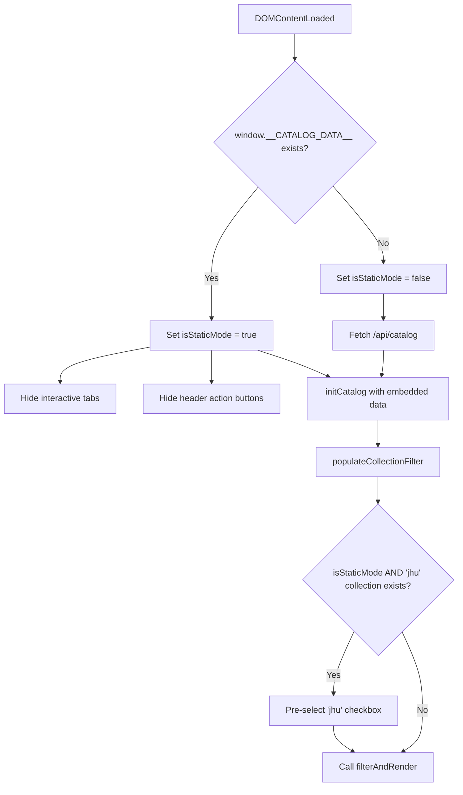

# Design Document

## Overview

The static catalog export (`forge catalog export`) produces a self-contained HTML page that embeds catalog data inline via `window.__CATALOG_DATA__` and `window.__ARTIFACT_CONTENT__` globals. Currently, the static page shares the exact same HTML template as the live `forge catalog browse` server, which means it renders interactive tabs (Collections, Manifest, Dependencies, Workspace, Build) and header action buttons (Import, Build, + New Artifact) that require live API endpoints to function. These non-functional elements confuse users on GitHub Pages.

This design adds a client-side static-mode detection layer that hides server-dependent UI elements and pre-selects the "jhu" collection filter when the page is loaded in static mode. The approach keeps the shared HTML template intact and applies all conditional behavior via JavaScript at initialization time, so the live browse server remains completely unaffected.

## Architecture

The implementation is entirely within the client-side JavaScript embedded in `browse-ui.ts`. No new modules, server routes, or build steps are needed.

**Key design decision**: All static-mode behavior is driven by a single `isStaticMode` boolean derived from `!!window.__CATALOG_DATA__`. This is checked once at initialization and passed into or referenced by the functions that need it. This avoids scattered `window.__CATALOG_DATA__` checks throughout the codebase and ensures a single source of truth for mode detection.

## Components and Interfaces

### Modified: `generateHtmlPage()` in `browse-ui.ts`

The inline `<script>` block within the HTML template is modified to add static-mode conditional logic. No changes to the function signature or the `generateStaticHtmlPage()` wrapper.

**Changes to the embedded JavaScript:**

1. **Static mode flag**: A top-level `var isStaticMode = !!window.__CATALOG_DATA__;` is added early in the `DOMContentLoaded` handler.

2. **Tab hiding logic**: After the flag is set, if `isStaticMode` is true, the code hides tab-nav items with `data-view` values of `collections`, `manifest`, `graph`, `workspace`, and `build` by setting `style.display = 'none'`.

3. **Header button hiding logic**: If `isStaticMode` is true, the code hides the elements with IDs `import-btn`, `build-btn`, `new-btn`, and `build-status-indicator` by setting `style.display = 'none'`.

4. **Collection filter default**: The `initCatalog` function (or the code immediately after it runs) checks `isStaticMode`. If true, after `populateCollectionFilter` has created the checkboxes, it looks for a `.collection-cb` checkbox with `value === 'jhu'`. If found, it sets `checked = true` and calls `filterAndRender()` to apply the filter immediately.

### Unchanged: `generateStaticHtmlPage()` in `browse-ui.ts`

This function continues to work as before — it calls `generateHtmlPage()` and injects the `__CATALOG_DATA__` and `__ARTIFACT_CONTENT__` script before `</head>`. The static-mode behavior is triggered automatically by the presence of `__CATALOG_DATA__` at runtime.

### Unchanged: `browse.ts`, `catalog.ts`

No server-side or catalog generation changes are needed.

## Data Models

No new data models are introduced. The existing `CatalogEntry` schema already includes a `collections` field (string array) which is used to populate the collection filter checkboxes.

The static mode detection relies on the existing `window.__CATALOG_DATA__` global that `generateStaticHtmlPage` already injects.

## Error Handling

- **Missing elements**: The tab/button hiding code uses `getElementById` and `querySelectorAll` with null checks, so if an element ID changes or is removed in the future, the code silently skips rather than throwing.
- **Missing "jhu" collection**: If no artifacts belong to the "jhu" collection, the checkbox won't exist in the DOM. The code checks for the checkbox's existence before attempting to set `checked = true`, so this case is handled gracefully — all artifacts display unfiltered.
- **Live mode unaffected**: Since `isStaticMode` is `false` when `__CATALOG_DATA__` is absent, none of the hiding or pre-selection logic executes in live browse mode.

## Testing Strategy

### Why Property-Based Testing Does Not Apply

This feature is purely about conditional DOM manipulation — hiding/showing specific UI elements based on a boolean flag (`isStaticMode`). The input space is not rich or varied enough for property-based testing:

- The mode detection is binary (static or live)
- The elements to hide are a fixed, known set
- The collection pre-selection has only two cases (jhu exists or doesn't)

There are no pure functions with universal properties, no serialization round-trips, and no algorithmic logic that benefits from randomized input generation.

### Example-Based Unit Tests

All tests use Bun's test runner. Tests verify the generated HTML string output from `generateHtmlPage()` and `generateStaticHtmlPage()`.

**Static mode — tab hiding:**
- `generateStaticHtmlPage` output contains JS that hides tabs with `data-view` of `collections`, `manifest`, `graph`, `workspace`, `build`
- The JS references `isStaticMode` for the hiding logic

**Static mode — button hiding:**
- `generateStaticHtmlPage` output contains JS that hides `#import-btn`, `#build-btn`, `#new-btn`, `#build-status-indicator`

**Static mode — collection default:**
- When catalog data includes artifacts with `collections: ["jhu"]`, the JS pre-selects the "jhu" checkbox and calls `filterAndRender`
- When catalog data has no "jhu" collection, no checkbox is pre-selected

**Live mode — regression:**
- `generateHtmlPage` output still contains all tabs (Collections, Manifest, Dependencies, Workspace, Build)
- `generateHtmlPage` output still contains all header buttons (Import, Build, + New Artifact)
- No collection checkboxes are pre-selected in live mode

**Static mode detection:**
- The JS uses `!!window.__CATALOG_DATA__` as the single detection mechanism
- The same `isStaticMode` variable controls all three behaviors (tabs, buttons, filters)
