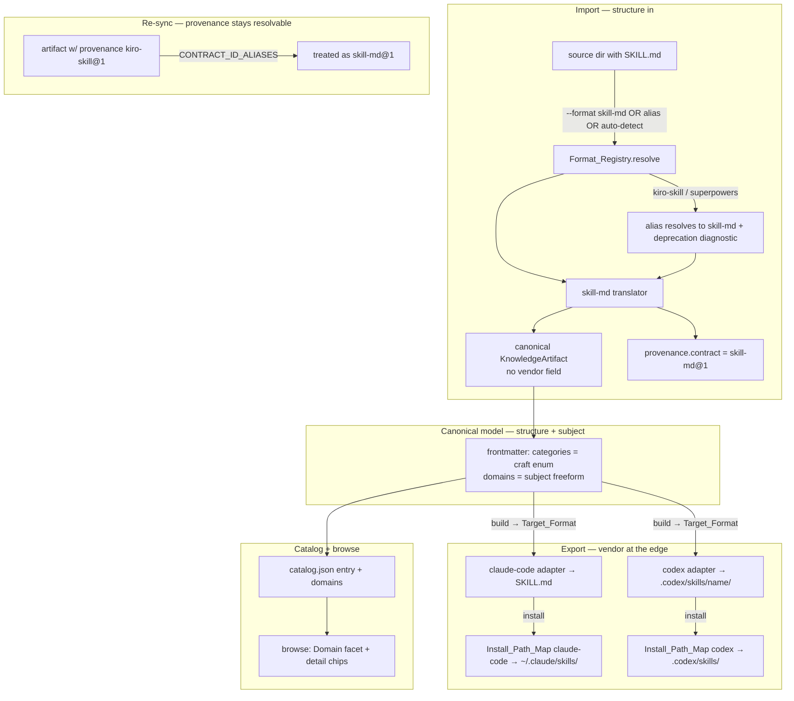

# Design Document: Vendor-Neutral Formats and Domain Categories

## Overview

This refactor unifies how Kanon classifies a canonical artifact under a single model: **an artifact is described by a fixed set of orthogonal axes — what it *is*, what *skill* it encodes, what it is *about*, and where it *came from* — and vendor is deliberately excluded from every one of those axes, appearing only at the export/install edge where a harness must physically discover the output.**

Today that model is violated in two different vocabularies, in the same way — a vendor has leaked onto an axis where it does not belong:

1. **Source formats** put vendor onto the *structure* axis: `kiro-skill` names a `SKILL.md` + `references/` layout — read by Claude Code, Codex, and Kiro alike — as though Kiro owned it, asserting it in a `harness: "kiro"` field. (The honestly-neutral name, `superpowers`, is the deprecated one.)
2. **Categories** collapse the *subject* axis into the *skill* axis: a single `categories` enum drawn from developer-tooling terms is the only label available, so a Johns Hopkins promotions-CV skill — whose *subject* is academic medicine — can only be filed under the *craft* term `documentation`.

Both are the same defect (a dimension carrying a value that belongs on a different dimension), so the design applies the same correction to both: give each concept its own axis, and confine vendor to the edge. Concretely:

- Collapse `kiro-skill` and `superpowers` into one vendor-neutral `skill-md` Source_Format (`harness: null`); keep the old names as deprecated aliases; keep recorded provenance resolvable. Leave `kiro-power` alone because `POWER.md` + `steering/` really is Kiro-native — its qualifier is factual, which is exactly the rule the unified model prescribes.
- Add a curation-owned, freeform `domains` axis for subject matter, leaving `categories` to mean technical craft, and surface `domains` in the catalog and browse UI.

The two fixes are separately *deliverable* (Parts A and B below can land as independent PRs) but they are not separately *conceived*: they are one model applied to two axes, with a third part (C) that makes the model's invariants mechanically enforced rather than a convention. The next section states that model; everything after it is an application of it.

The change is deliberately low-risk. The `FormatContract` schema already supports everything the format side needs (`harness: null`, an `aliases` array, `lifecycle` diagnostics), so no schema change is required there — only contract data, one merged translator, and a provenance-id resolver. The subject side mirrors the existing `catalog-metadata-evolution` precedent (`ecosystem`/`depends`/`enhances` are already freeform kebab-case arrays), so `domains` slots in the same way with no adapter changes.

## The Unified Classification Model

Every way Kanon labels a canonical artifact answers exactly one question and lives on exactly one axis. This is the spine of the design; Parts A and B are the two axes currently mis-populated.

| Axis | Question it answers | Field / mechanism | Vocabulary | Owner | Vendor allowed? |
|---|---|---|---|---|---|
| **Structure** | "What shape is this artifact?" | Source_Format at import; artifact `type` | closed (format registry / type enum) | derived | **Only if a vendor truly owns the shape** (`kiro-power` yes; `skill-md` no) |
| **Craft** | "What engineering skill does it encode?" | `categories` | controlled enum | curation | No |
| **Subject** | "What is it about?" | `domains` | freeform kebab-case | curation | No |
| **Origin** | "Where did it come from?" | `provenance` (machine), `attribution` (human) | free / structured | machine + curation | Named, never used to classify |
| **Destination** | "Which harness must discover it?" | `harnesses` allow-list → Target_Format + `Install_Path_Map` | `HarnessName` | curation (allow-list) + export-time | **Yes — this is vendor's only home** |

The `harnesses` frontmatter field sits on the **Destination** axis: it is an export-target allow-list (which harnesses this artifact may be built for), *not* a classification. This distinction matters for INV-1 — `harnesses` is the one frontmatter field that legitimately contains vendor names, precisely because naming Destination harnesses is its job. It is therefore explicitly exempted from the "no vendor in frontmatter" check.

Three invariants fall out of this table, and the whole design exists to enforce them. They are not merely descriptive: a single **model-invariant check** verifies all three across every Format_Contract and every Knowledge_Artifact (see Component C1), so the guarantee holds for the *whole* model, not just the two axes this refactor edits.

- **INV-1 (no vendor on intrinsic axes).** Structure, Craft, and Subject never encode a vendor — with the single, testable exception that a Structure *may* carry a vendor when that vendor genuinely defines the shape (`kiro-power` yes; `skill-md` no). Concretely: no `categories` or `domains` value equals a Harness_Name, no Source_Format other than `kiro-power` asserts a non-null `harness`, and no frontmatter field *except* `harnesses`/`provenance`/`attribution` contains a Harness_Name. Checked by C1 (Properties 3, 11).
- **INV-2 (orthogonality).** The axes are independent: an artifact may take any combination of values across them. A `domains` value is never validated as a `Category`, a `Category` never as a domain, and neither is ever derived from the source format (Property 9).
- **INV-3 (vendor at the edge only).** The vendor an artifact came *from* (Origin) is recorded but never drives behavior; the vendor it goes *to* (Destination) is the `harnesses` allow-list resolved through the Target_Format and `Install_Path_Map` at export. One canonical artifact therefore installs into `~/.claude/skills/`, `.codex/skills/`, or `.kiro/` with no change to how it was authored or classified (Properties 4, 5).

Read this way the two "halves" are one system: Part A removes an illegitimate vendor from the **Structure** axis and relocates the legitimate vendor concern to **Destination**; Part B splits an overloaded label into the distinct **Craft** and **Subject** axes; and the model-invariant check (Part C) makes all three invariants mechanically enforced rather than conventions a reviewer must remember. Same model, three parts.

## Scope

| In scope | Out of scope |
|---|---|
| `skill-md` Source_Format + `kiro-skill`/`superpowers` aliases | Renaming or changing any Target_Format (`codex`, `claude-code`, …) |
| Provenance_Contract_Id resolution for old ids | Bulk on-disk rewrite of existing provenance blocks (deferred to an explicit opt-in migration) |
| `domains` frontmatter + catalog + browse facet | Populating `domains` on existing artifacts (author/curator task, tracked separately) |
| The format-naming rule as an ADR (realizing ADR-0066) | The recursive all-file source read and binary-safe workflow content (separate specs) |
| Docs, scaffold, `rosetta formats` output | A *closed enum* for `domains` (kept freeform, governed by a warning against a Known_Domains_Registry) |
| Model-invariant check (Part C) enforcing INV-1..3 registry-wide | Enforcing invariants beyond the three defined (future axes handled by their own specs) |
| Known_Domains_Registry + governance-by-warning for `domains` | Auto-correcting or rejecting unrecognized domains (they warn, never fail) |
| Defining `harnesses` as the Destination-axis allow-list | Changing `harnesses` semantics or export behavior (only its model placement is clarified) |

## Architecture



The three boundaries this design makes explicit:

- **Import boundary** — the only place a *source* format name is chosen. After translation the artifact carries no vendor identity beyond `provenance` (machine origin) and `attribution` (human credit).
- **Export/install boundary** — the only place a *vendor* determines behavior, via the Target_Format adapter and `Install_Path_Map`. This is where "put it in `~/.claude/skills/` so Claude picks it up" lives.
- **Classification** — `categories` (craft) and `domains` (subject) describe the artifact intrinsically and touch neither boundary.

## Components and Interfaces

### Part A — Source formats

#### A1. `SKILL_MD_CONTRACT` (new, in `src/rosetta/builtins/contracts.ts`)

Replaces `KIRO_SKILL_CONTRACT` and `SUPERPOWERS_CONTRACT`.

```ts
export const SKILL_MD_CONTRACT: FormatContract = {
  id: "skill-md" as FormatIdentifier,
  contractVersion: "1.0",
  direction: "source",
  harness: null,                                   // no vendor owns SKILL.md
  aliases: ["kiro-skill", "superpowers"] as FormatIdentifier[],
  lifecycle: { status: "active", introducedIn: "<next-minor>" },
  canonicalVersions: { minInclusive: "1.0.0", maxExclusive: "2.0.0" },
  schemaReference: { type: "none", description: "SKILL.md skill with preserved companions" },
  pathConventions: [
    { pattern: "SKILL.md", required: true,  description: "Skill definition file" },
    { pattern: "**/*",     required: false, description: "Companion files preserved by relative path" },
  ],
  detection: {
    threshold: 0.5,
    rules: [
      { id: "skill-md",       kind: "basename",  pattern: "SKILL.md",     weight: 60, required: true,  evidenceLabel: "SKILL.md present" },
      { id: "references-dir", kind: "path-glob", pattern: "references/*", weight: 10, required: false, evidenceLabel: "references/ companions" },
    ],
  },
  variants: {}, optionDefinitions: {}, defaults: {},
  normalizationRules: [{ id: "skill-frontmatter", description: "Normalize SKILL.md frontmatter", scope: "source" }],
  compatibility: fullProfile(),
  security: { sensitiveValuePolicy: "reference-only", allowedReferencePatterns: ["\\$\\{[A-Z_]+\\}"] },
};
```

Two complementary mechanisms retire the old names (see Error Handling for how they differ):

- The contract's `aliases` array makes `kiro-skill`/`superpowers` **resolve** to `skill-md` (registry enforces alias uniqueness at registration — `registry.ts:293–327`).
- A `SELECTION_ALIASES` entry per old id makes selecting it **warn** with `replacement: "skill-md"` (same mechanism `auto` uses — `contracts.ts:56`).

`KIRO_POWER_CONTRACT` is unchanged.

#### A2. `translateSkillMd` (new, in `src/rosetta/builtins/sources/skill-md.ts`)

The merge of `translateKiroSkill` and `translateSuperpowers`. Behavior:

- Require `SKILL.md`; parse frontmatter + body.
- Map `references/*.md` companions to workflow files, stripping the `references/` prefix (preserving the current `kiro-skill` link-resolution behavior).
- `accountant.preserve()` every other companion file by its relative path (scripts, assets, nested trees).

Registered once in `src/rosetta/builtins/sources/index.ts`:

```ts
// before: ["kiro-skill", translateKiroSkill], ["superpowers", translateSuperpowers]
["skill-md" as FormatIdentifier, translateSkillMd],
```

`translateKiroSkill` and `translateSuperpowers` are deleted; their tests are re-pointed at `translateSkillMd`.

> Note: `translateSkillMd` preserves whatever companion files it is *given*. Ensuring the importer actually *reads* nested/non-`.md` companions (the `buildSourceDocuments` gap) is a dependency tracked in a separate spec; `skill-md` is written to assume it and degrades gracefully (fewer preserved files) until it lands.

#### A3. Provenance-id resolution (in `src/import.ts` and the re-sync/reconciliation reader)

Recording side:

```ts
const SOURCE_CONTRACT_IDENTIFIERS = {
  "kiro-power": "kiro-power@1",
  "skill-md":   "skill-md@1",   // replaces kiro-skill@1 / superpowers@1
};
```

Reading side (re-sync / three-way reconciliation) resolves historical ids:

```ts
const CONTRACT_ID_ALIASES: Record<string, string> = {
  "kiro-skill@1":  "skill-md@1",
  "superpowers@1": "skill-md@1",
};
function resolveContractId(recorded: string): string {
  return CONTRACT_ID_ALIASES[recorded] ?? recorded;
}
```

This resolver is read-only; per Requirement 5.4 no command rewrites recorded values as a side effect.

### Part B — Categories / domains

#### B1. `FrontmatterSchema` extension (in `src/schemas.ts`)

Mirror the existing `ecosystem` pattern; **no change to `CategoryEnum`**:

```ts
domains: z.array(z.string().min(1).regex(/^[a-z0-9]+(-[a-z0-9]+)*$/)).default([]),
```

#### B2. `CatalogEntrySchema` extension (in `src/schemas.ts`)

```ts
domains: z.array(z.string()),
```

#### B3. `generateCatalog()` (in `src/catalog.ts`)

Add `domains: fm.domains` to the `entries.push({...})` call, exactly as `ecosystem` is mapped today.

#### B4. `KNOWN_FRONTMATTER_FIELDS` (in `src/parser.ts`)

Add `"domains"` so it is a known field, not routed to `extraFields`.

#### B5. Curation-ownership wiring (in the reconciliation field-classification map)

`domains` joins `categories`, `trust`, `collections`, `attribution` as **curation-owned** (the map near `src/schemas.ts` / reconciliation that already labels `categories: "curation-owned"`). This guarantees Requirement 6.4: import does not populate it and re-sync does not overwrite it.

#### B6. Browse UI (in `src/browse-ui.ts`)

Add a Domain facet alongside the existing Category facet, and render Domain chips in the detail view distinctly from Category chips. Data already flows through the catalog entry.

#### B7. Scaffold + docs

- `templates/knowledge/knowledge.md.njk`: add a commented `domains: []` block.
- `CONTRIBUTING.md` / import docs: `--format skill-md`; note deprecated aliases; add the categories-vs-domains worked example.
- `rosetta formats` renderer: already reads `lifecycle` + `aliases`, so `skill-md` shows active and the old ids show as deprecated aliases once the contract changes land.

#### B8. Domain governance by warning (Known_Domains_Registry)

`domains` stays freeform at the *schema* level (any well-formed kebab-case string parses), but gains a curation layer so it does not fragment the way `ecosystem` did. A `KNOWN_DOMAINS` list (a plain exported `readonly string[]`, e.g. in `src/domains.ts`, alongside the docs that publish it) drives a Validator check:

```ts
// in validate.ts, cross-artifact pass — warning, never error (mirrors the
// existing unresolved-dependency check)
for (const d of fm.domains) {
  if (!KNOWN_DOMAINS.includes(d)) {
    const suggestion = closestKnownDomain(d); // Levenshtein over KNOWN_DOMAINS
    warnings.push({
      field: "domains",
      message: suggestion
        ? `Unrecognized domain "${d}" — did you mean "${suggestion}"?`
        : `Unrecognized domain "${d}" — add it to KNOWN_DOMAINS if intentional.`,
      filePath,
    });
  }
}
```

Key properties: unrecognized-but-well-formed values **warn, never fail** (the artifact stays valid); a near match suggests the canonical form (steering `k8s` → `kubernetes`); and adding a domain is a one-line append to `KNOWN_DOMAINS` with **no `FrontmatterSchema` change** — the schema regex is unchanged. This is deliberately the same mechanism ADR-0007 chose for `depends`/`enhances` (warn on unresolved reference), extended from "does it exist" to "is it canonical."

### Part C — Model-invariant enforcement

#### C1. `checkModelInvariants` (new, in `src/validate.ts`)

A single check that runs over all registered Format_Contracts and all loaded Knowledge_Artifacts and verifies INV-1..INV-3. It is the mechanism that makes the model a guarantee rather than a convention, and it is where a *future* leak (a new field, a new format) gets caught.

```ts
const HARNESS_NAMES: ReadonlySet<string> = new Set(SUPPORTED_HARNESSES);
// The only frontmatter fields permitted to contain a Harness_Name:
const VENDOR_BEARING_FIELDS = new Set(["harnesses", "provenance", "attribution"]);

function checkModelInvariants(
  contracts: readonly FormatContract[],
  artifacts: readonly KnowledgeArtifact[],
): { errors: ValidationError[]; warnings: ValidationWarning[] } {
  // INV-1a (registry, ERROR): only a genuinely vendor-owned Structure may set harness.
  //   Of built-ins, kiro-power is the sole permitted non-null source `harness`.
  // INV-1b (artifact, WARNING): no categories/domains value is a Harness_Name.
  // INV-3  (artifact, WARNING): no frontmatter field outside VENDOR_BEARING_FIELDS
  //   contains a Harness_Name value.
  // INV-2 is enforced structurally by the schema (separate enum vs. pattern) and by
  //   Property 9; C1 additionally asserts no code path derives domains/categories
  //   from the source format.
  // ...
}
```

Severity split follows Requirement 11.5/11.6: a violation in the **built-in registry** is an error (project-controlled code), while a violation in an **authored artifact's** metadata is a warning (author-fixable, non-blocking). `checkModelInvariants` is wired into `kanon validate` and also exercised directly by a test.

#### C2. Extensibility guard (the test that keeps the guard honest)

Requirement 11.7: a test enumerates the Intrinsic_Axis fields the invariant check knows about and asserts it matches the set of classification fields on `FrontmatterSchema`. If someone adds a new intrinsic field (a future "fifth axis") without teaching `checkModelInvariants` about it, that test fails — so the guardrail cannot silently fall behind the schema. This is what turns "we have three invariants today" into "the model stays enforced as it grows."

#### C3. `harnesses` clarified as Destination (Requirement 13)

No code change to `harnesses` behavior; the work is (a) exempting `harnesses` in `VENDOR_BEARING_FIELDS` above, (b) a doc/ADR note defining it as the Destination-axis export allow-list and contrasting it with the *removed* source-format `harness` field, so the two vendor-bearing concepts are not conflated.

### ADRs

- **ADR-0067 — Format identifiers describe structure, not vendor** (accepts/realizes ADR-0066): states the rule from Requirement 3, applies it (`skill-md`, `harness: null`; `kiro-power` unchanged), documents the alias migration, and records the model-invariant check as the mechanism enforcing it registry-wide.
- **ADR-0068 — Categories for craft, domains for subject** (extends ADR-0007): documents the two-axis split, why `domains` is freeform-with-warning (a Known_Domains_Registry) rather than a second closed enum, and defines `harnesses` as the Destination axis so INV-1 does not contradict itself.

## Data Models

### Source_Format inventory after the refactor

| id | direction | harness | markers | lifecycle | rationale |
|---|---|---|---|---|---|
| `kiro-power` | source | `kiro` | `POWER.md` + `steering/` | active | Kiro-native structure — qualifier is factual |
| `skill-md` | source | `null` | `SKILL.md` + companions | active | multi-harness structure — no vendor |
| `kiro-skill` | — | — | — | deprecated **alias → skill-md** | historical selector |
| `superpowers` | — | — | — | deprecated **alias → skill-md** | historical selector |

### Classification axes — concrete types

The axes and their invariants are defined in [The Unified Classification Model](#the-unified-classification-model); this table gives the concrete on-disk representation of each.

| Axis | Field / mechanism | TypeScript type | Default |
|---|---|---|---|
| Structure | Source_Format `id` (import) / `type` | `FormatIdentifier` / `ArtifactType` | derived |
| Craft | `categories` | `Category[]` (`z.enum`) | `[]` |
| Subject | `domains` | `string[]` (kebab-case) | `[]` |
| Origin | `provenance` / `attribution` | structured objects | absent |
| Destination | Target_Format + `Install_Path_Map` | `Record<HarnessName, string>` | resolved at export |

Per INV-1 and INV-3, the only fields that ever name a vendor are Origin (recorded, non-behavioral) and Destination (export-time) — Craft and Subject never do, and Structure does so only for a genuinely vendor-owned shape.

### Extended Frontmatter shape (delta only)

```ts
interface Frontmatter {
  // ...existing...
  categories: Category[];   // unchanged — controlled enum, technical craft
  domains: string[];        // NEW — default [], kebab-case, curation-owned subject matter
}
```

### Domain vs. Category worked example

`jhsomcv` (the Johns Hopkins promotions-CV skill):

```yaml
categories: [documentation]                 # the craft: it formats a document
domains: [academic, healthcare, publishing] # the subject: what it is about
```

Before this refactor only the first line was expressible, so the artifact read as generic "documentation." The `domains` line is what lets a browser find "all Johns Hopkins / all healthcare artifacts."

## Correctness Properties

*A property is a characteristic that should hold across all valid executions — a machine-verifiable statement of what the system should do.*

### Property 1: Alias output equivalence

*For any* source directory of Skill_Md_Structure, translating it with source selector `kiro-skill`, with `superpowers`, and with `skill-md` shall each produce an identical canonical `KnowledgeArtifact` and identical serialized output (diagnostics excepted).
**Validates: Requirements 1.4, 2.1, 2.2, 2.5**

### Property 2: Auto-detection resolves SKILL.md to skill-md

*For any* directory whose only recognized format marker is a `SKILL.md`, format detection shall select `skill-md` and no other source format.
**Validates: Requirements 1.5**

### Property 3: No source format asserts a false vendor

*For any* registered Source_Format, if its recognized structure is multi-harness then its `harness` field is `null`; `kiro-power` is the only Source_Format with a non-null `harness`.
**Validates: Requirements 3.2, 3.3, 3.4**

### Property 4: Provenance-id resolution round-trip

*For any* artifact whose recorded Provenance_Contract_Id is `kiro-skill@1` or `superpowers@1`, `resolveContractId` shall return `skill-md@1`; and re-syncing such an artifact shall recompute a base digest that verifies against the recorded base without re-import.
**Validates: Requirements 5.2, 5.3**

### Property 5: Export destination depends only on target, not source

*For any* canonical artifact and *for any* two source formats it could have been imported from, exporting to a given harness shall place output at the same Install_Path_Map location; the source format shall not affect the destination.
**Validates: Requirements 4.2, 4.5, 4.6**

### Property 6: Domains frontmatter round-trip

*For any* valid `domains` array (kebab-case strings), serializing the frontmatter to YAML then parsing back through `FrontmatterSchema` shall produce an equivalent, order-preserving array.
**Validates: Requirements 6.2, 6.6**

### Property 7: Domains catalog round-trip

*For any* valid `CatalogEntry` with a `domains` array, serializing to JSON then deserializing through the catalog schema shall preserve `domains` intact and in order.
**Validates: Requirements 8.1, 8.3**

### Property 8: Domains is curation-owned across re-sync

*For any* artifact with author-set `domains`, an import or re-sync of its upstream shall leave `domains` unchanged.
**Validates: Requirements 6.4**

### Property 9: Categories/domains independence

*For any* combination of zero-or-more valid Category values and zero-or-more valid Domain values, `FrontmatterSchema` shall accept the artifact; a `domains` value shall never be validated against `CategoryEnum`, and a `categories` value shall never be validated against the kebab-case domain pattern in place of the enum.
**Validates: Requirements 7.1, 7.3, 7.5**

### Property 10: Backward compatibility for the existing catalog

*For any* existing valid Knowledge_Artifact that omits `domains`, parsing shall succeed with `domains = []`, validation shall report no new errors, and its built harness output shall be unchanged.
**Validates: Requirements 9.1, 9.2, 9.3, 9.5**

### Property 11: Model invariants hold across the whole model

*For all* registered Format_Contracts and *for all* Knowledge_Artifacts, `checkModelInvariants` shall report no INV-1/INV-3 violation: no `categories` or `domains` value equals a Harness_Name; no Source_Format other than `kiro-power` asserts a non-null `harness`; and no frontmatter field outside `harnesses`/`provenance`/`attribution` contains a Harness_Name. *For any* synthetic artifact or contract that injects such a violation, the check shall flag it — as an error for a built-in-registry violation and a warning for an authored-metadata violation.
**Validates: Requirements 11.1, 11.2, 11.4, 11.5, 11.6**

### Property 12: Invariant check tracks the schema's intrinsic fields

*For* the set of classification fields declared on `FrontmatterSchema`, the set of Intrinsic_Axis fields `checkModelInvariants` inspects shall equal it; adding a classification field to the schema without registering it with the check shall cause the guard test to fail.
**Validates: Requirements 11.3, 11.7**

### Property 13: Unrecognized domains warn without failing, and suggest a canonical form

*For any* well-formed `domains` value not in the Known_Domains_Registry, the Validator shall emit exactly one warning naming the value and shall keep the artifact valid; *for any* such value within edit-distance threshold of a known domain, the warning shall name that closest known domain. *For any* value present in the registry, no warning shall be emitted.
**Validates: Requirements 12.2, 12.3, 12.4, 12.5**

## Error Handling

### Resolve vs. warn (the two alias mechanisms)

| Mechanism | Where | Effect on selection | Effect on user |
|---|---|---|---|
| Contract `aliases` array | `SKILL_MD_CONTRACT.aliases` | old id resolves to `skill-md` contract | none by itself |
| `SELECTION_ALIASES` entry | `contracts.ts` | selection succeeds | deprecation diagnostic naming `skill-md` |

Both are needed: `aliases` guarantees resolution; `SELECTION_ALIASES` guarantees the migration message. Neither changes output.

### Validation matrix

| Condition | Severity | Behavior |
|---|---|---|
| `domains` value fails kebab-case pattern | Error | `FrontmatterSchema.safeParse` fails, identifying the value (Req 6.5) |
| `domains` omitted | none | defaults to `[]` (Req 6.3, 9.1) |
| `categories` value not in `CategoryEnum` | Error | unchanged from today (Req 7.1) |
| Source selector `kiro-skill`/`superpowers` used | Warning | resolves to `skill-md`, deprecation diagnostic (Req 2.3) |
| Built-in registry asserts a false vendor `harness` | Error (registry self-check / C1) | registry validation fails at load (Req 3.4, 11.5) |
| Recorded provenance `kiro-skill@1` on re-sync | none | resolved to `skill-md@1` transparently (Req 5.2) |
| `categories`/`domains` value equals a Harness_Name | Warning (C1) | model-invariant check flags the axis + value; artifact stays valid (Req 11.2, 11.6) |
| Frontmatter field outside `harnesses`/`provenance`/`attribution` contains a Harness_Name | Warning (C1) | flagged; `harnesses` is exempt as the Destination allow-list (Req 11.4, 13.2) |
| Well-formed `domains` value not in Known_Domains_Registry | Warning | names the value, suggests closest known domain; artifact stays valid (Req 12.3, 12.4, 12.5) |
| New intrinsic-axis field added without registering with C1 | Error (guard test) | C2 extensibility test fails in CI (Req 11.7) |

### Failure isolation

Although Parts A, B, and C are one model (the axes of [The Unified Classification Model](#the-unified-classification-model)), Parts A and B touch disjoint code paths, so a fault in one cannot corrupt the other: a bug in the `domains` schema cannot change source translation, and the format rename cannot change catalog category behavior. This is a *delivery* property, not a conceptual seam — it lets the two axes land as separate PRs behind the same spec while remaining a single coherent system. Part C (the model-invariant check) is the cross-cutting piece: it depends on the field set both A and B settle, so it lands last and is the shared gate a reviewer uses to confirm INV-1..INV-3 held across both PRs — turning the invariants from something a reviewer must remember into something CI enforces.

## Testing Strategy

Runtime Bun (`bun test`); property tests via `fast-check` (min 100 runs), tagged `Feature: vendor-neutral-formats-categories, Property {N}: {title}`.

### Property-based tests

| Property | Test file | Focus |
|---|---|---|
| P1 Alias output equivalence | `src/__tests__/skill-md-alias-equivalence.property.test.ts` | translate under 3 selectors → identical artifact/output |
| P2 Auto-detect → skill-md | `src/__tests__/rosetta-detect-skill-md.test.ts` | SKILL.md-only dir resolves to skill-md |
| P3 No false vendor | `src/__tests__/format-vendor-rule.test.ts` | iterate built-in Source_Formats, assert harness rule |
| P4 Provenance-id round-trip | `src/__tests__/import-provenance.test.ts` (extend) | old ids resolve; re-sync digest verifies |
| P5 Export destination by target | `src/__tests__/install-destination.test.ts` | same artifact, two source origins, one destination |
| P6 Domains YAML round-trip | `src/__tests__/schema-roundtrip.property.test.ts` (extend `frontmatterArb`) | order/content preserved |
| P7 Domains catalog round-trip | `src/__tests__/catalog-roundtrip.property.test.ts` (extend `catalogEntryArb`) | JSON round-trip |
| P8 Domains curation-owned | `src/__tests__/reconciliation-*.test.ts` (extend) | re-sync preserves domains |
| P9 Categories/domains independence | `schema-roundtrip.property.test.ts` | cross-product accept |
| P10 Backward compat | new `src/__tests__/backcompat-domains.test.ts` + full build in CI | existing artifacts unchanged |
| P11 Model invariants hold model-wide | new `src/__tests__/model-invariants.property.test.ts` | clean corpus passes; injected violation flagged (error vs. warning by source) |
| P12 Invariant check tracks schema fields | `model-invariants.property.test.ts` (guard test, C2) | intrinsic-field set equals schema's; unregistered field fails |
| P13 Unrecognized domain warns + suggests | `src/__tests__/domain-governance.test.ts` | warn-not-fail; near-match suggestion; known value silent |

### Example-based tests

| Test | File | Requirement |
|---|---|---|
| `skill-md` registered active with correct markers | `rosetta` registry test | 1.1, 1.2, 1.3 |
| `kiro-skill`/`superpowers` resolve + warn | registry/import test | 2.1–2.4 |
| `kiro-power` unchanged (`harness: kiro`) | `format-vendor-rule.test.ts` | 3.2 |
| `SOURCE_CONTRACT_IDENTIFIERS` emits `skill-md@1` | `import-provenance.test.ts` | 5.1 |
| No side-effect provenance rewrite | reconciliation test | 5.4 |
| `domains` default `[]` when omitted | `schemas`/`validate` test | 6.3, 9.1 |
| catalog entry populated from `domains` | `catalog.test.ts` | 8.2 |
| browse Domain facet renders | `browse` test | 8.4, 8.5 |
| scaffold emits commented `domains: []` | `new.test.ts` | 10.1 |
| `harnesses` exempt from vendor-in-frontmatter check | `model-invariants.property.test.ts` | 13.2 |
| Known_Domains_Registry extends without schema change | `domain-governance.test.ts` | 12.6 |
| `checkModelInvariants` wired into `kanon validate` | `validate.test.ts` | 11.1 |

### Whole-catalog regression

Before/after `kanon build` across all harnesses and `kanon catalog generate` must diff empty except for added `domains` fields (Req 9.3, 9.4). Run in CI on the full 66-artifact set.
