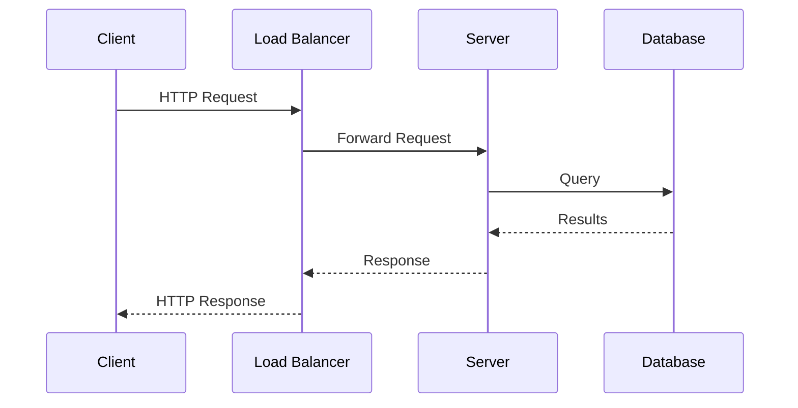
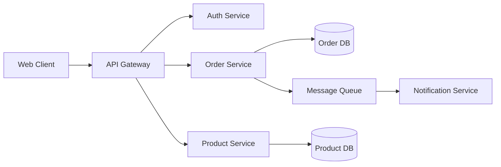

<!-- forge:version 0.2.0 -->
---
inclusion: manual
---

# Technical Author

## Overview

Technical Author is a comprehensive power for writing technical books. It breaks the book-writing process into discrete, manageable phases — each with its own steering file — so you can focus on one aspect of craft at a time while keeping the big picture in view.

Whether you're pitching a vague idea to an acquisitions editor or polishing a manuscript for production, Technical Author meets you where you are.

## Steering Files

This power has fourteen workflow files across three tracks:

- **concept-and-audience** — Define book concept and target audience
- **technology-landscape** — Research the technology landscape
- **book-architecture** — Design book structure and chapter flow
- **proposal-and-pitch** — Write proposals and pitch to publishers
- **chapter-drafting** — Draft individual chapters
- **code-examples** — Design and test code examples
- **running-example** — Manage the book's running example project
- **explanation-craft** — Write clear technical explanations
- **voice-and-style** — Develop technical writing voice
- **visuals-and-diagrams** — Create figures and diagrams
- **technical-review** — Manage technical review process
- **revision-and-polish** — Revise and polish the manuscript
- **production-prep** — Prepare manuscript for production
- **launch-and-marketing** — Plan book launch and marketing

## Getting Started

When a user activates this power, begin by asking which track fits their current needs:

**Ask the user:** "Where are you in your technical book journey?"

**Option 1: Planning Track** — "I'm developing a book idea. I need help with the concept, audience, outline, and proposal."

**Option 2: Writing Track** — "I have an approved outline. I need help writing chapters, code examples, and explanations."

**Option 3: Production Track** — "I have a draft. I need help with technical review, revision, and preparing for production."

**Option 4: Full Journey** — "I want to go from concept to finished manuscript. Walk me through everything."

Based on their answer, guide them into the appropriate track below. Users can switch tracks or access any phase at any time — the tracks are starting points, not constraints.

## Planning Track

The Planning Track covers everything before you write the first chapter. It's organized into five phases:

### Phases

1. **Concept & Audience** — Define what the book teaches, who it's for, and why it matters now
2. **Technology Landscape** — Research the competitive landscape, existing books, and market timing
3. **Book Architecture** — Design the table of contents, chapter flow, and learning progression
4. **Proposal & Pitch** — Write the book proposal for publishers or self-publishing planning
5. **Voice & Style** — Establish the prose style, tone, and conventions for the manuscript

### Planning Track Steering Files

- **concept-and-audience** — Develop your core idea into a compelling book concept with a defined audience, scope, and value proposition
- **technology-landscape** — Research existing books, competing resources, market timing, and positioning for your technical topic
- **book-architecture** — Design the table of contents, chapter structure, learning progression, and dependency graph
- **proposal-and-pitch** — Write a publisher-ready book proposal or self-publishing plan with market analysis and sample chapter
- **voice-and-style** — Define and maintain a consistent technical writing voice, code style, and pedagogical approach

## Writing Track

The Writing Track covers the craft of writing technical content chapter by chapter. It's organized into five phases:

### Phases

6. **Explanation Craft** — Master the techniques for explaining complex technical concepts clearly
7. **Code Examples** — Design, write, and maintain code examples that teach effectively
8. **Visual & Diagrams** — Plan diagrams, figures, screenshots, and visual explanations
9. **Chapter Drafting** — Write chapters systematically with attention to pacing, depth, and flow
10. **Running Example** — Design and maintain a cohesive example project that threads through the book

### Writing Track Steering Files

- **explanation-craft** — Techniques for explaining complex technical concepts with clarity, precision, and appropriate depth
- **code-examples** — Design, write, test, and maintain code examples that teach effectively and actually run
- **visuals-and-diagrams** — Plan and describe diagrams, architecture figures, screenshots, and visual explanations
- **chapter-drafting** — Write chapters systematically with attention to pacing, learning objectives, and forward momentum
- **running-example** — Design and maintain a cohesive example project that threads through the book and grows with the reader

## Production Track

The Production Track covers everything after the draft is written — review, revision, and preparation for publication. It's organized into four phases:

### Phases

11. **Technical Review** — Manage the technical review process and incorporate feedback
12. **Revision & Polish** — Revise for accuracy, clarity, consistency, and completeness
13. **Production Prep** — Prepare the manuscript for the publisher's production pipeline
14. **Launch & Marketing** — Plan the book launch, marketing, and ongoing maintenance

### Production Track Steering Files

- **technical-review** — Manage the technical review process, incorporate feedback, and resolve conflicting reviewer opinions
- **revision-and-polish** — Systematically revise for technical accuracy, prose clarity, code correctness, and consistency
- **production-prep** — Prepare the manuscript for the publisher's production pipeline including formatting, indexing, and final checks
- **launch-and-marketing** — Plan the book launch, build an audience, and maintain the book post-publication

## Full Journey

If the user selects the Full Journey, guide them through all fourteen phases in order — the Planning Track, then the Writing Track, then the Production Track. The complete sequence:

1. Concept & Audience
2. Technology Landscape
3. Book Architecture
4. Proposal & Pitch
5. Voice & Style
6. Explanation Craft
7. Code Examples
8. Visuals & Diagrams
9. Chapter Drafting
10. Running Example
11. Technical Review
12. Revision & Polish
13. Production Prep
14. Launch & Marketing

## Tips for Using This Power

- Activate the steering file for whichever phase you're working on
- Keep a running document for your book project (outline, code repo, style guide, manuscript)
- Reference earlier phase outputs as you move forward — consistency matters
- Don't try to perfect one phase before moving on; iteration is part of the process
- When stuck, try jumping to a different phase for fresh perspective
- You can switch between tracks at any time — the boundaries are guides, not walls
- Technical books are living documents — plan for updates from the start

## Examples

**Good code listing (follows standards):**
> Listing 3-4: Validating user input with Zod
> ```typescript
> const UserSchema = z.object({
>   name: z.string().min(1),
>   email: z.string().email(),
> });
> // ❶ Parse throws on invalid input
> const user = UserSchema.parse(rawInput);
> ```
> Callout ❶ explains the key behavior. The listing is under 10 lines, has a title, and is copy-paste runnable.

**Bad code listing:**
> Here's some code: (no title, no number, no callouts, 80 lines of unexplained implementation)

## Troubleshooting

**Agent produces code listings that don't compile:** Every listing must be tested. Use the code-examples workflow to verify listings against the running example's current state.

**Prose-code balance is off:** If there's more than ~1000 words without a code example, or ~50 lines of code without prose explanation, rebalance. Technical readers need both.

**Chapter dependencies are unclear:** Use the dependency graph from the chapter brief. If Chapter 7 assumes knowledge from Chapter 4, that dependency must be explicit in the brief.

## Book Architecture

# Book Architecture

## Overview

The architecture of a technical book is its table of contents, chapter structure, and learning progression. A well-architected book feels inevitable — each chapter builds on the last, the reader never feels lost, and by the end they've constructed a complete mental model. A poorly architected book feels like a random collection of topics stapled together.

This phase designs the skeleton that everything else hangs on.

## Workflow: Designing the Structure

### Step 1: Choose a Structural Pattern

Technical books follow recognizable patterns. Choose the one that fits your content:

**Bottom-Up (fundamentals first):**
- Start with core concepts, build toward complex applications
- Good for: language books, framework introductions, foundational topics
- Risk: readers may lose patience before reaching the interesting parts
- Example: "Programming Rust" — starts with ownership, builds to async

**Top-Down (big picture first):**
- Start with architecture and design, drill into implementation details
- Good for: architecture books, system design, strategic topics
- Risk: can feel abstract until the reader gets to concrete examples
- Example: "Designing Data-Intensive Applications" — starts with data models, drills into storage engines

**Spiral (revisit topics at increasing depth):**
- Introduce concepts simply, return to them with more nuance later
- Good for: complex topics where full understanding requires multiple passes
- Risk: can feel repetitive if not handled well
- Example: "The Art of PostgreSQL" — revisits SQL concepts at increasing sophistication

**Project-Based (learn by building):**
- Each chapter adds a feature or capability to a running example
- Good for: practical guides, framework tutorials, hands-on learners
- Risk: the project can constrain what topics you cover
- Example: "Agile Web Development with Rails" — builds a store application

**Reference (organized by topic):**
- Chapters are relatively independent, organized by domain
- Good for: cookbooks, API guides, comprehensive references
- Risk: no narrative momentum; readers may not read cover-to-cover
- Example: "JavaScript: The Definitive Guide" — organized by language feature

**Problem-Solution (organized by challenge):**
- Each chapter addresses a specific problem or use case
- Good for: intermediate/advanced audiences, cookbooks, best-practices guides
- Risk: can lack cohesion if problems aren't connected
- Example: "Release It!" — organized by production failure patterns

### Step 2: Define the Chapter List

Draft your table of contents. For each chapter, specify:

```markdown
# Table of Contents

## Part I: {Part Title} (if using parts)

### Chapter 1: {Title}
- **Learning objective:** What the reader can do after this chapter
- **Prerequisites:** What they need to know before reading this
- **Key concepts:** 3-5 main ideas covered
- **Estimated length:** {pages}

### Chapter 2: {Title}
- **Learning objective:** ...
- **Prerequisites:** Chapter 1
- **Key concepts:** ...
- **Estimated length:** {pages}
```

**Chapter count guidelines by book type:**

| Book Type | Typical Chapters | Typical Pages |
|-----------|-----------------|---------------|
| Introductory guide | 10-15 | 250-350 |
| Comprehensive guide | 15-25 | 400-600 |
| Cookbook/recipes | 10-15 (with many sections each) | 300-500 |
| Deep dive / advanced | 8-15 | 250-400 |
| Project-based | 10-20 | 300-500 |

### Step 3: Map the Dependency Graph

Technical content has dependencies — you can't explain middleware before explaining HTTP, can't cover testing strategies before covering the code being tested.

**Create a dependency map:**

```markdown
# Chapter Dependencies

Chapter 1: Foundations → (no dependencies)
Chapter 2: Core API → depends on Chapter 1
Chapter 3: Data Layer → depends on Chapter 1
Chapter 4: Authentication → depends on Chapters 2, 3
Chapter 5: Testing → depends on Chapters 2, 3
Chapter 6: Deployment → depends on Chapters 2, 3, 4
Chapter 7: Advanced Patterns → depends on Chapters 2, 3, 4, 5
```

**Check for problems:**
- **Circular dependencies:** Chapter A requires B, but B requires A. Resolve by restructuring or introducing concepts incrementally.
- **Deep dependency chains:** If Chapter 10 requires all of Chapters 1-9, the reader can't skip ahead. Consider making some chapters more independent.
- **Orphan chapters:** A chapter with no dependencies and nothing depends on it. It might not belong in this book.

### Step 4: Design the Learning Progression

The reader should feel a sense of growing capability as they move through the book:

**Early chapters (1-3):**
- Establish vocabulary and mental models
- Get the reader to a working "hello world" quickly
- Build confidence with small wins
- Set up the development environment

**Middle chapters (4-8):**
- Introduce the core techniques and patterns
- Increase complexity gradually
- Each chapter should produce something the reader is proud of
- This is where the bulk of the teaching happens

**Late chapters (9+):**
- Advanced topics, edge cases, production concerns
- Synthesis — connecting earlier concepts in sophisticated ways
- Real-world considerations (performance, security, operations)
- Where to go next

**The "aha moment" placement:**
Every 2-3 chapters, the reader should have a moment where disparate concepts click together. Plan these moments deliberately.

### Step 5: Design Chapter Internal Structure

Establish a consistent internal structure for chapters:

**Standard chapter template:**

```markdown
# Chapter N: {Title}

## What You'll Learn
- {Learning objective 1}
- {Learning objective 2}
- {Learning objective 3}

## {Section 1: Concept Introduction}
{Explain the concept with motivation — why does this matter?}

## {Section 2: Hands-On}
{Walk through the implementation with code examples}

## {Section 3: Going Deeper}
{Nuances, edge cases, advanced usage}

## {Section 4: Practical Application}
{Apply the concept to the running example or a realistic scenario}

## Summary
{Key takeaways — 3-5 bullet points}

## Exercises (optional)
{Practice problems or challenges for the reader}
```

Not every chapter needs every section, but having a template creates consistency that readers appreciate.

### Step 6: Validate the Architecture

Before writing, stress-test the structure:

- **Coverage check:** Does the TOC cover everything the reader needs to achieve the book's stated goal?
- **Pacing check:** Are chapters roughly similar in length? Wild variation suggests scope problems.
- **Progression check:** Does difficulty increase gradually? Are there sudden jumps?
- **Independence check:** Can a reader skip chapters they already know? (Desirable for reference-style books)
- **Completeness check:** After reading the last chapter, can the reader do what the book promised?

## Techniques

### The Sticky Note Method
Write each chapter title on a sticky note. Arrange them on a wall. Draw arrows for dependencies. Rearrange until the flow feels natural. This makes structure tangible and movable.

### The Reverse Design Method
Start with what the reader should be able to build or do after finishing the book. Work backward: what do they need to know to do that? What do they need to know before that? Keep going until you reach "things the reader already knows." That's your chapter list in reverse.

### The Three-Reader Test
Imagine three readers: a beginner, an intermediate, and an advanced practitioner. Trace each reader's path through the book. The beginner reads everything. The intermediate skips early chapters. The advanced reader jumps to specific topics. Does the book serve all three?

### The Competitor Comparison
Lay your TOC next to the TOC of 2-3 competing books. Where do you overlap? Where do you diverge? The overlaps should be handled better. The divergences should be your unique value.

## Deliverables

By the end of this phase, you should have:
- A chosen structural pattern with rationale
- A complete table of contents with learning objectives per chapter
- A dependency graph showing chapter relationships
- A learning progression plan with "aha moment" placement
- A chapter template for internal structure
- Estimated page counts per chapter and total
- Confidence that the architecture supports the book's goals

## Next Phase

With the architecture designed, move to **proposal-and-pitch** to write the book proposal for publishers.

## Chapter Drafting

# Chapter Drafting

## Overview

This is where the book gets written. Drafting a technical book is different from drafting fiction — you're teaching, not storytelling. But the same principle applies: the first draft's job is to exist. Perfection comes later. This phase provides a systematic approach to writing chapters that teach effectively without getting paralyzed by the pursuit of perfect explanations.

## Workflow: Writing the Draft

### Step 1: Set Up Your Drafting Practice

**Writing pace for technical books:**
- 500-1,000 words/day is a sustainable pace alongside a full-time job
- 1,500-2,500 words/day is possible during dedicated writing time
- A typical chapter is 5,000-15,000 words (20-50 manuscript pages)
- At 1,000 words/day, a chapter takes 1-3 weeks

**Technical book writing is slower than other writing because:**
- You need to write and test code examples
- You need to verify technical accuracy
- You need to create or plan diagrams
- You need to check that explanations actually work

**First draft mindset:**
- Get the content down. Clarity and polish come in revision.
- Mark uncertain sections with [TODO] or [CHECK] rather than stopping to research
- Write the parts you're confident about first; come back to the hard parts
- A rough explanation that exists is better than a perfect explanation that doesn't

### Step 2: Chapter Planning (Before Each Chapter)

Before writing a chapter, spend 30-60 minutes planning:

**Chapter brief:**

```markdown
# Chapter N: {Title}

## Learning Objectives
After reading this chapter, the reader will be able to:
- {Objective 1 — specific and measurable}
- {Objective 2}
- {Objective 3}

## Prerequisites
- {What the reader needs to know from earlier chapters}
- {External knowledge assumed}

## Key Concepts
1. {Concept A} — {one-sentence description}
2. {Concept B} — {one-sentence description}
3. {Concept C} — {one-sentence description}

## Code Examples Needed
- Listing N-1: {description}
- Listing N-2: {description}
- Listing N-3: {description}

## Figures Needed
- Figure N-1: {description}
- Figure N-2: {description}

## Section Outline
1. {Section title} — {what it covers, ~X pages}
2. {Section title} — {what it covers, ~X pages}
3. {Section title} — {what it covers, ~X pages}
4. Summary

## Connection to Running Example
- {How this chapter advances the running example}
- {What the reader builds or adds in this chapter}
```

### Step 3: Write the Chapter Opening

The first page of each chapter sets expectations and creates motivation:

**Opening pattern:**

1. **Hook** — Why should the reader care about this topic? Start with a problem, a question, or a scenario they'll recognize.

"You've built the API, written the tests, and everything works on your laptop. Then you deploy to production and discover that your application handles exactly one request at a time. Welcome to the world of concurrency."

2. **Context** — Where does this chapter fit in the book's progression?

"In the previous chapter, we built a basic HTTP server. Now we need to make it handle multiple requests simultaneously."

3. **Roadmap** — What will this chapter cover?

"We'll start with the simplest concurrency model — threads — and work our way to async/await. By the end of this chapter, your server will handle thousands of concurrent connections."

### Step 4: Write the Body

**Section-by-section approach:**

For each section in your outline:

1. **Introduce the concept** — What is it and why does it matter?
2. **Explain with an example** — Show, don't just tell
3. **Provide the code** — Working code that demonstrates the concept
4. **Walk through the code** — Explain what each part does
5. **Add nuance** — Edge cases, caveats, best practices
6. **Connect** — How does this relate to what came before and what comes next?

**Pacing within a chapter:**
- Alternate between prose explanation and code examples
- Don't go more than 2 pages without code in a hands-on book
- Don't go more than 1 page of code without prose explanation
- Use callout boxes to break up long explanatory sections
- Include "try it yourself" moments where the reader should run code

**Handling difficult explanations:**
When you hit a concept that's hard to explain:
- Write the explanation badly first — just get the ideas down
- Mark it with [REVISE] and move on
- Come back to it after writing the rest of the chapter (context helps)
- Try explaining it to a colleague or rubber duck
- Consider whether a diagram would help

### Step 5: Write the Chapter Closing

**Closing pattern:**

1. **Summary** — Key takeaways in 3-5 bullet points

```markdown
## Summary

- Threads provide the simplest concurrency model but have overhead per thread
- The async/await pattern handles many concurrent operations with minimal overhead
- Choose threads for CPU-bound work and async for I/O-bound work
- Always handle cancellation and timeouts in concurrent code
- Test concurrent code with deliberate race condition scenarios
```

2. **What's next** — Bridge to the next chapter

"Our server can now handle thousands of concurrent connections, but we haven't addressed what happens when things go wrong. In the next chapter, we'll add error handling, retries, and circuit breakers to make our system resilient."

3. **Exercises** (optional but valuable)

```markdown
## Exercises

1. **Warm-up:** Modify the thread pool example to log which thread handles each request.
2. **Practice:** Convert the synchronous database client from Chapter 3 to use async/await.
3. **Challenge:** Implement a rate limiter that allows at most 100 requests per second using the concurrency primitives from this chapter.
```

### Step 6: Manage the Draft

**Progress tracking:**

```markdown
# Draft Progress

| Chapter | Status | Word Count | Code Tested | Figures | Notes |
|---------|--------|------------|-------------|---------|-------|
| Ch 1 | ✅ Draft | 8,200 | ✅ | 2/2 | Needs intro rewrite |
| Ch 2 | ✅ Draft | 11,400 | ✅ | 3/3 | |
| Ch 3 | 🔄 In progress | 4,100 | Partial | 1/4 | Stuck on section 3.3 |
| Ch 4 | ⬜ Not started | — | — | — | |
```

**When you get stuck:**
- Skip to a different section or chapter
- Write the code example first, then explain it
- Write the summary first — knowing where you're going helps you get there
- Talk through the concept out loud and transcribe
- Read a competing book's treatment of the same topic for inspiration (not copying)
- Take a break — technical writing requires sustained concentration

**Continuity tracking:**
Keep a running document of things to check for consistency:
- Variable names and code identifiers used across chapters
- Terminology decisions (did you call it a "service" or a "microservice"?)
- Forward and backward references between chapters
- Running example state at each chapter boundary

## Techniques

### The Code-First Draft
Write all the code examples for a chapter first, test them, then write the prose around them. This ensures the code works and gives you a concrete foundation for explanations.

### The Outline Expansion Method
Start with your section outline. Expand each bullet point into a paragraph. Expand each paragraph into a section. This incremental approach prevents blank-page paralysis.

### The Teaching Session Method
Imagine you're giving a workshop on this chapter's topic. What would you say? What would you show on the screen? What questions would attendees ask? Write the chapter as if you're transcribing that workshop.

### The Two-Pass Draft
- Pass 1: Write the prose explanations without code (just [CODE: description] placeholders)
- Pass 2: Write and integrate the code examples
This separates the two different types of thinking required.

## Common Pitfalls

- **Perfectionism** — Polishing chapter 1 for weeks while chapters 2-12 don't exist. Write forward.
- **Scope creep** — A chapter that was supposed to be 20 pages becomes 50. Stick to the chapter brief. Split if necessary.
- **Code-prose imbalance** — Too much code without explanation, or too much explanation without code. Alternate regularly.
- **Losing the thread** — Forgetting what the reader knows at this point in the book. Reference your dependency graph.
- **Writing out of order without tracking** — If you write chapters non-sequentially, track what each chapter assumes the reader knows.

## Deliverables

By the end of this phase, you should have:
- A complete first draft of all chapters
- All code examples written and tested
- Figure placeholders or drafts in place
- A progress tracker showing chapter status
- A continuity document tracking cross-chapter references
- A list of known issues to address in revision

## Connection to Other Phases

- **Book Architecture** — The chapter briefs come from your architecture work
- **Voice & Style** — Apply your style guide consistently across chapters
- **Explanation Craft** — Use explanation techniques for every concept
- **Code Examples** — Integrate tested code listings as you draft
- **Visuals & Diagrams** — Reference planned figures and create placeholders
- **Running Example** — Advance the running example in each relevant chapter

## Code Examples

# Code Examples

## Overview

Code examples are the backbone of a technical book. They're not illustrations — they're the primary teaching tool. A reader who can't follow your code examples will put the book down. A reader whose code examples actually work will trust you for the rest of the book. This phase covers designing, writing, testing, and maintaining code examples that teach effectively.

## Workflow: Building Effective Code Examples

### Step 1: Define Your Code Strategy

Before writing any examples, make strategic decisions:

**Language and version:**
- Pin to a specific version (e.g., Python 3.12, Node.js 20 LTS)
- Document the version prominently (in the preface and in setup instructions)
- Choose a version that will be current at publication time

**Completeness level:**
- **Snippets** — Fragments that illustrate a concept (3-10 lines). Good for inline explanations.
- **Listings** — Complete, runnable units (10-50 lines). Good for demonstrating techniques.
- **Full examples** — Complete programs or modules. Good for chapter exercises and the running example.

**Repository strategy:**
- Will you maintain a companion code repository? (Strongly recommended)
- How is the repo organized? (By chapter, by topic, by progression)
- Does the repo contain the exact code from the book, or extended versions?
- How do you handle code that evolves across chapters?

**Dependency management:**
- Minimize external dependencies in examples
- Pin dependency versions
- Document all dependencies in a setup chapter or appendix
- Consider whether dependencies will still be available at publication time

### Step 2: Design Examples for Learning

Code examples in a book serve a different purpose than production code. Design for clarity and teaching:

**The minimal example principle:**
Show the minimum code needed to demonstrate the concept. Strip away everything that isn't directly relevant.

**Bad example (too much noise):**
```python
import os
import sys
import logging
from pathlib import Path
from dataclasses import dataclass, field
from typing import Optional, List

logger = logging.getLogger(__name__)

@dataclass
class Config:
    host: str = "localhost"
    port: int = 8080
    debug: bool = False
    log_level: str = "INFO"
    
    def validate(self):
        if self.port < 1 or self.port > 65535:
            raise ValueError(f"Invalid port: {self.port}")

# ... 30 more lines before the actual concept being taught
```

**Good example (focused on the concept):**
```python
from dataclasses import dataclass

@dataclass
class Config:
    host: str = "localhost"
    port: int = 8080
```

"The `@dataclass` decorator generates `__init__`, `__repr__`, and `__eq__` methods automatically from the field definitions. No boilerplate needed."

**The progression principle:**
Build examples incrementally. Start simple, add complexity in stages:

1. Version 1: The simplest possible version that works
2. Version 2: Add error handling
3. Version 3: Add the feature being taught
4. Version 4: Production-ready version (if relevant)

Show each version explicitly. Don't jump from simple to complex.

**The realistic principle:**
While examples should be minimal, they shouldn't be trivial. Use domain concepts the reader recognizes:

- Instead of `foo`, `bar`, `baz` → use `user`, `order`, `product`
- Instead of abstract operations → use operations the reader would actually perform
- Instead of toy data → use data that resembles real-world data

### Step 3: Write Code Listings

**Listing anatomy:**

```markdown
**Listing 4-3: Implementing retry logic with exponential backoff**

```python
import time
import random

def retry_with_backoff(fn, max_retries=3, base_delay=1.0):  # ❶
    for attempt in range(max_retries):
        try:
            return fn()  # ❷
        except Exception as e:
            if attempt == max_retries - 1:
                raise  # ❸
            delay = base_delay * (2 ** attempt)  # ❹
            jitter = random.uniform(0, delay * 0.1)
            time.sleep(delay + jitter)
```

❶ Accept any callable and configure retry behavior
❷ If the function succeeds, return immediately
❸ On the last attempt, re-raise the exception instead of retrying
❹ Exponential backoff: 1s, 2s, 4s — with jitter to prevent thundering herd
```

**Listing conventions:**
- Number listings sequentially within chapters (Listing 4-1, 4-2, 4-3)
- Give every listing a descriptive title
- Use callout markers (❶ ❷ ❸) for line-by-line explanations
- Keep listings under 30 lines when possible
- If a listing must be longer, break it into parts with explanations between

**Code evolution across listings:**
When modifying code from a previous listing, make changes visible:

```markdown
**Listing 4-4: Adding timeout support to our retry function** (changes from Listing 4-3 in bold)

```python
import time
import random
**import signal**

def retry_with_backoff(fn, max_retries=3, base_delay=1.0, **timeout=30**):
    **signal.alarm(timeout)**  # ❶
    for attempt in range(max_retries):
        try:
            return fn()
        except Exception as e:
            if attempt == max_retries - 1:
                raise
            delay = base_delay * (2 ** attempt)
            jitter = random.uniform(0, delay * 0.1)
            time.sleep(delay + jitter)
```

❶ Set an overall timeout for all retry attempts combined
```

### Step 4: Test Every Example

Untested code examples destroy credibility. Every listing in the book should be verified:

**Testing strategy:**
- Maintain a test suite that runs every code example
- Automate testing as part of your writing workflow
- Test against the specific language/framework version you're targeting
- Test on a clean environment periodically (not just your development machine)

**Code repository structure:**

```
book-code/
├── ch01/
│   ├── listing_01_01.py
│   ├── listing_01_02.py
│   └── tests/
│       └── test_listings.py
├── ch02/
│   ├── listing_02_01.py
│   └── tests/
│       └── test_listings.py
├── requirements.txt
├── README.md
└── Makefile          # or equivalent build tool
```

**Testing approaches:**
- **Unit tests** for functions and classes shown in listings
- **Integration tests** for examples that interact with external systems
- **Smoke tests** that simply import and run each listing
- **Output verification** that checks printed output matches what the book says

**When code can't be fully tested:**
- Infrastructure code (Terraform, CloudFormation) — test with dry-run or plan commands
- UI code — test the logic, screenshot the visual result
- Database queries — test against a local database with seed data
- API calls — use mocks or a test environment

### Step 5: Maintain Code Across Drafts

Code examples evolve as you write and revise. Manage this carefully:

**Version tracking:**
- Keep the code repository in sync with the manuscript
- Tag repository versions to match manuscript milestones
- When you change a listing, update all subsequent listings that depend on it

**Dependency updates:**
- Check for dependency updates monthly during writing
- Decide whether to update (and rewrite affected examples) or pin to the original version
- Document the decision and rationale

**The running example problem:**
If your book has a running example that grows across chapters, you need a way to show the state of the code at each chapter boundary. Options:
- Git branches per chapter (`ch01`, `ch02`, etc.)
- Git tags at chapter boundaries
- Separate directories per chapter with the complete state

## Techniques

### The Copy-Paste Test
Can a reader copy your code listing, paste it into their editor, and run it? If not, what's missing? (Imports, setup, configuration, data) Either include what's missing or clearly state the prerequisites.

### The Diff Review
When showing code evolution, review the diff between versions. Is the change clear? Can the reader see exactly what changed and why? If the diff is too large, break it into smaller steps.

### The Error Example
Deliberately show code that doesn't work, then fix it. This teaches debugging skills and helps readers recognize common mistakes:

"This looks right, but it has a subtle bug:"
```python
# Bug: this creates a shared default list across all instances
class UserList:
    def __init__(self, users=[]):
        self.users = users
```

"The fix:"
```python
class UserList:
    def __init__(self, users=None):
        self.users = users if users is not None else []
```

### The Incremental Build
For complex examples, show the code being built up line by line or block by block, with explanation between each addition. This mirrors how a developer actually writes code.

## Common Pitfalls

- **Untested code** — The single most damaging mistake. Readers will find every bug.
- **Missing imports** — Show all necessary imports, at least once per chapter.
- **Inconsistent style** — Code examples should follow a consistent style throughout the book.
- **Over-engineered examples** — Production patterns (dependency injection, abstract factories) in teaching code obscure the concept being taught.
- **Platform assumptions** — Code that only works on macOS, or only with a specific IDE. Be explicit about requirements.
- **Stale dependencies** — Libraries that have breaking changes between when you wrote the example and when the reader runs it. Pin versions.

## Deliverables

By the end of this phase, you should have:
- A code strategy document (language, version, completeness level, repo structure)
- A code style guide for examples
- A companion code repository initialized and organized
- A testing strategy for code examples
- Sample listings that demonstrate your code presentation approach

## Connection to Other Phases

- **Voice & Style** — Code conventions are part of your style guide
- **Explanation Craft** — Code and prose explanations work together
- **Running Example** — The running example is the largest code example in the book
- **Chapter Drafting** — Code listings are integrated into the drafting process
- **Technical Review** — Reviewers will test your code
- **Revision & Polish** — Code correctness is verified during revision

## Concept And Audience

# Concept & Audience

## Overview

Every technical book starts with a collision between a technology and a need. This phase transforms a raw idea — "I should write a book about X" — into a focused concept with a defined audience, clear scope, and a compelling reason to exist. The difference between a book that sells and one that doesn't often comes down to how well this phase was executed.

## Workflow: From Idea to Book Concept

### Step 1: Capture the Core Idea

Start with whatever sparked the impulse to write:

- A technology you know deeply that lacks good documentation
- A problem you've solved repeatedly that others struggle with
- A gap in the existing literature you keep bumping into
- A new approach or architecture pattern that needs explaining
- A technology that's about to become important and has no definitive guide

**Prompts to explore:**
- What do you find yourself explaining over and over at work?
- What topic do people come to you for help with?
- What book do you wish existed when you were learning this?
- What's changing in the technology landscape that creates a need for this book?

### Step 2: Define the Audience

A technical book that tries to serve everyone serves no one. Define your reader precisely:

**Primary audience:**
- What is their job title or role? (backend developer, DevOps engineer, data scientist, engineering manager)
- What is their experience level with the book's topic? (beginner, intermediate, advanced)
- What is their general technical experience? (junior dev, senior dev, architect)
- What do they already know before picking up this book?
- What do they need to be able to do after reading it?

**The reader persona:**
Write a one-paragraph description of your ideal reader:

"This book is for [role] who [current situation]. They have [existing knowledge] but need to [goal]. They're the kind of person who [characteristic that affects how they learn]."

**Example:**
"This book is for backend developers who are building their first distributed system. They have solid experience with monolithic applications and relational databases but need to understand event-driven architecture, eventual consistency, and service decomposition. They're the kind of person who learns best from working examples and wants to understand the 'why' before the 'how.'"

**Secondary audiences:**
Identify who else might read the book, but don't design for them:
- Adjacent roles (a book for developers might also interest technical managers)
- Different experience levels (an intermediate book might be useful for advanced readers as a reference)
- Students or career changers

### Step 3: Define the Scope

Scope is the most critical decision in technical book planning. Too broad and the book is shallow. Too narrow and it won't sell.

**Scope boundaries:**
- What is explicitly included?
- What is explicitly excluded?
- What prerequisites does the reader need?
- What version(s) of the technology are covered?
- What programming language(s) are used for examples?
- What operating systems or platforms are assumed?

**The depth vs. breadth tradeoff:**
- **Survey books** cover many topics at moderate depth (e.g., "Programming Rust")
- **Deep-dive books** cover fewer topics thoroughly (e.g., "Designing Data-Intensive Applications")
- **Cookbook/recipe books** cover many specific problems with focused solutions
- **Project-based books** teach through building something specific

Choose your approach and commit to it. Mixing approaches within a single book creates an uneven reading experience.

### Step 4: Articulate the Value Proposition

Answer the question every potential reader asks: "Why should I read this instead of the docs, a blog post, or a different book?"

**A technical book's value proposition usually falls into one or more categories:**

- **Curation** — You've filtered the signal from the noise. The reader doesn't have to wade through scattered documentation.
- **Narrative** — You've organized the material into a learning journey. The reader builds understanding progressively.
- **Depth** — You go deeper than blog posts or tutorials. The reader understands not just how, but why.
- **Experience** — You've made the mistakes so they don't have to. The reader gets battle-tested advice.
- **Synthesis** — You connect ideas across domains. The reader sees the bigger picture.
- **Timeliness** — You're covering something new that doesn't have good resources yet.

Write a one-sentence value proposition:
"This book gives [audience] the [type of value] they need to [outcome], which they can't get from [alternative]."

### Step 5: Validate the Concept

Before investing months of writing, stress-test the concept:

- **Market check:** Are there existing books on this topic? If yes, how is yours different? If no, is there actually demand?
- **Timing check:** Is the technology mature enough for a book? Too early and the content becomes outdated before publication. Too late and the market is saturated.
- **Expertise check:** Do you have the depth of knowledge to write this book? Where are your gaps?
- **Commitment check:** Can you sustain 6-18 months of writing on this topic? Do you still find it interesting after thinking about it for a week?
- **Scope check:** Can this be covered in 250-500 pages? If not, can you narrow the scope?

## Techniques

### The Elevator Pitch Test
Explain your book concept in 30 seconds to a colleague in your target audience. If they say "I'd read that," you're on track. If they say "what would that cover?" your concept isn't focused enough.

### The Table of Contents Sketch
Before formalizing anything, sketch a rough table of contents from memory. If you can list 8-15 chapter topics without straining, the scope is probably right. If you can only think of 4, the book might be too narrow. If you list 25, it's too broad.

### The "Who Cares" Test
For each aspect of your concept, ask "who cares about this and why?" If you can't answer specifically, that aspect might not belong in the book.

## Deliverables

By the end of this phase, you should have:
- A focused book concept (1-2 sentences)
- A defined primary audience with a reader persona
- Clear scope boundaries (what's in, what's out)
- A value proposition that differentiates from existing resources
- Confidence that the concept is viable and timely

## Next Phase

Once your concept is solid, move to **technology-landscape** to research the competitive landscape and market positioning.

## Explanation Craft

# Explanation Craft

## Overview

The core skill of technical writing isn't knowing the technology — it's explaining it. A technical book lives or dies on the quality of its explanations. This phase covers the techniques for making complex concepts clear, building mental models in the reader's mind, and managing cognitive load so the reader learns without drowning.

## Workflow: Building Clear Explanations

### Step 1: Identify What Needs Explaining

Not everything in a technical book requires the same depth of explanation:

**Concept types:**
- **New vocabulary** — Terms the reader hasn't encountered. Define clearly on first use.
- **New mental models** — Ways of thinking the reader doesn't have yet. These need the most care.
- **New techniques** — How to do something. Show, don't just tell.
- **New tradeoffs** — When to use what. Requires context and judgment.
- **Corrections** — Things the reader probably believes that are wrong or incomplete. Handle with care — nobody likes being told they're wrong.

**For each concept, assess:**
- How far is this from what the reader already knows? (The bigger the gap, the more scaffolding needed)
- Is this concept a prerequisite for later material? (If yes, invest more in the explanation)
- Can the reader look this up elsewhere? (If yes, you can be briefer)

### Step 2: Choose an Explanation Strategy

Different concepts call for different approaches:

**Definition + Example:**
Best for: New vocabulary, simple concepts
Pattern: State what it is, then show it in action.

"A *middleware* is a function that sits between the incoming request and your route handler. It can inspect, modify, or reject the request before it reaches your code."

```python
def logging_middleware(request, next):
    print(f"Received: {request.method} {request.path}")
    response = next(request)
    print(f"Responded: {response.status}")
    return response
```

**Analogy Bridge:**
Best for: New mental models, abstract concepts
Pattern: Connect to something the reader already understands, then show where the analogy breaks down.

"Think of a message queue like a to-do list shared between teams. One team adds tasks, another team works through them at their own pace. The list decouples the teams — the producers don't wait for the consumers, and the consumers don't need to know who created the work. Unlike a to-do list, though, each message is typically processed by exactly one consumer, and the queue guarantees ordering."

**Contrast:**
Best for: Distinguishing similar concepts, correcting misconceptions
Pattern: Show two things side by side and highlight the differences.

"Concurrency and parallelism are often confused, but they solve different problems. Concurrency is about *structure* — organizing your program to handle multiple tasks. Parallelism is about *execution* — actually running multiple tasks at the same time. You can have concurrency without parallelism (a single-core CPU switching between tasks) and parallelism without concurrency (a GPU running the same operation on thousands of data points)."

**Progressive Disclosure:**
Best for: Complex systems, multi-layered concepts
Pattern: Start with the simplest version, then add layers of complexity.

1. "At its simplest, a database transaction groups multiple operations into one atomic unit."
2. "But 'atomic' has specific guarantees — the ACID properties..."
3. "In distributed systems, full ACID becomes expensive. That's where eventual consistency enters..."
4. "The CAP theorem formalizes the tradeoffs..."

**Problem-Solution:**
Best for: Techniques, patterns, best practices
Pattern: Present the problem the reader feels, then introduce the solution.

"You've probably written code like this: [messy example]. It works, but it's fragile — any change to the data format breaks everything downstream. The Repository pattern solves this by..."

**Visual Explanation:**
Best for: Architectures, data flows, state machines, algorithms
Pattern: Describe what a diagram shows, walk through it step by step.

"Figure 3-1 shows the request lifecycle. Follow the numbered arrows: ❶ The client sends an HTTP request. ❷ The load balancer routes it to a server. ❸ The server checks the cache..."

### Step 3: Manage Cognitive Load

The reader's working memory is limited. Respect it:

**Chunking:**
- Break complex explanations into discrete steps
- Each step should be small enough to hold in working memory
- Number the steps so the reader can track progress
- Summarize after a sequence of steps

**Scaffolding:**
- Build on what the reader already knows
- Introduce one new concept at a time
- Don't combine a new concept with a new syntax in the same example
- When showing complex code, start with a simplified version

**Signposting:**
- Tell the reader what's coming ("In this section, we'll cover three approaches to...")
- Tell them where they are ("Now that we understand the basics, let's look at...")
- Tell them what they can skip ("If you're already familiar with X, skip to section Y")

**Repetition (strategic):**
- Restate key concepts in different words at different points
- Summarize at the end of each section and chapter
- Reference earlier explanations when building on them ("Recall from Chapter 3 that...")

### Step 4: Handle the "Why"

Technical books that only explain "how" are reference manuals. Books that also explain "why" are the ones readers remember and recommend.

**For every technique or pattern, address:**
- Why does this exist? What problem motivated it?
- Why this approach instead of alternatives?
- Why does it work the way it does? (Design decisions, tradeoffs)
- When should you not use it? (Limitations, counter-indications)

**The "why" hierarchy:**
1. **Immediate why** — Why are we doing this right now in the tutorial?
2. **Technical why** — Why does this technology work this way?
3. **Historical why** — What led to this design decision?
4. **Strategic why** — Why would you choose this over alternatives in a real project?

You don't need all four for every concept, but the best technical books touch on multiple levels.

### Step 5: Use Concrete Before Abstract

The human brain learns from specific examples before generalizing to abstract principles:

**Wrong order:**
"The Observer pattern defines a one-to-many dependency between objects so that when one object changes state, all its dependents are notified. [Then shows example]"

**Right order:**
"Imagine you have a spreadsheet cell that displays a chart. When the data changes, the chart needs to update. You could have the data check for charts every time it changes, but that couples the data to every possible display. Instead, the chart *subscribes* to the data and gets notified of changes. That's the Observer pattern."

**The pattern:**
1. Concrete scenario the reader can visualize
2. The problem that arises
3. The solution in concrete terms
4. The generalized principle
5. The formal name or definition

### Step 6: Write Effective Transitions

Transitions between topics are where readers get lost. Bridge every gap:

**Between sections within a chapter:**
"Now that we can create individual records, we need a way to query them efficiently. That's where indexes come in."

**Between chapters:**
End each chapter with a forward reference: "We've built the data layer. In the next chapter, we'll add the API that exposes it to clients."

**Between concepts:**
"Authentication tells us *who* the user is. But knowing who they are isn't enough — we also need to know what they're *allowed to do*. That's authorization."

## Techniques

### The Feynman Technique
Try to explain the concept to someone with no background in it. Where you struggle to simplify, you've found the hard parts that need the most attention in your writing.

### The Question-Answer Method
Before writing an explanation, list the questions a reader would ask:
- What is this?
- Why do I need it?
- How does it work?
- How do I use it?
- What can go wrong?
- When should I not use it?

Answer each question in order. That's your explanation.

### The Before/After Method
Show code or a system before applying the concept, then after. The contrast makes the value of the concept tangible.

### The Misconception Preempt
Identify the most common misconceptions about a topic and address them proactively: "You might think X, but actually Y, because Z."

## Common Pitfalls

- **Assuming knowledge** — The most common failure. If you're not sure whether the reader knows something, explain it briefly or provide a reference.
- **Explaining too much** — The opposite problem. If the reader already knows something, a lengthy explanation is patronizing. Know your audience.
- **Abstract without concrete** — Definitions and principles without examples. Always ground abstractions in specifics.
- **Code without explanation** — A code listing is not an explanation. Walk the reader through what the code does and why.
- **Explanation without code** — For a technical book, prose explanations need to be grounded in working examples.

## Deliverables

By the end of this phase, you should have:
- A catalog of key concepts in your book ranked by explanation difficulty
- Chosen explanation strategies for the hardest concepts
- A cognitive load management plan (chunking, scaffolding, signposting)
- Practice explanations for 3-5 of the most challenging concepts
- Confidence in your ability to make complex ideas clear

## Connection to Other Phases

- **Voice & Style** — Your explanation approach is part of your voice
- **Code Examples** — Explanations and code work together; neither stands alone
- **Chapter Drafting** — Explanation craft is the core skill you'll use in every chapter
- **Technical Review** — Reviewers will flag explanations that don't land

## Launch And Marketing

# Launch & Marketing

## Overview

A technical book that nobody knows about helps nobody. Marketing a technical book is different from marketing fiction — your audience is specific, your channels are well-defined, and your credibility as a practitioner is your greatest asset. This phase covers building an audience, planning the launch, and maintaining the book after publication.

## Workflow: From Manuscript to Market

### Step 1: Build Your Platform (Start Early)

Don't wait until the book is finished to start building an audience. Begin during the writing process:

**Blog posts:**
- Write posts on topics related to the book
- Share insights from your research and writing process
- Post excerpts or adapted sections (check your publisher contract for restrictions)
- Establish yourself as a voice on the topic

**Social media:**
- Share progress updates (chapter milestones, interesting findings)
- Engage with the community around your technology
- Share useful tips related to the book's topic
- Build relationships with other authors and influencers in the space

**Conference talks:**
- Propose talks on the book's core topics
- Mention the book (briefly) during talks
- Use conference networking to build awareness
- Collect email addresses from interested attendees

**Open source contributions:**
- Contribute to projects related to the book's technology
- Your contributions build credibility and visibility
- Link your author profile to your contributions

**Newsletter / mailing list:**
- Start collecting email addresses of interested readers
- Send updates about the book's progress
- Share exclusive content (early chapters, behind-the-scenes)
- This is your most valuable marketing asset — you own the relationship

### Step 2: Plan the Launch

**Pre-launch (2-3 months before publication):**

- Finalize the book's landing page or website
- Prepare social media announcements
- Line up early reviewers (bloggers, podcasters, community leaders)
- Send advance copies to influencers in your technology community
- Write a launch blog post
- Prepare a conference talk or webinar tied to the launch
- Set up the companion code repository with a polished README

**Launch week:**

- Announce on all channels (blog, social media, newsletter, relevant forums)
- Post on Hacker News, Reddit (relevant subreddits), Lobsters
- Reach out to podcasts for interview opportunities
- Ask colleagues and friends to share
- Respond to every comment and question — engagement matters in the first week
- Monitor for early feedback and reviews

**Post-launch (ongoing):**

- Continue writing blog posts that reference the book
- Give conference talks based on book content
- Engage with readers who share feedback
- Monitor and respond to reviews
- Track sales and adjust marketing efforts

### Step 3: Leverage Publisher Resources

If traditionally published, your publisher offers marketing support:

**What publishers typically provide:**
- Catalog listing and distribution
- Website listing with description and purchase links
- Email marketing to their subscriber list
- Social media promotion
- Conference booth presence (for major publishers)
- Early access / preview programs (O'Reilly Safari, Manning MEAP)

**What publishers typically don't provide:**
- Dedicated marketing campaigns for individual titles
- Social media management for your book
- Conference talk submissions on your behalf
- Community engagement

**The reality:** For most technical books, the author does 80% of the marketing. The publisher provides distribution and credibility. Plan accordingly.

### Step 4: Marketing Channels for Technical Books

**High-value channels:**

- **Hacker News** — A well-timed, well-titled post can drive significant sales. Don't be spammy; share genuine value.
- **Reddit** — Post in relevant subreddits (r/programming, r/python, r/devops, etc.). Follow community rules about self-promotion.
- **Twitter/X** — Technical community is active here. Thread format works well for sharing book insights.
- **LinkedIn** — Good for reaching professional developers and engineering managers.
- **Dev.to / Hashnode / Medium** — Publish adapted excerpts or companion articles.
- **Podcasts** — Reach out to technical podcasts for interview slots. Prepare talking points.
- **YouTube** — Create companion video content (tutorials, walkthroughs, concept explanations).
- **Conferences** — Talks based on book content are the highest-conversion marketing.
- **Corporate training** — Reach out to companies that use the technology for bulk purchases.
- **University courses** — Contact professors who teach related courses for textbook adoption.

**Low-value channels (for technical books):**
- General social media advertising (too broad)
- Book review blogs (most focus on fiction)
- Traditional media (newspapers, magazines)

### Step 5: Handle Reviews and Feedback

**Encouraging reviews:**
- Ask readers directly (in the book's closing, on social media, in your newsletter)
- Make it easy — provide direct links to review pages
- Respond to reviews (especially on platforms where responses are visible)

**Handling negative reviews:**
- Don't respond defensively
- If the criticism is valid, acknowledge it and note it for the next edition
- If the criticism is about scope ("doesn't cover X"), note that X was intentionally excluded
- If the review identifies an error, fix it in the errata and thank the reviewer

**Errata management:**
- Maintain a public errata page (on your website or the companion repository)
- Acknowledge errors promptly and professionally
- Provide corrections that readers can apply
- Roll fixes into the next printing or edition

### Step 6: Maintain the Book

Technical books have a shelf life. Plan for maintenance:

**Ongoing maintenance:**
- Update the companion code repository when dependencies release new versions
- Publish errata as errors are discovered
- Write blog posts addressing changes in the technology since publication
- Monitor the technology's roadmap for breaking changes

**When to update:**
- **Minor update (errata):** Fix errors, update URLs, correct code bugs
- **Revised edition:** Technology has a major version change, significant new features, or the market has shifted
- **New edition:** Substantial rewrite required due to fundamental changes in the technology

**Edition planning:**
- Track changes in the technology that affect your content
- When accumulated changes reach a tipping point, propose a new edition to your publisher
- A new edition is a new marketing opportunity — treat it as a mini-launch

**Sunsetting:**
- If the technology becomes obsolete, acknowledge it gracefully
- Consider open-sourcing the content if the publisher allows it
- Redirect readers to current resources

## Self-Publishing Marketing

Self-published authors handle all marketing. Additional considerations:

**Pricing strategy:**
- Research comparable books' pricing
- Consider tiered pricing (PDF only, PDF + EPUB, complete package with code)
- Early-bird pricing for pre-orders or early access
- Bundle pricing with related courses or tools

**Distribution channels:**
- Amazon KDP (largest reach, 70% royalty for $2.99-$9.99, 35% otherwise)
- Gumroad (direct sales, higher margins, you own the customer relationship)
- Leanpub (technical book focused, variable pricing, early access model)
- Your own website (highest margin, most control, least discovery)
- IngramSpark (print distribution to bookstores and libraries)

**Early access model:**
- Publish chapters as you write them
- Readers pay upfront and get updates
- Builds audience and provides feedback during writing
- Leanpub and Gumroad support this well

## Deliverables

By the end of this phase, you should have:
- A platform-building plan (blog, social media, newsletter)
- A launch timeline with specific actions
- Marketing materials (landing page, social media posts, blog post)
- A list of outreach targets (podcasts, influencers, communities)
- An errata management process
- A maintenance plan for keeping the book current
- A pricing and distribution strategy (if self-publishing)

## Connection to Other Phases

- **Concept & Audience** — Your audience definition drives marketing channel selection
- **Technology Landscape** — Your competitive analysis informs positioning in marketing materials
- **Proposal & Pitch** — Your positioning statement becomes marketing copy
- **Code Examples** — The companion repository is a marketing asset (make it excellent)

## Production Prep

# Production Prep

## Overview

Production prep is the bridge between your finished manuscript and the published book. This phase covers formatting, indexing, figure finalization, and the mechanical work needed to hand off a clean manuscript to the publisher's production team — or to prepare for self-publishing. It's less creative than writing but just as important. A sloppy handoff creates delays, errors, and frustration.

## Workflow: Preparing for Production

### Step 1: Understand the Production Pipeline

**Traditional publishing pipeline:**

```
Your manuscript → Copyedit → Author review → Typesetting → 
Author review (page proofs) → Indexing → Final proofs → Print/Digital
```

**Your responsibilities at each stage:**
- **Before copyedit:** Deliver a clean, complete manuscript in the publisher's required format
- **After copyedit:** Review all changes, answer queries, approve or reject edits
- **Page proofs:** Check layout, figure placement, code formatting, page breaks
- **Indexing:** Create or review the index (varies by publisher)
- **Final proofs:** Last chance to catch errors (changes at this stage are expensive)

**Self-publishing pipeline:**

```
Your manuscript → Hire copyeditor → Revise → Format/typeset → 
Create index → Cover design → Proof copies → Publish
```

You manage every step. Budget time and money accordingly.

### Step 2: Prepare the Manuscript File

**Format requirements (check with your publisher):**

Common formats:
- **AsciiDoc** — O'Reilly's preferred format. Supports code listings, callouts, cross-references natively.
- **DocBook XML** — Traditional technical publishing format. Powerful but verbose.
- **Markdown** — Some publishers accept it (Pragmatic Bookshelf, Leanpub). Simpler but less feature-rich.
- **Microsoft Word** — Some publishers still use it. Least ideal for technical content but widely supported.
- **LaTeX** — Common for academic and mathematical content. Excellent typesetting.

**Manuscript checklist:**

```markdown
# Manuscript Delivery Checklist

## Structure
- [ ] All chapters present and in final order
- [ ] Front matter complete (preface, acknowledgments, about the author)
- [ ] Back matter complete (appendices, glossary, bibliography)
- [ ] Chapter numbering correct
- [ ] Section numbering correct

## Text
- [ ] All [TODO] and [CHECK] markers resolved
- [ ] All placeholder text replaced with final content
- [ ] Spelling and grammar checked
- [ ] Terminology consistent throughout
- [ ] Cross-references verified (chapter, section, figure, listing numbers)

## Code
- [ ] All listings numbered and titled
- [ ] All listings tested against current technology version
- [ ] Code formatting consistent (indentation, line length)
- [ ] Callout markers match explanations
- [ ] Companion repository URL included
- [ ] Repository branches/tags match chapter references

## Figures
- [ ] All figures present in required format (SVG, PNG 300dpi, etc.)
- [ ] All figures numbered and titled
- [ ] All figures referenced in text
- [ ] Figure captions written
- [ ] Figures readable at print size
- [ ] Color figures work in grayscale (if print is B&W)

## Tables
- [ ] All tables formatted consistently
- [ ] Column headers clear
- [ ] Data accurate and up to date

## URLs and References
- [ ] All URLs verified and accessible
- [ ] URLs shortened or archived where appropriate (bit.ly, web.archive.org)
- [ ] Bibliography/references formatted per publisher style
```

### Step 3: Finalize Figures

**Figure production checklist:**

For each figure:
- [ ] Final version created from diagram source code
- [ ] Exported in publisher's required format
- [ ] Labeled with correct figure number
- [ ] Alt text or description written (for accessibility)
- [ ] Verified readable at expected print size
- [ ] Color version and grayscale version (if needed)

**Figure file naming convention:**
```
fig_03_01_system_architecture.svg
fig_03_02_request_flow.svg
fig_05_01_data_model.svg
```

**Common figure issues to catch:**
- Text too small to read at print size
- Lines too thin for print reproduction
- Colors that are indistinguishable in grayscale
- Figures that reference content not yet introduced
- Inconsistent visual style between figures

### Step 4: Create the Index

Indexing is often the author's responsibility for technical books. A good index makes the book useful as a reference long after the reader finishes it.

**Indexing approach:**

1. **Identify index terms as you do the final read-through:**
   - Technical terms and concepts
   - Tool and library names
   - Pattern and technique names
   - Configuration options and settings
   - Error messages and troubleshooting topics
   - API methods and functions

2. **Index entry types:**
   - **Primary entries:** Main discussion of a topic ("authentication, 45-52")
   - **Secondary entries:** Subtopics under a primary ("authentication: OAuth, 47; JWT, 49; session-based, 50")
   - **See references:** Redirect from alternate terms ("login, see authentication")
   - **See also references:** Related topics ("authentication, see also authorization")

3. **Indexing guidelines:**
   - Index concepts, not just words (index "error handling" where it's discussed, not every mention of the word "error")
   - Use the terms readers would search for
   - Include both the formal term and common synonyms
   - Don't over-index — 5-10 entries per page is typical for a technical book
   - Test the index by looking up topics you know are in the book

**Index tools:**
- Most publishers have indexing tools built into their production pipeline
- For self-publishing: dedicated indexing software or manual creation
- Some authors hire professional indexers (recommended if budget allows)

### Step 5: Review Copyedits

When the copyeditor returns the manuscript:

**What to check:**
- Technical terms not incorrectly "corrected" (copyeditors may not know your domain)
- Code not reformatted or altered
- Meaning not changed by grammatical corrections
- Consistent style applied throughout (not just in spots)
- Queries answered completely

**How to respond:**
- Accept changes that improve clarity without changing meaning
- Reject changes that introduce technical errors
- Answer all queries — don't leave any unresolved
- Be respectful — copyeditors improve your book, even when you disagree on specifics

### Step 6: Review Page Proofs

Page proofs show the final layout. This is your last chance to catch problems:

**What to check:**
- Code listings not broken across pages awkwardly
- Figures placed near their first reference in the text
- Tables not split across pages (or split sensibly if they must be)
- Headers and footers correct
- Page numbers in table of contents match actual pages
- Index page numbers correct
- No widows or orphans (single lines stranded at top/bottom of pages)
- URLs not broken by line wraps

**What you can't change at this stage:**
- Major rewrites (too expensive to re-typeset)
- Adding or removing content (changes page numbers, breaks index)
- Restructuring chapters or sections

Keep changes minimal — fix errors, don't improve prose.

## Self-Publishing Production

If you're self-publishing, you handle production yourself:

**Typesetting options:**
- **LaTeX** — Professional quality, steep learning curve
- **Pandoc** — Convert from Markdown to multiple formats
- **Asciidoctor** — Convert from AsciiDoc to PDF, HTML, EPUB
- **InDesign** — Professional layout tool, expensive
- **Leanpub** — Markdown to PDF/EPUB, handles distribution too

**Cover design:**
- Hire a professional designer (seriously — covers sell books)
- Provide: title, subtitle, author name, brief description, genre/audience
- Review at thumbnail size (that's how most people first see it)

**Formats to produce:**
- PDF (for print and direct sales)
- EPUB (for most e-readers)
- MOBI (for Kindle, though Amazon now accepts EPUB)
- HTML (for online reading)
- Print (via print-on-demand services like Amazon KDP, IngramSpark)

## Deliverables

By the end of this phase, you should have:
- A complete manuscript in the publisher's required format
- All figures finalized and delivered
- An index (or index terms marked for the indexer)
- Copyedits reviewed and responded to
- Page proofs reviewed and corrections submitted
- Companion code repository finalized and published

## Connection to Other Phases

- **Visuals & Diagrams** — Figures are finalized during production prep
- **Code Examples** — Code listings are verified one final time
- **Revision & Polish** — The revised manuscript is the input to production
- **Launch & Marketing** — Production prep overlaps with launch planning

## Proposal And Pitch

# Proposal & Pitch

## Overview

The book proposal is how you sell your book before it's written. For traditional technical publishers (O'Reilly, Manning, Pragmatic Bookshelf, Addison-Wesley, No Starch Press), the proposal is the gateway to a contract. For self-publishing, the proposal is a planning document that forces you to think through viability before investing months of writing.

A strong proposal demonstrates three things: you understand the market, you can write, and you can deliver.

## The Proposal Package

Most technical publishers expect these components:

| Component | Length | Purpose |
|-----------|--------|---------|
| Cover letter / pitch email | 1 page | Hook the acquisitions editor |
| Book description | 1-2 pages | What the book is and why it matters |
| Market analysis | 1-2 pages | Who will buy it and why |
| Competitive analysis | 1-2 pages | How it differs from existing books |
| Detailed outline | 3-10 pages | Chapter-by-chapter breakdown |
| Author bio | 1 paragraph - 1 page | Why you're qualified to write this |
| Sample chapter | 15-40 pages | Proof you can deliver |
| Schedule | 1 page | When you'll deliver each milestone |

Publisher-specific requirements vary. Always check the publisher's submission guidelines.

## Part 1: The Pitch Email

The pitch email is your first contact with an acquisitions editor. Keep it short and compelling.

**Structure:**

```
Subject: Book Proposal: {Title} — {One-line hook}

Dear {Editor Name},

{Paragraph 1: The hook — what the book is, in 2-3 sentences}

{Paragraph 2: Why now — market timing, technology adoption, gap in existing resources}

{Paragraph 3: Why you — your credentials, experience, platform}

{Paragraph 4: The ask — "I've attached a full proposal and sample chapter. I'd welcome the opportunity to discuss this further."}

Best regards,
{Your name}
{Your relevant links: blog, GitHub, Twitter/X, LinkedIn}
```

**Example hook paragraph:**
"I'm writing to propose a book on building production-ready event-driven systems with Apache Kafka. While several introductory Kafka books exist, none address the architectural patterns, failure modes, and operational concerns that teams encounter when moving from tutorials to production. This book fills that gap with battle-tested patterns drawn from my experience scaling event-driven systems at [Company]."

### Finding the Right Editor

- Check the publisher's website for acquisitions editor contacts
- Look at the acknowledgments in books similar to yours — authors often thank their editor
- Attend conferences where publishers have booths — editors are often there
- Some publishers have open submission forms (O'Reilly, Manning)
- LinkedIn can help identify the right person

### Publisher-Specific Notes

**O'Reilly Media:**
- Strong preference for practical, hands-on content
- Values author platform and community presence
- Has both traditional and "early release" (online-first) programs
- Proposal form available on their website

**Manning:**
- Known for the MEAP (Manning Early Access Program) — chapters published as written
- Values clear pedagogy and structured learning
- Detailed proposal template available

**Pragmatic Bookshelf:**
- Author-friendly terms, smaller but respected catalog
- Values opinionated, practical books
- Strong editorial process
- Proposal guidelines on their website

**Addison-Wesley / Pearson:**
- Academic and professional audience
- Longer publication timeline
- Strong distribution and institutional sales
- Series editors can be a good entry point

**No Starch Press:**
- Known for accessible, well-designed technical books
- Values clear writing and visual presentation
- Smaller catalog, selective acquisitions

**Packt:**
- High volume publisher, faster turnaround
- Lower advances but faster to market
- Good for niche topics that larger publishers might pass on

## Part 2: Book Description

The book description is the expanded pitch — 1-2 pages that cover:

**What the book is:**
- Title and subtitle
- One-paragraph summary
- The core promise to the reader

**Who it's for:**
- Primary audience (from your concept-and-audience work)
- Prerequisites
- What the reader will be able to do after reading

**What it covers:**
- High-level topic list (not the full outline — that's separate)
- What's explicitly excluded and why
- Technology versions covered

**Why it matters now:**
- Market timing argument
- Technology adoption trends
- Gap in existing resources

## Part 3: Market Analysis

Publishers need to know the book will sell. Provide evidence:

**Market size indicators:**
- Technology adoption statistics (GitHub stars, npm downloads, Stack Overflow trends, job postings)
- Conference attendance for relevant events
- Community size (subreddit subscribers, Discord members, forum activity)
- Enterprise adoption signals

**Target audience size:**
- Estimate the number of potential readers
- Identify the segments (developers, architects, DevOps, etc.)
- Note geographic distribution if relevant

**Sales channels:**
- Where will readers discover this book? (conferences, online communities, corporate training)
- Are there institutional buyers? (companies, universities, bootcamps)
- Is there potential for bulk/corporate sales?

## Part 4: Competitive Analysis

Summarize your technology-landscape research for the proposal:

**For each competing book (3-5 titles):**
- Title, author, publisher, year, current relevance
- What it does well
- What it misses
- How your book differs

**For online resources:**
- Acknowledge the best free resources
- Explain what a book provides that they don't (curation, narrative, depth, coherence)

**Your differentiation:**
- State clearly what your book offers that nothing else does
- Be specific — "better examples" isn't enough; "production-tested patterns for handling exactly-once delivery" is

## Part 5: Detailed Outline

Expand your book-architecture work into a proposal-ready outline:

**For each chapter:**

```markdown
### Chapter N: {Title} ({estimated pages})

{2-3 sentence description of what this chapter covers and why it matters}

Topics:
- {Topic 1}
- {Topic 2}
- {Topic 3}
- {Topic 4}

By the end of this chapter, the reader will be able to:
- {Concrete skill or understanding}
- {Concrete skill or understanding}
```

**Include:**
- Part divisions if applicable
- Appendices (setup guides, reference tables, further reading)
- Estimated total page count
- Note which chapter is the sample chapter

## Part 6: Author Bio

Your bio should establish credibility for this specific topic:

**Include:**
- Current role and relevant experience
- Specific experience with the book's technology
- Previous publications (books, articles, blog posts)
- Speaking experience (conferences, meetups, podcasts)
- Open source contributions relevant to the topic
- Teaching or training experience
- Online presence and audience size (blog subscribers, Twitter followers, GitHub followers)

**Don't include:**
- Unrelated hobbies or personal details (unless the publisher's culture encourages it)
- Every job you've ever had — focus on what's relevant
- Inflated claims — editors will check

## Part 7: Sample Chapter

The sample chapter proves you can write. Choose wisely:

**Which chapter to write:**
- Not Chapter 1 (too much setup, not representative of the book's core content)
- A chapter from the middle of the book that showcases your teaching style
- A chapter that covers a topic central to the book's value proposition
- A chapter that includes code examples, explanations, and practical application

**What the sample chapter demonstrates:**
- Your writing voice and clarity
- Your ability to explain complex concepts
- Your code example quality
- Your pedagogical approach
- That you can sustain quality over 20-40 pages

**Sample chapter checklist:**
- Follows the chapter template from your book architecture
- Includes working code examples (tested and correct)
- Has clear learning objectives
- Builds from simple to complex
- Includes diagrams or figures where helpful
- Reads well as a standalone piece (even though it's mid-book)

## Part 8: Schedule

Provide a realistic delivery schedule:

**Typical milestones:**

```markdown
# Delivery Schedule

Proposal accepted: {Month Year}
Chapters 1-3 draft: {+2-3 months}
Chapters 4-7 draft: {+3-4 months}
Chapters 8-12 draft: {+3-4 months}
Technical review: {+1-2 months}
Revisions: {+1-2 months}
Final manuscript: {+1 month}

Total estimated timeline: 12-18 months
```

**Be realistic:**
- Publishers prefer honest timelines over optimistic ones
- Account for your day job, vacations, and life events
- Build in buffer — technical books almost always take longer than planned
- If you've never written a book before, add 30-50% to your estimate

## Self-Publishing Considerations

If you're self-publishing, the proposal becomes your planning document:

**Additional decisions:**
- Platform (Leanpub, Gumroad, Amazon KDP, self-hosted)
- Pricing strategy
- Marketing plan (you're responsible for all of it)
- Technical review process (you'll need to organize this yourself)
- Editing (hire a professional technical editor and a copy editor)
- Cover design and formatting
- Distribution channels

**Advantages of self-publishing:**
- Higher royalty rates (70-90% vs. 10-15% for traditional)
- Full creative control
- Faster time to market
- Can publish incrementally (early access model)

**Disadvantages:**
- No advance payment
- You handle all marketing and distribution
- Less prestige signal (though this is changing)
- No editorial support unless you hire it

## Deliverables

By the end of this phase, you should have:
- A pitch email ready to send
- A complete book proposal document
- A polished sample chapter
- A realistic delivery schedule
- A target list of publishers and editors (or a self-publishing plan)

## Next Phase

With the proposal ready, move to **voice-and-style** to establish the writing conventions for the manuscript.

## Revision And Polish

# Revision & Polish

## Overview

The first draft gets the content down. Revision makes it teachable. Technical book revision is different from fiction revision — you're optimizing for clarity, accuracy, and learning effectiveness rather than narrative art. This phase provides a systematic, multi-pass approach to transforming a rough draft into a polished manuscript.

## Workflow: The Revision Passes

### Pass 1: Rest and Re-Read

**Create distance before revising.**

- Put the manuscript away for at least 1-2 weeks
- When you return, read the entire manuscript in as few sittings as possible
- Read as a learner, not the author — note where you get confused, bored, or lost
- Mark passages where the explanation doesn't land, even though you wrote it

**After the read-through, assess:**
- What chapters are strongest? What makes them work?
- What chapters are weakest? What's the core problem?
- Does the learning progression feel natural?
- Are there gaps where the reader would be lost?
- Is the difficulty ramp appropriate?

### Pass 2: Structural Revision

Address big-picture issues before touching prose:

**Chapter-level checks:**
- Does each chapter deliver on its learning objectives?
- Are chapters the right length? (Wildly uneven chapters suggest scope problems)
- Is the chapter order optimal? (Sometimes you discover a better sequence during drafting)
- Are there chapters that should be split, merged, or cut?
- Does each chapter have a clear beginning, middle, and end?

**Content coverage:**
- Does the book cover everything the reader needs to achieve the stated goal?
- Is there content that doesn't serve the book's purpose? (Cut it, even if it's good)
- Are there topics that need more depth?
- Are there topics that have too much depth for the audience level?

**Running example continuity:**
- Does the running example work at every chapter boundary?
- Does the project grow at a reasonable pace?
- Are there chapters where the running example feels forced?

**Actions in this pass:** Reorder sections, cut or add chapters, restructure the learning progression. This is major surgery.

### Pass 3: Explanation Revision

With the structure solid, improve every explanation:

**For each concept, check:**
- Is the motivation clear? (Why should the reader care?)
- Is the explanation accurate? (Technically correct, not misleading)
- Is the explanation clear? (Would a member of the target audience understand it?)
- Is there a concrete example? (Abstract explanations need grounding)
- Is the cognitive load manageable? (One concept at a time)

**Common explanation problems to fix:**
- **The curse of knowledge** — You skipped a step the reader needs. Add it.
- **Buried lede** — The key insight is in paragraph 3 instead of paragraph 1. Restructure.
- **Missing "why"** — You explained how but not why. Add motivation.
- **Jargon without definition** — A term used before it's explained. Define it or restructure.
- **Over-explanation** — Spending a page on something that needs a sentence. Trim.

### Pass 4: Code Revision

Verify every code example:

**Code accuracy:**
- Run every listing. Does it produce the output the book claims?
- Check against the current version of the technology
- Verify imports, dependencies, and configuration
- Test on a clean environment (not just your development machine)

**Code quality:**
- Do examples follow the code conventions from your style guide?
- Are variable names clear and consistent?
- Is the code the simplest version that demonstrates the concept?
- Are there unnecessary complications that distract from the teaching point?

**Code presentation:**
- Are listings numbered correctly and referenced in the text?
- Do callout annotations match the code?
- Is the code formatted consistently?
- Are changes between related listings clearly marked?

**Code evolution:**
- Does the running example compile/run at every chapter checkpoint?
- Are all branches/tags in the companion repository up to date?
- Do starter and checkpoint code match the manuscript?

### Pass 5: Line Editing

Now focus on prose quality:

**Clarity:**
- Is every sentence clear on first reading?
- Are there ambiguous pronouns or references?
- Can complex sentences be simplified?

**Economy:**
- Cut filler words (just, really, very, quite, basically, simply, actually)
- Tighten wordy constructions ("in order to" → "to", "the fact that" → cut)
- Remove redundant explanations (if you said it clearly once, don't say it again differently)
- Cut throat-clearing openings ("It's important to note that..." → just state the thing)

**Consistency:**
- Terminology consistent throughout? (Don't alternate between "function" and "method" for the same concept)
- Formatting consistent? (Code font for code terms, consistent heading levels)
- Person and tense consistent? (Don't switch between "we" and "you" randomly)

**Rhythm:**
- Vary sentence length
- Break up long paragraphs (especially in technical content)
- Read aloud to catch awkward phrasing

### Pass 6: Continuity and Polish

The final pass catches the small things:

**Cross-references:**
- Do all "see Chapter X" references point to the right chapter?
- Do all "as we saw in Listing X-Y" references point to the right listing?
- Do all figure references match actual figures?
- Are forward references still accurate after restructuring?

**Consistency details:**
- Chapter and section numbering correct?
- Listing numbering sequential within chapters?
- Figure numbering sequential within chapters?
- Terminology glossary complete and accurate?
- Index terms identified (if you're responsible for indexing)?

**Front and back matter:**
- Preface: Who is this book for? What will they learn? How to read it?
- Acknowledgments: Reviewers, editors, colleagues, family
- Appendix: Setup instructions, reference tables, further reading
- About the author: Updated bio

## Techniques

### The Chapter Swap Test
Read Chapter 7, then immediately read Chapter 3. Does Chapter 3 feel too basic after reading Chapter 7? Does Chapter 7 assume knowledge not covered by Chapter 3? This reveals progression problems.

### The Listing Audit
Create a spreadsheet of every code listing: number, description, language, tested (yes/no), references in text. This catches orphaned listings, missing references, and untested code.

### The Jargon Highlight
Print a chapter and highlight every technical term. For each one: Is it defined? Is it defined before first use? Is it used consistently? This is tedious but catches a common class of problems.

### The Beta Reader Protocol
After your own revision, get 2-3 people from your target audience to read the manuscript:
- Give them specific questions ("Could you follow the explanation in Section 5.3?")
- Ask them to work through the code examples
- Note where they get stuck — those are your revision priorities
- Patterns across multiple readers are more important than individual preferences

## Common Pitfalls

- **Revising too soon** — Editing chapters before the full draft exists leads to polishing content that might get cut.
- **Wrong order** — Line editing before structural revision wastes time on prose in sections that might be restructured.
- **Over-revising** — At some point, revision becomes procrastination. The manuscript will never be perfect.
- **Ignoring code** — Prose revision without code verification leaves bugs in the most important part of the book.
- **Losing the voice** — Over-editing can sand away personality. Keep some of your natural voice.

## Deliverables

By the end of this phase, you should have:
- A structurally sound manuscript with clear learning progression
- Accurate, tested code examples throughout
- Clear, consistent prose with a defined voice
- All cross-references verified
- Front and back matter complete
- A manuscript ready for production

## Connection to Other Phases

- **Technical Review** — Review feedback drives revision priorities
- **Code Examples** — Code revision is a major component of this phase
- **Voice & Style** — Your style guide is the reference standard for consistency checks
- **Production Prep** — The revised manuscript enters the production pipeline

## Running Example

# Running Example

## Overview

A running example is a cohesive project that threads through the book, growing in complexity as the reader learns new concepts. It transforms a technical book from a collection of isolated lessons into a narrative — the reader isn't just learning concepts, they're building something. The best technical books are remembered for their running examples: the bookstore in "Agile Web Development with Rails," the social network in countless web framework tutorials.

This phase covers designing, maintaining, and evolving a running example that serves the book's teaching goals without constraining them.

## When to Use a Running Example

**Use a running example when:**
- The book is tutorial or project-based
- Concepts build on each other and benefit from a shared context
- The reader should end up with something they built and understand completely
- The technology is best learned by building with it

**Don't use a running example when:**
- The book is a reference or cookbook (independent recipes work better)
- Topics are too diverse to fit a single project
- The technology doesn't lend itself to incremental building
- A running example would force artificial constraints on topic coverage

**Hybrid approach:**
Some books use a running example for core chapters and standalone examples for advanced or optional topics. This gives you the narrative benefits without the constraints.

## Workflow: Designing the Running Example

### Step 1: Choose the Domain

The running example's domain should be:

**Familiar enough** that the reader doesn't need to learn the domain to learn the technology. Good domains:
- E-commerce (products, orders, users, payments)
- Task/project management (tasks, users, teams, deadlines)
- Content management (posts, comments, users, media)
- Chat/messaging (messages, channels, users, notifications)
- Inventory/warehouse (items, locations, movements, reports)

**Rich enough** to support the concepts you need to teach. The domain should naturally require:
- The data structures you want to demonstrate
- The patterns you want to teach
- The complexity levels you need to reach
- The integrations or features you want to show

**Not so interesting** that it distracts from the technology. The domain is a vehicle for learning, not the destination.

### Step 2: Define the Project Scope

Map the running example to your chapter structure:

```markdown
# Running Example: {Project Name}

## Domain: {e.g., Online Bookstore}

## Project State by Chapter

### Chapter 1: Setup
- Initialize project structure
- Basic configuration
- "Hello world" equivalent

### Chapter 2: Data Model
- Define core entities (Book, Author, Category)
- Set up database schema
- Seed data for development

### Chapter 3: Basic CRUD
- Create, read, update, delete operations for Books
- Simple API endpoints or UI

### Chapter 4: Authentication
- User registration and login
- Protected routes/endpoints

### Chapter 5: Search & Filtering
- Full-text search for books
- Category filtering, pagination

### Chapter 6: Shopping Cart
- Cart management
- Session handling

### Chapter 7: Order Processing
- Checkout flow
- Payment integration (mocked)

### Chapter 8: Background Jobs
- Order confirmation emails
- Inventory updates

### Chapter 9: Testing
- Unit tests for business logic
- Integration tests for API
- End-to-end tests

### Chapter 10: Deployment
- Production configuration
- CI/CD pipeline
- Monitoring setup
```

### Step 3: Design the Data Model

Start with the complete data model, even though the reader won't see all of it until later chapters:

```markdown
# Complete Data Model

## Core Entities
- **Book**: id, title, author_id, isbn, price, description, published_date
- **Author**: id, name, bio
- **Category**: id, name, parent_id
- **User**: id, email, password_hash, name, role

## Introduced in Later Chapters
- **Cart**: id, user_id, created_at
- **CartItem**: id, cart_id, book_id, quantity
- **Order**: id, user_id, status, total, created_at
- **OrderItem**: id, order_id, book_id, quantity, price_at_purchase

## Relationships
- Book belongs to Author (many-to-one)
- Book has many Categories (many-to-many via BookCategory)
- User has one Cart
- Cart has many CartItems
- Order has many OrderItems
```

**Design principles:**
- Start simple — the initial model should have 2-3 entities
- Add entities as the book introduces concepts that need them
- Don't introduce entities before they're needed
- Keep the model realistic but not over-engineered

### Step 4: Plan the Code Evolution

The running example's code evolves across chapters. Plan how:

**Code state management:**

Option A: **Additive chapters** — Each chapter adds new files/features without modifying existing code much. Easier for the reader to follow.

Option B: **Refactoring chapters** — Some chapters refactor existing code to introduce better patterns. More realistic but harder to follow.

Option C: **Hybrid** — Mostly additive, with occasional refactoring chapters that are clearly marked.

**Repository branching strategy:**

```
main (final state of the project)
├── ch01-setup
├── ch02-data-model
├── ch03-basic-crud
├── ch04-authentication
├── ch05-search
├── ch06-cart
├── ch07-orders
├── ch08-background-jobs
├── ch09-testing
└── ch10-deployment
```

Each branch represents the state of the project at the end of that chapter. The reader can check out any branch to see the complete code at that point.

### Step 5: Create Starter and Checkpoint Code

**Starter code:**
What the reader begins with at the start of each chapter. This should be the end state of the previous chapter.

**Checkpoint code:**
The complete, working code at the end of each chapter. The reader can compare their work against this.

**Provide both in the companion repository:**

```markdown
# Repository Structure

book-code/
├── starter/           # Starting point for each chapter
│   ├── ch01/
│   ├── ch02/
│   └── ...
├── complete/          # Finished state for each chapter
│   ├── ch01/
│   ├── ch02/
│   └── ...
└── README.md          # Setup instructions and chapter guide
```

### Step 6: Handle the Complexity Ramp

The running example should feel manageable at every stage:

**Early chapters (simple):**
- Few files, minimal configuration
- The reader can hold the entire project in their head
- Focus on one concept at a time

**Middle chapters (growing):**
- More files, more moving parts
- The reader needs the project structure to navigate
- Introduce organizational patterns (modules, packages, layers)

**Late chapters (complex):**
- The project resembles a real application
- The reader relies on the architecture to manage complexity
- This is where the payoff happens — they've built something substantial

**Complexity management techniques:**
- Provide a project structure diagram at the start of each chapter
- Show only the files that change in each chapter
- Use clear naming conventions so the reader can find things
- Include a "where we are" summary at the start of each chapter

## Techniques

### The Feature Slice Approach
Each chapter adds a complete vertical slice of functionality (from UI/API to database). This gives the reader a sense of accomplishment with each chapter and keeps the project functional at every stage.

### The Scaffolding Technique
Provide pre-built scaffolding for parts of the project that aren't the focus of the current chapter. If Chapter 5 is about search, provide the UI components pre-built so the reader can focus on the search implementation.

### The "Real World" Sidebar
Periodically note how the running example differs from a production application: "In a real application, you'd also handle [X], but we're keeping things focused on [Y] for now. We'll address [X] in Chapter [N]."

### The Reset Point
At the start of each chapter, tell the reader how to get to the right starting state if they're jumping in mid-book or if something went wrong: "If you want to start fresh from this chapter, check out the `ch05-start` branch from the companion repository."

## Common Pitfalls

- **Over-scoped example** — A running example that's too ambitious becomes a burden. Keep it simple enough that the technology is the focus, not the application.
- **Under-scoped example** — A running example that's too trivial doesn't demonstrate real-world usage. It should be complex enough to encounter real problems.
- **Broken intermediate states** — The project should work at the end of every chapter. If Chapter 5's code doesn't run without Chapter 6's changes, you have a problem.
- **Domain complexity** — If the reader spends more time understanding the business logic than the technology, the domain is too complex.
- **Artificial constraints** — Don't force a concept into the running example if it doesn't fit naturally. Use a standalone example instead.

## Deliverables

By the end of this phase, you should have:
- A chosen domain with rationale
- A project scope mapped to chapters
- A complete data model (even if introduced incrementally)
- A code evolution plan (additive, refactoring, or hybrid)
- A companion repository with starter and checkpoint code
- A complexity management strategy

## Connection to Other Phases

- **Book Architecture** — The running example maps directly to the chapter structure
- **Code Examples** — The running example is the largest code example; standalone examples supplement it
- **Chapter Drafting** — Each chapter advances the running example
- **Technical Review** — Reviewers should be able to build the running example from scratch
- **Revision & Polish** — Verify the running example works end-to-end during revision

## Technical Review

# Technical Review

## Overview

Technical review is the process that separates professional technical books from blog posts. Reviewers catch errors you can't see because you're too close to the material — incorrect explanations, untested assumptions, missing context, and code that works on your machine but nowhere else. This phase covers organizing the review process, selecting reviewers, managing feedback, and resolving conflicting opinions.

## Workflow: Managing Technical Review

### Step 1: Understand the Review Types

Technical books typically go through multiple review rounds:

**Development review (during writing):**
- Informal feedback on chapters as you write them
- Catches structural and conceptual problems early
- Usually from 1-2 trusted colleagues
- Low overhead, high value

**Technical review (after first draft):**
- Formal review of the complete manuscript
- Focuses on technical accuracy, code correctness, and completeness
- Usually 3-5 reviewers with relevant expertise
- Publisher may organize this (O'Reilly, Manning) or you may need to arrange it yourself

**Copy editing (after technical review):**
- Focuses on prose quality, grammar, consistency
- Usually handled by the publisher's editorial team
- Not your responsibility to organize, but you'll need to review their changes

**Proofreading (final pass):**
- Catches typos, formatting errors, broken references
- Last chance before publication
- Usually handled by the publisher

### Step 2: Select Reviewers

**Ideal reviewer profile:**
- Knowledgeable about the book's technology
- Representative of the target audience (not too expert, not too beginner)
- Willing to commit the time (reviewing a technical book is 20-40 hours of work)
- Able to articulate what's confusing, not just what's wrong
- Diverse perspectives (different experience levels, different use cases, different platforms)

**Reviewer mix (for 3-5 reviewers):**
- 1-2 experts in the technology (catch technical errors)
- 1-2 members of the target audience (catch explanation failures)
- 1 person from an adjacent field (catches assumptions and jargon)

**Where to find reviewers:**
- Colleagues who work with the technology
- Open source community members
- Conference speakers on related topics
- Technical bloggers in the space
- Your publisher's reviewer network (if traditionally published)
- Online communities (with appropriate compensation or credit)

**Reviewer compensation:**
- Traditional publishers typically pay reviewers a flat fee ($200-500) or provide free books
- Self-publishers should offer compensation, credit in the acknowledgments, or both
- At minimum, reviewers should receive a free copy of the finished book and prominent acknowledgment

### Step 3: Prepare Review Materials

**What to send reviewers:**

```markdown
# Review Guide for {Book Title}

## About the Book
{Brief description, target audience, scope}

## What I'm Looking For
Please focus on:
- Technical accuracy — Is the code correct? Are the explanations accurate?
- Clarity — Are there parts that are confusing or need more explanation?
- Completeness — Is anything important missing?
- Code quality — Do the examples follow best practices? Would you write it differently?
- Pacing — Does the difficulty ramp appropriately?
- Audience fit — Is this the right level for {target audience description}?

## How to Provide Feedback
- Use comments/annotations in the document (or whatever tool we're using)
- For code issues, please note the listing number and describe the problem
- For conceptual issues, explain what's confusing and suggest an alternative if you have one
- Don't worry about typos or grammar — that's a separate pass

## Timeline
- Review period: {start date} to {end date}
- Please review at least {N} chapters per week
- Final feedback due: {date}

## Chapters
{List of chapters with brief descriptions so reviewers can prioritize}
```

**Review format options:**
- Google Docs with commenting (easy collaboration)
- PDF with annotation tools (familiar to most reviewers)
- GitHub pull requests (good for code-heavy reviews)
- Publisher's review platform (if available)

### Step 4: Process Feedback

**Triage incoming feedback:**

| Category | Action | Priority |
|----------|--------|----------|
| Factual error | Fix immediately | Critical |
| Code bug | Fix and retest | Critical |
| Confusing explanation | Rewrite | High |
| Missing content | Evaluate and add if warranted | High |
| Style preference | Consider but don't automatically adopt | Medium |
| Nitpick | Fix if easy, skip if not | Low |
| Scope expansion | Usually decline | Low |

**Feedback tracking:**

```markdown
# Review Feedback Tracker

| Chapter | Reviewer | Issue | Category | Status | Notes |
|---------|----------|-------|----------|--------|-------|
| Ch 3 | Alice | Listing 3-4 has a race condition | Code bug | ✅ Fixed | Added mutex |
| Ch 5 | Bob | Explanation of CAP theorem is misleading | Factual | 🔄 Rewriting | |
| Ch 5 | Alice | CAP explanation is fine | Conflicting | — | See Bob's feedback |
| Ch 7 | Carol | Should cover gRPC in addition to REST | Scope expansion | ❌ Declined | Out of scope |
| Ch 2 | Bob | Section 2.3 is too long | Pacing | ✅ Split into 2.3 and 2.4 | |
```

### Step 5: Resolve Conflicting Feedback

Reviewers will disagree. This is normal and valuable.

**When reviewers conflict:**

1. **Identify the underlying issue** — Often reviewers agree on the problem but disagree on the solution
2. **Consider the audience** — Which perspective better serves the target reader?
3. **Check the facts** — If it's a factual disagreement, verify independently
4. **Trust your judgment** — You know the book's goals better than any individual reviewer
5. **Document your decision** — Note why you chose one approach over another

**Common conflict patterns:**
- "Too basic" vs. "too advanced" → Check against your defined audience level
- "Needs more theory" vs. "needs more practice" → Check against your book's stated approach
- "This is wrong" vs. "this is a simplification" → Decide if the simplification serves the reader
- "Add X" vs. "the book is already too long" → Evaluate against scope boundaries

### Step 6: Incorporate Feedback

**Revision approach:**
1. Group feedback by chapter
2. Address critical issues first (factual errors, code bugs)
3. Rewrite confusing explanations
4. Add missing content that's within scope
5. Decline scope expansions with a brief note to the reviewer
6. Send revised chapters back to the reviewer who flagged the issue (for critical changes)

**Communicating with reviewers:**
- Thank them for specific, actionable feedback
- Explain when you decline a suggestion (they'll understand if you have a reason)
- Share the final version so they can see how their feedback was incorporated
- Acknowledge them prominently in the book

## Techniques

### The Fresh Eyes Test
After incorporating all review feedback, have one person who hasn't seen the manuscript read it from start to finish. They'll catch issues that reviewers missed because they were reading chapter by chapter.

### The Code Walkthrough
For critical code examples, do a live walkthrough with a reviewer. Screen-share, run the code, and talk through it. This catches issues that reading alone misses.

### The Audience Proxy Test
Find someone who matches your target audience profile but hasn't been involved in the book. Give them a chapter and watch them work through it. Where do they get stuck? Where do they skip ahead? Where do they re-read?

## Common Pitfalls

- **Too few reviewers** — One reviewer isn't enough. You need multiple perspectives.
- **Too many reviewers** — More than 5-6 reviewers creates feedback overload. Quality over quantity.
- **Ignoring uncomfortable feedback** — The feedback that stings is often the most valuable.
- **Accepting all feedback** — Not every suggestion improves the book. You're the author; make judgment calls.
- **Late reviews** — Start the review process as early as possible. Waiting until the manuscript is "perfect" means you'll get feedback too late to act on it.
- **Reviewer fatigue** — Don't send the entire manuscript at once. Send chapters in batches.

## Deliverables

By the end of this phase, you should have:
- A reviewer roster with assigned chapters and timelines
- A review guide sent to all reviewers
- A feedback tracker with all issues categorized and addressed
- A revised manuscript incorporating review feedback
- Documentation of decisions made on conflicting feedback
- Reviewer acknowledgments drafted

## Connection to Other Phases

- **Code Examples** — Reviewers will test your code; ensure the companion repo is ready
- **Explanation Craft** — Review feedback often targets explanations; use explanation techniques to rewrite
- **Revision & Polish** — Technical review feeds directly into the revision process
- **Production Prep** — The manuscript should be technically reviewed before entering production

## Technology Landscape

# Technology Landscape

## Overview

Understanding the landscape around your book isn't optional — it's how you position your work to succeed. This phase covers competitive analysis of existing books, the state of online resources, market timing, and how to carve out a unique position for your book. Publishers will ask about all of this in the proposal process, and self-publishers need it even more because there's no acquisitions editor to validate the concept.

## Workflow: Mapping the Landscape

### Step 1: Survey Existing Books

Find every book that covers your topic or adjacent topics. For each, document:

```markdown
# Competitive Analysis: {Title} by {Author}

Publisher: {publisher}
Published: {year}
Pages: {count}
Edition: {1st, 2nd, etc.}
Rating: {average rating on major retailers}

## What it covers
- {Topic 1}
- {Topic 2}

## What it does well
- {Strength 1}
- {Strength 2}

## What it misses or does poorly
- {Gap 1}
- {Gap 2}

## How my book differs
- {Differentiation point}

## Still relevant?
- {Yes/No — and why}
```

**Where to find competing titles:**
- Publisher catalogs (O'Reilly, Manning, Pragmatic Bookshelf, Addison-Wesley, Packt, No Starch Press)
- Amazon and other retailers (search by topic, check "customers also bought")
- Goodreads (reader reviews reveal what's valued and what's missing)
- Conference bookstores and recommended reading lists
- University course syllabi

### Step 2: Survey Online Resources

Books don't just compete with other books. Map the free alternatives:

**Official documentation:**
- How good is it? (Some technologies have excellent docs that reduce the need for books)
- What does it cover well? What does it miss?
- Is it reference-oriented or tutorial-oriented?

**Blog posts and tutorials:**
- Are there definitive blog series on this topic?
- What do they cover? What's their quality level?
- Do they go deep or stay surface-level?

**Video courses:**
- Are there popular courses on Udemy, Coursera, Pluralsight, or YouTube?
- What do they cover that a book wouldn't?
- What can a book do that video can't?

**Open source resources:**
- Are there comprehensive guides in project repositories?
- Community wikis or knowledge bases?

### Step 3: Assess Market Timing

Timing can make or break a technical book:

**Technology maturity curve:**
- **Too early (pre-1.0):** APIs change, content becomes outdated before publication. High risk, but first-mover advantage if the technology takes off.
- **Sweet spot (1.0-3.0):** Technology is stable enough to write about, adoption is growing, and there's demand for learning resources.
- **Mature (established):** Large potential audience, but likely competing with existing books. Need a strong differentiator (new edition, new angle, better pedagogy).
- **Declining:** Shrinking audience. Only worth writing if there's a specific underserved niche.

**Publication timeline:**
- How long will it take to write? (6-18 months is typical)
- What version of the technology will be current when the book publishes?
- Are there major releases or breaking changes on the horizon?
- Will the content still be relevant 2-3 years after publication?

### Step 4: Identify Your Positioning

Based on your competitive analysis, articulate what makes your book unique:

**Positioning angles:**
- **The definitive guide** — Comprehensive coverage that becomes the standard reference
- **The practical guide** — Focused on real-world application, less theory
- **The deep dive** — Goes deeper than anything else available on a specific aspect
- **The bridge** — Connects two domains (e.g., "Machine Learning for Software Engineers")
- **The modern take** — Updates an outdated classic or covers a new version/approach
- **The opinionated guide** — Takes a strong stance on best practices
- **The project-based guide** — Teaches through building something substantial

**Write your positioning statement:**
"{TITLE} is a {page count} {type of book} that fills the gap between {existing resource A} and {existing resource B}. While {competitor} focuses on {their angle}, this book emphasizes {your angle}, giving readers {specific outcome}."

### Step 5: Validate with the Community

Before committing, test your positioning:

- Post on relevant forums or social media: "I'm considering writing a book about X that focuses on Y. Would that be useful to you?"
- Talk to colleagues in your target audience
- Ask at conferences or meetups
- Check Stack Overflow question volume for your topic (high volume = demand)
- Look at job postings that mention your technology (growing mentions = growing market)

## Techniques

### The Gap Analysis Matrix

Create a matrix of topics vs. existing resources:

```markdown
| Topic | Book A | Book B | Docs | Blogs | My Book |
|-------|--------|--------|------|-------|---------|
| Fundamentals | ✅ Good | ✅ Good | ✅ | ✅ | Brief recap |
| Advanced patterns | ❌ Missing | ⚠️ Shallow | ❌ | ⚠️ | ✅ Deep coverage |
| Production concerns | ❌ | ❌ | ⚠️ | ❌ | ✅ Primary focus |
| Migration strategies | ❌ | ❌ | ❌ | ❌ | ✅ Unique content |
```

The columns where your book has ✅ and others have ❌ are your strongest selling points.

### The Amazon Review Mining Method

Read 20-30 reviews of competing books. Pay attention to:
- What readers praise (deliver this too)
- What readers complain about (avoid these mistakes)
- What readers wish was covered (opportunity for your book)
- The language readers use to describe what they want (use this in your proposal)

### The Conference Talk Test

If you've given talks on your topic, what questions does the audience ask? Those questions reveal what's missing from existing resources and what your book should address.

## Deliverables

By the end of this phase, you should have:
- A competitive analysis of 5-10 existing books
- A survey of online resources (docs, blogs, courses)
- A market timing assessment
- A clear positioning statement
- A gap analysis showing where your book adds unique value
- Community validation signals

## Next Phase

With the landscape mapped, move to **book-architecture** to design the table of contents and learning progression.

## Visuals And Diagrams

# Visuals & Diagrams

## Overview

A well-placed diagram can replace pages of prose. Technical books that rely solely on text to explain architectures, data flows, and state transitions are harder to follow than they need to be. This phase covers planning, designing, and describing the visual elements of your book — diagrams, figures, screenshots, and tables.

Note: As an AI assistant, I can help you plan diagrams, write descriptions, create text-based representations, and generate diagram source code (Mermaid, PlantUML, D2, etc.), but you'll need to produce the final visual assets yourself or with a design tool.

## Workflow: Planning Visual Content

### Step 1: Identify Where Visuals Add Value

Not every concept needs a diagram. Use visuals when:

- **Architecture and topology** — How components connect and communicate
- **Data flow** — How data moves through a system, pipeline, or process
- **State machines** — States and transitions in a protocol or workflow
- **Sequences** — The order of operations between multiple actors
- **Comparisons** — Side-by-side differences between approaches
- **Hierarchies** — Organizational structures, inheritance trees, dependency graphs
- **Timelines** — Event ordering, lifecycle phases, version history
- **Screenshots** — UI state, tool output, configuration screens

**Don't use visuals when:**
- The concept is simple enough to explain in a sentence
- The visual would just restate what the prose says
- The diagram would be so complex it's harder to read than text

### Step 2: Choose Diagram Types

Match the diagram type to the concept:

| Concept | Diagram Type | Tool Suggestion |
|---------|-------------|-----------------|
| System architecture | Box-and-arrow diagram | D2, Mermaid, draw.io |
| Request/response flow | Sequence diagram | Mermaid, PlantUML |
| State transitions | State diagram | Mermaid, PlantUML |
| Data model | Entity-relationship diagram | Mermaid, dbdiagram.io |
| Process flow | Flowchart | Mermaid, D2 |
| Class relationships | Class diagram | Mermaid, PlantUML |
| Deployment topology | Deployment diagram | D2, draw.io |
| Timeline / phases | Gantt or timeline | Mermaid, custom |
| Comparison | Table or side-by-side | Markdown table |

### Step 3: Design Each Diagram

For each planned visual, create a specification:

```markdown
# Figure {chapter}-{number}: {Title}

**Type:** {diagram type}
**Purpose:** {what this diagram explains}
**Appears after:** {which paragraph or section}

**Elements:**
- {Component A} — {what it represents}
- {Component B} — {what it represents}
- {Arrow/connection} — {what the relationship means}

**Key points the reader should take away:**
1. {Takeaway 1}
2. {Takeaway 2}

**Text-based representation:**
{ASCII art, Mermaid code, or detailed description}
```

### Step 4: Create Diagram Source Code

Use text-based diagram tools so diagrams can be version-controlled and updated:

**Mermaid example (sequence diagram):**


**Mermaid example (architecture):**


**D2 example (with styling):**
```d2
client: Web Client
gateway: API Gateway
auth: Auth Service
orders: Order Service
products: Product Service

client -> gateway: HTTPS
gateway -> auth: Validate Token
gateway -> orders: REST
gateway -> products: REST
orders -> products: gRPC {style.stroke-dash: 3}
```

### Step 5: Write Figure Descriptions

Every figure needs supporting prose:

**Before the figure:**
Introduce what the reader is about to see and what to focus on.

"Figure 5-3 shows the complete request lifecycle. Notice how the authentication check happens before the request reaches any business logic — this is the gateway pattern in action."

**After the figure:**
Walk through the key elements and connect to the broader narrative.

"The dashed line between the Order Service and Product Service represents an asynchronous call — the order doesn't wait for product details to be refreshed. We'll explore why this matters for system resilience in Chapter 8."

**For complex diagrams:**
Number the elements and walk through them sequentially, just like code callouts.

### Step 6: Plan Screenshots

Screenshots require special handling because they become outdated:

**When to use screenshots:**
- Tool configuration that's hard to describe in text
- UI state that the reader needs to verify they're on track
- Error messages or output that the reader should recognize
- IDE features or debugging workflows

**Screenshot best practices:**
- Crop tightly — show only the relevant portion
- Annotate with arrows or callouts pointing to key elements
- Use a consistent window size and theme
- Note the tool version in the caption
- Plan for screenshots to need updating in future editions

**Screenshot alternatives:**
- For CLI output, use code blocks instead of screenshots (easier to update)
- For configuration, show the config file content as code
- For simple UI elements, describe them in text

## Techniques

### The Napkin Sketch Test
Before creating a polished diagram, sketch it on paper (or a napkin). If the sketch communicates the concept, formalize it. If the sketch is confusing, the concept might need a different visual approach — or might not need a visual at all.

### The Progressive Diagram
For complex architectures, build the diagram across multiple figures:
- Figure 1: The simplest version (2-3 components)
- Figure 2: Add the next layer of complexity
- Figure 3: The complete picture

This mirrors the progressive disclosure technique from explanation-craft.

### The Before/After Diagram
Show the system before and after applying a pattern or change. Side-by-side comparison makes the impact of the change immediately visible.

### The Consistent Visual Language
Establish conventions and reuse them:
- Same shape for the same type of component throughout the book
- Same color coding (if using color)
- Same arrow styles for the same types of relationships
- Same layout direction (left-to-right, top-to-bottom)

## Publisher Considerations

**Figure formats:**
- Most publishers accept: SVG, PNG (300 DPI minimum), PDF
- Some publishers have specific tools or templates
- Ask your editor about figure requirements early
- Black and white vs. color — many print books are grayscale; design accordingly

**Figure numbering:**
- Number figures sequentially within chapters (Figure 3-1, 3-2, 3-3)
- Reference figures by number in the text ("as shown in Figure 3-1")
- Every figure must be referenced in the text — no orphan figures

**Accessibility:**
- Don't rely solely on color to convey information
- Provide alt text or detailed captions
- Ensure diagrams are readable at the printed size

## Deliverables

By the end of this phase, you should have:
- A figure plan listing every diagram and screenshot in the book
- Diagram specifications with elements, purpose, and text representations
- Diagram source code (Mermaid, D2, PlantUML, or equivalent)
- A consistent visual language documented
- Screenshot plan with annotation notes
- Understanding of your publisher's figure requirements

## Connection to Other Phases

- **Book Architecture** — The figure plan aligns with the chapter structure
- **Explanation Craft** — Visuals are an explanation technique; plan them together
- **Chapter Drafting** — Integrate figure references as you write
- **Production Prep** — Final figure formatting happens during production

## Voice And Style

# Voice & Style

## Overview

Technical writing has a reputation for being dry. It doesn't have to be. The best technical books have a distinct voice — authoritative but approachable, precise but not pedantic. This phase defines the prose style, tone, code conventions, and pedagogical approach that will make your manuscript consistent and readable across hundreds of pages.

## Workflow: Defining Your Technical Voice

### Step 1: Choose Your Narrative Stance

How do you relate to the reader?

- **The Guide** ("We'll build this together") — Collaborative, walks alongside the reader. Uses "we" and "let's." Good for tutorial-style books.
- **The Expert** ("Here's how it works") — Authoritative, explains from a position of knowledge. Uses "you" for the reader, third person for concepts. Good for reference and deep-dive books.
- **The Mentor** ("I've been where you are") — Personal, shares experience and war stories. Uses "I" and "you." Good for opinionated and experience-based books.
- **The Teacher** ("By the end of this chapter, you'll understand...") — Structured, learning-objective driven. Uses "you" and direct instruction. Good for textbook-style books.

Most technical books blend these, but one should dominate. Choose your primary stance and note where you'll shift.

### Step 2: Set the Tone

Where does your prose fall on these spectrums?

**Formality:**
- Casual ("Let's fire up the REPL and see what happens")
- Conversational ("You might be wondering why this matters")
- Professional ("This section examines the tradeoffs between...")
- Academic ("The following theorem establishes...")

**Humor:**
- None — Straight technical prose throughout
- Occasional — A light touch to keep things human
- Wry — Dry observations about the absurdities of software development
- Frequent — Humor is part of the voice (use carefully — it can age poorly)

**Personality:**
- Invisible — The prose gets out of the way; the content speaks
- Present — The author's perspective and opinions are part of the value
- Strong — The author's personality is a selling point (think "The Pragmatic Programmer")

**Confidence:**
- Hedged ("This approach might work well for...") — Appropriate for contested topics
- Direct ("Use this approach when...") — Appropriate for established best practices
- Opinionated ("Don't do this. Here's why.") — Appropriate for experience-based advice

### Step 3: Establish Prose Conventions

Define the mechanical aspects of your writing:

**Sentence structure:**
- Prefer short, clear sentences for explanations
- Use longer sentences sparingly for nuanced points
- One idea per sentence as a default
- Active voice over passive ("The function returns a list" not "A list is returned by the function")

**Vocabulary:**
- Define technical terms on first use
- Use consistent terminology throughout (don't alternate between "function" and "method" for the same concept unless the distinction matters)
- Avoid jargon that isn't necessary
- When jargon is necessary, explain it

**Paragraph structure:**
- Lead with the main point
- One topic per paragraph
- Keep paragraphs short (3-6 sentences for technical content)
- Use transitional sentences between sections

**Person and tense:**
- "You" for the reader (almost always)
- "We" for collaborative walkthroughs (if using the Guide stance)
- Present tense for describing how things work ("The compiler checks types at...")
- Past tense for historical context ("Version 2.0 introduced...")
- Imperative for instructions ("Open the file and add...")

### Step 4: Define Code Conventions

Code examples are as much a part of your voice as prose:

**Code style:**
- Language and version (e.g., Python 3.11+, TypeScript 5.x)
- Formatting standard (e.g., Black for Python, Prettier for TypeScript)
- Naming conventions used in examples
- Comment style and density

**Code presentation:**
- How much code per listing? (Keep listings focused — 5-30 lines is ideal)
- Do you show complete files or relevant snippets?
- How do you indicate code changes between listings? (Bold, annotations, callouts)
- Do you use line numbers?

**Code annotations:**
- Inline comments for brief explanations
- Callout annotations for detailed explanations (numbered markers in code, explanations below)
- Prose before or after the listing for context

**Example:**
```
// ❶ Create the client with retry configuration
const client = new Client({
  retries: 3,           // ❷
  timeout: 5000,
});

// ❸ The connection is lazy — nothing happens until the first request
```

❶ We configure the client at creation time, not per-request
❷ Three retries with exponential backoff is a reasonable default for most APIs
❸ This is important — don't assume the connection is live after construction

### Step 5: Establish Pedagogical Patterns

How do you teach? Define your recurring patterns:

**Concept introduction pattern:**
1. Motivate — Why does the reader need to know this?
2. Explain — What is it, in plain language?
3. Show — Demonstrate with a concrete example
4. Deepen — Add nuance, edge cases, and caveats
5. Connect — How does this relate to what they already know?

**The "explain like I'm a developer" test:**
For every concept, ask: "If a competent developer who doesn't know this specific technology asked me to explain it, what would I say?" That's your starting point.

**Callout boxes / sidebars:**
Define types you'll use consistently:

- **Note** — Additional context that's useful but not essential
- **Warning** — Something that will bite the reader if they're not careful
- **Tip** — A shortcut or best practice
- **Deep Dive** — Optional detailed explanation for curious readers
- **Historical Context** — Why something is the way it is

**Analogies and metaphors:**
- Use them to bridge from known to unknown
- Draw from software concepts the reader already understands
- Avoid forced or overextended analogies
- Be consistent — if you compare a message queue to a postal system, maintain that metaphor

### Step 6: Write a Style Sample

Before committing to the full manuscript, write 2,000-3,000 words in your chosen style. Pick a section from the middle of the book.

**Evaluate the sample:**
- Does it sound like you? (Authenticity matters)
- Is it clear to someone in your target audience?
- Can you sustain this voice for 300+ pages?
- Does the code presentation work?
- Is the pacing right — not too fast, not too slow?

If it doesn't feel right, adjust and try again.

## Techniques

### The Mentor Text Method
Identify 2-3 technical books whose style you admire. Analyze their prose: sentence structure, tone, how they introduce concepts, how they handle code. Use them as calibration points.

**Well-regarded technical writing styles to study:**
- Martin Kleppmann ("Designing Data-Intensive Applications") — Clear, thorough, well-structured
- Brian Kernighan ("The C Programming Language") — Sparse, precise, elegant
- Dave Thomas & Andy Hunt ("The Pragmatic Programmer") — Conversational, opinionated, memorable
- Julia Evans (blog/zines) — Enthusiastic, visual, accessible
- Sandi Metz ("Practical Object-Oriented Design") — Warm, methodical, example-driven

### The Read-Aloud Test
Read your prose aloud. Technical writing that sounds natural when spoken is almost always clearer than writing that only works on the page.

### The Jargon Audit
Highlight every technical term in a passage. For each one, ask: "Have I defined this? Does the reader know this term at this point in the book?" If not, either define it or restructure.

## Common Pitfalls

- **The curse of knowledge** — You know the topic so well that you skip steps the reader needs. Have someone less familiar read your drafts.
- **Inconsistent terminology** — Using different words for the same concept. Create a terminology glossary and stick to it.
- **Passive voice overuse** — "The request is processed by the server" is weaker than "The server processes the request."
- **Hedging everything** — "It might be a good idea to perhaps consider..." Just say it directly.
- **Code without context** — Dropping a code listing without explaining what it does or why the reader should care.

## Deliverables

By the end of this phase, you should have:
- A defined narrative stance and tone
- Prose conventions documented (sentence style, vocabulary, person/tense)
- Code conventions documented (style, presentation, annotations)
- Pedagogical patterns defined (concept introduction, callout types, analogy approach)
- A 2,000-3,000 word style sample that feels right
- 2-3 mentor texts for reference

## Next Phase

With your voice defined, move to **explanation-craft** to master the techniques for explaining complex technical concepts.
