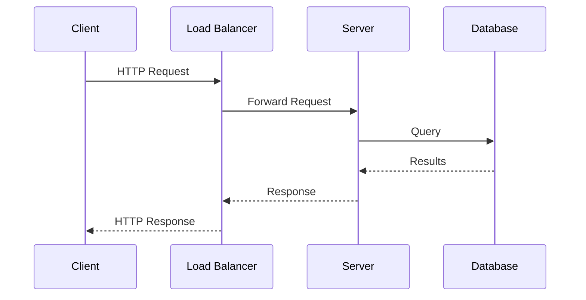
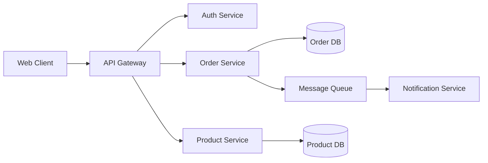

# Visuals & Diagrams

## Overview

A well-placed diagram can replace pages of prose. Technical books that rely solely on text to explain architectures, data flows, and state transitions are harder to follow than they need to be. This phase covers planning, designing, and describing the visual elements of your book — diagrams, figures, screenshots, and tables.

Note: As an AI assistant, I can help you plan diagrams, write descriptions, create text-based representations, and generate diagram source code (Mermaid, PlantUML, D2, etc.), but you'll need to produce the final visual assets yourself or with a design tool.

## Workflow: Planning Visual Content

### Step 1: Identify Where Visuals Add Value

Not every concept needs a diagram. Use visuals when:

- **Architecture and topology** — How components connect and communicate
- **Data flow** — How data moves through a system, pipeline, or process
- **State machines** — States and transitions in a protocol or workflow
- **Sequences** — The order of operations between multiple actors
- **Comparisons** — Side-by-side differences between approaches
- **Hierarchies** — Organizational structures, inheritance trees, dependency graphs
- **Timelines** — Event ordering, lifecycle phases, version history
- **Screenshots** — UI state, tool output, configuration screens

**Don't use visuals when:**
- The concept is simple enough to explain in a sentence
- The visual would just restate what the prose says
- The diagram would be so complex it's harder to read than text

### Step 2: Choose Diagram Types

Match the diagram type to the concept:

| Concept | Diagram Type | Tool Suggestion |
|---------|-------------|-----------------|
| System architecture | Box-and-arrow diagram | D2, Mermaid, draw.io |
| Request/response flow | Sequence diagram | Mermaid, PlantUML |
| State transitions | State diagram | Mermaid, PlantUML |
| Data model | Entity-relationship diagram | Mermaid, dbdiagram.io |
| Process flow | Flowchart | Mermaid, D2 |
| Class relationships | Class diagram | Mermaid, PlantUML |
| Deployment topology | Deployment diagram | D2, draw.io |
| Timeline / phases | Gantt or timeline | Mermaid, custom |
| Comparison | Table or side-by-side | Markdown table |

### Step 3: Design Each Diagram

For each planned visual, create a specification:

```markdown
# Figure {chapter}-{number}: {Title}

**Type:** {diagram type}
**Purpose:** {what this diagram explains}
**Appears after:** {which paragraph or section}

**Elements:**
- {Component A} — {what it represents}
- {Component B} — {what it represents}
- {Arrow/connection} — {what the relationship means}

**Key points the reader should take away:**
1. {Takeaway 1}
2. {Takeaway 2}

**Text-based representation:**
{ASCII art, Mermaid code, or detailed description}
```

### Step 4: Create Diagram Source Code

Use text-based diagram tools so diagrams can be version-controlled and updated:

**Mermaid example (sequence diagram):**


**Mermaid example (architecture):**


**D2 example (with styling):**
```d2
client: Web Client
gateway: API Gateway
auth: Auth Service
orders: Order Service
products: Product Service

client -> gateway: HTTPS
gateway -> auth: Validate Token
gateway -> orders: REST
gateway -> products: REST
orders -> products: gRPC {style.stroke-dash: 3}
```

### Step 5: Write Figure Descriptions

Every figure needs supporting prose:

**Before the figure:**
Introduce what the reader is about to see and what to focus on.

"Figure 5-3 shows the complete request lifecycle. Notice how the authentication check happens before the request reaches any business logic — this is the gateway pattern in action."

**After the figure:**
Walk through the key elements and connect to the broader narrative.

"The dashed line between the Order Service and Product Service represents an asynchronous call — the order doesn't wait for product details to be refreshed. We'll explore why this matters for system resilience in Chapter 8."

**For complex diagrams:**
Number the elements and walk through them sequentially, just like code callouts.

### Step 6: Plan Screenshots

Screenshots require special handling because they become outdated:

**When to use screenshots:**
- Tool configuration that's hard to describe in text
- UI state that the reader needs to verify they're on track
- Error messages or output that the reader should recognize
- IDE features or debugging workflows

**Screenshot best practices:**
- Crop tightly — show only the relevant portion
- Annotate with arrows or callouts pointing to key elements
- Use a consistent window size and theme
- Note the tool version in the caption
- Plan for screenshots to need updating in future editions

**Screenshot alternatives:**
- For CLI output, use code blocks instead of screenshots (easier to update)
- For configuration, show the config file content as code
- For simple UI elements, describe them in text

## Techniques

### The Napkin Sketch Test
Before creating a polished diagram, sketch it on paper (or a napkin). If the sketch communicates the concept, formalize it. If the sketch is confusing, the concept might need a different visual approach — or might not need a visual at all.

### The Progressive Diagram
For complex architectures, build the diagram across multiple figures:
- Figure 1: The simplest version (2-3 components)
- Figure 2: Add the next layer of complexity
- Figure 3: The complete picture

This mirrors the progressive disclosure technique from explanation-craft.

### The Before/After Diagram
Show the system before and after applying a pattern or change. Side-by-side comparison makes the impact of the change immediately visible.

### The Consistent Visual Language
Establish conventions and reuse them:
- Same shape for the same type of component throughout the book
- Same color coding (if using color)
- Same arrow styles for the same types of relationships
- Same layout direction (left-to-right, top-to-bottom)

## Publisher Considerations

**Figure formats:**
- Most publishers accept: SVG, PNG (300 DPI minimum), PDF
- Some publishers have specific tools or templates
- Ask your editor about figure requirements early
- Black and white vs. color — many print books are grayscale; design accordingly

**Figure numbering:**
- Number figures sequentially within chapters (Figure 3-1, 3-2, 3-3)
- Reference figures by number in the text ("as shown in Figure 3-1")
- Every figure must be referenced in the text — no orphan figures

**Accessibility:**
- Don't rely solely on color to convey information
- Provide alt text or detailed captions
- Ensure diagrams are readable at the printed size

## Deliverables

By the end of this phase, you should have:
- A figure plan listing every diagram and screenshot in the book
- Diagram specifications with elements, purpose, and text representations
- Diagram source code (Mermaid, D2, PlantUML, or equivalent)
- A consistent visual language documented
- Screenshot plan with annotation notes
- Understanding of your publisher's figure requirements

## Connection to Other Phases

- **Book Architecture** — The figure plan aligns with the chapter structure
- **Explanation Craft** — Visuals are an explanation technique; plan them together
- **Chapter Drafting** — Integrate figure references as you write
- **Production Prep** — Final figure formatting happens during production
